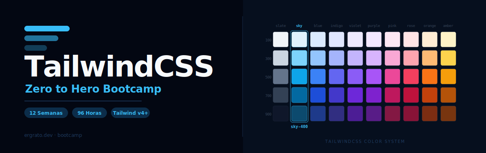

<p align="center">
  
</p>

<p align="center">
  <a href="LICENSE"></a>
  <a href="#"></a>
  <a href="#"></a>
  <a href="#"></a>
  <a href="CONTRIBUTING.md"></a>
</p>

<p align="center">
  <a href="README_EN.md"></a>
</p>

---

## 📋 Descripción

Bootcamp intensivo de **12 semanas (~3 meses)** enfocado en el dominio de **TailwindCSS** y el diseño UI moderno. Diseñado para llevar a estudiantes de cero a **Desarrollador Frontend Junior**, con énfasis en la filosofía utility-first, sistemas de diseño y proyectos del mundo real.

### 🎯 Objetivos

Al finalizar el bootcamp, los estudiantes serán capaces de:

- ✅ Dominar los fundamentos de HTML semántico y CSS necesarios para usar Tailwind
- ✅ Usar la filosofía utility-first para construir interfaces modernas
- ✅ Aplicar el sistema de diseño de Tailwind (colores, tipografía, espaciado)
- ✅ Construir layouts complejos con Flexbox y Grid utilities de Tailwind
- ✅ Implementar diseño responsive con el enfoque mobile-first
- ✅ Diseñar componentes UI reutilizables (navbar, cards, forms, modals)
- ✅ Personalizar Tailwind con `tailwind.config.js` y temas custom
- ✅ Usar plugins oficiales (Typography, Forms, Aspect Ratio, Line Clamp)
- ✅ Implementar dark mode, animaciones y transiciones
- ✅ Integrar TailwindCSS con React, Next.js y bibliotecas de componentes

### 🚀 ¿Por qué TailwindCSS?

> **TailwindCSS moderno desde el día 1** — Sin clases legacy, solo las mejores prácticas actuales con Tailwind v4+.

TailwindCSS es el framework CSS utility-first más popular del mundo. Este bootcamp se enfoca exclusivamente en Tailwind v4+ y las herramientas modernas del ecosistema frontend. Los estudiantes aprenden directamente las técnicas que usarán en el mundo profesional.

---

## 🗓️ Estructura del Bootcamp

|           Etapa            | Semanas | Horas | Temas Principales                                              |
| :------------------------: | :-----: | :---: | -------------------------------------------------------------- |
| **Fundamentos Web**        |   1-2   |  16h  | HTML semántico, CSS esencial, entorno de desarrollo, intro Tailwind v4 |
| **Core Tailwind**          |   3-5   |  24h  | Colores, tipografía, espaciado, borders, shadows, estados interactivos |
| **Layout**                 |   6-7   |  16h  | Flexbox utilities, Grid utilities, layouts reales              |
| **Componentes & UI**       |   8-9   |  16h  | Navbar, cards, buttons, forms, modals, alertas                 |
| **Tailwind Avanzado**      |  10-11  |  16h  | Config, temas personalizados, plugins, animaciones, dark mode  |
| **Ecosistema & Producción**|   12    |   8h  | React/Next.js, daisyUI, shadcn/ui, optimización, proyecto final |

**Total: 12 semanas** | **96 horas** de formación intensiva

---

## 📚 Contenido por Semana

Cada semana incluye:

```
bootcamp/week-XX-tema_principal/
├── README.md                 # Descripción y objetivos
├── rubrica-evaluacion.md     # Criterios de evaluación
├── 0-assets/                 # Imágenes y diagramas
├── 1-teoria/                 # Material teórico
├── 2-practicas/              # Ejercicios guiados
├── 3-proyecto/               # Proyecto semanal
├── 4-recursos/               # Recursos adicionales
│   ├── ebooks-free/
│   ├── videografia/
│   └── webgrafia/
└── 5-glosario/               # Términos clave
```

### 🔑 Componentes Clave

- 📖 **Teoría**: Conceptos fundamentales con ejemplos del mundo real
- 💻 **Práctica**: Ejercicios progresivos y proyectos hands-on
- 📝 **Evaluación**: Evidencias de conocimiento, desempeño y producto
- 🎓 **Recursos**: Glosarios, referencias y material complementario

---

## 🗓️ Semanas del Bootcamp

| Semana | Tema | Descripción |
|:------:|------|-------------|
| [01](bootcamp/week-01-html_semantico_y_css_esencial) | HTML Semántico y CSS Esencial | Fundamentos web: HTML5, box model, cascade |
| [02](bootcamp/week-02-entorno_y_filosofia_utility_first) | Entorno y Filosofía Utility-First | Vite + Tailwind, primeras clases de utilidad |
| [03](bootcamp/week-03-colores_tipografia_y_espaciado) | Colores, Tipografía y Espaciado | Sistema de diseño: paleta, fuentes, spacing scale |
| [04](bootcamp/week-04-borders_shadows_sizing_y_estados) | Borders, Shadows, Sizing y Estados | Bordes, sombras, sizing, hover/focus/active |
| [05](bootcamp/week-05-responsive_design_y_mobile_first) | Responsive Design y Mobile-First | Breakpoints, containers, diseño adaptativo |
| [06](bootcamp/week-06-flexbox_utilities) | Flexbox Utilities | Flex layouts: justify, align, wrap, gap |
| [07](bootcamp/week-07-grid_utilities_y_layouts) | Grid Utilities y Layouts | Grid layouts, col/row span, layouts complejos |
| [08](bootcamp/week-08-componentes_navbar_buttons_cards) | Componentes: Navbar, Buttons y Cards | Componentes UI esenciales |
| [09](bootcamp/week-09-componentes_forms_modals_alertas) | Componentes: Forms, Modals y Alertas | Formularios, overlays y notificaciones |
| [10](bootcamp/week-10-tailwind_config_y_temas_personalizados) | Tailwind Config y Temas Personalizados | tailwind.config.js, design tokens, CSS vars |
| [11](bootcamp/week-11-plugins_animaciones_y_dark_mode) | Plugins, Animaciones y Dark Mode | Plugins oficiales, transiciones, modo oscuro |
| [12](bootcamp/week-12-integracion_frameworks_y_proyecto_final) | Integración con Frameworks y Proyecto Final | React, Next.js, daisyUI, shadcn/ui |

---

## 🛠️ Stack Tecnológico

| Tecnología    | Versión   | Uso                          |
|---------------|-----------|------------------------------|
| TailwindCSS   | **4+**    | Framework CSS utility-first  |
| Node.js       | **22+**   | Entorno de ejecución JS      |
| pnpm          | **9+**    | Gestor de paquetes           |
| Vite          | **6+**    | Bundler y dev server         |
| PostCSS       | **8+**    | Procesador CSS               |
| React         | **19+**   | Biblioteca UI (semana 12)    |
| Next.js       | **15+**   | Framework React (semana 12)  |

**Entorno de desarrollo**: Node.js + Vite + pnpm (❌ NO usar CDN para aprendizaje)

---

## 🚀 Inicio Rápido

### Prerrequisitos

- **Node.js 22+** instalado ([nodejs.org](https://nodejs.org/))
- **pnpm** instalado (`npm install -g pnpm`)
- **Git** para control de versiones
- **VS Code** (recomendado) con extensiones incluidas
- Navegador moderno (Chrome, Firefox, Edge)

### 1. Clonar el Repositorio

```bash
git clone https://github.com/ergrato-dev/bc-tailwindcss.git
cd bc-tailwindcss
```

### 2. Instalar Extensiones de VS Code

```bash
# Abrir en VS Code
code .

# Las extensiones recomendadas aparecerán automáticamente
# O ejecutar: Ctrl+Shift+P → "Extensions: Show Recommended Extensions"
```

### 3. Navegar a la Semana Actual

```bash
cd bootcamp/week-01-html_semantico_y_css_esencial
```

### 4. Seguir las Instrucciones

Cada semana contiene un `README.md` con instrucciones detalladas.

---

## 📊 Metodología de Aprendizaje

### Estrategias Didácticas

- 🎯 **Aprendizaje Basado en Proyectos (ABP)**
- 🧩 **Práctica Deliberada**
- 🎨 **UI Challenges** (réplicas de interfaces reales)
- 👥 **Code Review entre pares**
- 🎮 **Live Coding**

### Distribución del Tiempo (8h/semana)

- **Teoría**: 2-2.5 horas
- **Prácticas**: 3-3.5 horas
- **Proyecto**: 2-2.5 horas

### Evaluación

Cada semana incluye tres tipos de evidencias:

1. **Conocimiento 🧠** (30%): Cuestionarios y evaluaciones teóricas
2. **Desempeño 💪** (40%): Ejercicios prácticos en clase
3. **Producto 📦** (30%): Entregables evaluables (proyectos funcionales)

**Criterio de aprobación**: Mínimo 70% en cada tipo de evidencia

---

## 🤝 Contribuir

¡Las contribuciones son bienvenidas! Este es un proyecto educativo de código abierto.

### Cómo Contribuir

1. Lee la [Guía de Contribución](CONTRIBUTING.md)
2. Revisa el [Código de Conducta](CODE_OF_CONDUCT.md)
3. Fork del repositorio
4. Crea tu rama (`git checkout -b feature/nueva-funcionalidad`)
5. Commit con [Conventional Commits](https://www.conventionalcommits.org/) (`git commit -m 'feat: add new exercise'`)
6. Push a la rama (`git push origin feature/nueva-funcionalidad`)
7. Abre un Pull Request

### 📋 Áreas de Contribución

- ✨ Ejercicios adicionales
- 📚 Mejoras en documentación
- 🐛 Corrección de errores
- 🎨 Recursos visuales (diagramas SVG)
- 🌐 Traducciones
- 📹 Videos tutoriales

---

## 📞 Soporte

- 💬 **Discussions**: [GitHub Discussions](https://github.com/ergrato-dev/bc-tailwindcss/discussions)
- 🐛 **Issues**: [GitHub Issues](https://github.com/ergrato-dev/bc-tailwindcss/issues)

---

## ⚠️ Exención de Responsabilidad

Este repositorio es un recurso **educativo** creado con fines de aprendizaje. Al utilizarlo, aceptas los siguientes términos:

- **Solo fines educativos**: El contenido, los ejemplos de código y los proyectos están diseñados exclusivamente para la enseñanza y el aprendizaje. No constituyen asesoramiento profesional, legal ni de seguridad.
- **Sin garantías**: El material se proporciona **"tal cual"**, sin garantías de ningún tipo, expresas o implícitas, incluyendo idoneidad para un propósito particular o ausencia de errores.
- **Código en producción**: Los ejemplos de código son ilustrativos. Antes de usarlos en entornos productivos, debes realizar revisiones de seguridad, rendimiento y adaptación a tu contexto específico.
- **Versiones de software**: Las versiones de librerías y herramientas mencionadas pueden quedar desactualizadas. Siempre consulta la documentación oficial más reciente.
- **Limitación de responsabilidad**: Los autores y contribuidores no se responsabilizan por pérdidas de datos, daños directos o indirectos, interrupciones de servicio ni cualquier otro perjuicio derivado del uso de este material.
- **Responsabilidad del estudiante**: Cada estudiante es responsable de sus propias implementaciones, entornos de desarrollo y decisiones técnicas.

---

## 📄 Licencia

Este proyecto está bajo la Licencia MIT - ver el archivo [LICENSE](LICENSE) para más detalles.

---

## 🏆 Agradecimientos

- [TailwindCSS](https://tailwindcss.com/) — Por crear el mejor framework CSS utility-first
- [Adam Wathan](https://github.com/adamwathan) — Creador de TailwindCSS
- [Vite](https://vitejs.dev/) — Por el mejor dev server del ecosistema frontend
- Comunidad TailwindCSS — Por los recursos, plugins y ejemplos
- Todos los contribuidores

---

## 📚 Documentación Adicional

- [🤖 Instrucciones de Copilot](.github/copilot-instructions.md)
- [🤝 Guía de Contribución](CONTRIBUTING.md)
- [📜 Código de Conducta](CODE_OF_CONDUCT.md)
- [🔒 Política de Seguridad](SECURITY.md)

---

<p align="center">
  <strong>🎓 Bootcamp TailwindCSS - Zero to Hero</strong><br>
  <em>De cero a desarrollador frontend en 3 meses</em>
</p>

<p align="center">
  <a href="bootcamp/week-01-html_semantico_y_css_esencial">Comenzar Semana 1</a> •
  <a href="_docs">Ver Documentación</a> •
  <a href="https://github.com/ergrato-dev/bc-tailwindcss/issues">Reportar Issue</a> •
  <a href="CONTRIBUTING.md">Contribuir</a>
</p>

<p align="center">
  Hecho con ❤️ para la comunidad de desarrolladores
</p>
