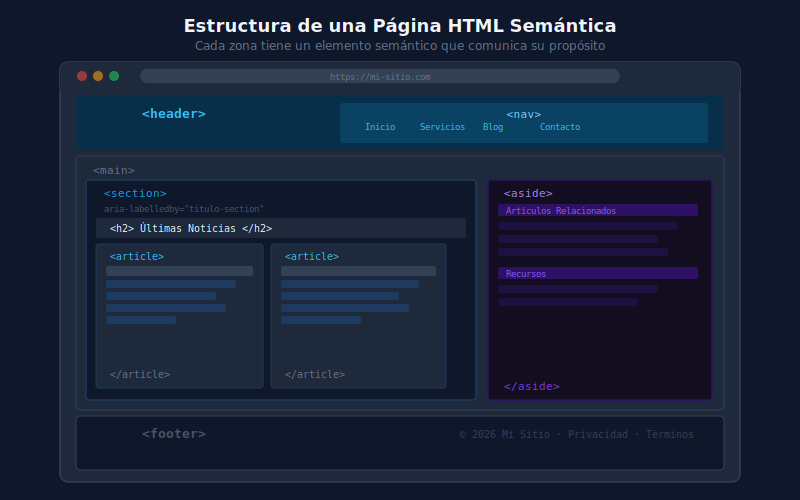

# 🏷️ HTML Semántico

## 🎯 Objetivos

- Entender qué significa "semántico" en HTML
- Conocer las etiquetas de estructura y contenido de HTML5
- Escribir HTML accesible con atributos `alt`, `aria-label` y `lang`
- Distinguir entre etiquetas genéricas y semánticas

---

## 📋 Contenido

### 1. ¿Qué es el HTML Semántico?

**Semántico** significa que el código comunica su _propósito_, no solo su apariencia.

Compara estos dos fragmentos — ambos se ven igual en el browser, pero uno comunica significado:

```html
<!-- ❌ Sin semántica — solo cajas genéricas -->
<div class="header">
  <div class="nav">
    <div class="nav-item">Inicio</div>
  </div>
</div>
<div class="main-content">
  <div class="article">
    <div class="titulo">Mi Blog Post</div>
    <div class="texto">Contenido del artículo...</div>
  </div>
</div>

<!-- ✅ Con semántica — el código comunica estructura y propósito -->
<header>
  <nav>
    <a href="/">Inicio</a>
  </nav>
</header>
<main>
  <article>
    <h1>Mi Blog Post</h1>
    <p>Contenido del artículo...</p>
  </article>
</main>
```

**¿Por qué importa?**
- **SEO**: Los motores de búsqueda entienden mejor el contenido
- **Accesibilidad**: Los lectores de pantalla navegan por landmarks semánticos
- **Mantenibilidad**: Código más fácil de entender para otros desarrolladores
- **Futuro**: Fácil de estilizar con Tailwind porque la estructura ya está clara

---

### 2. Etiquetas de Estructura (Landmarks)

Estas etiquetas definen las grandes zonas de la página:

```html
<!DOCTYPE html>
<html lang="es">
  <head>
    <meta charset="UTF-8" />
    <meta name="viewport" content="width=device-width, initial-scale=1.0" />
    <title>Título de la página</title>
  </head>
  <body>

    <!-- Encabezado principal de la página o sección -->
    <header>
      <nav>
        <!-- Navegación principal -->
        <ul>
          <li><a href="/">Inicio</a></li>
          <li><a href="/about">Acerca</a></li>
        </ul>
      </nav>
    </header>

    <!-- Contenido principal — solo uno por página -->
    <main>

      <!-- Sección temática con título propio -->
      <section>
        <h2>Sección de Noticias</h2>
        <!-- ... -->
      </section>

      <!-- Contenido autónomo (post, noticia, comentario) -->
      <article>
        <h2>Título del Artículo</h2>
        <p>Contenido...</p>
      </article>

      <!-- Contenido complementario (sidebar, notas) -->
      <aside>
        <h3>Artículos relacionados</h3>
      </aside>

    </main>

    <!-- Pie de página -->
    <footer>
      <p>&copy; 2026 Mi Sitio</p>
    </footer>

  </body>
</html>
```



#### Cuándo usar `<section>` vs `<article>` vs `<div>`

| Etiqueta | Úsala cuando... | Ejemplo |
|----------|-----------------|---------|
| `<article>` | El contenido puede existir de forma independiente | Post de blog, noticia, comentario, tarjeta de producto |
| `<section>` | Agrupa contenido relacionado temáticamente, con título propio | "Sección de testimonios", "Sección de precios" |
| `<div>` | Solo necesitas un contenedor para layout/estilos, sin significado semántico | Wrapper para aplicar `flex` o `grid` |

> 💡 **Regla práctica**: Si la sección tiene un `<h2>` o `<h3>` natural que la describe, usa `<section>`. Si el contenido puede vivir en otro sitio (newsletter, RSS), usa `<article>`. Si solo necesitas dividir para estilos, usa `<div>`.

---

### 3. Etiquetas de Contenido

Para dar significado al contenido dentro de las secciones:

```html
<!-- Jerarquía de títulos — h1 solo una vez por página -->
<h1>Título Principal</h1>
<h2>Subtítulo de Sección</h2>
<h3>Subtítulo de Subsección</h3>

<!-- Texto -->
<p>Párrafo de texto normal.</p>
<strong>Texto importante (negrita semántica)</strong>
<em>Texto enfatizado (cursiva semántica)</em>

<!-- Imagen con descripción -->
<figure>
  
  <figcaption>Ventas del primer trimestre 2026</figcaption>
</figure>

<!-- Lista de navegación o items relacionados -->
<ul>
  <li>Item sin orden</li>
</ul>
<ol>
  <li>Primer paso</li>
  <li>Segundo paso</li>
</ol>

<!-- Tiempo (fecha/hora legible por máquinas) -->
<time datetime="2026-03-29">29 de marzo de 2026</time>

<!-- Cita -->
<blockquote cite="https://tailwindcss.com">
  <p>Tailwind CSS is a utility-first CSS framework.</p>
</blockquote>

<!-- Dirección de contacto (dentro de footer o article) -->
<address>
  <a href="mailto:hola@ejemplo.com">hola@ejemplo.com</a>
</address>
```

---

### 4. Accesibilidad Básica

La accesibilidad no es opcional — es parte de escribir buen HTML.

#### 4.1 Atributo `alt` en imágenes

```html
<!-- ✅ alt descriptivo — explica el contenido de la imagen -->


<!-- ✅ alt vacío — para imágenes decorativas (el lector de pantalla las ignora) -->


<!-- ❌ Incorrecto — no describe nada útil -->


```

#### 4.2 Botones y enlaces accesibles

```html
<!-- ✅ Botón con texto visible -->
<button type="button">Cerrar menú</button>

<!-- ✅ Botón sin texto visible — usa aria-label -->
<button type="button" aria-label="Cerrar menú de navegación">
  <svg><!-- icono X --></svg>
</button>

<!-- ✅ Enlace con texto descriptivo -->
<a href="/blog/css-grid">Leer artículo sobre CSS Grid</a>

<!-- ❌ Enlace ambiguo — el lector de pantalla solo dice "haz clic aquí" -->
<a href="/blog/css-grid">haz clic aquí</a>
```

#### 4.3 Atributo `lang` en `<html>`

```html
<!-- Crucial: indica el idioma del documento al navegador y lectores de pantalla -->
<html lang="es">
<!-- o para inglés: -->
<html lang="en">
```

#### 4.4 Jerarquía de títulos

```html
<!-- ✅ Jerarquía correcta — solo un h1, orden descendente -->
<h1>Título de la página</h1>
  <h2>Sección A</h2>
    <h3>Subsección A.1</h3>
  <h2>Sección B</h2>

<!-- ❌ Saltarse niveles confunde a lectores de pantalla -->
<h1>Título</h1>
<h3>Subtítulo</h3>  <!-- Se saltó h2 -->
```

---

### 5. Ejemplo Completo: Página de Blog

```html
<!DOCTYPE html>
<html lang="es">
  <head>
    <meta charset="UTF-8" />
    <meta name="viewport" content="width=device-width, initial-scale=1.0" />
    <meta name="description" content="Blog sobre desarrollo web moderno" />
    <title>Dev Blog — Artículos de Frontend</title>
    <link rel="stylesheet" href="styles.css" />
  </head>
  <body>

    <header>
      <a href="/" aria-label="Dev Blog - Ir a inicio">
        <strong>Dev Blog</strong>
      </a>
      <nav aria-label="Navegación principal">
        <ul>
          <li><a href="/" aria-current="page">Inicio</a></li>
          <li><a href="/articles">Artículos</a></li>
          <li><a href="/about">Acerca</a></li>
        </ul>
      </nav>
    </header>

    <main>
      <section aria-labelledby="featured-title">
        <h2 id="featured-title">Artículos Destacados</h2>

        <article>
          <header>
            <h3>
              <a href="/articles/css-grid">Dominando CSS Grid en 2026</a>
            </h3>
            <p>
              Por <strong>Ana García</strong> ·
              <time datetime="2026-03-01">1 de marzo de 2026</time>
            </p>
          </header>
          <p>
            CSS Grid sigue siendo la herramienta más poderosa para layouts
            bidimensionales. En este artículo exploramos los patrones más usados...
          </p>
          <footer>
            <a href="/articles/css-grid">Leer artículo completo</a>
          </footer>
        </article>

      </section>
    </main>

    <footer>
      <address>
        Contacto: <a href="mailto:hola@devblog.com">hola@devblog.com</a>
      </address>
      <p><small>&copy; 2026 Dev Blog. Todos los derechos reservados.</small></p>
    </footer>

  </body>
</html>
```

---

## 📚 Recursos Adicionales

- [MDN: HTML Semántico](https://developer.mozilla.org/es/docs/Glossary/Semantics#semántica_en_html)
- [MDN: Elementos HTML](https://developer.mozilla.org/es/docs/Web/HTML/Element)
- [W3C: WAI-ARIA Landmarks](https://www.w3.org/WAI/ARIA/apg/patterns/landmarks/)
- [The A11Y Project](https://www.a11yproject.com/)

---

## ✅ Checklist de Verificación

Antes de continuar, asegúrate de:

- [ ] Conocer las diferencias entre `<section>`, `<article>` y `<div>`
- [ ] Saber cuándo usar `alt=""` (decorativo) vs `alt="descripción"` (informativo)
- [ ] Entender por qué el `lang` en `<html>` importa
- [ ] Tener solo un `<h1>` por página y respetar la jerarquía de títulos
- [ ] Conocer al menos 10 etiquetas semánticas de HTML5 y su propósito
