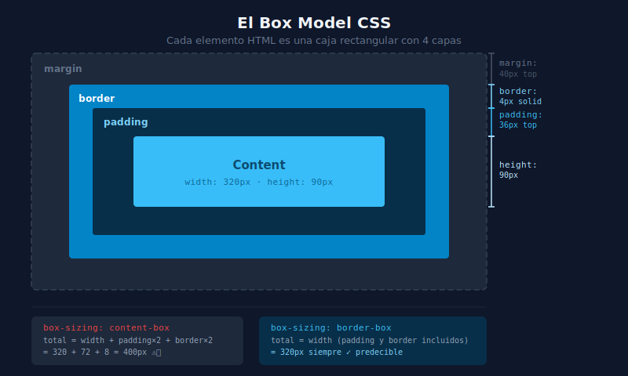

# 📦 El Box Model de CSS

## 🎯 Objetivos

- Entender las 4 capas del box model: content, padding, border, margin
- Saber calcular el tamaño real de un elemento
- Entender `box-sizing: border-box` y por qué es el estándar actual
- Conocer el margin collapsing y cómo evitar sorpresas

---

## 📋 Contenido

### 1. ¿Qué es el Box Model?

En CSS, **todo elemento HTML es una caja rectangular** con cuatro capas:

```
┌──────────────────────────────────────────────────┐
│                    MARGIN                        │  ← Espacio exterior (transparente)
│  ┌────────────────────────────────────────────┐  │
│  │                  BORDER                   │  │  ← Borde visible
│  │  ┌──────────────────────────────────────┐  │  │
│  │  │               PADDING               │  │  │  ← Espacio interior (toma el color de fondo)
│  │  │  ┌────────────────────────────────┐  │  │  │
│  │  │  │           CONTENT             │  │  │  │  ← El contenido real (texto, imagen)
│  │  │  └────────────────────────────────┘  │  │  │
│  │  └──────────────────────────────────────┘  │  │
│  └────────────────────────────────────────────┘  │
└──────────────────────────────────────────────────┘
```



---

### 2. Las 4 Capas

#### Content (Contenido)
El área donde se muestra el texto o la imagen. Se controla con `width` y `height`.

#### Padding (Relleno interior)
Espacio entre el **contenido** y el **borde**. Hereda el color de fondo del elemento.

```css
/* Una sola medida — mismo valor en todos los lados */
padding: 16px;

/* Dos medidas — vertical | horizontal */
padding: 8px 16px;

/* Cuatro medidas — arriba | derecha | abajo | izquierda (sentido horario) */
padding: 8px 16px 12px 16px;

/* Propiedades individuales */
padding-top: 8px;
padding-right: 16px;
padding-bottom: 8px;
padding-left: 16px;
```

#### Border (Borde)
Envuelve el padding. Tiene tres sub-propiedades: `width`, `style` y `color`.

```css
/* Shorthand */
border: 2px solid #e5e7eb;

/* Propiedades individuales */
border-width: 1px;
border-style: solid;    /* solid | dashed | dotted | none */
border-color: #e5e7eb;

/* Bordes individuales */
border-top: 2px solid #38BDF8;
border-bottom: 1px dashed #9ca3af;
```

#### Margin (Margen exterior)
Espacio **fuera** del borde. Separa el elemento de sus vecinos. Es **transparente** (no hereda color de fondo).

```css
/* Misma sintaxis que padding */
margin: 24px;
margin: 16px 32px;
margin: 16px 32px 24px 32px;

/* Centrar horizontalmente (clásico) */
margin: 0 auto;

/* Propiedades individuales */
margin-top: 16px;
margin-right: auto;
margin-bottom: 16px;
margin-left: auto;
```

---

### 3. Calculando el Tamaño Real

> ⚠️ **Problema**: Por defecto, `width` y `height` solo definen el **área de contenido**. El tamaño real en pantalla es mucho mayor.

```css
/* Con box-sizing: content-box (comportamiento por DEFECTO del browser) */
.caja {
  width: 200px;
  padding: 20px;
  border: 4px solid black;
  margin: 10px;
}

/* Tamaño real en pantalla:
   - Width total = 200 + 20 + 20 + 4 + 4 = 248px
   - Height depende del contenido + 40px padding + 8px border
   - El margin no suma al elemento, crea espacio alrededor
*/
```

Esto origina matemáticas complicadas. Por eso existe `box-sizing: border-box`:

---

### 4. `box-sizing: border-box` — El Estándar Moderno

Con `border-box`, el `width` y `height` que defines **incluyen** el padding y el border.

```css
/* ✅ Aplicación global — siempre al inicio del proyecto */
*,
*::before,
*::after {
  box-sizing: border-box;
}

.caja {
  width: 200px;       /* Este es el tamaño TOTAL en pantalla */
  padding: 20px;      /* Incluido dentro del width */
  border: 4px solid;  /* Incluido dentro del width */
  /* El contenido real = 200 - 40(padding) - 8(border) = 152px */
}
```

**TailwindCSS aplica `border-box` automáticamente** — una razón más para usarlo.

---

### 5. Margin Collapsing

Cuando dos márgenes verticales se encuentran, **el mayor "gana"** en lugar de sumarse:

```html
<!-- Cada párrafo tiene margin-bottom: 16px y margin-top: 16px -->
<!-- El espacio entre ellos NO es 32px, sino 16px (el mayor de los dos) -->
<p style="margin-bottom: 16px">Párrafo 1</p>
<p style="margin-top: 16px">Párrafo 2</p>
```

El margin collapsing ocurre:
- Entre **hermanos** con márgenes verticales contiguos
- Entre **padre e hijo** cuando el padre no tiene padding ni border

> 💡 **Para evitar sorpresas**: usa `padding` en lugar de `margin` cuando quieras espaciado interno, y considera usar solo `margin-bottom` (o solo `margin-top`) para espaciado entre elementos.

---

### 6. Elementos Inline vs Block

El box model se comporta diferente según el tipo de elemento:

| Propiedad | `display: block` | `display: inline` |
|-----------|-----------------|-------------------|
| `width` / `height` | ✅ Aplica | ❌ Ignora |
| `padding` | ✅ Aplica en todos los lados | ⚠️ Solo lados (no afecta al flujo vertical) |
| `margin` | ✅ Aplica en todos los lados | ⚠️ Solo horizontal |
| Ocupa toda la anchura | ✅ Sí | ❌ Solo el ancho del contenido |

```html
<!-- block por defecto: div, p, h1-h6, section, article, header, footer -->
<!-- inline por defecto: span, a, strong, em, img -->

<!-- Para tener lo mejor de ambos: display: inline-block -->
<span style="display:inline-block; width:100px; height:50px; padding:8px">
  Ahora tiene dimensiones
</span>
```

---

### 7. Visualizando el Box Model en DevTools

Las herramientas de desarrollo del navegador son tu aliado:

1. Abre DevTools (`F12` o `Ctrl+Shift+I`)
2. Selecciona un elemento (pestaña **Elements**)
3. En la pestaña **Computed** ve el diagrama del box model
4. En la pestaña **Styles** ve y modifica propiedades en tiempo real

> 🔍 **Tip**: Puedes editar los valores de margin, padding y border directamente en el diagrama del box model en DevTools para experimentar.

---

## 📚 Recursos Adicionales

- [MDN: Introduction to the CSS Box Model](https://developer.mozilla.org/es/docs/Web/CSS/CSS_box_model/Introduction_to_the_CSS_box_model)
- [MDN: box-sizing](https://developer.mozilla.org/es/docs/Web/CSS/box-sizing)
- [MDN: Mastering Margin Collapsing](https://developer.mozilla.org/es/docs/Web/CSS/CSS_box_model/Mastering_margin_collapsing)
- [CSS Tricks: The CSS Box Model](https://css-tricks.com/the-css-box-model/)

---

## ✅ Checklist de Verificación

Antes de continuar, asegúrate de:

- [ ] Saber diferenciar margin (exterior) de padding (interior)
- [ ] Saber que `margin: 0 auto` centra horizontalmente un elemento con `width` definido
- [ ] Entender por qué `box-sizing: border-box` es mejor para calcular tamaños
- [ ] Poder calcular el tamaño total de un elemento datos su `width`, `padding` y `border`
- [ ] Conocer el margin collapsing y en qué situaciones ocurre
