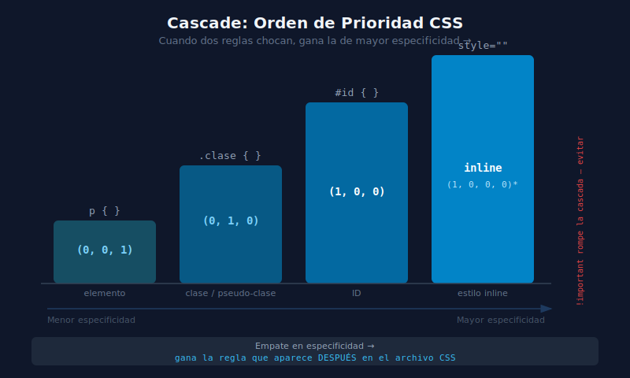

# 🌊 Cascade y Especificidad en CSS

## 🎯 Objetivos

- Entender cómo el navegador decide qué regla CSS aplicar cuando hay conflictos
- Calcular la especificidad de cualquier selector
- Comprender la herencia de propiedades CSS
- Saber por qué `!important` debe evitarse

---

## 📋 Contenido

### 1. ¿Qué es la Cascada?

CSS significa **Cascading Style Sheets** — "Hojas de Estilo en Cascada". La "cascada" es el algoritmo que resuelve conflictos cuando múltiples reglas intentan aplicar al mismo elemento.

La cascada evalúa en este orden (de mayor a menor peso):

```
1. !important del autor
2. !important del usuario (configuración del browser)
3. Estilos inline (atributo style="")
4. Especificidad del selector (ID > class > element)
5. Orden de aparición en el código (la última regla gana)
6. Herencia
7. Estilos por defecto del navegador (user agent stylesheet)
```

---

### 2. Especificidad

La especificidad es un sistema de "puntuación" de los selectores. Se calcula en tres categorías:

```
(A, B, C)
 │  │  └── Selectores de elemento y pseudo-elementos: div, p, h1, ::before
 │  └───── Clases, atributos y pseudo-clases: .clase, [attr], :hover, :first-child
 └──────── IDs: #id
```

Ejemplos:

```css
/* Especificidad (0, 0, 1) — solo elemento */
p {
  color: red;
}

/* Especificidad (0, 1, 0) — solo clase */
.texto {
  color: blue;
}

/* Especificidad (1, 0, 0) — solo ID */
#titulo {
  color: green;
}

/* Especificidad (0, 1, 1) — clase + elemento */
p.texto {
  color: purple;
}

/* Especificidad (1, 1, 1) — ID + clase + elemento */
#section p.texto {
  color: orange;
}
```

**Comparando especificidades:**

```
(0,0,1) < (0,1,0) < (1,0,0)
  p           .clase        #id

Gana el de mayor valor en la categoría más "a la izquierda":
(1,0,0) > (0,99,99)  →  Un solo ID supera a 99 clases + 99 elementos
```

---

### 3. Visualizando Conflictos

```html
<p id="intro" class="texto destacado">¿De qué color seré?</p>
```

```css
/* Regla 1: (0,0,1) */
p {
  color: gray;
}

/* Regla 2: (0,1,0) */
.texto {
  color: blue;
}

/* Regla 3: (0,2,0) — gana entre estas 3 porque 2 clases > 1 clase */
.texto.destacado {
  color: red;
}

/* Regla 4: (1,0,0) — gana sobre todas las de arriba */
#intro {
  color: green; /* ← Este aplica */
}
```

> El párrafo se muestra en **verde** porque el selector `#id` tiene mayor especificidad.

---

### 4. Orden de Aparición (Desempate)

Cuando dos reglas tienen la **misma especificidad**, gana la que aparece **después** en el código (o se carga después):

```css
/* Misma especificidad: (0,1,0) */

.boton-primario {
  background: blue;
}

.boton-activo {
  background: green; /* ← Esta gana si el elemento tiene ambas clases */
}
```

```html
<!-- El botón se muestra verde -->
<button class="boton-primario boton-activo">Click</button>
```

> 💡 **Para TailwindCSS**: Esto es importante porque todas las clases de Tailwind tienen especificidad `(0,0,1)` o `(0,1,0)`. El orden en el CSS generado por Tailwind determina el ganador — por eso Tailwind es predecible.

---

### 5. Herencia

Algunas propiedades CSS se **heredan** del padre al hijo automáticamente:

```html
<div style="color: navy; font-size: 18px; border: 2px solid red;">
  <p>Este párrafo hereda color y font-size, pero NO el border.</p>
  <span>Este span también hereda.</span>
</div>
```

**Propiedades que SÍ se heredan** (principalmente tipografía):
- `color`, `font-family`, `font-size`, `font-weight`
- `line-height`, `letter-spacing`, `text-align`
- `visibility`, `cursor`, `list-style`

**Propiedades que NO se heredan** (principalmente box model):
- `width`, `height`, `margin`, `padding`, `border`
- `background`, `display`, `position`, `float`

```css
/* Puedes forzar herencia con: */
.hijo {
  border: inherit; /* hereda el border del padre */
}

/* O resetear a valor inicial: */
.hijo {
  color: initial; /* aplica el color por defecto del browser */
}
```

---

### 6. `!important` — Usar con Extremo Cuidado

`!important` sobrescribe la cascada normal y hace que una regla gane sobre cualquier otra (excepto otro `!important` con igual o mayor especificidad):

```css
p {
  color: red !important; /* Gana sobre cualquier otra regla */
}

#titulo {
  color: green; /* Pierde ante !important de menor especificidad */
}
```

**¿Por qué evitar `!important`?**

```css
/* Una vez usas !important, necesitas más !important para sobrescribir */
.boton {
  padding: 8px !important;
}
/* Más tarde alguien quiere cambiar el padding... */
.boton-grande {
  padding: 16px !important; /* Necesita !important de nuevo */
}
/* El código se vuelve inmanejable */
```

> ❌ **Regla de oro**: Si sientes la necesidad de usar `!important`, es señal de que la especificidad de tus selectores no está bien diseñada. Arregla los selectores, no uses `!important`.

---

### 7. El Diagrama Completo



```
            Inline styles (style="")          ← Especificidad máxima
                     │
                   #id {}                     ← (1,0,0)
                     │
            .clase, [attr], :hover {}         ← (0,1,0)
                     │
          elemento, ::pseudo-elemento {}      ← (0,0,1)
                     │
         Estilos del navegador (user agent)   ← Mínima prioridad
```

---

### 8. Estrategia Práctica: Baja Especificidad

La recomendación de la industria moderna es usar **baja especificidad** en tus selectores:

```css
/* ✅ Buenas prácticas — especificidad baja y predecible */
.card { background: white; }
.card-title { font-size: 1.25rem; }
.card-body { padding: 1rem; }

/* ❌ Malas prácticas — especificidad alta y difícil de sobrescribir */
#main > section > div.card h2.card-title { font-size: 1.25rem; }
```

> 💡 **TailwindCSS tiene especificidad baja por diseño**: Cada clase de utilidad aplica una sola propiedad con la menor especificidad posible. Esto es una de las grandes ventajas del framework.

---

## 📚 Recursos Adicionales

- [MDN: CSS Cascade](https://developer.mozilla.org/es/docs/Web/CSS/Cascade)
- [MDN: Specificity](https://developer.mozilla.org/es/docs/Web/CSS/Specificity)
- [Specificity Calculator](https://specificity.keegan.st/) — Calcula la especificidad visualmente
- [CSS Tricks: Specifics on CSS Specificity](https://css-tricks.com/specifics-on-css-specificity/)

---

## ✅ Checklist de Verificación

Antes de continuar, asegúrate de:

- [ ] Poder calcular la especificidad de cualquier selector CSS
- [ ] Predecir correctamente cuál regla gana en un conflicto de selectores
- [ ] Saber que el orden de aparición en el código desempata igual especificidad
- [ ] Identificar qué propiedades CSS se heredan y cuáles no
- [ ] Entender por qué se debe evitar `!important`
