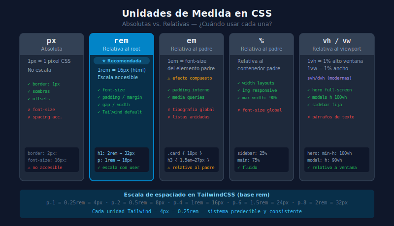

# 📏 Unidades de Medida en CSS

## 🎯 Objetivos

- Distinguir entre unidades absolutas y relativas
- Entender cuándo usar `px`, `rem`, `em`, `%`, `vh` y `vw`
- Conocer la relación entre `rem` y el sistema de espaciado de TailwindCSS

---

## 📋 Contenido

### 1. Unidades Absolutas vs Relativas

| Tipo | Unidades | Descripción |
|------|----------|-------------|
| **Absolutas** | `px`, `cm`, `mm`, `pt` | Tamaño fijo, no cambia con el contexto |
| **Relativas** | `rem`, `em`, `%`, `vh`, `vw`, `fr` | Se calculan en relación a algo |

En desarrollo web moderno, se prefieren las **relativas** para mejor accesibilidad y responsive design.



---

### 2. `px` — Píxeles

La unidad más conocida. En pantallas de alta densidad (Retina), `1px` en CSS no es exactamente 1 píxel físico, pero es el punto de referencia más intuitivo.

```css
.titulo {
  font-size: 24px;   /* Siempre 24px, en cualquier contexto */
  border: 1px solid; /* Bordes finos siempre en px */
}
```

**Cuándo usarlo:**
- ✅ Bordes (`border: 1px solid`)
- ✅ Sombras y offsets pequeños
- ✅ Breakpoints en media queries (aunque `em` puede ser mejor)
- ❌ Tipografía principal (impide que el usuario cambie el tamaño de fuente del browser)

---

### 3. `rem` — Relative to Root

`1rem` = valor de `font-size` del elemento `<html>` (por defecto **16px** en todos los browsers).

```css
html {
  font-size: 16px; /* 1rem = 16px */
}

h1 { font-size: 2rem; }    /* 2 × 16 = 32px */
h2 { font-size: 1.5rem; }  /* 1.5 × 16 = 24px */
p  { font-size: 1rem; }    /* 1 × 16 = 16px */
```

**¿Por qué `rem` es mejor que `px` para tipografía?**

Si el usuario configura un tamaño base mayor en su browser (accesibilidad), todo el contenido escala proporcionalmente:

```
Usuario configura font-size base = 20px:
  h1: 2rem → 2 × 20 = 40px  (escala correctamente)
  h2: 1.5rem → 1.5 × 20 = 30px  (escala correctamente)
```

**Truco del 62.5%:**

```css
/* Algunos devs usan esto para que 1rem = 10px (más fácil de calcular) */
html {
  font-size: 62.5%; /* 62.5% de 16px = 10px */
}
h1 { font-size: 3.2rem; }  /* 32px */
p  { font-size: 1.6rem; }  /* 16px */
```

> ⚠️ Este truco tiene desventajas de accesibilidad. En TailwindCSS no es necesario — usa directamente las clases de texto.

**Cuándo usar `rem`:**
- ✅ `font-size` de cualquier elemento
- ✅ `padding` y `margin` (espaciado que escala con accesibilidad)
- ✅ `gap` en layouts
- ✅ `width` y `height` relacionados con texto

---

### 4. `em` — Relative to Parent

`1em` = valor de `font-size` del **elemento padre** (o del propio elemento si defines `font-size`).

```css
.card {
  font-size: 18px;  /* tamaño base del card */
}
.card h3 {
  font-size: 1.5em; /* 1.5 × 18 = 27px — relativo al padre .card */
}
.card p {
  font-size: 0.9em; /* 0.9 × 18 = 16.2px */
  padding: 1em;     /* 1 × 16.2 = 16.2px — padding relativo al texto del párrafo */
}
```

**El problema con `em`: el efecto compuesto**

```css
ul { font-size: 0.9em; }

/* Si tienes listas anidadas, cada nivel multiplica:
   - Nivel 1: 0.9em × 16px = 14.4px
   - Nivel 2: 0.9em × 14.4px = 12.96px
   - Nivel 3: 0.9em × 12.96px = 11.66px ... */
```

**Cuándo usar `em`:**
- ✅ `padding` e internos de un componente que debe escalar con su propio texto
- ✅ Media queries (en vez de `px`) para que respondan al tamaño de fuente del usuario
- ❌ Por lo general, `rem` es más predecible para tipografía

---

### 5. `%` — Porcentaje

Relativo al elemento **padre** (para `width`, `height`) o al propio elementos (para `font-size`).

```css
.container {
  width: 1200px;
}

.sidebar {
  width: 25%; /* 25% de 1200px = 300px */
}

.main-content {
  width: 75%; /* 75% de 1200px = 900px */
}
```

```css
p {
  font-size: 100%; /* 100% del font-size del padre — equivale a 1em */
}
```

**Cuándo usar `%`:**
- ✅ Layouts fluidos: `width: 100%`, `max-width: 90%`
- ✅ Contenedores que deben llenar a su padre
- ✅ Imágenes responsive: `img { width: 100%; }`
- ❌ Tipografía principal (usa `rem` o clases de Tailwind)

---

### 6. `vh` y `vw` — Viewport Units

`1vh` = 1% del alto de la ventana del browser  
`1vw` = 1% del ancho de la ventana del browser

```css
/* Hero section que ocupa toda la pantalla */
.hero {
  height: 100vh;
  width: 100vw;   /* normalmente no es necesario, los block son 100% por defecto */
}

/* Tipografía que crece con la ventana */
h1 {
  font-size: 5vw; /* 5% del ancho de la ventana */
}
```

**Unidades modernas: `svh`, `dvh`**

```css
/* En mobile, 100vh puede incluir la barra del browser (problema clásico) */
/* Usar las nuevas unidades en proyectos modernos: */
.hero {
  height: 100svh; /* small viewport height — excluye barras del browser */
}
```

**Cuándo usar viewport units:**
- ✅ Secciones hero a pantalla completa (`height: 100vh`)
- ✅ Modals y overlays que cubren la pantalla
- ✅ Tipografía fluida responsiva (con `clamp()`)
- ❌ Texto en general (demasiado variable)

---

### 7. Comparación Rápida

| Unidad | Se calcula respecto a | Mejor para |
|--------|----------------------|------------|
| `px` | Nada (absoluto) | Bordes, sombras, valores fijos pequeños |
| `rem` | `font-size` del `<html>` | Tipografía, espaciado general |
| `em` | `font-size` del padre | Padding/margin de componentes |
| `%` | Dimensión del padre | Layouts fluidos, imágenes |
| `vh` | Alto del viewport | Secciones hero, overlays |
| `vw` | Ancho del viewport | Elementos full-width, tipografía fluida |

---

### 8. Relación con TailwindCSS

TailwindCSS usa `rem` internamente para casi todo. La escala de espaciado sigue esta relación:

```
Tailwind unit = 4px = 0.25rem
```

| Clase Tailwind | Valor | En px |
|----------------|-------|-------|
| `p-1` | `0.25rem` | `4px` |
| `p-2` | `0.5rem` | `8px` |
| `p-4` | `1rem` | `16px` |
| `p-6` | `1.5rem` | `24px` |
| `p-8` | `2rem` | `32px` |
| `p-10` | `2.5rem` | `40px` |

> 💡 **De ahora en adelante** en el bootcamp usarás clases de Tailwind en vez de escribir valores en `rem` manualmente — pero ahora ya sabes qué hay debajo.

---

## 📚 Recursos Adicionales

- [MDN: CSS Values and Units](https://developer.mozilla.org/es/docs/Learn_web_development/Core/Styling_basics/Values_and_units)
- [CSS Tricks: The Lengths of CSS](https://css-tricks.com/the-lengths-of-css/)
- [Every Layout: Units](https://every-layout.dev/rudiments/units/)

---

## ✅ Checklist de Verificación

Antes de continuar, asegúrate de:

- [ ] Diferenciar entre unidades absolutas (`px`) y relativas (`rem`, `em`, `%`)
- [ ] Saber que `1rem = 16px` por defecto y que `rem` es relativo al `<html>`
- [ ] Entender el efecto compuesto de `em` en elementos anidados
- [ ] Usar `100vh` para secciones de pantalla completa
- [ ] Saber que Tailwind spacing: `1 unidad = 0.25rem = 4px`
