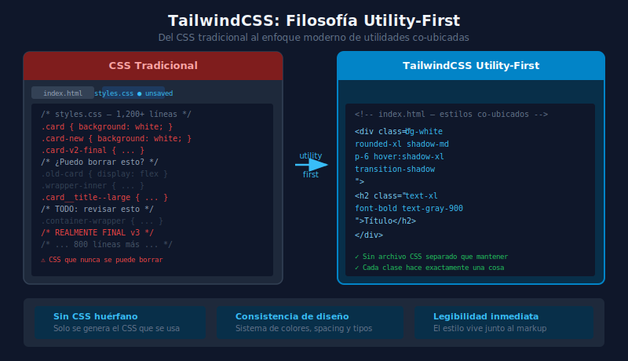

# 💨 Introducción a TailwindCSS

## 🎯 Objetivos

- Entender el problema que TailwindCSS resuelve
- Comprender la filosofía utility-first
- Diferenciar Tailwind de CSS en línea y de otros frameworks
- Conocer lo nuevo en Tailwind v4

---

## 📋 Contenido

### 1. El Problema con el CSS Tradicional

A medida que un proyecto crece, el CSS se vuelve difícil de mantener. Los equipos han intentado resolver esto con metodologías:

**BEM (Block Element Modifier):**
```css
/* Viene con reglas de nomenclatura estrictas */
.card { }
.card__title { }
.card__body { }
.card--featured { }
.card__title--large { }
```

**El problema**: Los nombres crecen, hay que decidir qué "bloque" es cada cosa, y el CSS sigue siendo un archivo separado que debe mantenerse en sintonía con el HTML.

**El resultado real en proyectos grandes:**

```css
/* CSS que nadie se atreve a borrar porque "podría estar usándose en algún lado" */
.container-wrapper { }
.container-wrapper-inner { }
.container-wrapper-inner-flex { }
/* ... 10.000 líneas después ... */
.new-card-v2-final { }
.new-card-v2-final-REALMENTE-FINAL { }
```

---

### 2. La Solución: Utility-First

TailwindCSS propone escribir estilos directamente en el HTML usando clases de utilidad — cada clase hace **una sola cosa**:

```html
<!-- CSS Tradicional: hay que ir al archivo CSS para entender el estilo -->
<div class="hero-section">
  <h1 class="hero-title">Hola Mundo</h1>
</div>

<!-- TailwindCSS utility-first: el estilo es legible directamente en el HTML -->
<div class="flex items-center justify-center min-h-screen bg-gray-900">
  <h1 class="text-4xl font-bold text-white">Hola Mundo</h1>
</div>
```

**Ventajas:**

| Problema clásico | Solución en Tailwind |
|-----------------|---------------------|
| "¿Puedo borrar esta clase?" | Sí — si no aparece en el HTML, Tailwind la elimina |
| Nombres de clases arbitrarios | No existen — son utilidades con nombres descriptivos |
| CSS que crece sin límite | El CSS final es solo las utilidades usadas (~10-15KB) |
| Cambiar estilos requiere ir al .css | Todo está en el HTML, co-ubicado |
| Estilos globales que afectan otra cosa | Cada utilidad afecta solo el elemento |

---

### 3. ¿No es lo mismo que CSS Inline?

Esta es la primera pregunta que surge. La respuesta es **no**, por varias razones:

```html
<!-- CSS Inline — muchas limitaciones: -->
<div style="background-color: #1f2937; padding: 16px;">
  <!-- No puedes hacer hover, focus, media queries con inline CSS -->
</div>

<!-- TailwindCSS — tiene todas las capacidades de CSS: -->
<div class="bg-gray-800 p-4 hover:bg-gray-700 md:p-8 dark:bg-slate-900">
  <!-- hover:, focus:, md:, dark: y cualquier variante -->
</div>
```

**Tailwind vs CSS inline:**

| | CSS Inline | TailwindCSS |
|---|-----------|------------|
| Pseudo-clases (`hover:`, `focus:`) | ❌ | ✅ |
| Media queries (`md:`, `lg:`) | ❌ | ✅ |
| Dark mode (`dark:`) | ❌ | ✅ |
| Variables de diseño consistentes | ❌ | ✅ (sistema de diseño integrado) |
| Autocompletado en VS Code | ❌ | ✅ (extensión Tailwind IntelliSense) |
| Purging de clases no usadas | N/A | ✅ |

---

### 4. Cómo Funciona TailwindCSS

```
Tu HTML/JSX (con clases Tailwind)
           │
           ▼
    Tailwind escanea
    todos los archivos
    buscando clases
           │
           ▼
    Genera CSS solo para
    las clases encontradas
           │
           ▼
    CSS optimizado de ~10KB
    listo para producción
```

**En Tailwind v4 esto es aún más eficiente**: usa un motor basado en Rust (Oxide) que es hasta 10x más rápido que v3.



---

### 5. Lo Nuevo en Tailwind v4

Tailwind v4 representó una reescritura completa del framework. Las diferencias más importantes para este bootcamp:

**Configuración en CSS (no en JS):**
```css
/* ✅ Método moderno Tailwind v4 — en tu archivo CSS */
@import "tailwindcss";

@theme {
  --color-brand: #38BDF8;
  --font-sans: "Inter", sans-serif;
}
```

```js
// ❌ Método antiguo v3 — tailwind.config.js obligatorio
module.exports = {
  theme: {
    extend: {
      colors: {
        brand: "#38BDF8",
      },
    },
  },
};
```

**Import simplificado:**
```css
/* ✅ Tailwind v4 */
@import "tailwindcss";

/* ❌ Tailwind v3 (legacy) */
@tailwind base;
@tailwind components;
@tailwind utilities;
```

**Clases arbitrarias mejoradas:**
```html
<!-- Puedes usar cualquier valor CSS directamente -->
<div class="bg-[#38BDF8] w-[calc(100%-2rem)] mt-[clamp(1rem,5vw,3rem)]">
```

---

### 6. Un Vistazo a lo que Construirás

Sin Tailwind (semana 1):
```html
<section style="...">
  <div class="hero-container">
    <h1 class="hero-title">Título</h1>
    <p class="hero-description">Descripción</p>
    <a class="hero-cta" href="#">Comenzar</a>
  </div>
</section>
```
```css
/* styles.css */
.hero-container { max-width: 1200px; margin: 0 auto; padding: 0 24px; }
.hero-title { font-size: 3rem; font-weight: 700; color: #111827; }
.hero-description { font-size: 1.125rem; color: #6b7280; margin-top: 16px; }
.hero-cta { display: inline-flex; padding: 12px 24px; background: #0ea5e9; color: white; border-radius: 8px; }
```

Con Tailwind (semana 2 en adelante):
```html
<section class="py-24 px-6">
  <div class="max-w-7xl mx-auto">
    <h1 class="text-5xl font-bold text-gray-900">Título</h1>
    <p class="mt-4 text-lg text-gray-500">Descripción</p>
    <a href="#" class="mt-8 inline-flex px-6 py-3 bg-sky-500 text-white rounded-lg hover:bg-sky-600 transition-colors">
      Comenzar
    </a>
  </div>
</section>
```

> **Sin archivo CSS separado.** Todo el estilo vive con el HTML. Esto es lo que aprenderás a dominar en las próximas semanas.

---

## 📚 Recursos Adicionales

- [TailwindCSS Docs: Utility-First Fundamentals](https://tailwindcss.com/docs/utility-first)
- [TailwindCSS v4 Release](https://tailwindcss.com/blog/tailwindcss-v4)
- [Tailwind Play — Sandbox online](https://play.tailwindcss.com/)
- [Adam Wathan: CSS Utility Classes and "Separation of Concerns"](https://adamwathan.me/css-utility-classes-and-separation-of-concerns/) — El post original que justificó utility-first

---

## ✅ Checklist de Verificación

Antes de continuar, asegúrate de:

- [ ] Explicar con tus palabras qué es la filosofía utility-first
- [ ] Saber al menos 3 ventajas de Tailwind sobre CSS tradicional
- [ ] Entender por qué Tailwind no es lo mismo que CSS inline
- [ ] Conocer la diferencia entre el `@import` de Tailwind v4 y el `@tailwind` de v3
- [ ] Haber explorado [Tailwind Play](https://play.tailwindcss.com/) aunque sea 5 minutos
