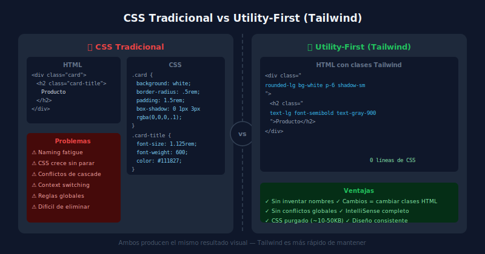

# ⚗️ Filosofía Utility-First

## 🎯 Objetivos

- Entender qué significa "utility-first" y por qué existe
- Comparar utility-first con CSS tradicional, BEM y CSS Modules
- Identificar cuándo utility-first es la mejor elección
- Desmitificar las críticas más comunes

---

## 📋 Contenido

### 1. El Problema que Resuelve

Cuando escribes CSS tradicional, enfrentas estos problemas constantemente:

**Naming fatigue** — ¿Cómo llamo a esta clase?
```css
/* ¿Es .card-header? ¿.product-card__title? ¿.featured-item-heading? */
.????? {
  font-size: 1.25rem;
  font-weight: 700;
  color: #1e293b;
}
```

**Specificity wars** — Las reglas se pisan entre sí:
```css
.card h2 { color: blue; }
.sidebar .card h2 { color: red; }  /* tengo que ser más específico */
.sidebar .card.featured h2 { color: green; }  /* ...y más... */
```

**CSS crece, nunca decrece** — Una vez que agregas una regla, rara vez la eliminas por miedo a romper algo.

**Context switching** — Vas de HTML → CSS → HTML → CSS constantemente.

---

### 2. Utility-First: El Paradigma



**Utility-first** significa que en lugar de abstraer estilos en componentes CSS con nombres, aplicas clases de propósito único directamente en el HTML:

```html
<!-- CSS tradicional -->
<div class="product-card">
  <h2 class="product-title">Zapatillas Running</h2>
  <p class="product-price">$89.99</p>
</div>
```

```css
.product-card {
  background: white;
  border-radius: 0.5rem;
  padding: 1.5rem;
  box-shadow: 0 1px 3px rgba(0,0,0,0.1);
}
.product-title {
  font-size: 1.125rem;
  font-weight: 600;
  color: #111827;
}
.product-price {
  font-size: 1.5rem;
  font-weight: 700;
  color: #0369a1;
  margin-top: 0.5rem;
}
```

```html
<!-- Utility-first con Tailwind -->
<div class="rounded-lg bg-white p-6 shadow-sm">
  <h2 class="text-lg font-semibold text-gray-900">Zapatillas Running</h2>
  <p class="mt-2 text-2xl font-bold text-sky-700">$89.99</p>
</div>
```

**¿Qué cambia?**
1. No hay archivo CSS separado que mantener
2. No hay que inventar nombres de clases
3. Cambiar el estilo = cambiar las clases en el HTML
4. Los estilos no tienen scope global → no hay effecto sorpresa

---

### 3. Utility-First vs Otros Enfoques

| Enfoque | Ventajas | Desventajas |
|---------|----------|-------------|
| **CSS Propio** | Total control, CSS mínimo si se hace bien | Naming, especificidad, crece con el tiempo |
| **BEM** | Nomenclatura estructurada, menos conflictos | Verbose, sigue teniendo los mismos problemas de CSS |
| **CSS Modules** | Scope local automático | Requiere bundler, separación HTML/CSS |
| **Utility-First (Tailwind)** | Sin naming, predecible, diseño consistente, IntelliSense | HTML verboso, curva de aprendizaje de clases |
| **CSS-in-JS** | Scope dinámico, variables JS | Runtime overhead, no estándar |

---

### 4. Las Críticas Más Comunes

**"El HTML queda muy largo y feo"**
```html
<!-- Sí, las clases son largas... -->
<button class="rounded-lg bg-sky-500 px-4 py-2 text-sm font-medium text-white hover:bg-sky-600 focus:outline-none focus:ring-2 focus:ring-sky-500 focus:ring-offset-2 disabled:cursor-not-allowed disabled:opacity-50">
  Enviar
</button>
```
Pero: los IDEs con IntelliSense hacen esto manejable. Y si este botón se repite, puedes extraerlo a un componente (React, Vue, etc.) o usar `@apply`.

**"No es diferente a estilos inline"**
No es así. Las clases Tailwind:
- Tienen valores del sistema de diseño (escala consistente)
- Soportan estados (`hover:`, `focus:`, `dark:`, responsive)
- Generan clases CSS reales (no `style=""`)
- Tienen IntelliSense completo

**"El CSS generado es enorme"**
Con JIT (Just-in-Time), Tailwind v4 genera **solo las clases que usas**. Un proyecto real tiene entre 10-50KB de CSS purgeado.

---

### 5. Cuándo Usar (y No Usar) Utility-First

✅ **Ideal para:**
- Proyectos con diseño consistente (design system)
- Equipos donde cada dev escribe sus propios estilos
- Prototipos rápidos
- Sitios con mucha variación de componentes

⚠️ **Considera alternativas cuando:**
- El proyecto tiene muy pocos componentes y CSS simple
- El equipo prefiere CSS arquitectural (ITCSS, etc.)
- Necesitas generar clases dinámicamente en tiempo de ejecución

---

## ✅ Checklist de Verificación

- [ ] Puedo explicar la diferencia entre utility-first y BEM sin mirar notas
- [ ] Entiendo por qué las clases Tailwind no son iguales a estilos inline
- [ ] Conozco al menos 3 ventajas concretas de utility-first
- [ ] Sé cuándo utility-first podría NO ser la mejor opción
