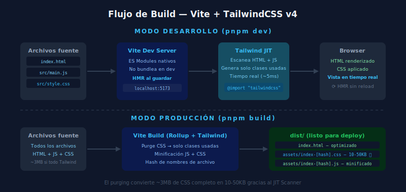

# ⚙️ Instalación: Vite + TailwindCSS v4

## 🎯 Objetivos

- Crear un proyecto Vite desde cero con pnpm
- Instalar y configurar TailwindCSS v4
- Entender qué hace cada archivo de configuración
- Levantar el servidor de desarrollo con HMR

---

## 📋 Contenido

### 1. Prerequisitos

Antes de continuar, verifica que tienes:

```bash
# Node.js 22+
node --version   # debe mostrar v22.x.x o superior

# pnpm
pnpm --version   # debe mostrar 9.x o superior

# Si no tienes pnpm:
npm install -g pnpm
```

---

### 2. Crear el Proyecto con Vite

```bash
# Crear proyecto vanilla JS con Vite
pnpm create vite@latest mi-proyecto-tailwind -- --template vanilla

# Entrar al directorio
cd mi-proyecto-tailwind

# Instalar dependencias base
pnpm install
```

**`--template vanilla`** crea un proyecto JavaScript puro, sin framework.
Más adelante en el bootcamp usaremos `--template react` para React.

---

### 3. Instalar TailwindCSS v4

TailwindCSS v4 usa el plugin oficial de Vite (no PostCSS separado):

```bash
# Instalar Tailwind + su plugin para Vite
pnpm add -D tailwindcss @tailwindcss/vite
```

- **`tailwindcss`** — El motor de Tailwind (CLI y CSS processing)
- **`@tailwindcss/vite`** — Integración directa con Vite (maneja el build automáticamente)
- **`-D`** — Son devDependencies: solo se necesitan para desarrollo, no en producción

> ⚠️ En v4 **NO necesitas** `postcss` ni `autoprefixer` como paquetes separados. El plugin `@tailwindcss/vite` los maneja internamente.

---

### 4. Configurar Vite

Edita `vite.config.js` para agregar el plugin de Tailwind:

```js
// vite.config.js
import { defineConfig } from 'vite'
import tailwindcss from '@tailwindcss/vite'

export default defineConfig({
  plugins: [
    tailwindcss(),
  ],
})
```

---

### 5. Crear el CSS de Entrada

Tailwind v4 usa una sola directiva en el CSS:

```css
/* src/style.css (o src/main.css) */
@import "tailwindcss";

/* Tus estilos personalizados van aquí, después del import */
```

> 🚀 **Tailwind v4 vs v3**: En v3 necesitabas tres directivas:
> ```css
> /* ❌ API legacy - NO usar en v4 */
> @tailwind base;
> @tailwind components;
> @tailwind utilities;
> ```
> En v4, una sola línea `@import "tailwindcss"` lo hace todo.

---

### 6. Conectar CSS al HTML

En `index.html`, asegúrate de que el CSS ya está importado a través del `main.js`:

```html
<!-- index.html -->
<!DOCTYPE html>
<html lang="es" class="h-full">
  <head>
    <meta charset="UTF-8" />
    <meta name="viewport" content="width=device-width, initial-scale=1.0" />
    <title>Mi Proyecto Tailwind</title>
  </head>
  <body class="h-full bg-gray-50">
    <div id="app"></div>
    <script type="module" src="/src/main.js"></script>
  </body>
</html>
```

```js
// src/main.js
import './style.css'  // Importa el CSS (Vite procesa @import "tailwindcss")

document.querySelector('#app').innerHTML = `
  <h1 class="text-4xl font-bold text-sky-500">¡Tailwind v4 funcionando!</h1>
`
```

---

### 7. Levantar el Servidor de Desarrollo



```bash
pnpm dev
```

Abre el browser en `http://localhost:5173` y verás el texto en azul sky.

**HMR (Hot Module Replacement)**: Cada vez que guardas un archivo, el browser se actualiza instantáneamente sin recargar la página completa.

---

### 8. Build de Producción

```bash
pnpm build
```

Genera la carpeta `dist/` con:
- `index.html` — HTML optimizado
- `assets/index-[hash].css` — Solo las clases Tailwind que usas (~10-50KB)
- `assets/index-[hash].js` — JavaScript minificado

---

## 📁 Estructura Final del Proyecto

```
mi-proyecto-tailwind/
├── index.html          ← Punto de entrada HTML
├── package.json        ← Dependencias y scripts
├── pnpm-lock.yaml      ← Lockfile (no editar)
├── vite.config.js      ← Configuración de Vite + Tailwind plugin
├── src/
│   ├── main.js         ← Punto de entrada JS (importa CSS)
│   └── style.css       ← @import "tailwindcss" + estilos custom
└── public/             ← Archivos estáticos (favicons, etc.)
```

---

## ✅ Checklist de Verificación

- [ ] `pnpm dev` levanta el servidor sin errores
- [ ] El browser muestra el texto con clases Tailwind aplicadas
- [ ] IntelliSense autocompleta clases Tailwind en VS Code
- [ ] `pnpm build` genera la carpeta `dist/` con CSS purgado
- [ ] Entiendo para qué sirve cada archivo de configuración
