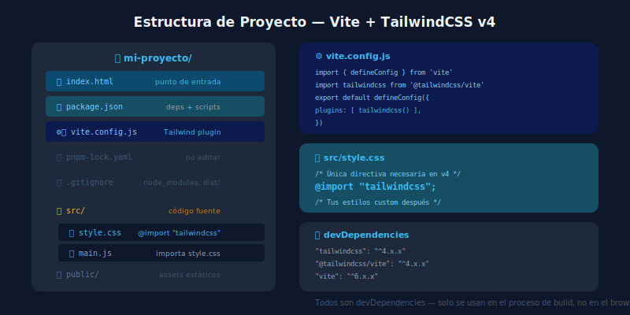

# 🏗️ Estructura del Proyecto Tailwind + Vite

## 🎯 Objetivos

- Entender qué hace cada archivo de un proyecto Vite + Tailwind
- Saber dónde va cada tipo de código
- Entender el flujo de build: source → bundle → output

---

## 📋 Contenido

### 1. Mapa del Proyecto



```
mi-proyecto/
├── index.html            ← Punto de entrada del browser
├── package.json          ← Metadatos, dependencias, scripts npm
├── pnpm-lock.yaml        ← Versiones exactas de dependencias instaladas
├── vite.config.js        ← Configuración del bundler (plugins, alias, etc.)
├── .gitignore            ← Archivos que Git ignora (node_modules, dist)
│
├── src/                  ← Todo tu código fuente
│   ├── main.js           ← Punto de entrada JavaScript
│   ├── style.css         ← CSS principal (con @import "tailwindcss")
│   └── components/       ← (opcional) HTML/JS de componentes
│
└── public/               ← Archivos estáticos copiados tal cual al build
    └── favicon.ico
```

---

### 2. `index.html` — La Raíz

A diferencia de Webpack, Vite usa `index.html` como punto de entrada real, no como template:

```html
<!DOCTYPE html>
<html lang="es">
  <head>
    <meta charset="UTF-8" />
    <meta name="viewport" content="width=device-width, initial-scale=1.0" />
    <title>Mi App</title>
    <!-- Vite maneja el CSS automáticamente a través de los imports en JS -->
  </head>
  <body>
    <div id="app"></div>
    <!-- Este script es el punto de entrada: Vite lo procesa -->
    <script type="module" src="/src/main.js"></script>
  </body>
</html>
```

---

### 3. `package.json` — El Mapa de Dependencias

```json
{
  "name": "mi-proyecto",
  "private": true,
  "version": "0.0.0",
  "type": "module",
  "scripts": {
    "dev": "vite",         // pnpm dev → servidor de desarrollo
    "build": "vite build", // pnpm build → bundle de producción
    "preview": "vite preview" // pnpm preview → previsualizar build local
  },
  "devDependencies": {
    "tailwindcss": "^4.0.0",     // Motor de Tailwind
    "@tailwindcss/vite": "^4.0.0", // Plugin Vite para Tailwind
    "vite": "^6.0.0"             // Bundler
  }
}
```

**devDependencies vs dependencies**: Todo en Tailwind es devDependency porque genera CSS en tiempo de build, no en tiempo de ejecución.

---

### 4. `vite.config.js` — El Motor

```js
import { defineConfig } from 'vite'
import tailwindcss from '@tailwindcss/vite'

export default defineConfig({
  plugins: [
    tailwindcss(),  // Activa el procesamiento de @import "tailwindcss"
  ],
  // Otras opciones útiles:
  // base: '/mi-repo/',        // Si usas GitHub Pages con subdirectorio
  // build: {
  //   outDir: 'dist',         // Carpeta de output (default: 'dist')
  //   assetsDir: 'assets',    // Subcarpeta para assets
  // }
})
```

---

### 5. `src/style.css` — El CSS de Entrada

```css
/* La directiva principal — importa todo Tailwind */
@import "tailwindcss";

/* Aquí van tus estilos personalizados */

/* Ejemplo: var CSS para design tokens */
@theme {
  --color-brand: #0ea5e9;
  --font-display: 'Inter', sans-serif;
}

/* Ejemplo: utilidades custom */
@layer utilities {
  .text-balance {
    text-wrap: balance;
  }
}
```

---

### 6. `src/main.js` — El Punto de Entrada JS

```js
// Importar CSS (Vite lo procesa y genera el bundle)
import './style.css'

// Importar componentes
import { setupCounter } from './counter.js'

// Tu aplicación
document.querySelector('#app').innerHTML = `
  <main class="min-h-screen bg-gray-50 py-16">
    <div class="mx-auto max-w-2xl px-4">
      <h1 class="text-4xl font-bold tracking-tight text-gray-900">
        Hola Tailwind
      </h1>
    </div>
  </main>
`
```

---

### 7. El Flujo de Build

```
src/style.css  →  @tailwindcss/vite escanea HTML+JS  →  genera clases usadas
src/main.js    →  Vite bundlea y minifica             →  dist/assets/index.js
index.html     →  Vite procesa imports y hashes       →  dist/index.html
                                                      →  dist/assets/index.css (purgado)
```

**Resultado final en `dist/`:**
- Solo clases Tailwind que aparecen en tu código
- CSS minificado y optimizado
- Listo para subir a servidor o CDN

---

## ✅ Checklist de Verificación

- [ ] Entiendo para qué sirve cada archivo del proyecto
- [ ] Sé dónde agregar nuevos estilos CSS
- [ ] Comprendo la diferencia entre `dev` y `build`
- [ ] Puedo explicar por qué las devDependencies no van a producción
