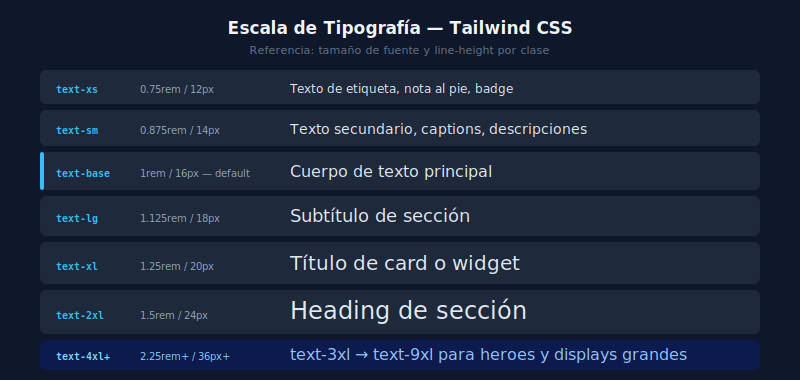
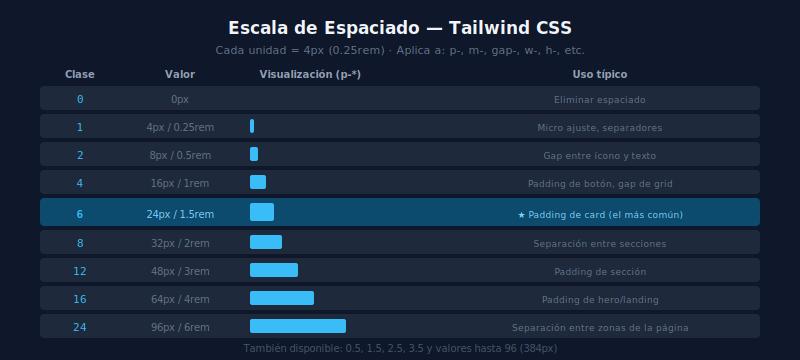

# 🎨 Primeras Clases de Utilidad

## 🎯 Objetivos

- Dominar las categorías más usadas de clases Tailwind
- Entender el patrón de nomenclatura de las utilidades
- Aplicar texto, colores, fondo, espaciado, tamaño y bordes básicos

---

## 📋 Contenido

### 1. El Patrón de Nomenclatura

Las clases Tailwind siguen un patrón consistente:

```
[variante:]propiedad-valor
```

Ejemplos:
- `text-lg` → font-size: 1.125rem
- `bg-sky-500` → background-color: sky 500
- `p-4` → padding: 1rem (4 × 0.25rem)
- `hover:bg-sky-600` → bg-sky-600 al hacer hover
- `md:text-xl` → text-xl en pantallas ≥ 768px

---

### 2. Tipografía



```html
<!-- Tamaño de texto -->
<p class="text-xs">text-xs — 12px</p>
<p class="text-sm">text-sm — 14px</p>
<p class="text-base">text-base — 16px (default)</p>
<p class="text-lg">text-lg — 18px</p>
<p class="text-xl">text-xl — 20px</p>
<p class="text-2xl">text-2xl — 24px</p>
<p class="text-3xl">text-3xl — 30px</p>
<p class="text-4xl">text-4xl — 36px</p>

<!-- Peso de fuente -->
<p class="font-thin">font-thin — 100</p>
<p class="font-light">font-light — 300</p>
<p class="font-normal">font-normal — 400</p>
<p class="font-medium">font-medium — 500</p>
<p class="font-semibold">font-semibold — 600</p>
<p class="font-bold">font-bold — 700</p>
<p class="font-black">font-black — 900</p>

<!-- Alineación y decoración -->
<p class="text-left">Alineado izquierda</p>
<p class="text-center">Centrado</p>
<p class="text-right">Alineado derecha</p>
<p class="uppercase">MAYÚSCULAS</p>
<p class="lowercase">minúsculas</p>
<p class="capitalize">Capitalizado</p>
<p class="underline">Subrayado</p>
<p class="line-through">Tachado</p>
<p class="italic">Cursiva</p>
<p class="truncate">Texto muy largo que se trunca con elipsis...</p>
```

---

### 3. Colores de Texto y Fondo

Tailwind tiene una paleta de colores con escala del 50 (más claro) al 950 (más oscuro):

```html
<!-- Colores de texto -->
<p class="text-gray-900">Texto casi negro</p>
<p class="text-gray-600">Texto secundario</p>
<p class="text-gray-400">Texto deshabilitado</p>
<p class="text-sky-500">Texto azul cielo</p>
<p class="text-emerald-600">Texto verde esmeralda</p>
<p class="text-red-500">Texto de error</p>
<p class="text-amber-500">Texto de advertencia</p>
<p class="text-white">Texto blanco</p>

<!-- Colores de fondo -->
<div class="bg-white">Fondo blanco</div>
<div class="bg-gray-50">Fondo gris muy claro</div>
<div class="bg-gray-100">Fondo gris claro</div>
<div class="bg-sky-500">Fondo azul cielo</div>
<div class="bg-slate-900">Fondo oscuro</div>

<!-- Combinación texto + fondo -->
<div class="bg-sky-500 text-white">Badge azul con texto blanco</div>
<div class="bg-emerald-100 text-emerald-800">Badge verde</div>
```

---

### 4. Espaciado (Padding y Margin)



La escala de espaciado: cada unidad = 4px (0.25rem).

```html
<!-- Padding (espacio interior) -->
<div class="p-4">p-4 = padding 1rem en todos los lados</div>
<div class="px-4">px-4 = padding horizontal (left + right)</div>
<div class="py-4">py-4 = padding vertical (top + bottom)</div>
<div class="pt-2 pb-6 pl-4 pr-8">Padding individual por lado</div>

<!-- Margin (espacio exterior) -->
<div class="m-4">m-4 = margin en todos los lados</div>
<div class="mx-auto">mx-auto = centrar horizontalmente</div>
<div class="mt-8">mt-8 = margin-top 2rem</div>
<div class="mb-4">mb-4 = margin-bottom 1rem</div>

<!-- Espaciado entre hijos -->
<ul class="space-y-2">
  <li>Elemento 1</li>  <!-- gap vertical de 0.5rem entre children -->
  <li>Elemento 2</li>
  <li>Elemento 3</li>
</ul>

<!-- Referencia de la escala -->
<!-- 
  0 = 0px       4 = 1rem (16px)   8 = 2rem (32px)
  1 = 0.25rem   5 = 1.25rem       10 = 2.5rem
  2 = 0.5rem    6 = 1.5rem        12 = 3rem
  3 = 0.75rem   7 = 1.75rem       16 = 4rem
-->
```

---

### 5. Bordes y Bordes Redondeados

```html
<!-- Border básico -->
<div class="border">Border 1px solid</div>
<div class="border-2">Border 2px</div>
<div class="border-4">Border 4px</div>

<!-- Color del borde -->
<div class="border border-gray-200">Borde gris claro</div>
<div class="border border-sky-500">Borde azul</div>
<div class="border border-red-300">Borde rojo claro</div>

<!-- Border por lado -->
<div class="border-t">Solo arriba</div>
<div class="border-b">Solo abajo</div>
<div class="border-l-4 border-sky-500">Borde izquierdo azul grueso</div>

<!-- Bordes redondeados -->
<div class="rounded-sm">rounded-sm — 2px</div>
<div class="rounded">rounded — 4px (default)</div>
<div class="rounded-md">rounded-md — 6px</div>
<div class="rounded-lg">rounded-lg — 8px</div>
<div class="rounded-xl">rounded-xl — 12px</div>
<div class="rounded-2xl">rounded-2xl — 16px</div>
<div class="rounded-full">rounded-full — 9999px (círculo/pill)</div>
```

---

### 6. Ancho y Alto

```html
<!-- Ancho fijo -->
<div class="w-8">w-8 = 2rem</div>
<div class="w-16">w-16 = 4rem</div>
<div class="w-32">w-32 = 8rem</div>
<div class="w-64">w-64 = 16rem</div>

<!-- Ancho relativo -->
<div class="w-full">w-full = 100%</div>
<div class="w-1/2">w-1/2 = 50%</div>
<div class="w-1/3">w-1/3 = 33.33%</div>
<div class="w-2/3">w-2/3 = 66.66%</div>

<!-- Ancho viewport y container -->
<div class="w-screen">w-screen = 100vw</div>
<div class="max-w-2xl mx-auto">max-w-2xl + centrado</div>

<!-- Alto -->
<div class="h-8">h-8 = 2rem</div>
<div class="h-screen">h-screen = 100vh</div>
<div class="min-h-screen">min-h-screen = min-height: 100vh</div>
```

---

### 7. Primer Componente Completo

Combinando todo lo anterior:

```html
<!-- Tarjeta de notificación -->
<div class="max-w-sm rounded-xl border border-gray-200 bg-white p-4 shadow-sm">
  <!-- Header de la tarjeta -->
  <div class="flex items-start gap-3">
    <!-- Icono de estado -->
    <span class="mt-0.5 rounded-full bg-emerald-100 p-1">
      <span class="block h-4 w-4 rounded-full bg-emerald-500"></span>
    </span>
    <!-- Contenido -->
    <div>
      <p class="text-sm font-semibold text-gray-900">Pago recibido</p>
      <p class="mt-0.5 text-sm text-gray-500">Tu pago de $89.99 fue procesado.</p>
    </div>
  </div>
  <!-- Acción -->
  <div class="mt-4 text-right">
    <button class="text-sm font-medium text-sky-600 hover:text-sky-700">
      Ver detalles →
    </button>
  </div>
</div>
```

---

## ✅ Checklist de Verificación

- [ ] Puedo aplicar cualquier tamaño de texto y peso de fuente
- [ ] Entiendo el sistema de escalas numéricas de Tailwind (4 = 1rem)
- [ ] Sé aplicar colores de texto y fondo con cualquier tono de la paleta
- [ ] Controlo padding y margin con precisión por lado
- [ ] Puedo crear bordes con ancho, color y radio específicos
- [ ] Construyo un componente completo sin consultar documentación básica
