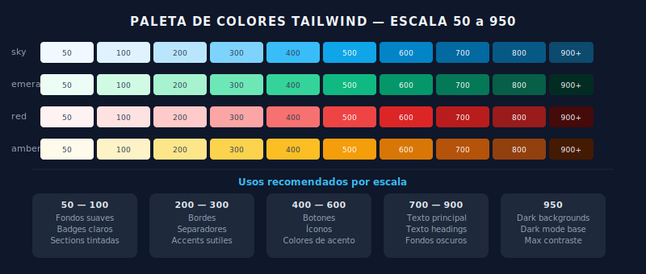

# 🎨 Paleta de Colores de Tailwind

## 🎯 Objetivos

- Entender la estructura de la paleta: colores × escala numérica
- Saber elegir tonos para texto, fondo, borde y acento
- Aplicar colores con semántica en interfaces reales
- Entender la opacidad con la notación `/`

---

## 📋 Contenido



### 1. Estructura de la Paleta

Tailwind tiene ~22 colores semánticos, cada uno con 11 escalas:

```
{color}-{escala}
  sky-50   → clarísimo (casi blanco)
  sky-100  → muy claro (fondos suaves)
  sky-200  → claro
  sky-300  → claro medio
  sky-400  → medio
  sky-500  → el tono "puro" del color
  sky-600  → oscuro medio
  sky-700  → oscuro (buen contraste sobre blanco)
  sky-800  → muy oscuro
  sky-900  → casi negro (máximo contraste)
  sky-950  → extremadamente oscuro
```

**Colores disponibles:** slate, gray, zinc, neutral, stone, red, orange, amber, yellow, lime, green, emerald, teal, cyan, sky, blue, indigo, violet, purple, fuchsia, pink, rose.

---

### 2. Cómo Elegir el Tono Correcto

| Uso | Escala recomendada | Ejemplo |
|-----|-------------------|---------|
| **Fondo de página** | 50 | `bg-gray-50` |
| **Fondo de card** | white o 50 | `bg-white` |
| **Fondo sutil coloreado** | 100 | `bg-sky-100` |
| **Tono de badge** | 100-200 | `bg-emerald-100` |
| **Color acento/botón** | 500-600 | `bg-sky-500` |
| **Hover de botón** | +100 al acento | `hover:bg-sky-600` |
| **Texto sobre fondo claro** | 700-900 | `text-gray-900` |
| **Texto secundario** | 500-600 | `text-gray-600` |
| **Texto deshabilitado** | 400 | `text-gray-400` |
| **Texto sobre fondo oscuro** | white o 50 | `text-white` |
| **Borde sutil** | 200 | `border-gray-200` |
| **Borde de badge** | 200-300 | `border-sky-200` |

---

### 3. Clases de Color

```html
<!-- Texto -->
<p class="text-gray-900">Texto principal</p>
<p class="text-gray-600">Texto secundario</p>
<p class="text-sky-600">Texto de enlace</p>

<!-- Fondo -->
<div class="bg-white">Card blanca</div>
<div class="bg-sky-50">Fondo azul muy suave</div>
<div class="bg-sky-500">Caja azul sólida</div>

<!-- Borde -->
<div class="border border-gray-200">Borde sutil</div>
<div class="border-2 border-sky-500">Borde acento</div>

<!-- Ring (outline tipo focus) -->
<button class="focus:ring-2 focus:ring-sky-500 focus:ring-offset-2">
  Botón con ring
</button>

<!-- Opacidad con "/" -->
<div class="bg-sky-500/20">Fondo sky al 20% de opacidad</div>
<div class="text-gray-900/70">Texto al 70% de opacidad</div>
```

---

### 4. Colores Semánticos (Patrones Comunes)

```html
<!-- Componente de alerta con colores semánticos -->

<!-- Éxito / Success -->
<div class="flex items-center gap-3 rounded-lg bg-emerald-50 border border-emerald-200 p-4">
  <span class="text-emerald-600 font-medium">✓ Guardado correctamente</span>
</div>

<!-- Error / Danger -->
<div class="flex items-center gap-3 rounded-lg bg-red-50 border border-red-200 p-4">
  <span class="text-red-700 font-medium">✕ Error al procesar</span>
</div>

<!-- Advertencia / Warning -->
<div class="flex items-center gap-3 rounded-lg bg-amber-50 border border-amber-200 p-4">
  <span class="text-amber-800 font-medium">⚠ Revisa los datos</span>
</div>

<!-- Información / Info -->
<div class="flex items-center gap-3 rounded-lg bg-sky-50 border border-sky-200 p-4">
  <span class="text-sky-700 font-medium">ℹ Nueva versión disponible</span>
</div>
```

---

### 5. Contraste y Accesibilidad

Para cumplir WCAG AA necesitas una relación de contraste ≥ 4.5:1 para texto normal.

**Reglas prácticas:**
- Texto sobre fondo blanco: usa **600+** (ej: `text-gray-600`)
- Texto sobre fondo oscuro (500+): usa **blanco** (`text-white`) o escala **50**
- Evita combinar escalas similares: `text-gray-400` sobre `bg-gray-300` = bajo contraste

```html
<!-- ✅ Buen contraste -->
<div class="bg-white text-gray-900">Contraste ~17:1 ✓</div>
<div class="bg-sky-600 text-white">Contraste ~5:1 ✓</div>
<div class="bg-gray-100 text-gray-700">Contraste ~8:1 ✓</div>

<!-- ❌ Mal contraste -->
<div class="bg-gray-100 text-gray-400">Contraste ~3:1 ✗</div>
<div class="bg-sky-200 text-sky-400">Contraste ~2:1 ✗</div>
```

---

## ✅ Checklist de Verificación

- [ ] Puedo elegir el tono correcto (50-950) según el uso (fondo, texto, acento)
- [ ] Entiendo la diferencia entre escala 100 (fondo badge) y 500 (botón sólido)
- [ ] Mis combinaciones de color/fondo tienen contraste WCAG AA
- [ ] Uso colores semánticos (emerald=éxito, red=error, amber=advertencia, sky=info)
