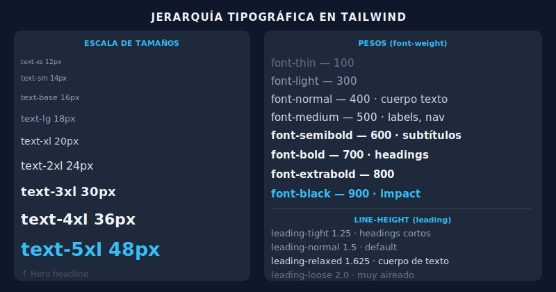

# 🔤 Tipografía en Tailwind

## 🎯 Objetivos

- Controlar completamente la tipografía con clases Tailwind
- Entender la jerarquía tipográfica visual
- Aplicar font-family, line-height, letter-spacing
- Crear sistemas tipográficos coherentes

---

## 📋 Contenido



### 1. Font Size — La Escala Completa

```html
<p class="text-xs">12px — Etiquetas, badges, notas al pie</p>
<p class="text-sm">14px — Texto auxiliar, captions</p>
<p class="text-base">16px — Cuerpo de texto (default)</p>
<p class="text-lg">18px — Lead paragraph, subtítulos pequeños</p>
<p class="text-xl">20px — Subtítulos de sección</p>
<p class="text-2xl">24px — Títulos de card o widget</p>
<p class="text-3xl">30px — Heading de sección</p>
<p class="text-4xl">36px — Título de página</p>
<p class="text-5xl">48px — Hero headline</p>
<p class="text-6xl">60px — Display grande</p>
<p class="text-7xl">72px — Display extra grande</p>
```

---

### 2. Font Weight

```html
<p class="font-thin">font-thin — 100 · Decorativo</p>
<p class="font-extralight">font-extralight — 200</p>
<p class="font-light">font-light — 300 · Lead text en diseños modernos</p>
<p class="font-normal">font-normal — 400 · Cuerpo de texto</p>
<p class="font-medium">font-medium — 500 · Labels, nav links</p>
<p class="font-semibold">font-semibold — 600 · Títulos de card, subtítulos</p>
<p class="font-bold">font-bold — 700 · Headings, énfasis fuerte</p>
<p class="font-extrabold">font-extrabold — 800</p>
<p class="font-black">font-black — 900 · Impacto visual máximo</p>
```

**Regla práctica:**
- Cuerpo de texto → `font-normal`
- Labels, categorías → `font-medium`
- Subtítulos de componentes → `font-semibold`
- Headings de página → `font-bold` o `font-extrabold`

---

### 3. Line Height (interlineado)

```html
<!-- line-height afecta la legibilidad del texto corrido -->
<p class="leading-none">leading-none = 1 · Solo para headings cortos</p>
<p class="leading-tight">leading-tight = 1.25 · Headings de varias líneas</p>
<p class="leading-snug">leading-snug = 1.375</p>
<p class="leading-normal">leading-normal = 1.5 · Default del browser</p>
<p class="leading-relaxed">leading-relaxed = 1.625 · Cuerpo de texto ideal</p>
<p class="leading-loose">leading-loose = 2 · Texto muy aireado</p>
```

**Regla práctica:**
- Headings cortos → `leading-tight` o `leading-none`
- Cuerpo de texto largo → `leading-relaxed` o `leading-loose`
- Default → `leading-normal` (1.5)

---

### 4. Letter Spacing (tracking)

```html
<p class="tracking-tighter">tracking-tighter = -0.05em</p>
<p class="tracking-tight">tracking-tight = -0.025em · Headings grandes</p>
<p class="tracking-normal">tracking-normal = 0 · Default</p>
<p class="tracking-wide">tracking-wide = 0.025em</p>
<p class="tracking-wider">tracking-wider = 0.05em</p>
<p class="tracking-widest">tracking-widest = 0.1em · Uppercase labels</p>
```

Patrón común:
```html
<!-- Etiqueta uppercase con tracking amplio -->
<span class="text-xs font-semibold uppercase tracking-widest text-gray-500">
  Categoría
</span>
```

---

### 5. Font Family

Por defecto Tailwind incluye tres stacks:

```html
<!-- Sistema sans-serif (default para UI) -->
<p class="font-sans">Inter, system-ui, -apple-system, sans-serif</p>

<!-- Sistema serif (para contenido editorial) -->
<p class="font-serif">Georgia, Cambria, serif</p>

<!-- Sistema monospace (para código) -->
<p class="font-mono">Menlo, Monaco, monospace</p>
```

Para usar fuentes custom (como Inter de Google Fonts):
```css
/* En src/style.css */
@import "tailwindcss";
@import url("https://fonts.googleapis.com/css2?family=Inter:wght@300..900&display=swap");

@theme {
  --font-sans: 'Inter', system-ui, sans-serif;
}
```

---

### 6. Decoración y Transformación

```html
<!-- Transformación de texto -->
<p class="uppercase">Todo en MAYÚSCULAS</p>
<p class="lowercase">todo en minúsculas</p>
<p class="capitalize">Primera Letra De Cada Palabra</p>
<p class="normal-case">Sin transformación</p>

<!-- Decoración -->
<p class="underline">Subrayado</p>
<p class="line-through">Tachado</p>
<p class="no-underline">Sin subrayado (para links)</p>

<!-- Overflow de texto -->
<p class="truncate">Texto que se trunca con elipsis cuando es muy largo...</p>
<p class="line-clamp-2">Texto que se limita a 2 líneas máximo y luego
  muestra elipsis cuando el contenido es demasiado largo para el contenedor</p>
```

---

### 7. Sistema Tipográfico Completo

Ejemplo de jerarquía coherente para una página de artículo:

```html
<article class="mx-auto max-w-2xl px-4 py-12">
  <!-- Categoría -->
  <span class="text-xs font-semibold uppercase tracking-widest text-sky-600">
    Diseño Web
  </span>

  <!-- Título principal -->
  <h1 class="mt-3 text-4xl font-bold tracking-tight text-gray-900 leading-tight">
    Cómo TailwindCSS cambió mi forma de trabajar
  </h1>

  <!-- Byline -->
  <p class="mt-4 text-sm text-gray-500">
    Por <span class="font-medium text-gray-700">Ana García</span> · 12 min lectura
  </p>

  <!-- Lead paragraph -->
  <p class="mt-6 text-xl text-gray-600 leading-relaxed">
    Después de 5 años usando BEM y CSS Modules, decidí darle una oportunidad real
    a Tailwind. Esta es mi experiencia honesta.
  </p>

  <!-- Cuerpo -->
  <div class="mt-8 space-y-6 text-base text-gray-700 leading-relaxed">
    <p>El primer día fue duro. Las clases interminables en el HTML...</p>
    <p>Pero a la semana, algo cambió. Ya no necesitaba inventar nombres...</p>
  </div>
</article>
```

---

## ✅ Checklist de Verificación

- [ ] Uso `leading-relaxed` o `leading-loose` en texto corrido largo
- [ ] Los headings tienen `tracking-tight` y `leading-tight`
- [ ] Las etiquetas uppercase usan `tracking-widest`
- [ ] Mi jerarquía tipográfica es clara: h1>h2>h3>body claramente distintos
- [ ] Elijo el peso correcto por nivel de la jerarquía
