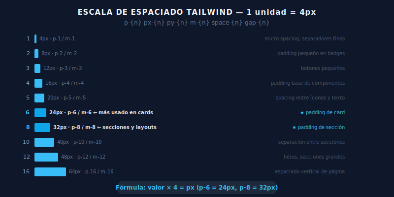

# 📐 Sistema de Espaciado de Tailwind

## 🎯 Objetivos

- Dominar el sistema de espaciado de 4px de Tailwind
- Aplicar padding y margin con precisión por eje y lado
- Usar `space-x` y `space-y` para espaciado entre hijos
- Crear layouts con espaciado consistente

---

## 📋 Contenido



### 1. La Escala de Espaciado

Cada número de la escala = 4px:

| Clase | px | rem |
|-------|----|-----|
| `0` | 0px | 0 |
| `0.5` | 2px | 0.125rem |
| `1` | 4px | 0.25rem |
| `2` | 8px | 0.5rem |
| `3` | 12px | 0.75rem |
| `4` | 16px | 1rem |
| `5` | 20px | 1.25rem |
| `6` | 24px | 1.5rem |
| `8` | 32px | 2rem |
| `10` | 40px | 2.5rem |
| `12` | 48px | 3rem |
| `16` | 64px | 4rem |
| `20` | 80px | 5rem |
| `24` | 96px | 6rem |

---

### 2. Padding

```html
<!-- Todos los lados -->
<div class="p-4">Padding 16px en todos los lados</div>

<!-- Ejes -->
<div class="px-6">Padding horizontal (left + right): 24px</div>
<div class="py-4">Padding vertical (top + bottom): 16px</div>

<!-- Combinado (el más común en UI) -->
<div class="px-4 py-2">Botón: 16px horizontal, 8px vertical</div>
<div class="px-6 py-4">Card: 24px horizontal, 16px vertical</div>

<!-- Por lado individual -->
<div class="pt-8">Padding top: 32px</div>
<div class="pb-4">Padding bottom: 16px</div>
<div class="pl-4">Padding left: 16px</div>
<div class="pr-2">Padding right: 8px</div>
```

---

### 3. Margin

```html
<!-- Todos los lados -->
<div class="m-4">Margin 16px</div>

<!-- Ejes -->
<div class="mx-auto">Centrar horizontalmente</div>
<div class="my-8">Margin vertical 32px</div>

<!-- Por lado -->
<div class="mt-4">Margin top 16px (lo más usado)</div>
<div class="mb-6">Margin bottom 24px</div>

<!-- Margin negativo -->
<div class="mt-4 -mt-2">Margin top negativo (superponer elementos)</div>
```

**Tip importante:** Para espaciado entre elementos de una lista o sección, usa `mt-*` en el elemento hijo, no `mb-*` en el padre.

---

### 4. Space-X y Space-Y

`space-x-*` y `space-y-*` aplican margen entre hijos de un flex container, sin margen en el primer hijo.

```html
<!-- Sin space-x: hay que poner margen manualmente -->
<nav class="flex">
  <a class="ml-6">Link 1</a>  <!-- primero sin margen -->
  <a class="ml-6">Link 2</a>
  <a class="ml-6">Link 3</a>
</nav>

<!-- Con space-x: mucho más limpio -->
<nav class="flex space-x-6">
  <a>Link 1</a>
  <a>Link 2</a>
  <a>Link 3</a>
</nav>

<!-- space-y para listas verticales -->
<ul class="space-y-4">
  <li>Elemento 1</li>
  <li>Elemento 2</li>
  <li>Elemento 3</li>
</ul>
```

**¿Cuándo usar space-* vs gap-*?**
- `space-*` → en flex containers lineales simples
- `gap-*` → en flex o grid con wrap, o en grids, siempre que tengas wrapping

---

### 5. Gap (para Flexbox y Grid)

```html
<!-- Gap uniforme -->
<div class="flex gap-4">
  <div>Item 1</div>
  <div>Item 2</div>
  <div>Item 3</div>
</div>

<!-- Gap por eje -->
<div class="grid grid-cols-3 gap-x-6 gap-y-4">
  <!-- gap horizontal vs vertical diferente -->
</div>
```

---

### 6. Contenedor con Max Width

```html
<!-- Patrón estándar de contenedor centrado -->
<div class="mx-auto max-w-7xl px-4 sm:px-6 lg:px-8">
  <!-- contenido de página -->
</div>

<!-- Contenedor para texto (legibilidad óptima ~65ch) -->
<div class="mx-auto max-w-2xl px-4">
  <!-- artículo o blog post -->
</div>
```

**Referencia de max-width:**
- `max-w-xs` → 320px
- `max-w-sm` → 384px
- `max-w-md` → 448px
- `max-w-lg` → 512px
- `max-w-xl` → 576px
- `max-w-2xl` → 672px (ideal para texto)
- `max-w-4xl` → 896px
- `max-w-7xl` → 1280px (layout de página)

---

## ✅ Checklist de Verificación

- [ ] Puedo convertir cualquier clase de espaciado a px mentalmente (4=16, 6=24, 8=32)
- [ ] Uso `px-*` + `py-*` en componentes en lugar de `p-*` cuando los ejes son diferentes
- [ ] Entiendo cuándo usar `space-y-*` vs `mt-*` vs `gap-*`
- [ ] Mis layouts tienen espaciado consistente: mismos valores para elementos similares
