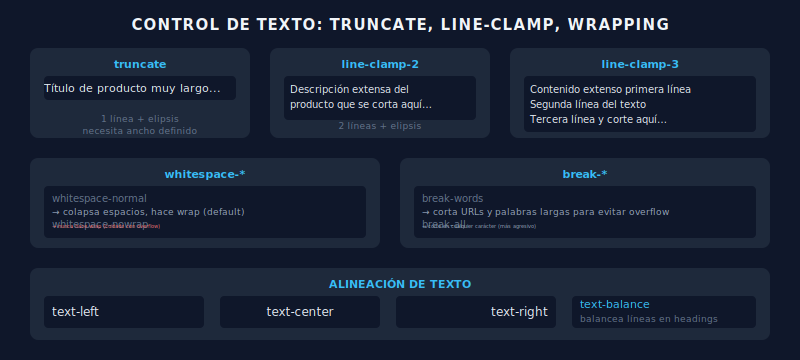

# 📄 Text Overflow, Wrapping y Alineación

## 🎯 Objetivos

- Controlar el desbordamiento de texto
- Aplicar truncado y line-clamp
- Gestionar el wrapping y el whitespace
- Dominar la alineación de texto

---

## 📋 Contenido



### 1. Truncado con Elipsis

```html
<!-- truncate: una línea + elipsis al final -->
<p class="w-48 truncate">
  Este texto es muy largo y será truncado con elipsis
</p>
<!-- Resultado: "Este texto es muy lar..." -->

<!-- overflow-hidden: corta sin elipsis -->
<p class="w-48 overflow-hidden">
  Texto cortado abruptamente sin elipsis
</p>
```

Para que `truncate` funcione:
1. El elemento debe tener un ancho definido (`w-*`, `max-w-*`, o estar en un contenedor flex)
2. La clase incluye automáticamente `overflow-hidden` y `text-ellipsis`

---

### 2. Line Clamp (multiline truncate)

```html
<!-- Limitar a 1 línea -->
<p class="line-clamp-1">Texto de una sola línea máximo...</p>

<!-- Limitar a 2 líneas (muy común en cards) -->
<p class="line-clamp-2">
  Descripción de producto que si es muy larga se corta
  a dos líneas exactas con elipsis al final automáticamente
</p>

<!-- Limitar a 3 líneas -->
<p class="line-clamp-3">...</p>

<!-- Eliminar el clamp (útil para toggles) -->
<p class="line-clamp-none">Texto completo sin límite</p>
```

---

### 3. Whitespace

```html
<!-- Colapsa espacios normalmente (default) -->
<p class="whitespace-normal">  Espacios  múltiples    colapsan  </p>

<!-- Preserva saltos de línea y espacios -->
<p class="whitespace-pre">Línea 1
Línea 2
  Indentado</p>

<!-- Preserva pero hace wrap -->
<p class="whitespace-pre-wrap">Preserva formato pero hace wrap cuando llega al borde</p>

<!-- No hace wrap nunca (cuidado con overflow) -->
<p class="whitespace-nowrap">Este texto nunca hará wrap sin importar el ancho</p>
```

---

### 4. Word Break

```html
<!-- Corta palabras largas cuando no hay espacio -->
<p class="break-words">https://una-url-muy-larga-que-no-tiene-espacios/y/sigue/siendo/larga</p>

<!-- No corta palabras nunca -->
<p class="break-normal">Comportamiento normal del navegador</p>

<!-- Corte en cualquier carácter (más agresivo) -->
<p class="break-all">TextoMuyLargoSinEspaciosQueNecesitaCortarse</p>

<!-- Mantiene palabras completas cuando puede -->
<p class="break-keep">For CJK text that should keep words intact</p>
```

---

### 5. Alineación de Texto

```html
<p class="text-left">Alineado a la izquierda (default)</p>
<p class="text-center">Centrado</p>
<p class="text-right">Alineado a la derecha</p>
<p class="text-justify">
  Justificado: el texto se distribuye para ocupar todo el ancho
  de la línea, creando márgenes uniformes en ambos lados.
</p>

<!-- Text-wrap moderno (v3.3+) -->
<h1 class="text-balance">
  Título que balancea el texto para que las líneas sean iguales
</h1>
<p class="text-pretty">
  Párrafo que evita líneas huérfanas al final
</p>
```

---

### 6. Casos de Uso Reales

```html
<!-- Card con título truncado y descripción en 2 líneas -->
<article class="max-w-sm rounded-xl border bg-white p-4">
  <h3 class="truncate font-semibold text-gray-900">
    Nombre de producto muy largo que se trunca
  </h3>
  <p class="mt-1 line-clamp-2 text-sm text-gray-600">
    Descripción detallada del producto que puede ser muy extensa
    y queremos mostrar solo las primeras dos líneas.
  </p>
</article>

<!-- Lista de resultados con text overflow controlado -->
<ul class="space-y-2">
  <li class="flex items-center gap-3">
    <span class="w-32 shrink-0 truncate text-sm font-medium text-gray-900">
      Nombre de archivo largo.pdf
    </span>
    <span class="flex-1 truncate text-sm text-gray-500">
      Ruta: /documentos/importante/muy/profundo/archivo.pdf
    </span>
  </li>
</ul>
```

---

## ✅ Checklist de Verificación

- [ ] Uso `truncate` para títulos en una línea dentro de contenedores con ancho
- [ ] Uso `line-clamp-2` o `line-clamp-3` para descripciones en cards
- [ ] Entiendo cuándo usar `break-words` vs `break-all`
- [ ] Uso `text-balance` en headings para mejor presentación visual
