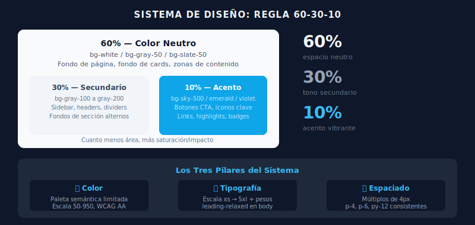

# 🎨 Sistema de Diseño y Coherencia Visual

## 🎯 Objetivos

- Entender qué es un sistema de diseño y por qué importa
- Aplicar los tres pilares (color, tipografía, espaciado) de forma coherente
- Crear componentes con jerarquía visual clara
- Conocer los patrones más comunes de UI

---

## 📋 Contenido



### 1. ¿Qué es un Sistema de Diseño?

Un sistema de diseño es un **conjunto de reglas y tokens** que garantizan coherencia visual en toda la interfaz:

- **Tokens de color**: ¿Qué colores usamos y para qué?
- **Escala tipográfica**: ¿Qué tamaños y pesos?
- **Escala de espaciado**: ¿Qué valores de padding y margin?
- **Componentes**: Botones, cards, badges con variantes definidas

Tailwind implementa un sistema de diseño **opinionado pero flexible**.

---

### 2. Los Tres Pilares Juntos

Un error común es usar los pilares por separado. Aquí cómo combinarlos:

```html
<!-- ❌ Sin sistema: valores arbitrarios, sin coherencia -->
<div style="padding: 13px; font-size: 15px; color: #3a4b5c; margin-bottom: 7px;">
  Título sin sistema
</div>

<!-- ✅ Con sistema Tailwind: valores de la escala, coherentes -->
<div class="p-4 text-base text-gray-700 mb-4">
  Contenido con sistema
</div>
```

---

### 3. Jerarquía Visual en la Práctica

```html
<!-- Card de artículo de blog — jerarquía clara -->
<article class="max-w-sm overflow-hidden rounded-2xl bg-white shadow-sm">

  <!-- Imagen -->
  

  <div class="p-5">
    <!-- Categoría: pequeña, colored, uppercase -->
    <span class="text-xs font-semibold uppercase tracking-wider text-sky-600">
      Frontend
    </span>

    <!-- Título: prominente, peso bold -->
    <h2 class="mt-1 text-lg font-bold leading-tight text-gray-900 line-clamp-2">
      Cómo construir un sistema de colores con Tailwind
    </h2>

    <!-- Descripción: secundaria, más pequeña -->
    <p class="mt-2 text-sm text-gray-600 leading-relaxed line-clamp-3">
      Una guía práctica para definir paletas semánticas
      que funcionen en modo claro y oscuro.
    </p>

    <!-- Footer: metadatos, mínimo espacio -->
    <div class="mt-4 flex items-center justify-between">
      <span class="text-xs text-gray-400">12 min lectura</span>
      <time class="text-xs text-gray-400">Mar 2026</time>
    </div>
  </div>
</article>
```

---

### 4. Patrones de Color Comunes

```html
<!-- Patrón 1: Fondo claro con texto oscuro (el default) -->
<div class="bg-white text-gray-900">
  <p class="text-gray-600">Texto secundario</p>
  <p class="text-gray-400">Texto deshabilitado</p>
</div>

<!-- Patrón 2: Sección con fondo de acento suave -->
<section class="bg-sky-50">
  <h2 class="text-sky-900 font-bold">Título</h2>
  <p class="text-sky-700">Texto en la sección de acento</p>
  <button class="bg-sky-500 text-white hover:bg-sky-600">CTA</button>
</section>

<!-- Patrón 3: Header oscuro -->
<header class="bg-slate-900">
  <nav>
    <a class="text-slate-300 hover:text-white">Link</a>
    <a class="text-white font-semibold">Activo</a>
  </nav>
</header>
```

---

### 5. La Regla del "60-30-10"

Una guía clásica de diseño para mantener coherencia:

- **60%** del espacio visual: color neutro (blanco, grays claros)
- **30%** del espacio visual: color secundario (grays medios, backgrounds)
- **10%** del espacio visual: color acento (sky, emerald, violet...)

```html
<!-- 60% neutro, 30% secondary, 10% acento -->
<main class="min-h-screen bg-gray-50">           <!-- 60% neutro -->
  <div class="bg-white rounded-xl shadow-sm p-6"> <!-- 30% blanco -->
    <button class="bg-sky-500 text-white px-4 py-2 rounded-lg"> <!-- 10% acento -->
      Acción principal
    </button>
  </div>
</main>
```

---

## ✅ Checklist de Verificación

- [ ] Mis páginas usan máximo 2-3 colores de acento
- [ ] La jerarquía tipográfica es clara: categoría < subtítulo < título, en ese orden
- [ ] El espaciado es consistente: elementos similares tienen valores iguales
- [ ] Los textos secundarios usan escala 500-600, no 300-400 (bajo contraste)
- [ ] Mis componentes siguen el patrón 60-30-10 intuitivamente
