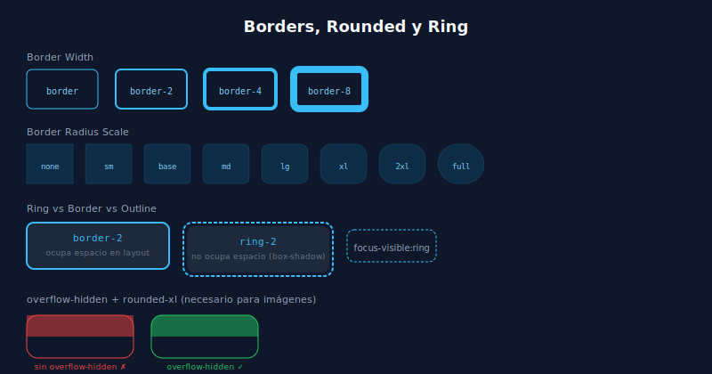

# 🔲 Borders y Rounded en Tailwind

## 🎯 Objetivos

- Controlar bordes por lado, color y grosor
- Aplicar border-radius con la escala de Tailwind
- Usar outlines y rings para feedback visual
- Combinar bordes con colores del sistema

---

## 📋 Contenido



### 1. Border Width

```html
<!-- Aplicar borde (requiere border-width + border-color) -->
<div class="border">1px en todos los lados (default: gray-200)</div>
<div class="border-2">2px</div>
<div class="border-4">4px</div>
<div class="border-8">8px</div>
<div class="border-0">Sin borde</div>

<!-- Por lado -->
<div class="border-t">Solo top</div>
<div class="border-b">Solo bottom</div>
<div class="border-l">Solo left</div>
<div class="border-r">Solo right</div>
<div class="border-x">Left + Right</div>
<div class="border-y">Top + Bottom</div>

<!-- Con color -->
<div class="border border-gray-200">Borde sutil</div>
<div class="border border-sky-500">Borde de acento</div>
<div class="border-2 border-red-400">Borde de error</div>

<!-- Borde solo abajo (divider) -->
<div class="border-b border-gray-100 pb-4 mb-4">Sección con divider</div>
```

---

### 2. Border Radius

```html
<!-- Escala completa -->
<div class="rounded-sm">rounded-sm — 2px</div>
<div class="rounded">rounded — 4px (default)</div>
<div class="rounded-md">rounded-md — 6px</div>
<div class="rounded-lg">rounded-lg — 8px · cards comunes</div>
<div class="rounded-xl">rounded-xl — 12px · cards modernas</div>
<div class="rounded-2xl">rounded-2xl — 16px · cards grandes</div>
<div class="rounded-3xl">rounded-3xl — 24px · modals, sheets</div>
<div class="rounded-full">rounded-full — 9999px · pills, avatars, badges</div>
<div class="rounded-none">Sin radio</div>

<!-- Por lado / esquina -->
<div class="rounded-t-xl">Solo esquinas superiores</div>
<div class="rounded-b-lg">Solo esquinas inferiores</div>
<div class="rounded-tl-2xl">Solo esquina top-left</div>

<!-- Patrón: imagen en card con top rounded -->
<div class="overflow-hidden rounded-xl">
    <!-- imagen no desborda las esquinas -->
</div>
```

**Reglas prácticas:**
- Botones → `rounded-md` o `rounded-lg`
- Cards → `rounded-xl` o `rounded-2xl`
- Pills / badges → `rounded-full`
- Avatares circulares → `rounded-full`
- Inputs → `rounded-lg`

---

### 3. Outline vs Ring vs Border

```html
<!-- Border: ocupa espacio en el layout (afecta box model) -->
<div class="border-2 border-sky-500">Border visible</div>

<!-- Ring: no ocupa espacio (usa box-shadow con offset) — ideal para focus -->
<button class="ring-2 ring-sky-500">Ring visible</button>
<button class="ring-2 ring-sky-500 ring-offset-2">Ring con offset blanco</button>

<!-- Outline: similar a ring pero más básico -->
<button class="outline outline-2 outline-sky-500">Outline</button>
<button class="outline-none focus:outline-none">Sin outline (cuidado: accesibilidad)</button>
```

**Regla de oro:** Usa `focus-visible:ring-2 focus-visible:ring-sky-500 focus-visible:ring-offset-2` en botones e inputs para feedback de teclado sin afectar el mouse.

---

### 4. Divide (separadores entre hijos)

```html
<!-- divide-y añade border-top a todos los hijos excepto el primero -->
<ul class="divide-y divide-gray-100">
  <li class="py-3">Item 1</li>
  <li class="py-3">Item 2</li>
  <li class="py-3">Item 3</li>
</ul>

<!-- divide-x para columnas -->
<div class="flex divide-x divide-gray-200">
  <div class="px-6">Columna 1</div>
  <div class="px-6">Columna 2</div>
</div>
```

---

## ✅ Checklist de Verificación

- [ ] Uso `border border-gray-200` (no solo `border`) para bordes visibles
- [ ] Los cards tienen `overflow-hidden rounded-xl` para contener imágenes correctamente
- [ ] Los botones tienen `focus-visible:ring-2` (no `focus:ring-2`) para accesibilidad de teclado
- [ ] Uso `divide-y` en listas para separadores más limpios que margin/padding
