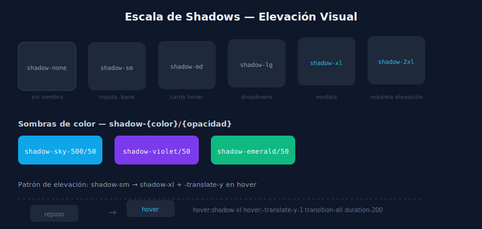

# 🌒 Shadows en Tailwind

## 🎯 Objetivos

- Dominar la escala de box-shadow
- Usar sombras de color para efectos modernos
- Implementar el patrón de "elevación" con hover
- Conocer drop-shadow para elementos sin fondo

---

## 📋 Contenido



### 1. Box Shadow — Escala de Elevación

```html
<!-- Escala completa de sombras -->
<div class="shadow-none">Sin sombra</div>
<div class="shadow-sm">shadow-sm — sombra casi imperceptible (inputs, dividers)</div>
<div class="shadow">shadow — sombra suave (cards base)</div>
<div class="shadow-md">shadow-md — sombra media (cards hover, dropdowns)</div>
<div class="shadow-lg">shadow-lg — sombra pronunciada (modals, tooltips)</div>
<div class="shadow-xl">shadow-xl — sombra grande (drawers, panels flotantes)</div>
<div class="shadow-2xl">shadow-2xl — sombra máxima (sheets, colores vivos)</div>
<div class="shadow-inner">shadow-inner — sombra hacia adentro (inputs activos)</div>
```

---

### 2. Elevación con Hover

El patrón más común: la card "sube" al hacer hover aumentando la sombra y/o la escala.

```html
<!-- Patrón de elevación -->
<div class="shadow-sm transition-shadow duration-200 hover:shadow-md">
  Card con elevación suave
</div>

<!-- Elevación con escala -->
<div class="shadow transition-all duration-200 hover:shadow-lg hover:-translate-y-0.5">
  Card que sube ligeramente
</div>

<!-- Elevación completa con group -->
<div class="group shadow-sm transition-all duration-300 hover:shadow-xl rounded-2xl">
  
  <div class="p-4">
    <h3 class="text-gray-900 group-hover:text-sky-600 transition-colors">Título</h3>
  </div>
</div>
```

---

### 3. Sombras de Color

Una de las características más potentes de Tailwind v3+: sombras coloreadas.

```html
<!-- Sombras coloreadas -->
<button class="bg-sky-500 text-white shadow-lg shadow-sky-500/50 hover:shadow-sky-500/80">
  Botón con sombra de color
</button>

<button class="bg-violet-600 text-white shadow-lg shadow-violet-600/40">
  Botón violet con glow
</button>

<div class="rounded-xl bg-emerald-500 p-4 shadow-xl shadow-emerald-500/30">
  Card con sombra verde
</div>
```

La sintaxis `shadow-{color}/{opacidad}` combina el color con la sombra base.

---

### 4. Drop Shadow (para elementos sin fondo)

`drop-shadow-*` usa CSS `filter: drop-shadow()` — funciona con PNGs transparentes e íconos SVG.

```html
<!-- drop-shadow en SVG/PNG transparente -->


<!-- drop-shadow en texto -->
<h1 class="text-5xl font-black text-white drop-shadow-lg">
  Título con sombra
</h1>

<!-- Escala: drop-shadow-sm, drop-shadow, drop-shadow-md, drop-shadow-lg, drop-shadow-xl, drop-shadow-2xl -->
```

**Diferencia `shadow` vs `drop-shadow`:**
- `shadow-*` → box-shadow, aplica al bounding box del elemento
- `drop-shadow-*` → filter drop-shadow, sigue la forma real del contenido (SVG, PNG transparente)

---

### 5. Patrones de Uso por Componente

| Componente | Sombra base | Sombra hover |
|-----------|------------|-------------|
| Card | `shadow-sm` | `shadow-md` o `shadow-lg` |
| Modal | `shadow-2xl` | — |
| Dropdown | `shadow-lg` | — |
| Input base | `shadow-sm` | — |
| Input focus | → `shadow-inner` | — |
| Botón primario | `shadow-sm` | `shadow-md shadow-{color}/50` |
| Tooltip | `shadow-lg` | — |

---

## ✅ Checklist de Verificación

- [ ] Mis cards tienen `shadow-sm` base y `hover:shadow-md` o mayor
- [ ] Uso `transition-shadow duration-200` para que la transición sea suave
- [ ] Los botones importantes tienen `shadow-{color}/50` para efecto glow
- [ ] Entiendo cuándo `drop-shadow-*` es mejor que `shadow-*`
