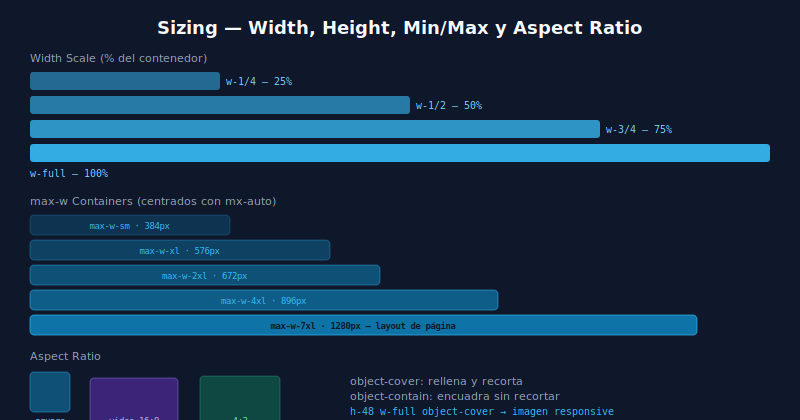

# 📏 Sizing en Tailwind

## 🎯 Objetivos

- Dominar width y height con la escala de Tailwind
- Usar min/max-width y min/max-height correctamente
- Entender los valores especiales: full, screen, fit, auto, svh
- Controlar aspect-ratio y object-fit

---

## 📋 Contenido



### 1. Width y Height — Escala Numérica

La misma escala que spacing (1 = 4px):

```html
<!-- Tamaños fijos -->
<div class="w-4 h-4">16×16px — ícono pequeño</div>
<div class="w-6 h-6">24×24px — ícono medium</div>
<div class="w-8 h-8">32×32px — ícono large</div>
<div class="w-10 h-10">40×40px — avatar small</div>
<div class="w-12 h-12">48×48px — avatar medium</div>
<div class="w-16 h-16">64×64px — avatar large</div>
<div class="w-24 h-24">96×96px</div>
<div class="w-32 h-32">128×128px</div>
<div class="w-48 h-48">192×192px</div>
<div class="w-64 h-64">256×256px</div>
```

---

### 2. Valores Especiales

```html
<!-- Porcentajes -->
<div class="w-1/2">50% del padre</div>
<div class="w-1/3">33.33%</div>
<div class="w-2/3">66.66%</div>
<div class="w-1/4">25%</div>
<div class="w-3/4">75%</div>

<!-- full vs screen -->
<div class="w-full">100% del contenedor padre</div>
<div class="w-screen">100vw (ancho del viewport)</div>
<div class="h-full">100% del alto del padre</div>
<div class="h-screen">100vh</div>
<div class="h-svh">100svh (small viewport height — móvil sin la barra del browser)</div>
<div class="h-dvh">100dvh (dynamic viewport height)</div>

<!-- fit-content -->
<div class="w-fit">Ancho según el contenido</div>
<div class="h-fit">Alto según el contenido</div>

<!-- auto -->
<div class="w-auto">Auto (default para la mayoría)</div>
<div class="mx-auto">Centrar horizontalmente</div>
```

---

### 3. Min y Max Width/Height

```html
<!-- Max width — el más usado para contenedores -->
<div class="max-w-sm">Max 384px</div>
<div class="max-w-md">Max 448px</div>
<div class="max-w-lg">Max 512px</div>
<div class="max-w-xl">Max 576px</div>
<div class="max-w-2xl">Max 672px · prose/texto</div>
<div class="max-w-4xl">Max 896px</div>
<div class="max-w-7xl">Max 1280px · layout de página</div>
<div class="max-w-full">Max 100% del padre</div>
<div class="max-w-none">Sin límite de ancho</div>

<!-- Min width -->
<div class="min-w-0">min-width: 0 (necesario en flex para que truncate funcione)</div>
<div class="min-w-full">min-width: 100%</div>

<!-- Min height -->
<div class="min-h-screen">Mínimo 100vh (para páginas que ocupan todo)</div>
<div class="min-h-0">reset</div>

<!-- Max height -->
<div class="max-h-64">Max height 256px (scroll containers)</div>
<div class="max-h-screen">Max 100vh</div>
<div class="overflow-y-auto max-h-96">Lista scrollable</div>
```

---

### 4. Aspect Ratio

```html
<!-- Relaciones de aspecto —  mantiene proporciones al cambiar ancho -->
<div class="aspect-square">1:1 (cuadrado)</div>
<div class="aspect-video">16:9 (video)</div>
<div class="aspect-[4/3]">4:3 arbitrario</div>

<!-- Caso de uso: thumbnail de video -->
<div class="aspect-video w-full overflow-hidden rounded-lg">
  
</div>

<!-- Avatar cuadrado que siempre mantiene proporción -->
<div class="aspect-square w-12 overflow-hidden rounded-full">
  
</div>
```

---

### 5. Object Fit y Object Position

```html
<!-- object-cover: rellena el contenedor recortando (el más común) -->


<!-- object-contain: encuadra el contenido sin recortar -->


<!-- object-fill: deforma la imagen para que llene exactamente -->


<!-- object-none: tamaño natural (sin escalar) -->


<!-- Posición de foco -->


```

---

## ✅ Checklist de Verificación

- [ ] Uso `max-w-*` en contenedores, no `w-*` fijo en elementos responsive
- [ ] Las imágenes en cards tienen `h-48 w-full object-cover`
- [ ] Cuando uso `truncate` en flex, pongo `min-w-0` en el elemento padre flex
- [ ] Uso `aspect-video` o `aspect-square` para mantener proporciones de media
- [ ] Uso `min-h-screen` en el body/wrapper para páginas que deben llenar la pantalla
