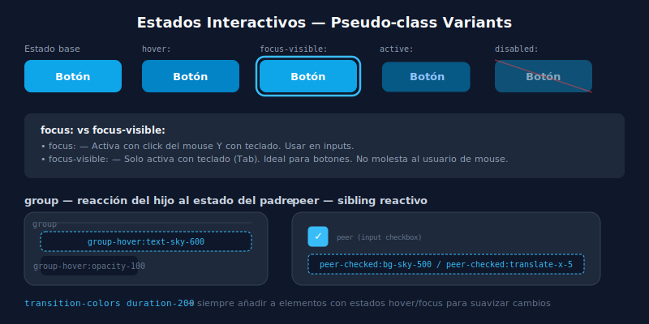

# 🎯 Estados Interactivos en Tailwind

## 🎯 Objetivos

- Aplicar todos los estados pseudo-class de CSS con variantes de Tailwind
- Distinguir `focus` vs `focus-visible` para accesibilidad
- Implementar estados `disabled` correctamente
- Entender `aria-*` variantes

---

## 📋 Contenido



### 1. Hover

```html
<!-- Hover básico -->
<button class="bg-sky-500 hover:bg-sky-600">Hover cambia fondo</button>
<a class="text-gray-600 hover:text-gray-900">Hover oscurece texto</a>

<!-- Hover con múltiples propiedades -->
<div class="
  rounded-xl border border-gray-200 bg-white shadow-sm
  hover:border-sky-200 hover:shadow-md hover:-translate-y-0.5
  transition-all duration-200
">
  Card con hover completo
</div>

<!-- Hover con opacity -->
<button class="opacity-100 hover:opacity-80 transition-opacity">
  Fade on hover
</button>
```

---

### 2. Focus y Focus-Visible

```html
<!-- focus: activa con click Y con teclado -->
<input class="border border-gray-200 focus:border-sky-500 focus:ring-2 focus:ring-sky-500/20 outline-none rounded-lg px-3 py-2" />

<!-- focus-visible: SOLO activa con teclado (sin anillo con mouse) -->
<button class="rounded-lg bg-sky-500 px-4 py-2 text-white outline-none
  focus-visible:ring-2 focus-visible:ring-sky-500 focus-visible:ring-offset-2">
  Botón accesible
</button>

<!-- focus-within: el padre reacciona cuando un hijo tiene foco *)
<label class="block rounded-lg border border-gray-200 p-3
  focus-within:border-sky-500 focus-within:ring-1 focus-within:ring-sky-500/30">
  <span class="text-sm text-gray-600">Email</span>
  <input class="block w-full outline-none mt-1" type="email" />
</label>
```

**¿Cuándo usar cada uno?**
- `focus:` → en inputs, donde quieres feedback visual siempre
- `focus-visible:` → en botones, para no mostrar el anillo al hacer click con mouse
- `focus-within:` → en labels/wrappers de input

---

### 3. Active

```html
<!-- Active: mientras el botón está siendo presionado -->
<button class="
  bg-sky-500 hover:bg-sky-600 active:bg-sky-700 active:scale-95
  transition-all duration-75
  text-white px-4 py-2 rounded-lg
">
  Botón responsive al click
</button>

<!-- Link activo -->
<a class="text-gray-600 hover:text-sky-600 active:text-sky-800">Link</a>
```

---

### 4. Disabled

```html
<!-- Botón deshabilitado -->
<button
  disabled
  class="bg-sky-500 text-white px-4 py-2 rounded-lg
         disabled:opacity-50 disabled:cursor-not-allowed disabled:pointer-events-none"
>
  Enviando...
</button>

<!-- Input deshabilitado -->
<input
  disabled
  class="border border-gray-200 rounded-lg px-3 py-2
         disabled:bg-gray-50 disabled:text-gray-400 disabled:cursor-not-allowed"
  value="Valor no editable"
/>

<!-- aria-disabled (para elementos que no admiten el atributo disabled) -->
<div
  role="button"
  aria-disabled="true"
  class="aria-disabled:opacity-50 aria-disabled:cursor-not-allowed"
>
  Elemento con aria-disabled
</div>
```

---

### 5. Checked, Selected, Required

```html
<!-- Checkbox con peer — el label reacciona al estado del input -->
<label class="flex items-center gap-2 cursor-pointer">
  <input type="checkbox" class="peer sr-only" />
  <div class="h-5 w-5 rounded border border-gray-300 bg-white
              peer-checked:bg-sky-500 peer-checked:border-sky-500
              transition-colors">
    <!-- custom checkbox visual -->
  </div>
  <span class="text-sm text-gray-700 peer-checked:text-gray-900 peer-checked:font-medium">
    Acepto los términos
  </span>
</label>

<!-- Input requerido -->
<input
  required
  class="border border-gray-200 rounded-lg px-3 py-2
         required:border-red-300 invalid:border-red-400"
  type="email"
  placeholder="correo@ejemplo.com"
/>
```

---

### 6. Group — Reaccionar al Hover del Padre

```html
<!-- group en el padre, group-hover: en los hijos -->
<article class="group relative overflow-hidden rounded-2xl bg-white shadow-sm hover:shadow-xl transition-shadow">

  <!-- La imagen hace zoom cuando la card hace hover -->
  <div class="overflow-hidden">
    
  </div>

  <!-- Overlay que aparece al hacer hover -->
  <div class="absolute inset-0 bg-sky-900/0 group-hover:bg-sky-900/20 transition-colors duration-300"></div>

  <div class="p-5">
    <!-- El título cambia de color en hover de la card -->
    <h3 class="font-semibold text-gray-900 group-hover:text-sky-600 transition-colors">
      Título del artículo
    </h3>
    <!-- La flecha aparece en hover -->
    <span class="mt-2 inline-block translate-x-0 opacity-0 text-sky-500 transition-all group-hover:translate-x-1 group-hover:opacity-100">
      Leer más →
    </span>
  </div>
</article>
```

---

## ✅ Checklist de Verificación

- [ ] Todos mis botones tienen `focus-visible:ring-2 focus-visible:ring-{color} focus-visible:ring-offset-2`
- [ ] Los inputs tienen `focus:border-{color} focus:ring-2 focus:ring-{color}/20 outline-none`
- [ ] Los botones deshabilitados tienen `disabled:opacity-50 disabled:cursor-not-allowed`
- [ ] Uso `group` + `group-hover:` para interacciones complejas padre-hijo
- [ ] Mis transiciones tienen `transition-*` y `duration-200` o similar
