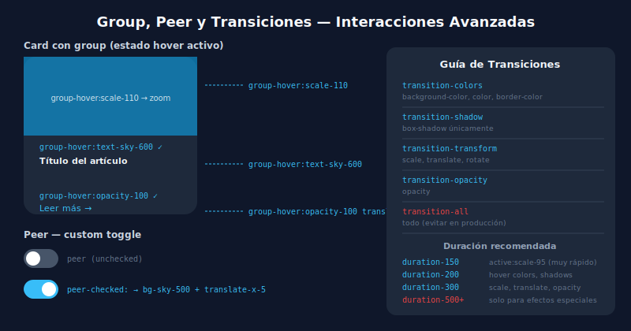

# 🔗 Group, Peer y Transiciones

## 🎯 Objetivos

- Usar `group` y `group-hover:` para interacciones padre-hijo
- Aplicar `peer` para que un elemento reaccione al estado de un sibling
- Implementar transiciones suaves con `transition-*` y `duration-*`
- Entender `transform` y sus utilidades

---

## 📋 Contenido



### 1. Group — Interacción Padre-Hijo

```html
<!-- Añadir "group" al padre, usar "group-hover:" en hijos -->
<div class="group cursor-pointer rounded-xl p-4 hover:bg-sky-50 transition-colors">
  <h3 class="font-semibold text-gray-900 group-hover:text-sky-600 transition-colors">
    Título
  </h3>
  <p class="text-sm text-gray-500">Descripción</p>
  <!-- Icono que aparece con hover -->
  <svg class="w-4 h-4 text-gray-300 opacity-0 group-hover:opacity-100 transition-opacity">...</svg>
</div>

<!-- Groups anidados con nombre -->
<div class="group/card hover:bg-sky-50">
  <div class="group/item">
    <!-- reacciona a hover de group/item -->
    <span class="group-hover/item:text-sky-600">Item level</span>
    <!-- reacciona a hover de group/card -->
    <span class="group-hover/card:text-emerald-600">Card level</span>
  </div>
</div>
```

---

### 2. Peer — Elemento Sibling Reactivo

`peer` marca el elemento de referencia, `peer-*:` se aplica al siguiente sibling.

```html
<!-- Toggle switch accesible con peer -->
<label class="flex items-center gap-3 cursor-pointer">
  <input type="checkbox" class="peer sr-only" />
  <div class="
    relative h-6 w-11 rounded-full bg-gray-200
    peer-checked:bg-sky-500
    after:absolute after:top-0.5 after:left-0.5
    after:h-5 after:w-5 after:rounded-full after:bg-white after:shadow
    after:transition-transform
    peer-checked:after:translate-x-5
    transition-colors
  "></div>
  <span class="text-sm text-gray-700 peer-checked:font-semibold peer-checked:text-gray-900">
    Notificaciones activas
  </span>
</label>

<!-- Validación de input con peer -->
<div>
  <input
    type="email"
    class="peer w-full rounded-lg border border-gray-200 px-3 py-2 outline-none
           focus:border-sky-500 invalid:border-red-400"
    placeholder="correo@ejemplo.com"
    required
  />
  <!-- Este mensaje solo aparece cuando el input es inválido Y tiene foco -->
  <p class="mt-1 hidden text-xs text-red-500 peer-invalid:peer-focus:block">
    Ingresa un correo válido
  </p>
</div>
```

---

### 3. Transiciones

```html
<!-- transition-all: anima todas las propiedades cambiadas (evitar en prod) -->
<div class="transition-all duration-300">...</div>

<!-- Más específico (mejor rendimiento) -->
<div class="transition-colors duration-200">Solo anima color</div>
<div class="transition-shadow duration-200">Solo sombra</div>
<div class="transition-transform duration-300">Solo transform</div>
<div class="transition-opacity duration-150">Solo opacidad</div>

<!-- Timing functions -->
<div class="transition-transform duration-300 ease-in">ease-in</div>
<div class="transition-transform duration-300 ease-out">ease-out (más natural)</div>
<div class="transition-transform duration-300 ease-in-out">ease-in-out</div>

<!-- Delay -->
<div class="transition-opacity duration-300 delay-150">Espera 150ms antes de iniciar</div>
```

---

### 4. Transform

```html
<!-- Escala -->
<div class="hover:scale-105 transition-transform">Escala al 105% en hover</div>
<div class="hover:scale-95 transition-transform">Escala al 95% (presionado)</div>

<!-- Traslación -->
<div class="hover:-translate-y-1 transition-transform">Sube 4px en hover</div>
<div class="hover:translate-x-1 transition-transform">Mueve 4px a la derecha</div>

<!-- Rotación -->
<svg class="hover:rotate-45 transition-transform duration-300">...</svg>

<!-- Combinado: card que sube y gana sombra -->
<div class="
  shadow-sm rounded-xl
  hover:-translate-y-1 hover:shadow-md
  transition-all duration-200
">
  Card elevada
</div>
```

---

### 5. Patrón Completo: Card Interactiva

```html
<article class="
  group
  overflow-hidden rounded-2xl border border-gray-100 bg-white
  shadow-sm hover:shadow-xl
  transition-all duration-300
  cursor-pointer
">
  <!-- Imagen con zoom -->
  <div class="overflow-hidden">
    
  </div>

  <div class="p-5">
    <!-- Badge de categoría -->
    <span class="text-xs font-semibold uppercase tracking-wider text-sky-600">
      Tutorial
    </span>

    <!-- Título que cambia de color -->
    <h2 class="mt-2 text-lg font-bold text-gray-900
               group-hover:text-sky-600
               transition-colors duration-200
               line-clamp-2">
      Título del artículo
    </h2>

    <!-- Flecha que se mueve -->
    <div class="mt-4 flex items-center gap-1 text-sm font-medium text-sky-500
                translate-x-0 opacity-0
                group-hover:translate-x-1 group-hover:opacity-100
                transition-all duration-200">
      Leer más →
    </div>
  </div>
</article>
```

---

## ✅ Checklist de Verificación

- [ ] Uso `group` + `group-hover:` para interacciones en cards y listas
- [ ] Mis transiciones son específicas (`transition-colors`, no `transition-all`) cuando es posible
- [ ] Uso `peer` + `peer-checked:` para custom checkboxes y toggles
- [ ] Las animaciones tienen `duration-200` a `duration-300` (no más largas en UI)
- [ ] El `transform` en hover usa `transition-transform duration-200` para suavidad
