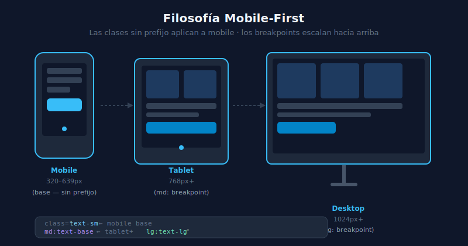

# 📱 Filosofía Mobile-First

## 🎯 Objetivos

- Entender por qué mobile-first es la estrategia estándar del CSS moderno
- Comprender cómo los breakpoints de Tailwind son min-width
- Distinguir mobile-first de desktop-first

---

## 📋 Contenido



### 1. ¿Por qué Mobile-First?

Mobile-first significa **diseñar primero para el viewport más pequeño** y luego añadir complejidad para pantallas más grandes.

**Razones técnicas:**
- El CSS sin prefijo de breakpoint aplica a **todos los tamaños**
- Los breakpoints de Tailwind son `min-width` — se activan hacia arriba
- El browser carga primero el CSS base; las queries de media se evalúan después
- Mejor rendimiento en dispositivos lentos (menos CSS a procesar)

**Razones de diseño:**
- Fuerza a priorizar el contenido (lo esencial primero)
- Evita el "desktop shrink" — adaptaciones torpes de desktop a mobile
- La mayoría del tráfico web es desde mobile

---

### 2. Breakpoints son Min-Width

```html
<!-- ✅ MOBILE-FIRST — base para mobile, escala hacia arriba -->
<p class="text-sm md:text-base lg:text-lg">
  <!-- text-sm: todos los tamaños (incluyendo mobile)    -->
  <!-- md:text-base: >= 768px                            -->
  <!-- lg:text-lg: >= 1024px                             -->
</p>

<!-- ❌ DESKTOP-FIRST (trampa común) — evitar este patrón -->
<p class="text-lg max-md:text-base max-sm:text-sm">
  <!-- Funciona, pero va contra la filosofía mobile-first -->
  <!-- max-md: <= 768px, max-sm: <= 640px                 -->
</p>
```

**Regla de oro:** El CSS sin prefijo es tu "mobile base". Solo agrega breakpoints cuando el diseño NECESITA cambiar para pantallas más grandes.

---

### 3. Las Reglas en Orden

Mobile-first implica escribir las clases en orden de contexto: base → sm → md → lg → xl:

```html
<!-- Correcto: base mobile, luego escalando -->
<div class="
  block          <!-- mobile: bloque -->
  sm:flex        <!-- ≥ 640px: flex -->
  md:grid        <!-- ≥ 768px: grid -->
">
```

---

### 4. Cuándo NO añadir breakpoints

No todo necesita ser responsive. Pregúntate: "¿Este elemento se ve mal en mobile?". Si la respuesta es no, no añadas un breakpoint solo por añadirlo.

```html
<!-- ✅ Solo un breakpoint donde realmente cambia el layout -->
<article class="p-4 md:p-8">
  <h1 class="text-2xl md:text-4xl font-bold">Título</h1>
  <!-- El color del texto es igual en todos: no necesita breakpoint -->
  <p class="text-gray-600 leading-relaxed">Texto...</p>
</article>
```

---

## ✅ Checklist de Verificación

- [ ] Mis clases base funcionan bien en 320px (iPhone SE)
- [ ] Solo añado breakpoints donde el diseño realmente necesita cambiar
- [ ] Uso `sm:`, `md:`, `lg:` (min-width) no `max-sm:`, `max-md:` (max-width)
- [ ] Verifico el resultado en DevTools con el modo responsive activado
