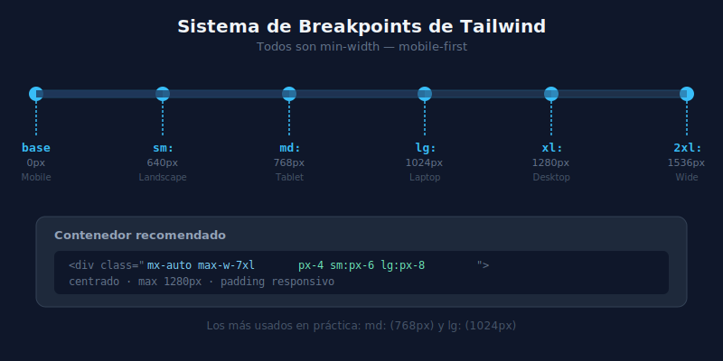

# 📐 Sistema de Breakpoints

## 🎯 Objetivos

- Memorizar los 6 breakpoints de Tailwind y sus valores
- Elegir el breakpoint correcto para cada caso
- Usar el container responsive correctamente

---

## 📋 Contenido



### 1. Los 6 Breakpoints

| Prefijo | Min-Width | Dispositivo típico |
|---------|-----------|-------------------|
| (base)  | 0px       | Mobile pequeño (320–639px) |
| `sm:`   | 640px     | Mobile grande / landscape |
| `md:`   | 768px     | Tablet portrait |
| `lg:`   | 1024px    | Tablet landscape / laptop |
| `xl:`   | 1280px    | Desktop |
| `2xl:`  | 1536px    | Desktop grande |

```html
<!-- Ejemplo de uso de todos los breakpoints -->
<div class="
  w-full          <!-- 0-639px: ancho completo -->
  sm:w-1/2        <!-- 640-767px: 50% -->
  md:w-1/3        <!-- 768-1023px: 33% -->
  lg:w-1/4        <!-- 1024-1279px: 25% -->
  xl:w-1/5        <!-- 1280-1535px: 20% -->
  2xl:w-1/6       <!-- ≥ 1536px: 16.6% -->
">...</div>
```

---

### 2. Breakpoints Más Usados en Práctica

En la mayoría de proyectos, usarás principalmente `md:` y `lg:`:

```html
<!-- Layout de 2 columnas en tablet+ -->
<div class="grid grid-cols-1 md:grid-cols-2 gap-6">...</div>

<!-- Texto hero que escala -->
<h1 class="text-3xl md:text-5xl lg:text-7xl font-black">Hero</h1>

<!-- Padding que aumenta en desktop -->
<section class="px-4 md:px-8 lg:px-16 py-12 md:py-24">...</section>
```

---

### 3. Contenedor Responsive

El patrón de contenedor más usado en Tailwind:

```html
<!-- Opción A: max-w-7xl + mx-auto + padding lateral responsive -->
<div class="mx-auto max-w-7xl px-4 sm:px-6 lg:px-8">
  <!-- Contenido de página -->
</div>

<!-- Opción B: clase container de Tailwind (aplica max-w por breakpoint) -->
<div class="container mx-auto px-4">
  <!-- Contenido -->
</div>
```

**Diferencia:**
- `max-w-7xl mx-auto` → ancho máximo fijo de 1280px
- `container` → usa el max-width del breakpoint actual (sm=640, md=768, etc.)

En la mayoría de proyectos modernos, `max-w-7xl mx-auto` es más predecible.

---

### 4. Breakpoints Arbitrarios

Para casos especiales puedes usar valores arbitrarios:

```html
<!-- Breakpoint personalizado -->
<div class="sm:block [@media(min-width:900px)]:flex">...</div>

<!-- Más limpio con variable de diseño en tailwind.config -->
<!-- Preferir los breakpoints estándar cuando sea posible -->
```

---

## ✅ Checklist de Verificación

- [ ] Conozco los valores numéricos de al menos `sm`, `md`, `lg`, `xl`
- [ ] Mis contenedores usan `mx-auto max-w-7xl px-4 sm:px-6 lg:px-8`
- [ ] Testo en los breakpoints clave: 375px, 768px, 1024px, 1280px
- [ ] No uso más breakpoints de los necesarios (minimalismo responsive)
