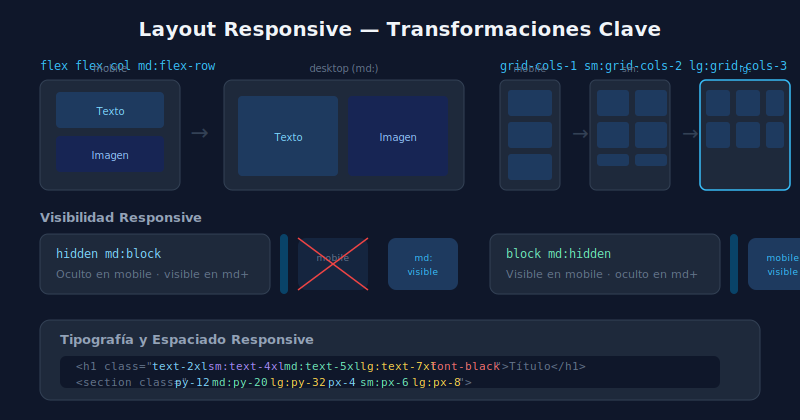

# 🔄 Layout Responsive con Tailwind

## 🎯 Objetivos

- Transformar layouts de una columna a múltiples columnas
- Cambiar de flex-column a flex-row según el breakpoint
- Controlar visibilidad de elementos por breakpoint

---

## 📋 Contenido



### 1. Grid Responsive — El Patrón Más Usado

```html
<!-- De 1 → 2 → 3 columnas según viewport -->
<div class="grid grid-cols-1 sm:grid-cols-2 lg:grid-cols-3 gap-6">
  <div>Card 1</div>
  <div>Card 2</div>
  <div>Card 3</div>
</div>

<!-- De 1 → 2 → 4 (para dashboards) -->
<div class="grid grid-cols-1 sm:grid-cols-2 xl:grid-cols-4 gap-4">
  <div>Stat 1</div>
  <div>Stat 2</div>
  <div>Stat 3</div>
  <div>Stat 4</div>
</div>
```

---

### 2. Flex Direction Responsive

```html
<!-- Mobile: columna apilada — Desktop: fila lado a lado -->
<section class="flex flex-col md:flex-row gap-8 items-center">
  <div class="w-full md:w-1/2">
    <h2 class="text-3xl font-bold">Texto de hero</h2>
    <p class="mt-4 text-gray-600">Descripción...</p>
  </div>
  <div class="w-full md:w-1/2">
    
  </div>
</section>

<!-- Invertir orden en mobile (texto encima, imagen abajo en desktop) -->
<section class="flex flex-col-reverse md:flex-row gap-8">
  
  <div class="w-full md:w-1/2">Contenido</div>
</section>
```

---

### 3. Visibilidad Responsive

```html
<!-- Ocultar en mobile, mostrar en tablet+ -->
<nav class="hidden md:flex gap-8">
  <a href="#">Inicio</a>
  <a href="#">Servicios</a>
  <a href="#">Contacto</a>
</nav>

<!-- Mostrar solo en mobile (hamburger, etc.) -->
<button class="block md:hidden">
  <!-- Icono hamburger -->
  <span class="block w-6 h-0.5 bg-gray-800"></span>
  <span class="block w-6 h-0.5 bg-gray-800 mt-1.5"></span>
  <span class="block w-6 h-0.5 bg-gray-800 mt-1.5"></span>
</button>

<!-- Combinaciones comunes -->
<div class="block sm:hidden">Solo mobile (0-639px)</div>
<div class="hidden sm:block md:hidden">Solo small (640-767px)</div>
<div class="hidden md:block">Tablet y desktop (768px+)</div>
<div class="hidden lg:block">Solo desktop (1024px+)</div>
```

---

### 4. Espaciado y Tipografía Responsive

```html
<!-- Padding que escala con la pantalla -->
<section class="py-12 md:py-20 lg:py-32 px-4 sm:px-6 lg:px-8">
  <!-- Hero -->
</section>

<!-- Tipografía escalable: mobile → tablet → desktop -->
<h1 class="text-2xl sm:text-4xl md:text-5xl lg:text-7xl font-black leading-tight">
  Landing Hero Title
</h1>
<p class="text-base md:text-lg lg:text-xl text-gray-600 max-w-2xl mx-auto">
  Descripción del producto...
</p>

<!-- Gap responsive en grids -->
<div class="grid grid-cols-1 md:grid-cols-3 gap-4 md:gap-6 lg:gap-8">...</div>
```

---

### 5. Imágenes Responsive

```html
<!-- Imagen que ocupa todo el ancho en mobile, mitad en desktop -->


<!-- Imagen con aspect-ratio fijo responsive -->
<div class="aspect-video w-full overflow-hidden rounded-xl">
  
</div>

<!-- Avatar responsive -->

```

---

## ✅ Checklist de Verificación

- [ ] Mis grids empiezan en `grid-cols-1` y escalan hacia arriba
- [ ] Las secciones hero usan `flex-col md:flex-row`
- [ ] Solo oculto elementos con `hidden md:block` (no con JS cuando es solo visual)
- [ ] El espaciado y la tipografía escalan con breakpoints de forma consistente
