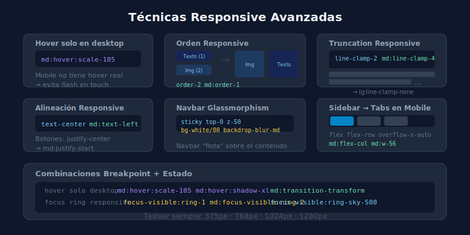

# 🚀 Técnicas Responsive Avanzadas

## 🎯 Objetivos

- Usar variantes responsive con estados (hover, focus)
- Aplicar orden y alineación responsive en flex/grid
- Manejar text overflow y truncation responsive

---

## 📋 Contenido



### 1. Combinar Responsive con Estados

Los prefijos de breakpoint se pueden combinar con variantes de estado:

```html
<!-- hover solo en desktop (mobile no tiene hover real) -->
<a class="text-gray-600 md:hover:text-sky-600 md:transition-colors">
  Link
</a>

<!-- Focus ring tamaño responsive -->
<button class="focus-visible:ring-1 md:focus-visible:ring-2 focus-visible:ring-sky-500">
  Botón
</button>

<!-- Scale en hover solo en desktop -->
<div class="md:hover:scale-105 md:transition-transform duration-200 rounded-xl">
  Card
</div>
```

---

### 2. Orden en Flex/Grid Responsive

```html
<!-- Imagen primero en desktop, segunda en mobile -->
<div class="flex flex-col md:flex-row gap-8">
  <!-- En mobile: texto arriba (order-1), imagen abajo (order-2) -->
  <!-- En desktop: imagen izquierda, texto derecha (order natural) -->
  <div class="order-2 md:order-1 w-full md:w-1/2">
    
  </div>
  <div class="order-1 md:order-2 w-full md:w-1/2">
    <h2>Título</h2>
    <p>Descripción</p>
  </div>
</div>
```

---

### 3. Tipografía y Truncation Responsive

```html
<!-- Mostrar más texto en pantallas grandes -->
<p class="line-clamp-2 md:line-clamp-3 lg:line-clamp-none text-gray-600">
  Párrafo largo que se recorta diferente según el viewport...
</p>

<!-- Tamaño de fuente y leading responsive -->
<h1 class="text-2xl leading-tight sm:text-4xl sm:leading-tight md:text-6xl md:leading-none font-black">
  Gran Título
</h1>

<!-- Alineación responsive -->
<div class="text-center md:text-left">
  <h2 class="text-2xl font-bold">Sección</h2>
  <p class="text-gray-600">Descripción centrada en mobile, izquierda en desktop</p>
</div>
```

---

### 4. Position y Stack Responsive

```html
<!-- Badge que cambia de posición -->
<div class="relative">
  
  <!-- En mobile: badge dentro del flujo; en desktop: overlay absoluto -->
  <span class="md:absolute md:top-4 md:right-4 inline-block rounded-full bg-sky-500 px-3 py-1 text-xs font-bold text-white">
    Nuevo
  </span>
</div>

<!-- Sidebar responsive: se convierte en tabs en mobile -->
<div class="flex flex-col md:flex-row gap-8">
  <!-- Mobile: tabs horizontales / Desktop: sidebar vertical -->
  <nav class="flex flex-row overflow-x-auto md:flex-col md:w-48 gap-1">
    <a href="#" class="shrink-0 rounded-lg px-3 py-2 text-sm font-medium bg-sky-50 text-sky-700">
      Perfil
    </a>
    <a href="#" class="shrink-0 rounded-lg px-3 py-2 text-sm font-medium text-gray-600 hover:bg-gray-50">
      Seguridad
    </a>
  </nav>
  <main class="flex-1">Contenido</main>
</div>
```

---

### 5. Print Variant

```html
<!-- Ocultar en impresión, mostrar solo en pantalla -->
<nav class="print:hidden">Navegación</nav>
<footer class="print:hidden">Footer con ads</footer>

<!-- Mostrar solo en impresión -->
<div class="hidden print:block">
  <p>Versión para imprimir — URL: ejemplo.com/articulo</p>
</div>

<!-- Ajustar colores para impresión -->
<body class="bg-white text-gray-900 print:text-black">
```

---

## ✅ Checklist de Verificación

- [ ] Combino breakpoints con estados cuando tiene sentido (ej: `md:hover:scale-105`)
- [ ] Uso `order-*` responsive cuando necesito reordenar elementos en mobile
- [ ] `line-clamp-*` responsive para truncar texto de forma diferente según pantalla
- [ ] `text-center md:text-left` en secciones que se centran en mobile
- [ ] Verifico el sitio con DevTools en al menos 3 tamaños: 375px, 768px, 1280px
