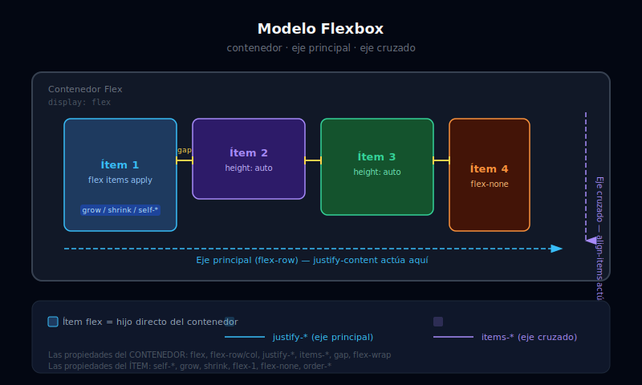

# 📦 Conceptos Fundamentales de Flexbox

## 🎯 Objetivos

- Entender qué es un contenedor flex y qué son los ítems flex
- Distinguir el eje principal del eje cruzado
- Activar Flexbox con `flex` e `inline-flex`
- Controlar la dirección con `flex-row` y `flex-col`
- Manejar el desbordamiento con `flex-wrap`

---

## 📋 Contenido



### 1. ¿Qué es Flexbox?

Flexbox es un **modelo de layout unidimensional**: distribuye elementos en una sola dimensión a la vez (fila o columna). Es ideal para:

- Alinear elementos en una barra de navegación
- Centrar contenido vertical y horizontalmente
- Distribuir espacio entre ítems de forma flexible
- Crear layouts sidebar + contenido principal

> **CSS Grid** es bidimensional (filas Y columnas). Cuando necesitas controlar ambas dimensiones al mismo tiempo, usa Grid. Cuando trabajas en una sola dimensión, usa Flexbox.

---

### 2. Contenedor vs. Ítems

La distinción más importante en Flexbox:

```html
<!-- El CONTENEDOR define el contexto flex -->
<!-- Las clases de distribución (justify-*, items-*) van aquí -->
<div class="flex gap-4">

  <!-- Los ÍTEMS son los hijos directos del contenedor -->
  <!-- Las clases de auto-alineación (self-*) van en los ítems -->
  <div>Ítem 1</div>
  <div>Ítem 2</div>
  <div>Ítem 3</div>

</div>
```

**Regla de oro:** `flex`, `justify-*`, `items-*`, `gap-*`, `flex-row`, `flex-col`, `flex-wrap` → **siempre en el contenedor**. `self-*`, `flex-1`, `grow`, `shrink`, `order-*` → **siempre en los ítems**.

---

### 3. Activar Flexbox: `flex` e `inline-flex`

```html
<!-- flex: el contenedor ocupa todo el ancho disponible (display: flex) -->
<div class="flex gap-4 bg-gray-100 p-4">
  <div class="rounded bg-sky-200 px-4 py-2">A</div>
  <div class="rounded bg-sky-200 px-4 py-2">B</div>
  <div class="rounded bg-sky-200 px-4 py-2">C</div>
</div>

<!-- inline-flex: el contenedor se adapta al contenido (display: inline-flex) -->
<!-- Útil para botones con icono + texto -->
<button class="inline-flex items-center gap-2 rounded-lg bg-sky-500 px-4 py-2 text-white">
  <!-- El botón solo ocupa el espacio que necesita, no 100% del ancho -->
  <svg class="h-4 w-4" fill="none" viewBox="0 0 24 24" stroke="currentColor">
    <path stroke-linecap="round" stroke-linejoin="round" stroke-width="2" d="M12 4v16m8-8H4" />
  </svg>
  Añadir item
</button>
```

---

### 4. Dirección: `flex-row` y `flex-col`

El eje principal determina en qué dirección se colocan los ítems:

```html
<!-- flex-row (por defecto): ítems de izquierda a derecha -->
<!-- Eje principal: horizontal → justify-* controla horizontal -->
<!-- Eje cruzado: vertical → items-* controla vertical -->
<div class="flex flex-row gap-4">
  <div class="rounded bg-violet-200 p-4">1</div>
  <div class="rounded bg-violet-200 p-4">2</div>
  <div class="rounded bg-violet-200 p-4">3</div>
</div>

<!-- flex-col: ítems de arriba a abajo -->
<!-- Eje principal: vertical → justify-* controla vertical -->
<!-- Eje cruzado: horizontal → items-* controla horizontal -->
<div class="flex flex-col gap-4">
  <div class="rounded bg-emerald-200 p-4">1</div>
  <div class="rounded bg-emerald-200 p-4">2</div>
  <div class="rounded bg-emerald-200 p-4">3</div>
</div>

<!-- flex-row-reverse: de derecha a izquierda -->
<div class="flex flex-row-reverse gap-4">
  <div class="rounded bg-amber-200 p-4">Aparece primero visualmente</div>
  <div class="rounded bg-amber-200 p-4">Aparece segundo</div>
</div>

<!-- flex-col-reverse: de abajo a arriba -->
<div class="flex flex-col-reverse gap-4">
  <div class="rounded bg-rose-200 p-4">Aparece abajo visualmente (es el primero en el HTML)</div>
  <div class="rounded bg-rose-200 p-4">Aparece arriba</div>
</div>
```

> **Impacto en justify e items:** Cuando cambias `flex-row` a `flex-col`, los roles de `justify-*` e `items-*` **se intercambian**. En `flex-col`, `justify-center` centra verticalmente e `items-center` centra horizontalmente.

---

### 5. Desbordamiento: `flex-wrap`

Por defecto, los ítems flex intentan caber en **una sola línea**, comprimiéndose si es necesario. `flex-wrap` permite que salten a la línea siguiente:

```html
<!-- flex-nowrap (comportamiento por defecto) -->
<!-- Los ítems se comprimen para caber en una línea -->
<div class="flex flex-nowrap gap-2 overflow-hidden bg-gray-100 p-4">
  <div class="min-w-32 rounded bg-sky-300 p-4 text-center">Card 1</div>
  <div class="min-w-32 rounded bg-sky-300 p-4 text-center">Card 2</div>
  <div class="min-w-32 rounded bg-sky-300 p-4 text-center">Card 3</div>
  <div class="min-w-32 rounded bg-sky-300 p-4 text-center">Card 4</div>
  <div class="min-w-32 rounded bg-sky-300 p-4 text-center">Card 5</div>
</div>

<!-- flex-wrap: los ítems saltan a la siguiente línea si no caben -->
<div class="flex flex-wrap gap-2 bg-gray-100 p-4">
  <div class="min-w-32 rounded bg-violet-300 p-4 text-center">Card 1</div>
  <div class="min-w-32 rounded bg-violet-300 p-4 text-center">Card 2</div>
  <div class="min-w-32 rounded bg-violet-300 p-4 text-center">Card 3</div>
  <div class="min-w-32 rounded bg-violet-300 p-4 text-center">Card 4</div>
  <div class="min-w-32 rounded bg-violet-300 p-4 text-center">Card 5</div>
</div>
```

**Cuándo usar cada uno:**
- `flex-nowrap`: Navbars, barras de herramientas (no queremos que los ítems salten de línea)
- `flex-wrap`: Grids de tags/chips, galerías de iconos, listas de ítems que deben adaptarse

---

### 6. Espaciado con `gap`

`gap-*` es la forma moderna de añadir espacio entre ítems flex. Es superior a `margin` porque:

- No añade espacio exterior al contenedor
- Funciona en ambas direcciones (row y column)
- El código es más limpio y predecible

```html
<!-- gap-4: espacio uniforme en todas las direcciones -->
<div class="flex flex-wrap gap-4">
  <div class="rounded bg-sky-200 p-4">A</div>
  <div class="rounded bg-sky-200 p-4">B</div>
  <div class="rounded bg-sky-200 p-4">C</div>
</div>

<!-- gap-x-8 gap-y-2: espacio diferente en horizontal y vertical -->
<div class="flex flex-wrap gap-x-8 gap-y-2">
  <span class="rounded-full bg-gray-200 px-3 py-1 text-sm">Tag 1</span>
  <span class="rounded-full bg-gray-200 px-3 py-1 text-sm">Tag 2</span>
  <span class="rounded-full bg-gray-200 px-3 py-1 text-sm">Tag 3</span>
  <span class="rounded-full bg-gray-200 px-3 py-1 text-sm">Tag 4</span>
</div>
```

---

## ✅ Checklist de Verificación

- [ ] Sé dónde poner `flex` (en el contenedor, no en los ítems)
- [ ] Entiendo que `flex-row` es horizontal y `flex-col` es vertical
- [ ] Sé que `justify-*` e `items-*` intercambian sus ejes al cambiar entre `flex-row` y `flex-col`
- [ ] Uso `gap-*` en lugar de `margin` para espaciado entre ítems
- [ ] Sé cuándo aplicar `flex-wrap` para evitar desbordamiento
