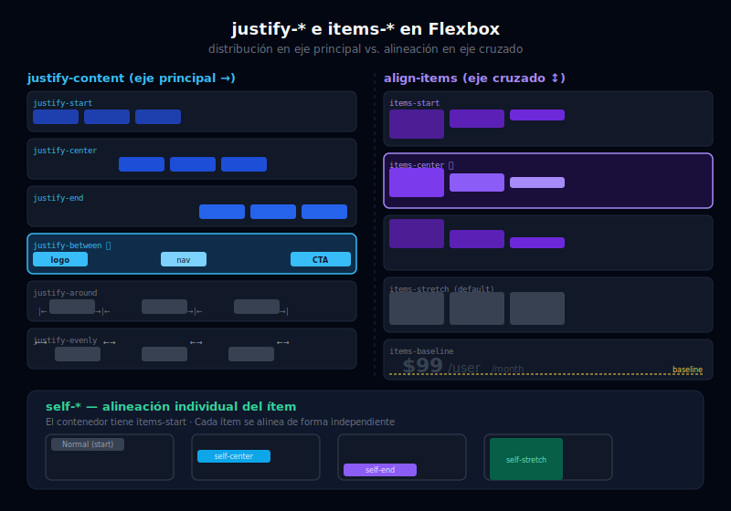

# 🎯 Justify y Align: Distribución y Alineación

## 🎯 Objetivos

- Dominar todas las variantes de `justify-*` para el eje principal
- Dominar todas las variantes de `items-*` para el eje cruzado
- Usar `self-*` para alinear un ítem individual de forma independiente
- Entender `align-content` con `content-*` para múltiples líneas

---

## 📋 Contenido



### 1. `justify-*` — Eje Principal

`justify-content` distribuye los ítems **a lo largo del eje principal** (horizontal en `flex-row`, vertical en `flex-col`).

```html
<!-- justify-start (por defecto): ítems al inicio del eje principal -->
<div class="flex justify-start gap-3 bg-sky-50 p-4">
  <div class="rounded bg-sky-500 px-6 py-3 text-white">A</div>
  <div class="rounded bg-sky-500 px-6 py-3 text-white">B</div>
  <div class="rounded bg-sky-500 px-6 py-3 text-white">C</div>
</div>

<!-- justify-center: ítems centrados en el eje principal -->
<div class="flex justify-center gap-3 bg-violet-50 p-4">
  <div class="rounded bg-violet-500 px-6 py-3 text-white">A</div>
  <div class="rounded bg-violet-500 px-6 py-3 text-white">B</div>
  <div class="rounded bg-violet-500 px-6 py-3 text-white">C</div>
</div>

<!-- justify-end: ítems al final del eje principal -->
<div class="flex justify-end gap-3 bg-emerald-50 p-4">
  <div class="rounded bg-emerald-500 px-6 py-3 text-white">A</div>
  <div class="rounded bg-emerald-500 px-6 py-3 text-white">B</div>
  <div class="rounded bg-emerald-500 px-6 py-3 text-white">C</div>
</div>

<!-- justify-between: primer ítem al inicio, último al final, resto distribuido -->
<!-- ⭐ El patrón MÁS USADO: logo izquierda, menú derecha -->
<div class="flex justify-between bg-gray-100 px-6 py-3">
  <span class="font-bold text-gray-900">Logo</span>
  <nav class="flex gap-6">
    <a href="#" class="text-gray-600 hover:text-gray-900">Inicio</a>
    <a href="#" class="text-gray-600 hover:text-gray-900">Sobre mí</a>
    <a href="#" class="text-gray-600 hover:text-gray-900">Contacto</a>
  </nav>
</div>

<!-- justify-around: espacio igual alrededor de cada ítem (el espacio en los bordes es la mitad) -->
<div class="flex justify-around bg-amber-50 p-4">
  <div class="rounded bg-amber-400 px-6 py-3">A</div>
  <div class="rounded bg-amber-400 px-6 py-3">B</div>
  <div class="rounded bg-amber-400 px-6 py-3">C</div>
</div>

<!-- justify-evenly: espacio COMPLETAMENTE igual entre todos (incluyendo bordes) -->
<div class="flex justify-evenly bg-rose-50 p-4">
  <div class="rounded bg-rose-400 px-6 py-3 text-white">A</div>
  <div class="rounded bg-rose-400 px-6 py-3 text-white">B</div>
  <div class="rounded bg-rose-400 px-6 py-3 text-white">C</div>
</div>
```

**Tabla de referencia rápida:**

| Clase | CSS equivalente | Descripción |
|-------|----------------|-------------|
| `justify-start` | `justify-content: flex-start` | Ítems al inicio |
| `justify-center` | `justify-content: center` | Ítems centrados |
| `justify-end` | `justify-content: flex-end` | Ítems al final |
| `justify-between` | `justify-content: space-between` | Espacio entre ítems |
| `justify-around` | `justify-content: space-around` | Espacio alrededor |
| `justify-evenly` | `justify-content: space-evenly` | Espacio uniforme total |

---

### 2. `items-*` — Eje Cruzado

`align-items` alinea los ítems **en el eje cruzado** (vertical en `flex-row`, horizontal en `flex-col`). Afecta a todos los ítems.

```html
<!-- items-stretch (por defecto): ítems se estiran para igualar la altura del más alto -->
<div class="flex items-stretch gap-3 bg-gray-100 p-4" style="height: 120px;">
  <div class="rounded bg-gray-400 px-6 text-white flex items-center">Alto</div>
  <div class="rounded bg-gray-300 px-6 text-white flex items-center">Medio</div>
  <div class="rounded bg-gray-200 px-6 text-gray-700 flex items-center">Bajo</div>
</div>

<!-- items-start: ítems alineados en el inicio del eje cruzado (arriba en flex-row) -->
<div class="flex items-start gap-3 bg-sky-50 p-4" style="height: 120px;">
  <div class="rounded bg-sky-500 px-6 py-8 text-white">Alto</div>
  <div class="rounded bg-sky-400 px-6 py-4 text-white">Medio</div>
  <div class="rounded bg-sky-300 px-6 py-2 text-sky-800">Bajo</div>
</div>

<!-- items-center: ítems centrados en el eje cruzado (vertical en flex-row) -->
<!-- ⭐ Combinado con justify-center: centrado perfecto -->
<div class="flex items-center gap-3 bg-violet-50 p-4" style="height: 120px;">
  <div class="rounded bg-violet-500 px-6 py-8 text-white">Alto</div>
  <div class="rounded bg-violet-400 px-6 py-4 text-white">Medio</div>
  <div class="rounded bg-violet-300 px-6 py-2 text-violet-800">Bajo</div>
</div>

<!-- items-end: ítems alineados en el final del eje cruzado (abajo en flex-row) -->
<div class="flex items-end gap-3 bg-emerald-50 p-4" style="height: 120px;">
  <div class="rounded bg-emerald-500 px-6 py-8 text-white">Alto</div>
  <div class="rounded bg-emerald-400 px-6 py-4 text-white">Medio</div>
  <div class="rounded bg-emerald-300 px-6 py-2 text-emerald-800">Bajo</div>
</div>

<!-- items-baseline: ítems alineados por la línea de base del texto -->
<!-- Útil cuando hay texto de diferentes tamaños en una fila -->
<div class="flex items-baseline gap-3 bg-amber-50 px-6 py-4">
  <span class="text-4xl font-bold text-amber-700">Precio</span>
  <span class="text-xl text-amber-500">$99</span>
  <span class="text-sm text-amber-400">/mes</span>
</div>
```

---

### 3. `self-*` — Alineación Individual

`align-self` permite que **un ítem específico** se alinee de forma diferente a los demás, ignorando el `items-*` del contenedor.

```html
<div class="flex items-start gap-4 bg-gray-100 p-6" style="height: 160px;">

  <!-- Este ítem SIGUE la alineación del contenedor (items-start) -->
  <div class="rounded bg-gray-400 px-6 py-4 text-white">Normal (start)</div>

  <!-- self-center: este ítem se centra independientemente -->
  <div class="self-center rounded bg-sky-500 px-6 py-4 text-white">Self center</div>

  <!-- self-end: este ítem va al final del eje cruzado -->
  <div class="self-end rounded bg-violet-500 px-6 py-4 text-white">Self end</div>

  <!-- self-stretch: este ítem se estira para llenar el contenedor -->
  <div class="self-stretch rounded bg-emerald-500 px-6 py-4 text-white flex items-center">Self stretch</div>

</div>
```

**Caso de uso real:** badge o etiqueta posicionada de forma diferente al resto del contenido:

```html
<!-- Tarjeta con badge en la esquina superior derecha usando self -->
<div class="flex items-start gap-4 rounded-xl border border-gray-200 bg-white p-6">
  
  <div class="flex-1">
    <p class="font-semibold text-gray-900">María García</p>
    <p class="text-sm text-gray-500">Desarrolladora Frontend</p>
  </div>
  <!-- Badge alineado al inicio igual que el avatar (items-start lo permite) -->
  <span class="self-start rounded-full bg-emerald-100 px-2 py-0.5 text-xs font-medium text-emerald-700">
    Activa
  </span>
</div>
```

---

### 4. `content-*` — Múltiples Líneas

Cuando hay `flex-wrap` y los ítems ocupan **más de una línea**, `align-content` controla cómo se distribuyen esas líneas en el eje cruzado.

```html
<!-- content-start: todas las líneas juntas al inicio (arriba en flex-row) -->
<div class="flex flex-wrap content-start gap-2 bg-sky-50 p-4" style="height: 200px;">
  <div class="w-24 rounded bg-sky-300 p-3 text-center text-sm">1</div>
  <div class="w-24 rounded bg-sky-300 p-3 text-center text-sm">2</div>
  <div class="w-24 rounded bg-sky-300 p-3 text-center text-sm">3</div>
  <div class="w-24 rounded bg-sky-300 p-3 text-center text-sm">4</div>
  <div class="w-24 rounded bg-sky-300 p-3 text-center text-sm">5</div>
</div>

<!-- content-center: líneas centradas verticalmente -->
<div class="flex flex-wrap content-center gap-2 bg-violet-50 p-4" style="height: 200px;">
  <div class="w-24 rounded bg-violet-300 p-3 text-center text-sm">1</div>
  <div class="w-24 rounded bg-violet-300 p-3 text-center text-sm">2</div>
  <div class="w-24 rounded bg-violet-300 p-3 text-center text-sm">3</div>
  <div class="w-24 rounded bg-violet-300 p-3 text-center text-sm">4</div>
  <div class="w-24 rounded bg-violet-300 p-3 text-center text-sm">5</div>
</div>

<!-- content-between: primera línea arriba, última abajo, espacio entre medias -->
<div class="flex flex-wrap content-between gap-2 bg-emerald-50 p-4" style="height: 200px;">
  <div class="w-24 rounded bg-emerald-300 p-3 text-center text-sm">1</div>
  <div class="w-24 rounded bg-emerald-300 p-3 text-center text-sm">2</div>
  <div class="w-24 rounded bg-emerald-300 p-3 text-center text-sm">3</div>
  <div class="w-24 rounded bg-emerald-300 p-3 text-center text-sm">4</div>
  <div class="w-24 rounded bg-emerald-300 p-3 text-center text-sm">5</div>
</div>
```

> `content-*` **solo funciona** cuando hay `flex-wrap` y el contenedor tiene una altura definida. Sin estas condiciones, no tiene efecto visible.

---

## ✅ Checklist de Verificación

- [ ] Uso `justify-between` instintivamente para layouts con logo + nav o título + acciones
- [ ] Sé que `items-center` es la clave del centrado vertical
- [ ] Entiendo que `justify-*` e `items-*` intercambian sus ejes al pasar de `flex-row` a `flex-col`
- [ ] Uso `self-*` cuando un solo ítem necesita alineación diferente
- [ ] Conozco `items-baseline` para alinear texto de diferentes tamaños
