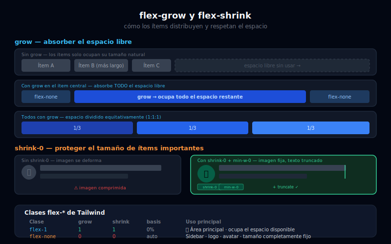

# 📐 Flex Grow, Shrink y Basis

## 🎯 Objetivos

- Entender cómo los ítems crecen (`grow`) y se encogen (`shrink`)
- Usar `flex-1` para ocupar el espacio disponible
- Distinguir `flex-1`, `flex-auto`, `flex-none` e `flex-initial`
- Aplicar `flex-basis` para definir el tamaño base de un ítem
- Construir el patrón sidebar fijo + contenido expansible

---

## 📋 Contenido



### 1. El Espacio Libre y Cómo se Reparte

Flexbox calcula el **espacio libre** restante después de colocar todos los ítems. Las propiedades `grow` y `shrink` dictan cómo se reparte ese espacio.

```
Contenedor: 900px
Ítems: 200px + 200px + 200px = 600px
Espacio libre: 900px - 600px = 300px → se reparte según flex-grow
```

---

### 2. `grow` — Crecer para Ocupar Espacio

`grow` hace que un ítem **absorba el espacio libre** del contenedor. Sin `grow`, los ítems solo ocupan su tamaño natural.

```html
<!-- Sin grow: los ítems solo ocupan lo que necesitan -->
<div class="flex gap-4 bg-gray-100 p-4">
  <div class="rounded bg-sky-200 px-6 py-3">Sin grow</div>
  <div class="rounded bg-sky-200 px-6 py-3">Sin grow</div>
  <div class="rounded bg-sky-200 px-6 py-3">Sin grow</div>
  <!-- El espacio restante queda vacío a la derecha -->
</div>

<!-- Con grow: el segundo ítem absorbe TODO el espacio libre -->
<div class="flex gap-4 bg-gray-100 p-4">
  <div class="rounded bg-sky-300 px-6 py-3">Fijo</div>
  <div class="grow rounded bg-sky-500 px-6 py-3 text-white">Crece (grow)</div>
  <div class="rounded bg-sky-300 px-6 py-3">Fijo</div>
</div>

<!-- Todos con grow: el espacio se reparte de forma equitativa -->
<div class="flex gap-4 bg-gray-100 p-4">
  <div class="grow rounded bg-violet-300 px-6 py-3 text-center">1/3</div>
  <div class="grow rounded bg-violet-400 px-6 py-3 text-center text-white">1/3</div>
  <div class="grow rounded bg-violet-500 px-6 py-3 text-center text-white">1/3</div>
</div>
```

---

### 3. `shrink` — Encoger Cuando Falta Espacio

`shrink` permite que un ítem **se comprima** cuando el contenedor es demasiado pequeño. Por defecto, todos los ítems pueden encogerse (`shrink` está activo).

```html
<!-- shrink-0: el ítem NO se encoge aunque el contenedor sea pequeño -->
<!-- Útil para imágenes o avatares que no deben deformarse -->
<div class="flex gap-3 overflow-hidden bg-gray-100 p-4" style="width: 300px;">
  <!-- Avatar que NO se encoge -->
  
  <div class="min-w-0">
    <!-- min-w-0 es necesario para que el texto se trunque correctamente -->
    <p class="truncate font-semibold text-gray-900">Nombre muy largo que podría desbordarse</p>
    <p class="truncate text-sm text-gray-500">descripcion.larga@email.com</p>
  </div>
</div>
```

> **Truco importante:** `min-w-0` en un ítem flex es necesario cuando quieres que el texto se trunque con `truncate`. Sin `min-w-0`, el ítem flex no se puede comprimir por debajo de su contenido natural.

---

### 4. Las Clases `flex-*` — Atajos Combinados

Las clases `flex-*` son atajos que combinan grow, shrink y basis:

```html
<!-- flex-1: grow=1 shrink=1 basis=0% → ocupa TODO el espacio libre sin mínimo de tamaño -->
<!-- ⭐ La clase flex MÁS USADA -->
<div class="flex h-screen bg-gray-900">
  <!-- Sidebar: tamaño fijo, no crece ni se encoge -->
  <aside class="flex-none w-64 bg-gray-800">Sidebar</aside>
  <!-- Main: ocupa el RESTO del espacio disponible -->
  <main class="flex-1 overflow-auto bg-gray-950 p-8">Contenido principal</main>
</div>

<!-- flex-auto: grow=1 shrink=1 basis=auto → crece, se encoge, pero respeta su tamaño intrínseco -->
<div class="flex gap-4 bg-gray-100 p-4">
  <div class="flex-auto rounded bg-sky-300 px-4 py-3 text-center">Auto</div>
  <div class="flex-auto rounded bg-sky-400 px-10 py-3 text-center text-white">Auto (más ancho base)</div>
  <div class="flex-auto rounded bg-sky-500 px-4 py-3 text-center text-white">Auto</div>
</div>

<!-- flex-initial: grow=0 shrink=1 basis=auto → NO crece, SÍ se encoge si es necesario -->
<!-- Es el comportamiento por defecto de los ítems flex sin ninguna clase -->
<div class="flex gap-4 bg-gray-100 p-4">
  <div class="flex-initial rounded bg-violet-300 px-4 py-3">Initial (no crece)</div>
  <div class="flex-initial rounded bg-violet-300 px-4 py-3">Initial</div>
  <!-- Espacio libre queda vacío: no se reparte porque grow=0 -->
</div>

<!-- flex-none: grow=0 shrink=0 basis=auto → tamaño completamente fijo -->
<!-- Útil para logos, avatares, iconos de ancho fijo -->
<div class="flex items-center gap-4 bg-gray-100 p-4">
  <div class="flex-none w-16 h-16 rounded-full bg-sky-500 flex items-center justify-center text-white font-bold">
    Logo
  </div>
  <div class="flex-1 min-w-0">
    <p class="text-lg font-bold text-gray-900">Título del sitio</p>
    <p class="truncate text-sm text-gray-500">Subtítulo que puede ser bastante largo</p>
  </div>
</div>
```

**Tabla de referencia:**

| Clase | grow | shrink | basis | Cuándo usarlo |
|-------|------|--------|-------|---------------|
| `flex-1` | 1 | 1 | 0% | Área principal que ocupa el espacio |
| `flex-auto` | 1 | 1 | auto | Crece y se encoge respetando su tamaño propio |
| `flex-initial` | 0 | 1 | auto | Tamaño natural, puede encogerse |
| `flex-none` | 0 | 0 | auto | Tamaño completamente fijo |

---

### 5. `basis-*` — Tamaño Base del Ítem

`flex-basis` define el **tamaño base** de un ítem antes de que se distribuya el espacio libre. Acepta los mismos valores que `width`:

```html
<!-- basis-0: tamaño base cero, todo el espacio viene del grow -->
<div class="flex gap-4 bg-gray-100 p-4">
  <div class="basis-0 grow rounded bg-sky-300 p-4 text-center">1 parte</div>
  <div class="basis-0 grow-[2] rounded bg-sky-400 p-4 text-center text-white">2 partes</div>
  <div class="basis-0 grow rounded bg-sky-500 p-4 text-center text-white">1 parte</div>
</div>

<!-- basis-64: tamaño base fijo de 16rem (256px), luego crece con flex-1 -->
<div class="flex gap-4 bg-gray-100 p-4">
  <div class="basis-64 shrink-0 rounded bg-violet-300 p-4">Sidebar (basis-64)</div>
  <div class="flex-1 rounded bg-violet-100 p-4">Contenido principal (flex-1)</div>
</div>

<!-- basis-1/3: tamaño base de 33.33% del contenedor -->
<div class="flex gap-4 bg-gray-100 p-4">
  <div class="basis-1/3 rounded bg-emerald-200 p-4 text-center">33%</div>
  <div class="basis-1/3 rounded bg-emerald-300 p-4 text-center">33%</div>
  <div class="basis-1/3 rounded bg-emerald-400 p-4 text-center text-white">33%</div>
</div>
```

---

### 6. Patrón Fundamental: Sidebar + Contenido

Este es el patrón más importante de esta semana:

```html
<!-- Layout base: sidebar fijo + contenido que ocupa el resto -->
<div class="flex h-screen overflow-hidden">

  <!-- Sidebar: ancho fijo, no crece ni se encoge -->
  <aside class="flex-none w-64 overflow-y-auto bg-gray-900 p-4">
    <nav class="flex flex-col gap-1">
      <a href="#" class="flex items-center gap-3 rounded-lg px-3 py-2 text-gray-300 hover:bg-gray-800 hover:text-white transition-colors">
        Dashboard
      </a>
      <a href="#" class="flex items-center gap-3 rounded-lg px-3 py-2 text-gray-300 hover:bg-gray-800 hover:text-white transition-colors">
        Proyectos
      </a>
    </nav>
  </aside>

  <!-- Main: ocupa TODO el espacio restante, scroll independiente -->
  <main class="flex-1 flex flex-col overflow-hidden">
    <!-- Header interno del área de contenido -->
    <header class="flex-none flex items-center justify-between border-b border-gray-800 bg-gray-950 px-8 py-4">
      <h1 class="text-xl font-bold text-white">Dashboard</h1>
      <button class="rounded-lg bg-sky-500 px-4 py-2 text-sm text-white hover:bg-sky-600">
        Nueva acción
      </button>
    </header>

    <!-- Área de scroll del contenido -->
    <div class="flex-1 overflow-auto bg-gray-950 p-8">
      <!-- Contenido principal aquí -->
    </div>
  </main>

</div>
```

---

## ✅ Checklist de Verificación

- [ ] Sé que `flex-1` es el "rellena el espacio" y `flex-none` es el "tamaño fijo"
- [ ] Puedo crear un layout sidebar + main con solo `flex-none w-64` y `flex-1`
- [ ] Entiendo por qué `min-w-0` es necesario para truncar texto en ítems flex
- [ ] Distingo `flex-1` (basis 0%) de `flex-auto` (basis auto)
- [ ] Uso `shrink-0` en imágenes y avatares para que no se deformen
