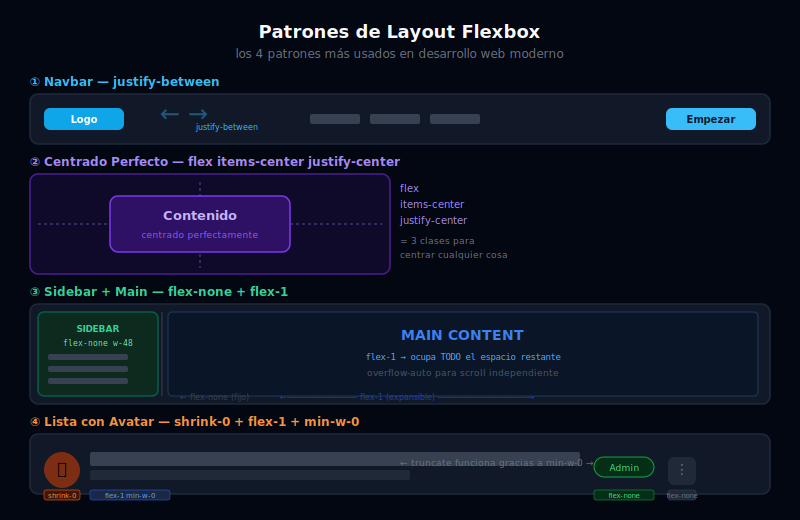

# 🏗️ Patrones de Layout con Flexbox

## 🎯 Objetivos

- Construir una navbar profesional con logo, links y CTA
- Implementar el layout sidebar + main usando solo Flexbox
- Lograr centrado perfecto horizontal y vertical
- Crear un footer multi-columna
- Entender el patrón "Holy Grail" con Flexbox

---



## 📋 Contenido

### 1. Centrado Perfecto

El patrón más famoso de Flexbox: centrar un elemento horizontal y verticalmente.

```html
<!-- Centrado perfecto en toda la pantalla -->
<div class="flex min-h-screen items-center justify-center bg-gray-950">
  <div class="rounded-2xl bg-white p-12 text-center shadow-xl">
    <h1 class="text-3xl font-bold text-gray-900">¡Centrado Perfecto!</h1>
    <p class="mt-2 text-gray-500">Solo 3 clases en el contenedor</p>
  </div>
</div>

<!-- Centrado dentro de una caja de altura fija -->
<div class="flex h-64 items-center justify-center rounded-xl bg-gradient-to-br from-sky-500 to-violet-600">
  <p class="text-2xl font-bold text-white">Centrado en la caja</p>
</div>

<!-- Centrado con flex-col: logo + texto apilados y centrados -->
<div class="flex min-h-screen flex-col items-center justify-center gap-6 bg-gray-950">
  <div class="flex h-20 w-20 items-center justify-center rounded-2xl bg-sky-500">
    <span class="text-3xl text-white">⚡</span>
  </div>
  <h1 class="text-4xl font-black text-white">Marca</h1>
  <p class="text-gray-400">Tagline descriptivo del producto</p>
  <button class="rounded-xl bg-sky-500 px-8 py-3 font-semibold text-white hover:bg-sky-600">
    Empezar gratis
  </button>
</div>
```

---

### 2. Navbar — Logo + Links + CTA

El patrón `justify-between` es la base de todas las navbars modernas:

```html
<header class="sticky top-0 z-50 border-b border-gray-800 bg-gray-950/80 backdrop-blur-sm">
  <nav class="mx-auto flex max-w-7xl items-center justify-between px-6 py-4">

    <!-- Logo (flex-none: tamaño fijo) -->
    <a href="/" class="flex items-center gap-2">
      <div class="flex h-8 w-8 items-center justify-center rounded-lg bg-sky-500">
        <span class="text-sm font-bold text-white">A</span>
      </div>
      <span class="text-lg font-bold text-white">AppName</span>
    </a>

    <!-- Links de navegación (hidden en mobile, flex en desktop) -->
    <ul class="hidden items-center gap-8 md:flex">
      <li><a href="#" class="text-sm text-gray-400 transition-colors hover:text-white">Producto</a></li>
      <li><a href="#" class="text-sm text-gray-400 transition-colors hover:text-white">Precios</a></li>
      <li><a href="#" class="text-sm text-gray-400 transition-colors hover:text-white">Docs</a></li>
      <li><a href="#" class="text-sm text-gray-400 transition-colors hover:text-white">Blog</a></li>
    </ul>

    <!-- Acciones (CTA) -->
    <div class="flex items-center gap-3">
      <a href="#" class="hidden text-sm text-gray-400 hover:text-white md:block">Iniciar sesión</a>
      <a href="#" class="rounded-lg bg-sky-500 px-4 py-2 text-sm font-semibold text-white transition-colors hover:bg-sky-600">
        Empezar gratis
      </a>
      <!-- Hamburger solo en mobile -->
      <button class="flex items-center justify-center rounded-lg p-2 text-gray-400 hover:bg-gray-800 hover:text-white md:hidden">
        <svg class="h-5 w-5" fill="none" viewBox="0 0 24 24" stroke="currentColor">
          <path stroke-linecap="round" stroke-linejoin="round" stroke-width="2" d="M4 6h16M4 12h16M4 18h16" />
        </svg>
      </button>
    </div>

  </nav>
</header>
```

---

### 3. Sidebar + Main Content

El layout más usado en aplicaciones web SPA y dashboards:

```html
<div class="flex h-screen overflow-hidden bg-gray-950">

  <!-- ===== SIDEBAR ===== -->
  <!-- flex-none w-64: ancho fijo de 256px, NO crece ni se encoge -->
  <!-- hidden md:flex: oculto en mobile, visible en desktop -->
  <aside class="hidden flex-none flex-col border-r border-gray-800 bg-gray-900 md:flex" style="width: 256px;">

    <!-- Logo en el sidebar -->
    <div class="flex h-16 flex-none items-center gap-2 border-b border-gray-800 px-6">
      <div class="flex h-8 w-8 items-center justify-center rounded-lg bg-sky-500">
        <span class="text-sm font-bold text-white">D</span>
      </div>
      <span class="font-bold text-white">Dashboard</span>
    </div>

    <!-- Navegación del sidebar (flex-col + gap) -->
    <!-- flex-1 + overflow-auto: scroll si hay muchos links -->
    <nav class="flex-1 overflow-y-auto p-4">
      <p class="mb-2 px-3 text-xs font-semibold uppercase tracking-wider text-gray-500">Principal</p>
      <ul class="flex flex-col gap-1">
        <li>
          <!-- Ítem activo -->
          <a href="#" class="flex items-center gap-3 rounded-lg bg-sky-500/10 px-3 py-2 text-sm font-medium text-sky-400">
            <svg class="h-4 w-4" fill="none" viewBox="0 0 24 24" stroke="currentColor">
              <path stroke-linecap="round" stroke-linejoin="round" stroke-width="2" d="M3 7v10a2 2 0 002 2h14a2 2 0 002-2V9a2 2 0 00-2-2H5a2 2 0 00-2 2z" />
            </svg>
            Resumen
          </a>
        </li>
        <li>
          <a href="#" class="flex items-center gap-3 rounded-lg px-3 py-2 text-sm text-gray-400 transition-colors hover:bg-gray-800 hover:text-white">
            <svg class="h-4 w-4" fill="none" viewBox="0 0 24 24" stroke="currentColor">
              <path stroke-linecap="round" stroke-linejoin="round" stroke-width="2" d="M9 5H7a2 2 0 00-2 2v10a2 2 0 002 2h8a2 2 0 002-2V7a2 2 0 00-2-2h-2M9 5a2 2 0 002 2h2a2 2 0 002-2M9 5a2 2 0 012-2h2a2 2 0 012 2" />
            </svg>
            Proyectos
          </a>
        </li>
        <li>
          <a href="#" class="flex items-center gap-3 rounded-lg px-3 py-2 text-sm text-gray-400 transition-colors hover:bg-gray-800 hover:text-white">
            <svg class="h-4 w-4" fill="none" viewBox="0 0 24 24" stroke="currentColor">
              <path stroke-linecap="round" stroke-linejoin="round" stroke-width="2" d="M17 20h5v-2a3 3 0 00-5.356-1.857M17 20H7m10 0v-2c0-.656-.126-1.283-.356-1.857M7 20H2v-2a3 3 0 015.356-1.857M7 20v-2c0-.656.126-1.283.356-1.857m0 0a5.002 5.002 0 019.288 0M15 7a3 3 0 11-6 0 3 3 0 016 0z" />
            </svg>
            Equipo
          </a>
        </li>
      </ul>
    </nav>

    <!-- Perfil de usuario en la parte inferior -->
    <div class="flex-none border-t border-gray-800 p-4">
      <div class="flex items-center gap-3">
        
        <div class="min-w-0 flex-1">
          <p class="truncate text-sm font-medium text-white">Ana García</p>
          <p class="truncate text-xs text-gray-400">ana@empresa.com</p>
        </div>
      </div>
    </div>

  </aside>

  <!-- ===== MAIN AREA ===== -->
  <!-- flex-1: ocupa TODO el espacio que el sidebar no usa -->
  <!-- flex flex-col: para que el header sea fijo y el contenido haga scroll -->
  <main class="flex flex-1 flex-col overflow-hidden">

    <!-- Header del área de contenido -->
    <header class="flex flex-none items-center justify-between border-b border-gray-800 bg-gray-950 px-8 py-4">
      <div>
        <h1 class="text-xl font-bold text-white">Resumen</h1>
        <p class="text-sm text-gray-400">Bienvenida de vuelta, Ana</p>
      </div>
      <div class="flex items-center gap-3">
        <button class="rounded-lg border border-gray-700 px-4 py-2 text-sm text-gray-300 hover:bg-gray-800">
          Exportar
        </button>
        <button class="rounded-lg bg-sky-500 px-4 py-2 text-sm font-semibold text-white hover:bg-sky-600">
          Nuevo proyecto
        </button>
      </div>
    </header>

    <!-- Contenido con scroll independiente -->
    <div class="flex-1 overflow-auto bg-gray-950 p-8">
      <!-- Aquí va el contenido de la página -->
      <p class="text-gray-400">Contenido principal con scroll independiente...</p>
    </div>

  </main>

</div>
```

---

### 4. Footer Multi-Columna

Un footer con columnas distribuidas equitativamente usando Flexbox:

```html
<footer class="bg-gray-900 border-t border-gray-800">
  <!-- Sección superior: columnas de links -->
  <div class="mx-auto max-w-7xl px-6 py-12">
    <div class="flex flex-col gap-12 md:flex-row">

      <!-- Columna de marca (más ancha) -->
      <div class="flex-none md:w-64">
        <a href="/" class="flex items-center gap-2">
          <div class="flex h-8 w-8 items-center justify-center rounded-lg bg-sky-500">
            <span class="text-sm font-bold text-white">A</span>
          </div>
          <span class="font-bold text-white">AppName</span>
        </a>
        <p class="mt-4 text-sm leading-relaxed text-gray-400">
          Una descripción breve del producto o servicio que ofrece la empresa.
        </p>
      </div>

      <!-- Columnas de links (distribuidas con flex-1) -->
      <div class="flex flex-1 flex-col gap-8 sm:flex-row">
        <div class="flex-1">
          <h3 class="text-sm font-semibold uppercase tracking-wider text-gray-300">Producto</h3>
          <ul class="mt-4 flex flex-col gap-3">
            <li><a href="#" class="text-sm text-gray-400 hover:text-white">Características</a></li>
            <li><a href="#" class="text-sm text-gray-400 hover:text-white">Precios</a></li>
            <li><a href="#" class="text-sm text-gray-400 hover:text-white">Changelog</a></li>
          </ul>
        </div>
        <div class="flex-1">
          <h3 class="text-sm font-semibold uppercase tracking-wider text-gray-300">Empresa</h3>
          <ul class="mt-4 flex flex-col gap-3">
            <li><a href="#" class="text-sm text-gray-400 hover:text-white">Sobre nosotros</a></li>
            <li><a href="#" class="text-sm text-gray-400 hover:text-white">Blog</a></li>
            <li><a href="#" class="text-sm text-gray-400 hover:text-white">Empleos</a></li>
          </ul>
        </div>
        <div class="flex-1">
          <h3 class="text-sm font-semibold uppercase tracking-wider text-gray-300">Legal</h3>
          <ul class="mt-4 flex flex-col gap-3">
            <li><a href="#" class="text-sm text-gray-400 hover:text-white">Privacidad</a></li>
            <li><a href="#" class="text-sm text-gray-400 hover:text-white">Términos</a></li>
            <li><a href="#" class="text-sm text-gray-400 hover:text-white">Cookies</a></li>
          </ul>
        </div>
      </div>

    </div>
  </div>

  <!-- Sección inferior: copyright + redes sociales -->
  <div class="border-t border-gray-800">
    <div class="mx-auto flex max-w-7xl items-center justify-between px-6 py-4">
      <p class="text-sm text-gray-500">© 2026 AppName. Todos los derechos reservados.</p>
      <div class="flex items-center gap-4">
        <a href="#" class="text-gray-400 hover:text-white transition-colors">
          <svg class="h-5 w-5" fill="currentColor" viewBox="0 0 24 24">
            <path d="M8.29 20.251c7.547 0 11.675-6.253 11.675-11.675 0-.178 0-.355-.012-.53A8.348 8.348 0 0022 5.92a8.19 8.19 0 01-2.357.646 4.118 4.118 0 001.804-2.27 8.224 8.224 0 01-2.605.996 4.107 4.107 0 00-6.993 3.743 11.65 11.65 0 01-8.457-4.287 4.106 4.106 0 001.27 5.477A4.072 4.072 0 012.8 9.713v.052a4.105 4.105 0 003.292 4.022 4.095 4.095 0 01-1.853.07 4.108 4.108 0 003.834 2.85A8.233 8.233 0 012 18.407a11.616 11.616 0 006.29 1.84" />
          </svg>
        </a>
        <a href="#" class="text-gray-400 hover:text-white transition-colors">
          <svg class="h-5 w-5" fill="currentColor" viewBox="0 0 24 24">
            <path fill-rule="evenodd" d="M12 2C6.477 2 2 6.484 2 12.017c0 4.425 2.865 8.18 6.839 9.504.5.092.682-.217.682-.483 0-.237-.008-.868-.013-1.703-2.782.605-3.369-1.343-3.369-1.343-.454-1.158-1.11-1.466-1.11-1.466-.908-.62.069-.608.069-.608 1.003.07 1.531 1.032 1.531 1.032.892 1.53 2.341 1.088 2.91.832.092-.647.35-1.088.636-1.338-2.22-.253-4.555-1.113-4.555-4.951 0-1.093.39-1.988 1.029-2.688-.103-.253-.446-1.272.098-2.65 0 0 .84-.27 2.75 1.026A9.564 9.564 0 0112 6.844c.85.004 1.705.115 2.504.337 1.909-1.296 2.747-1.027 2.747-1.027.546 1.379.202 2.398.1 2.651.64.7 1.028 1.595 1.028 2.688 0 3.848-2.339 4.695-4.566 4.943.359.309.678.92.678 1.855 0 1.338-.012 2.419-.012 2.747 0 .268.18.58.688.482A10.019 10.019 0 0022 12.017C22 6.484 17.522 2 12 2z" clip-rule="evenodd" />
          </svg>
        </a>
      </div>
    </div>
  </div>
</footer>
```

---

### 5. Componente de Lista de Usuarios

Un patrón muy común en dashboards: lista de ítems con avatar, info y acción:

```html
<ul class="flex flex-col divide-y divide-gray-800 rounded-xl border border-gray-800 bg-gray-900">
  <!-- Ítem de lista -->
  <li class="flex items-center gap-4 px-6 py-4">
    <!-- Avatar: shrink-0 para que no se comprima -->
    

    <!-- Info: flex-1 + min-w-0 para permitir truncate -->
    <div class="flex-1 min-w-0">
      <p class="truncate text-sm font-semibold text-white">Ana García</p>
      <p class="truncate text-xs text-gray-400">ana.garcia@empresa.com</p>
    </div>

    <!-- Badge: flex-none para tamaño fijo -->
    <span class="flex-none rounded-full bg-emerald-500/10 px-2.5 py-0.5 text-xs font-medium text-emerald-400">
      Admin
    </span>

    <!-- Acción: flex-none -->
    <button class="flex-none rounded-lg p-2 text-gray-400 hover:bg-gray-800 hover:text-white transition-colors">
      <svg class="h-4 w-4" fill="none" viewBox="0 0 24 24" stroke="currentColor">
        <path stroke-linecap="round" stroke-linejoin="round" stroke-width="2" d="M12 5v.01M12 12v.01M12 19v.01M12 6a1 1 0 110-2 1 1 0 010 2zm0 7a1 1 0 110-2 1 1 0 010 2zm0 7a1 1 0 110-2 1 1 0 010 2z" />
      </svg>
    </button>
  </li>
</ul>
```

---

## ✅ Checklist de Verificación

- [ ] Puedo centrar cualquier elemento con `flex items-center justify-center`
- [ ] Construyo navbars con `justify-between` sin usar `float` ni `position: absolute`
- [ ] Crea layouts sidebar + main sin usar `position: fixed` para el sidebar
- [ ] Un footer multi-columna con Flexbox y `flex-col md:flex-row`
- [ ] Uso `shrink-0` + `flex-1` + `min-w-0` en patrones de lista con avatar + texto
