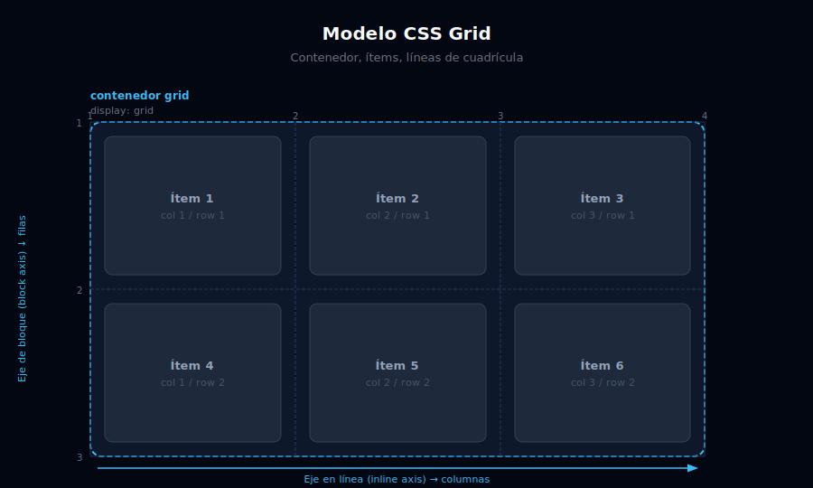

# 🔲 Grid Básico en Tailwind

## 🎯 Objetivos

- Activar CSS Grid con `grid` e `inline-grid`
- Entender el flujo automático de los ítems (`grid-flow-*`)
- Usar `place-items` para centrar en ambos ejes a la vez
- Dominar el comportamiento por defecto de Grid

---



## 📋 Contenido

### 1. ¿Qué es CSS Grid?

CSS Grid es un **modelo de layout bidimensional**: controla filas Y columnas al mismo tiempo. A diferencia de Flexbox (1D), Grid permite posicionar elementos en una cuadrícula de dos ejes.

```
Flexbox → "quiero alinear elementos en una fila o columna"
Grid    → "quiero construir una cuadrícula de filas y columnas"
```

**Cuándo usar Grid:**
- Layouts de página (header / sidebar / main / footer)
- Galerías de imágenes
- Dashboards de widgets
- Layouts tipo magazine (artículo destacado + sidebar)

---

### 2. Activar Grid: `grid` e `inline-grid`

```html
<!-- grid: el contenedor ocupa todo el ancho disponible -->
<div class="grid grid-cols-3 gap-4 bg-gray-900 p-6">
  <div class="rounded-lg bg-sky-500 p-4 text-center text-white">1</div>
  <div class="rounded-lg bg-sky-400 p-4 text-center text-white">2</div>
  <div class="rounded-lg bg-sky-300 p-4 text-center text-sky-900">3</div>
</div>

<!-- inline-grid: el contenedor se ajusta a su contenido (como inline-flex) -->
<div class="inline-grid grid-cols-2 gap-2 rounded-lg bg-gray-800 p-3">
  <div class="rounded bg-violet-500 p-2 text-xs text-white">A</div>
  <div class="rounded bg-violet-400 p-2 text-xs text-white">B</div>
</div>
```

> **Regla de oro:** `grid`, `grid-cols-*`, `grid-rows-*`, `gap-*`, `grid-flow-*` → siempre en el **contenedor**. `col-span-*`, `row-span-*`, `col-start-*`, `self-*` → siempre en los **ítems**.

---

### 3. Flujo automático: `grid-flow-*`

Sin `grid-cols-*` definido, Grid coloca ítems automáticamente usando `auto-fill` interno. Con `grid-flow-*` controlamos la dirección:

```html
<!-- grid-flow-row (por defecto): llena fila por fila -->
<div class="grid grid-cols-3 grid-flow-row gap-4 p-6 bg-gray-900">
  <!-- Los ítems se colocan: 1-2-3 en fila 1, 4-5-6 en fila 2... -->
  <div class="rounded bg-sky-500 p-4 text-white text-center">1</div>
  <div class="rounded bg-sky-500 p-4 text-white text-center">2</div>
  <div class="rounded bg-sky-500 p-4 text-white text-center">3</div>
  <div class="rounded bg-sky-400 p-4 text-white text-center">4</div>
  <div class="rounded bg-sky-400 p-4 text-white text-center">5</div>
</div>

<!-- grid-flow-col: llena columna por columna -->
<div class="grid grid-rows-3 grid-flow-col gap-4 p-6 bg-gray-900">
  <!-- Los ítems se colocan: 1-2-3 en col 1, 4-5-6 en col 2... -->
  <div class="rounded bg-emerald-500 p-4 text-white text-center">1</div>
  <div class="rounded bg-emerald-500 p-4 text-white text-center">2</div>
  <div class="rounded bg-emerald-500 p-4 text-white text-center">3</div>
  <div class="rounded bg-emerald-400 p-4 text-white text-center">4</div>
</div>

<!-- grid-flow-dense: rellena huecos con ítems más pequeños -->
<!-- Útil en galerías tipo masonry donde los ítems tienen distintos tamaños -->
<div class="grid grid-cols-3 grid-flow-row-dense gap-4 p-6 bg-gray-900">
  <div class="col-span-2 rounded bg-rose-500 p-4 text-white">Grande (2 cols)</div>
  <div class="rounded bg-rose-400 p-4 text-white">Normal</div>
  <div class="rounded bg-rose-300 p-4 text-rose-900">Normal</div>
  <div class="col-span-2 rounded bg-rose-500 p-4 text-white">Grande (2 cols)</div>
  <!-- dense rellena el hueco de la primera fila con el siguiente ítem -->
</div>
```

---

### 4. Centrado total: `place-items`

`place-items` es un shorthand para `align-items` + `justify-items` en Grid. Es la forma más concisa de centrar **todo el contenido** de un grid:

```html
<!-- place-items-center: centra en ambos ejes simultáneamente -->
<div class="grid h-64 place-items-center rounded-xl bg-gray-900">
  <div class="rounded-lg bg-sky-600 px-8 py-4 text-white font-bold text-xl">
    ¡Centrado con 2 clases!
  </div>
</div>

<!-- Comparación: en Flex necesitas 3 clases -->
<div class="flex h-64 items-center justify-center rounded-xl bg-gray-900">
  <div class="rounded-lg bg-violet-600 px-8 py-4 text-white font-bold text-xl">
    Flex: 3 clases
  </div>
</div>

<!-- place-content-center para múltiples ítems -->
<div class="grid h-64 grid-cols-2 gap-4 place-content-center rounded-xl bg-gray-900 p-6">
  <div class="rounded bg-emerald-500 p-4 text-white">A</div>
  <div class="rounded bg-emerald-400 p-4 text-white">B</div>
</div>

<!-- place-self-* → en el ítem, no en el contenedor -->
<div class="grid h-64 grid-cols-3 gap-4 rounded-xl bg-gray-900 p-4">
  <div class="rounded bg-sky-500 p-4 text-white">Normal</div>
  <div class="place-self-center rounded bg-sky-400 p-4 text-white">Centrado</div>
  <div class="place-self-end rounded bg-sky-300 p-4 text-sky-900">Al final</div>
</div>
```

| Clase | Equivalente | Efecto |
|-------|------------|--------|
| `place-items-center` | `items-center` + `justify-items-center` | Centra todos los ítems en su celda |
| `place-content-center` | `content-center` + `justify-content-center` | Centra el grid completo en el contenedor |
| `place-self-center` | `self-center` + `justify-self-center` | Centra un ítem individual en su celda |

---

### 5. Grid vs. ninguno: cuándo empieza a tener sentido

```html
<!-- ❌ Sin Grid: márgenes manuales, no responsive -->
<div style="margin: 0 auto; max-width: 1200px;">
  <div style="float: left; width: 33.3%">A</div>
  <div style="float: left; width: 33.3%">B</div>
  <div style="float: left; width: 33.3%">C</div>
</div>

<!-- ✅ Con Grid Tailwind: limpio, responsive, sin hacks -->
<div class="grid grid-cols-1 gap-6 md:grid-cols-2 lg:grid-cols-3">
  <div class="rounded-xl bg-gray-800 p-6">A</div>
  <div class="rounded-xl bg-gray-800 p-6">B</div>
  <div class="rounded-xl bg-gray-800 p-6">C</div>
</div>
```

---

## ✅ Checklist de Verificación

- [ ] Sé activar Grid con `grid` y entiendo que los hijos directos son ítems de la cuadrícula
- [ ] Entiendo la diferencia entre `grid-flow-row` y `grid-flow-col`
- [ ] Puedo centrar un elemento en ambos ejes con `place-items-center`
- [ ] Entiendo cuándo usar Grid vs. Flexbox
- [ ] Completo el **Ejercicio 01** de prácticas (Grid Básico)
