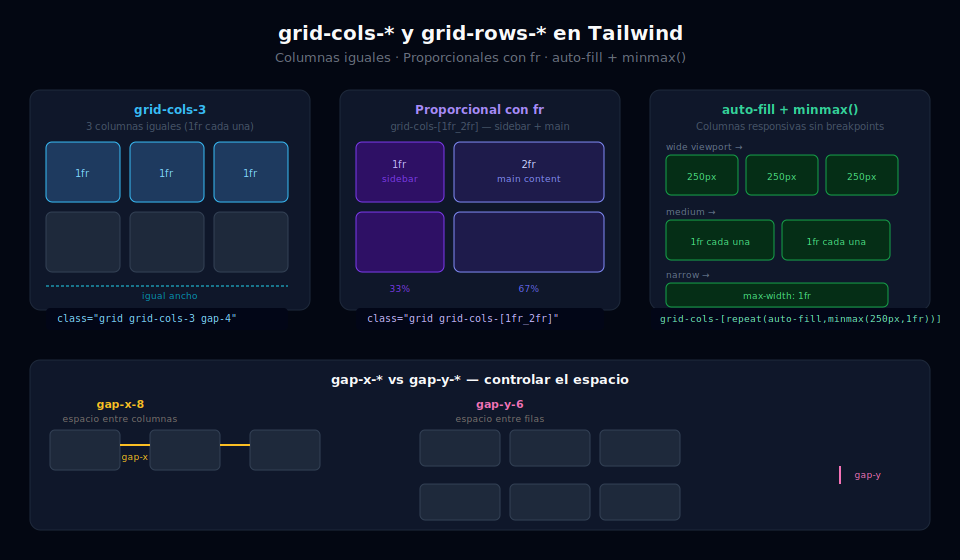

# 📐 Grid Cols, Rows y Gap

## 🎯 Objetivos

- Definir columnas con `grid-cols-{n}`, unidades `fr` y templates personalizados
- Definir filas con `grid-rows-{n}` y `grid-rows-[template]`
- Crear columnas intrínsecamente responsivas con `auto-fill` y `minmax()`
- Controlar el espacio entre celdas con `gap-*`, `gap-x-*` y `gap-y-*`

---



## 📋 Contenido

### 1. `grid-cols-{n}` — Columnas de igual ancho

La forma más básica: `n` columnas del mismo ancho (`1fr` cada una):

```html
<!-- 1 columna — mobile first -->
<div class="grid grid-cols-1 gap-4 p-6 bg-gray-900">
  <div class="rounded-lg bg-sky-500 p-4 text-white text-center">A</div>
  <div class="rounded-lg bg-sky-400 p-4 text-white text-center">B</div>
  <div class="rounded-lg bg-sky-300 p-4 text-sky-900 text-center">C</div>
</div>

<!-- 3 columnas iguales — clásica galería de features -->
<div class="grid grid-cols-3 gap-6 p-6 bg-gray-900">
  <div class="rounded-xl bg-gray-800 p-6">Feature 1</div>
  <div class="rounded-xl bg-gray-800 p-6">Feature 2</div>
  <div class="rounded-xl bg-gray-800 p-6">Feature 3</div>
</div>

<!-- Responsive: 1 col en mobile, 2 en tablet, 3 en desktop -->
<div class="grid grid-cols-1 gap-6 p-6 md:grid-cols-2 lg:grid-cols-3">
  <div class="rounded-xl bg-gray-800 p-6">Card 1</div>
  <div class="rounded-xl bg-gray-800 p-6">Card 2</div>
  <div class="rounded-xl bg-gray-800 p-6">Card 3</div>
  <div class="rounded-xl bg-gray-800 p-6">Card 4</div>
  <div class="rounded-xl bg-gray-800 p-6">Card 5</div>
  <div class="rounded-xl bg-gray-800 p-6">Card 6</div>
</div>
```

---

### 2. Unidades `fr` — Proporción del espacio libre

`fr` (fraction) divide el espacio disponible proporcionalmente. Se usa con templates personalizados:

```html
<!-- 2 columnas: sidebar 1fr + main 2fr → sidebar ocupa 1/3 del espacio -->
<!-- No confundir con flex-none: aquí ambas columnas son dinámicas -->
<div class="grid grid-cols-[1fr_2fr] gap-6 p-6 bg-gray-900">
  <aside class="rounded-xl bg-gray-800 p-4">
    <p class="text-sm text-gray-400">Sidebar (1fr)</p>
  </aside>
  <main class="rounded-xl bg-gray-700 p-4">
    <p class="text-sm text-gray-400">Contenido principal (2fr)</p>
  </main>
</div>

<!-- Sidebar fijo + main flexible: auto (ancho del contenido) + 1fr -->
<div class="grid grid-cols-[240px_1fr] gap-6 min-h-screen bg-gray-950">
  <aside class="rounded-xl bg-gray-900 p-4">Sidebar fijo 240px</aside>
  <main class="rounded-xl bg-gray-800 p-6">Main ocupa el resto</main>
</div>

<!-- Layout de 12 columnas clásico -->
<!-- Replica el sistema de 12 columnas de Bootstrap con Grid puro -->
<div class="grid grid-cols-12 gap-4 p-6 bg-gray-900">
  <div class="col-span-8 rounded-lg bg-sky-700 p-4 text-white">8 columnas</div>
  <div class="col-span-4 rounded-lg bg-sky-500 p-4 text-white">4 columnas</div>
</div>
```

---

### 3. `auto-fill` y `minmax()` — Grid intrínsecamente responsive

La técnica más poderosa: columnas que se crean solas sin breakpoints explícitos.

```html
<!--
  minmax(250px, 1fr): cada columna tiene mínimo 250px
  auto-fill: crea TODAS las columnas que quepan, incluso vacías
  auto-fit: crea solo columnas ocupadas y estira las existentes
-->

<!-- auto-fill: si solo hay 2 ítems en espacio para 3, la 3ª columna queda vacía -->
<div class="grid grid-cols-[repeat(auto-fill,minmax(250px,1fr))] gap-6 p-6 bg-gray-900">
  <div class="rounded-xl bg-emerald-800 p-6 text-white">Card 1</div>
  <div class="rounded-xl bg-emerald-700 p-6 text-white">Card 2</div>
</div>

<!-- auto-fit: si solo hay 2 ítems, se estiran para ocupar todo el espacio -->
<div class="grid grid-cols-[repeat(auto-fit,minmax(250px,1fr))] gap-6 p-6 bg-gray-900">
  <div class="rounded-xl bg-violet-800 p-6 text-white">Card 1</div>
  <div class="rounded-xl bg-violet-700 p-6 text-white">Card 2</div>
</div>

<!-- Galería responsive real sin un solo breakpoint -->
<div class="grid grid-cols-[repeat(auto-fill,minmax(200px,1fr))] gap-4 p-6 bg-gray-900">
  <div class="aspect-square rounded-xl bg-gray-700 object-cover"></div>
  <div class="aspect-square rounded-xl bg-gray-700 object-cover"></div>
  <div class="aspect-square rounded-xl bg-gray-700 object-cover"></div>
  <div class="aspect-square rounded-xl bg-gray-700 object-cover"></div>
  <div class="aspect-square rounded-xl bg-gray-700 object-cover"></div>
  <div class="aspect-square rounded-xl bg-gray-700 object-cover"></div>
</div>
```

> **auto-fill vs auto-fit**: Usa `auto-fit` cuando quieres que pocos ítems ocupen todo el espacio. Usa `auto-fill` cuando quieres mantener el ritmo visual de columnas aunque haya pocos ítems.

---

### 4. `grid-rows-{n}` — Definir filas

Menos común que `grid-cols`, pero esencial para layouts de página completa:

```html
<!-- Layout de página: header fijo + main flexible + footer fijo -->
<div class="grid min-h-screen grid-rows-[auto_1fr_auto] bg-gray-950">
  <header class="border-b border-gray-800 bg-gray-900 px-6 py-4">
    <p class="text-white font-bold">Header (auto)</p>
  </header>

  <main class="overflow-auto p-6">
    <!-- Este bloque ocupa todo el espacio disponible entre header y footer -->
    <p class="text-gray-400">Main content (1fr — crece para llenar)</p>
  </main>

  <footer class="border-t border-gray-800 bg-gray-900 px-6 py-4 text-center text-sm text-gray-500">
    Footer (auto)
  </footer>
</div>

<!-- Galería de 2 filas con altura fija -->
<div class="grid grid-rows-2 gap-4 p-4 bg-gray-900" style="height: 400px">
  <div class="grid grid-cols-3 gap-4">
    <!-- Primera fila: 3 ítems -->
    <div class="rounded-lg bg-sky-700 p-4 text-white">1</div>
    <div class="rounded-lg bg-sky-600 p-4 text-white">2</div>
    <div class="rounded-lg bg-sky-500 p-4 text-white">3</div>
  </div>
  <div class="grid grid-cols-2 gap-4">
    <!-- Segunda fila: 2 ítems más grandes -->
    <div class="rounded-lg bg-sky-400 p-4 text-white">4</div>
    <div class="rounded-lg bg-sky-300 p-4 text-sky-900">5</div>
  </div>
</div>
```

---

### 5. `gap-*`, `gap-x-*` y `gap-y-*`

```html
<!-- gap-*: mismo espacio entre filas Y columnas -->
<div class="grid grid-cols-3 gap-6 p-6 bg-gray-900">
  <!-- 24px entre cada celda horizontal y verticalmente -->

<!-- gap-x / gap-y: espaciado diferente por eje -->
<div class="grid grid-cols-3 gap-x-8 gap-y-4 p-6 bg-gray-900">
  <!-- 32px entre columnas, 16px entre filas -->

<!-- gap-0 para grids sin espacio (tipo tabla) -->
<div class="grid grid-cols-4 gap-0 rounded-xl overflow-hidden border border-gray-700">
  <div class="border-b border-r border-gray-700 p-4 text-sm text-gray-400">Nombre</div>
  <div class="border-b border-r border-gray-700 p-4 text-sm text-gray-400">Email</div>
  <div class="border-b border-r border-gray-700 p-4 text-sm text-gray-400">Plan</div>
  <div class="border-b border-gray-700 p-4 text-sm text-gray-400">Estado</div>
  <div class="border-r border-gray-800 p-4 text-white">Ana García</div>
  <div class="border-r border-gray-800 p-4 text-white">ana@example.com</div>
  <div class="border-r border-gray-800 p-4 text-white">Pro</div>
  <div class="p-4 text-emerald-400">Activo</div>
</div>
```

---

## ✅ Checklist de Verificación

- [ ] Sé la diferencia entre `grid-cols-3` (iguales) y `grid-cols-[1fr_2fr]` (proporcionales)
- [ ] Entiendo qué hace `minmax(250px, 1fr)` y si debo usar `auto-fill` o `auto-fit`
- [ ] Puedo crear el layout `header / main / footer` con `grid-rows-[auto_1fr_auto]`
- [ ] Sé cuándo usar `gap-x-*` y `gap-y-*` por separado
- [ ] Completo el **Ejercicio 02** de prácticas (Galería Responsive)
