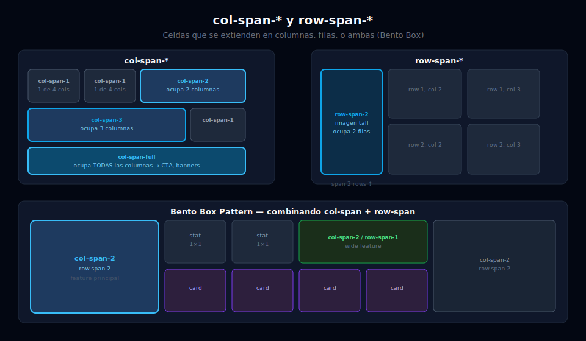

# 📏 col-span, row-span y Posicionamiento Explícito

## 🎯 Objetivos

- Extender elementos a múltiples columnas con `col-span-*`
- Extender elementos a múltiples filas con `row-span-*`
- Usar `col-span-full` y `row-span-full` para ocupar toda la dimensión
- Posicionar elementos explícitamente con `col-start-*` y `col-end-*`

---



## 📋 Contenido

### 1. `col-span-*` — Ocupar múltiples columnas

```html
<!-- Grid de 3 columnas: el primer ítem ocupa 2 columnas (el artículo destacado) -->
<div class="grid grid-cols-3 gap-4 p-6 bg-gray-900">

  <!-- Este ítem ocupa las columnas 1 y 2 → col-span-2 -->
  <article class="col-span-2 rounded-xl bg-gray-800 p-6">
    <span class="inline-block rounded-full bg-sky-500/20 px-3 py-1 text-xs text-sky-400">
      Destacado
    </span>
    <h2 class="mt-3 text-xl font-bold text-white">Artículo Principal</h2>
    <p class="mt-2 text-sm text-gray-400">
      Este artículo ocupa 2 de las 3 columnas disponibles.
    </p>
  </article>

  <!-- Este ítem ocupa solo la columna 3 → col-span-1 (por defecto) -->
  <aside class="rounded-xl bg-gray-800 p-4">
    <h3 class="text-sm font-semibold text-gray-300">Sidebar</h3>
    <p class="mt-2 text-xs text-gray-500">1 columna</p>
  </aside>

  <!-- Los siguientes ítems siguen el flujo normal (1 columna cada uno) -->
  <div class="rounded-xl bg-gray-800 p-4 text-white">Card 1</div>
  <div class="rounded-xl bg-gray-800 p-4 text-white">Card 2</div>
  <div class="rounded-xl bg-gray-800 p-4 text-white">Card 3</div>

</div>

<!-- col-span-full: ocupa TODAS las columnas (útil para headers y CTAs) -->
<div class="grid grid-cols-3 gap-4 p-6 bg-gray-900">
  <div class="col-span-full rounded-xl bg-sky-900 p-6 text-center">
    <h2 class="text-xl font-bold text-white">Sección CTA — ocupa las 3 columnas</h2>
    <p class="text-sm text-sky-300 mt-1">col-span-full es equivalente a col-span-3 en este grid</p>
  </div>
  <div class="rounded-xl bg-gray-800 p-4 text-white">Card 1</div>
  <div class="rounded-xl bg-gray-800 p-4 text-white">Card 2</div>
  <div class="rounded-xl bg-gray-800 p-4 text-white">Card 3</div>
</div>
```

---

### 2. `row-span-*` — Ocupar múltiples filas

```html
<!-- Grid de 2 columnas: la imagen de la izquierda ocupa 2 filas -->
<div class="grid grid-cols-2 grid-rows-2 gap-4 p-6 bg-gray-900">

  <!-- La imagen ocupa las 2 filas de la columna 1 → row-span-2 -->
  <div class="row-span-2 rounded-xl overflow-hidden bg-gray-700">
    
  </div>

  <!-- Estos dos ítems ocupan una fila cada uno en la columna 2 -->
  <div class="rounded-xl bg-sky-900 p-6">
    <h3 class="font-bold text-white">Ítem superior</h3>
    <p class="text-sm text-sky-300 mt-1">Fila 1, columna 2</p>
  </div>
  <div class="rounded-xl bg-violet-900 p-6">
    <h3 class="font-bold text-white">Ítem inferior</h3>
    <p class="text-sm text-violet-300 mt-1">Fila 2, columna 2</p>
  </div>

</div>

<!-- Layout tipo bento box: mezcla de col-span y row-span -->
<div class="grid grid-cols-4 grid-rows-3 gap-3 p-4 bg-gray-900" style="height: 400px">

  <!-- Bloque grande: 2 cols × 2 filas -->
  <div class="col-span-2 row-span-2 rounded-2xl bg-sky-800 p-6">
    <p class="text-sm text-sky-400">Grande</p>
    <p class="mt-2 text-2xl font-bold text-white">2×2</p>
  </div>

  <!-- Bloque ancho: 2 cols × 1 fila -->
  <div class="col-span-2 rounded-2xl bg-emerald-800 p-4">
    <p class="text-sm text-emerald-400">Ancho</p>
    <p class="font-bold text-white">2×1</p>
  </div>

  <!-- Bloque vertical: 1 col × 2 filas -->
  <div class="row-span-2 rounded-2xl bg-violet-800 p-4">
    <p class="text-sm text-violet-400">Alto</p>
    <p class="font-bold text-white mt-1">1×2</p>
  </div>

  <!-- Bloque normal -->
  <div class="rounded-2xl bg-gray-700 p-4">
    <p class="text-sm text-gray-400">Normal 1×1</p>
  </div>

  <!-- Bloque ancho inferior: 3 cols -->
  <div class="col-span-3 rounded-2xl bg-rose-800 p-4">
    <p class="text-sm text-rose-400">Ancho 3×1</p>
  </div>

</div>
```

---

### 3. `col-start-*` y `col-end-*` — Posicionamiento explícito

Permite colocar un ítem en una posición específica del grid independientemente del flujo automático:

```html
<!-- Grid de 6 columnas: posicionamos elementos exactamente -->
<div class="grid grid-cols-6 gap-4 p-6 bg-gray-900">

  <!-- Del inicio (col 1) hasta col 4 → ocupa 3 columnas -->
  <div class="col-start-1 col-end-4 rounded-lg bg-sky-700 p-4 text-white text-sm">
    col-start-1 col-end-4 (cols 1, 2, 3)
  </div>

  <!-- Empieza en col 4, termina en col 7 (final) → ocupa 3 columnas -->
  <div class="col-start-4 col-end-7 rounded-lg bg-violet-700 p-4 text-white text-sm">
    col-start-4 col-end-7 (cols 4, 5, 6)
  </div>

  <!-- Centrar un elemento en la columna 3-5 (saltando 1 y 6) -->
  <div class="col-start-2 col-end-6 rounded-lg bg-emerald-700 p-4 text-center text-white text-sm">
    col-start-2 col-end-6 — centrado
  </div>

</div>

<!-- Uso real: landing con título centrado en grid de 12 columnas -->
<div class="grid grid-cols-12 gap-4 px-6 py-16 bg-gray-950">
  <div class="col-start-2 col-end-12 text-center md:col-start-3 md:col-end-11 lg:col-start-4 lg:col-end-10">
    <h1 class="text-4xl font-extrabold tracking-tight text-white">
      Título perfectamente centrado con Grid
    </h1>
    <p class="mt-4 text-lg text-gray-400">
      Usamos col-start/end para anchos variables por breakpoint.
    </p>
  </div>
</div>
```

---

### 4. Resumen visual de valores

```
Grid de 4 columnas:
│  col 1  │  col 2  │  col 3  │  col 4  │
1         2         3         4         5  ← líneas

col-span-2  = ocupa 2 columnas contiguas
col-span-full = col-start-1 col-end-[-1] = todas las columnas

col-start-2 col-end-4 = ocupa columnas 2 y 3 (entre líneas 2 y 4)
col-start-1 col-end-3 = ocupa columnas 1 y 2 (entre líneas 1 y 3)
```

| Clase | Descripción |
|-------|-------------|
| `col-span-1` | 1 columna (por defecto) |
| `col-span-2` | 2 columnas contiguas |
| `col-span-3` | 3 columnas contiguas |
| `col-span-full` | Todas las columnas del grid |
| `row-span-2` | 2 filas contiguas |
| `row-span-full` | Todas las filas del grid |
| `col-start-2` | Empieza en la línea 2 |
| `col-end-5` | Termina en la línea 5 |

---

## ✅ Checklist de Verificación

- [ ] Sé usar `col-span-2` para un artículo destacado en un grid de 3 columnas
- [ ] Entiendo la diferencia entre `col-span-full` y `col-span-{n}` explícito
- [ ] Puedo construir un "bento box" mezclando `col-span-*` y `row-span-*`
- [ ] Sé cómo usar `col-start-*` para centrar contenido en un grid de 12 columnas
- [ ] Completo el **Ejercicio 03** de prácticas (Layout Magazine)
