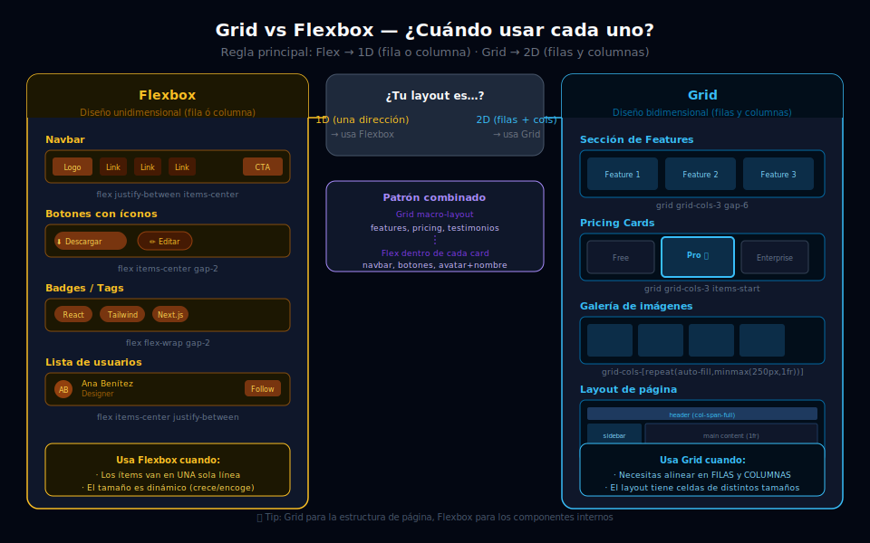

# ⚖️ Grid vs. Flexbox: ¿Cuándo Usar Cada Uno?

## 🎯 Objetivos

- Dominar el criterio 1D vs. 2D para elegir entre Grid y Flexbox
- Identificar patrones de UI que requieren Grid y cuáles requieren Flexbox
- Combinar Grid y Flexbox en el mismo diseño sin conflictos
- Reconocer anti-patrones comunes (usar Grid donde Flex es suficiente y viceversa)

---



## 📋 Contenido

### 1. La regla de oro: 1D vs. 2D

```
¿Necesito controlar filas Y columnas al mismo tiempo?
  → SÍ → Usa CSS Grid
  → NO → Usa Flexbox
```

**Flexbox** es unidimensional: los ítems fluyen en UNA dirección (fila o columna). Puedes controlar cómo se distribuye el espacio en esa dirección, pero no puedes alinear elementos entre filas distintas.

**Grid** es bidimensional: define tanto columnas como filas. Puedes hacer que una celda ocupe varias columnas Y varias filas al mismo tiempo.

---

### 2. Patrones que pertenecen a Flexbox

```html
<!-- ✅ Flexbox: Navbar — 1 fila de elementos alineados -->
<nav class="flex items-center justify-between px-6 py-4 bg-gray-900">
  <a href="/" class="text-xl font-bold text-white">Logo</a>
  <ul class="hidden md:flex gap-6">
    <li><a href="#" class="text-gray-400 hover:text-white">Docs</a></li>
    <li><a href="#" class="text-gray-400 hover:text-white">Pricing</a></li>
  </ul>
  <button class="rounded-lg bg-sky-500 px-4 py-2 text-sm font-semibold text-white">
    Sign up
  </button>
</nav>

<!-- ✅ Flexbox: Fila de badges/tags — fluye en una dirección -->
<div class="flex flex-wrap gap-2">
  <span class="rounded-full bg-sky-500/20 px-3 py-1 text-xs text-sky-400">React</span>
  <span class="rounded-full bg-violet-500/20 px-3 py-1 text-xs text-violet-400">TypeScript</span>
  <span class="rounded-full bg-emerald-500/20 px-3 py-1 text-xs text-emerald-400">Node.js</span>
</div>

<!-- ✅ Flexbox: Botón con icono + texto — 1 eje -->
<button class="flex items-center gap-2 rounded-lg bg-sky-600 px-4 py-2 text-white">
  <svg class="h-4 w-4" fill="none" viewBox="0 0 24 24" stroke="currentColor">
    <path stroke-linecap="round" stroke-linejoin="round" stroke-width="2" d="M12 4v16m8-8H4"/>
  </svg>
  <span>Nuevo proyecto</span>
</button>

<!-- ✅ Flexbox: Lista de usuarios con avatar + texto + badge -->
<div class="flex items-center gap-4 rounded-xl bg-gray-800 p-4">
  
  <div class="min-w-0 flex-1">
    <p class="truncate font-medium text-white">María García</p>
    <p class="truncate text-sm text-gray-400">maria@example.com</p>
  </div>
  <span class="shrink-0 rounded-full bg-emerald-500/20 px-2 py-1 text-xs text-emerald-400">
    Admin
  </span>
</div>
```

---

### 3. Patrones que pertenecen a Grid

```html
<!-- ✅ Grid: Sección de features — múltiples cards en cuadrícula -->
<section class="grid grid-cols-1 gap-8 p-12 md:grid-cols-3">
  <div class="rounded-2xl bg-gray-800 p-6">
    <div class="mb-4 flex h-12 w-12 items-center justify-center rounded-xl bg-sky-500/20">
      <span class="text-2xl">⚡</span>
    </div>
    <h3 class="text-lg font-bold text-white">Rápido</h3>
    <p class="mt-2 text-sm text-gray-400">Descripción de la feature.</p>
  </div>
  <!-- ... más cards -->
</section>

<!-- ✅ Grid: Layout de página completa -->
<div class="grid min-h-screen grid-cols-[240px_1fr] grid-rows-[auto_1fr_auto]">
  <header class="col-span-2 border-b border-gray-800 bg-gray-900 px-6 py-4">
    Nav
  </header>
  <aside class="border-r border-gray-800 bg-gray-900 p-4">Sidebar</aside>
  <main class="overflow-auto p-6">Contenido</main>
  <footer class="col-span-2 border-t border-gray-800 bg-gray-900 p-4 text-center">
    Footer
  </footer>
</div>

<!-- ✅ Grid: Galería de imágenes responsive -->
<div class="grid grid-cols-[repeat(auto-fill,minmax(200px,1fr))] gap-3 p-6">
  
  
  <!-- ... más imágenes se adaptan solas -->
</div>

<!-- ✅ Grid: Pricing cards — 3 cards que se alinean verticalmente -->
<!-- Con Grid todas las cards de la misma fila tienen la MISMA altura -->
<div class="grid grid-cols-1 gap-6 md:grid-cols-3">
  <div class="rounded-2xl bg-gray-800 p-8">Plan Free</div>
  <div class="rounded-2xl bg-sky-600 p-8">Plan Pro ⭐</div>
  <div class="rounded-2xl bg-gray-800 p-8">Plan Enterprise</div>
</div>
```

---

### 4. Combinar Grid y Flexbox: el patrón real

Lo más común en proyectos reales es **usar ambos a la vez**:

```html
<!-- Grid para la macro-estructura de la página -->
<div class="grid grid-cols-1 gap-8 p-8 lg:grid-cols-3">

  <!-- Cada card usa Flexbox internamente para alinear su contenido -->
  <article class="flex flex-col rounded-2xl bg-gray-800 overflow-hidden">

    <!-- Imagen: flex-none (no se estira) -->
    

    <!-- Contenido: flex-1 para empujar el footer de la card al fondo -->
    <div class="flex flex-1 flex-col p-6">
      <div class="flex items-center gap-2 mb-3">
        <span class="rounded-full bg-sky-500/20 px-2 py-1 text-xs text-sky-400">React</span>
        <span class="text-xs text-gray-500">5 min de lectura</span>
      </div>
      <h2 class="text-lg font-bold text-white">Título del artículo</h2>
      <p class="mt-2 flex-1 text-sm text-gray-400">
        Descripción corta del artículo...
      </p>
      <div class="mt-4 flex items-center justify-between border-t border-gray-700 pt-4">
        <div class="flex items-center gap-2">
          <div class="h-7 w-7 rounded-full bg-gray-600"></div>
          <span class="text-sm text-gray-400">Ana García</span>
        </div>
        <a href="#" class="text-sm text-sky-400 hover:text-sky-300">Leer →</a>
      </div>
    </div>

  </article>

  <!-- Segunda card -->
  <article class="flex flex-col rounded-2xl bg-gray-800 overflow-hidden">
    
    <div class="flex flex-1 flex-col p-6">
      <!-- mismo patrón -->
    </div>
  </article>

</div>
```

**Regla práctica:**
- **Grid** → estructura general de la página o sección (dónde va cada bloque)
- **Flexbox** → dentro de cada componente (cómo se alinean los elementos internos)

---

### 5. Anti-patrones comunes

```html
<!-- ❌ Usar Grid para un simple botón con icono -->
<button class="grid grid-cols-[auto_1fr] gap-2 rounded bg-sky-500 px-4 py-2">
  <!-- Incorrecto: Grid para un layout de 1 fila es overkill -->
  <span>🔍</span>
  <span>Buscar</span>
</button>

<!-- ✅ En su lugar: Flexbox -->
<button class="flex items-center gap-2 rounded bg-sky-500 px-4 py-2">
  <span>🔍</span>
  <span>Buscar</span>
</button>

<!-- ❌ Usar Flexbox para un grid de cards esperas que se alineen entre filas -->
<div class="flex flex-wrap gap-6">
  <!-- Las cards NO se alinean entre filas, cada fila es independiente -->
  <div class="flex-1 basis-64 rounded bg-gray-800 p-4" style="min-width: 250px">
    <h3>Título largo que afecta la altura</h3>
    <p>Contenido corto</p>
  </div>
  <div class="flex-1 basis-64 rounded bg-gray-800 p-4" style="min-width: 250px">
    <h3>Título</h3>
    <p>Contenido más largo que hace esta card más alta, rompiendo la alineación visual</p>
  </div>
</div>

<!-- ✅ En su lugar: Grid alinea automáticamente la altura por fila -->
<div class="grid grid-cols-[repeat(auto-fill,minmax(250px,1fr))] gap-6">
  <div class="rounded bg-gray-800 p-4">
    <h3>Título largo que afecta la altura</h3>
    <p>Contenido corto</p>
  </div>
  <div class="rounded bg-gray-800 p-4">
    <h3>Título</h3>
    <p>Contenido más largo — ¡la primera card tiene la misma altura gracias a Grid!</p>
  </div>
</div>
```

---

## ✅ Checklist de Verificación

- [ ] Puedo explicar la regla 1D (Flex) vs. 2D (Grid) con un ejemplo
- [ ] Sé por qué las pricing cards deben usar Grid y no Flexbox
- [ ] Construyo layouts con Grid en la macro-estructura y Flexbox en los componentes
- [ ] Evito usar Grid para botones, navbars y otros elementos lineales simples
- [ ] Completo el **Ejercicio 04** de prácticas (Dashboard Grid)
