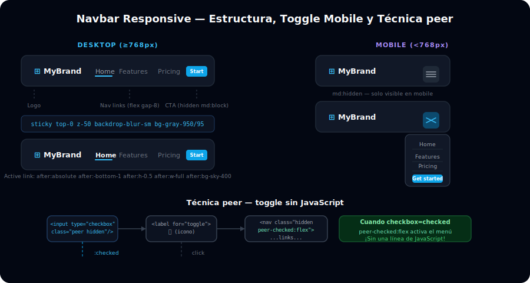

# 🍔 Navbar Responsive en Tailwind

## 🎯 Objetivos

- Construir la estructura semántica de un navbar con `<header>` y `<nav>`
- Aplicar `flex` para el layout horizontal del navbar
- Implementar un menú hamburger funcional con CSS puro usando la técnica `peer`
- Agregar estado activo en links y sticky positioning

---



## 📋 Contenido

### 1. Estructura Base del Navbar

Un navbar siempre usa Flexbox: los elementos se distribuyen en una sola fila horizontal con `justify-between` (logo a la izquierda, links en el centro/derecha, CTA al extremo derecho).

```html
<!-- Estructura básica: header > nav > [logo | links | cta] -->
<header class="sticky top-0 z-50 border-b border-gray-800 bg-gray-950/95 backdrop-blur-sm">
  <nav class="mx-auto flex max-w-7xl items-center justify-between px-6 py-4">

    <!-- Logo -->
    <a href="/" class="flex items-center gap-2 text-xl font-bold text-white">
      <span class="text-sky-400">⊞</span> MyBrand
    </a>

    <!-- Links (ocultos en mobile) -->
    <ul class="hidden items-center gap-8 md:flex">
      <li><a href="#" class="text-sm text-gray-400 transition-colors hover:text-white">Features</a></li>
      <li><a href="#" class="text-sm text-gray-400 transition-colors hover:text-white">Pricing</a></li>
      <li><a href="#" class="text-sm text-gray-400 transition-colors hover:text-white">About</a></li>
    </ul>

    <!-- CTA button (oculto en mobile) -->
    <a href="#" class="hidden rounded-lg bg-sky-500 px-4 py-2 text-sm font-semibold text-white transition-colors hover:bg-sky-400 md:block">
      Get started
    </a>

    <!-- Hamburger (visible solo en mobile) -->
    <!-- (Ver sección 3 para la técnica peer) -->
    <button class="rounded-lg p-2 text-gray-400 hover:bg-gray-800 hover:text-white md:hidden" aria-label="Abrir menú">
      <svg class="h-6 w-6" fill="none" stroke="currentColor" viewBox="0 0 24 24">
        <path stroke-linecap="round" stroke-linejoin="round" stroke-width="2" d="M4 6h16M4 12h16M4 18h16"/>
      </svg>
    </button>

  </nav>
</header>
```

> **Por qué `sticky top-0 z-50`:** mantiene el navbar visible mientras el usuario hace scroll; `z-50` asegura que queda encima del resto del contenido; `backdrop-blur-sm` con fondo semitransparente crea el efecto "frosted glass".

---

### 2. Links con Estado Activo

Usar `aria-current="page"` en el link activo y `aria-current:*` como variante de Tailwind:

```html
<!-- El link activo tiene texto blanco + indicador visual -->
<ul class="hidden items-center gap-8 md:flex">
  <li>
    <a href="/"
       class="text-sm font-medium text-white"
       aria-current="page">
      <!-- Indicador de página actual con underline -->
      <span class="relative after:absolute after:bottom-[-4px] after:left-0 after:h-0.5 after:w-full after:bg-sky-400">
        Home
      </span>
    </a>
  </li>
  <li>
    <a href="/features"
       class="text-sm text-gray-400 transition-colors hover:text-white">
      Features
    </a>
  </li>
  <li>
    <a href="/pricing"
       class="text-sm text-gray-400 transition-colors hover:text-white">
      Pricing
    </a>
  </li>
</ul>
```

---

### 3. Menú Hamburger con `peer` (sin JavaScript)

La técnica usa un `<input type="checkbox">` oculto. Cuando el usuario lo marca (clickea el label), el menú pasa de `hidden` a `flex` usando la variante `peer-checked:`.

```html
<header class="sticky top-0 z-50 border-b border-gray-800 bg-gray-950">
  <nav class="mx-auto max-w-7xl px-6 py-4">

    <!-- Fila principal: logo + hamburger -->
    <div class="flex items-center justify-between">

      <a href="/" class="text-xl font-bold text-white">⊞ MyBrand</a>

      <!-- Grupo hamburger: checkbox + label -->
      <div class="md:hidden">
        <!-- Checkbox oculto: su estado controla el menú via peer -->
        <input
          type="checkbox"
          id="nav-toggle"
          class="peer hidden"
          aria-label="Toggle navegación"
        />
        <!-- Label = botón hamburger -->
        <label for="nav-toggle"
               class="cursor-pointer rounded-lg p-2 text-gray-400 hover:bg-gray-800 hover:text-white"
               aria-label="Abrir menú">
          <svg class="h-6 w-6" fill="none" stroke="currentColor" viewBox="0 0 24 24">
            <path stroke-linecap="round" stroke-linejoin="round" stroke-width="2"
                  d="M4 6h16M4 12h16M4 18h16"/>
          </svg>
        </label>

        <!-- Menú mobile: hidden por defecto, flex cuando peer (checkbox) está checked -->
        <div class="absolute left-0 top-[73px] hidden w-full flex-col gap-2 border-b border-gray-800 bg-gray-950 px-6 py-4 peer-checked:flex">
          <a href="#" class="py-2 text-sm text-gray-400 hover:text-white">Features</a>
          <a href="#" class="py-2 text-sm text-gray-400 hover:text-white">Pricing</a>
          <a href="#" class="py-2 text-sm text-gray-400 hover:text-white">About</a>
          <a href="#" class="mt-2 block rounded-lg bg-sky-500 px-4 py-2 text-center text-sm font-semibold text-white">
            Get started
          </a>
        </div>
      </div>

      <!-- Links desktop (ocultos en mobile) -->
      <ul class="hidden items-center gap-8 md:flex">
        <li><a href="#" class="text-sm text-gray-400 transition-colors hover:text-white">Features</a></li>
        <li><a href="#" class="text-sm text-gray-400 transition-colors hover:text-white">Pricing</a></li>
        <li><a href="#" class="text-sm text-gray-400 transition-colors hover:text-white">About</a></li>
      </ul>
      <a href="#" class="hidden rounded-lg bg-sky-500 px-4 py-2 text-sm font-semibold text-white hover:bg-sky-400 md:block">
        Get started
      </a>

    </div>
  </nav>
</header>
```

> **Cómo funciona `peer`:**
> 1. El `<input class="peer hidden">` es invisible pero mantiene su estado
> 2. El `<div class="hidden peer-checked:flex">` escucha al peer hermano siguiente
> 3. Cuando el checkbox se marca (`checked`), la variante `peer-checked:flex` sobreescribe `hidden`
> 4. Al hacer clic en el `<label>`, el checkbox cambia estado → el menú aparece/desaparece

---

### 4. Variantes de Navbar

```html
<!-- Navbar transparente (sobre hero con imagen) -->
<header class="absolute inset-x-0 top-0 z-50">
  <nav class="mx-auto flex max-w-7xl items-center justify-between px-6 py-6">
    <!-- Solo el logo y links sin fondo -->
    <a href="/" class="text-xl font-bold text-white">⊞ MyBrand</a>
    <!-- ... links ... -->
  </nav>
</header>

<!-- Navbar con submenu horizontal (hover) usando group -->
<li class="group relative">
  <a href="#" class="flex items-center gap-1 text-sm text-gray-400 hover:text-white">
    Products <span class="transition-transform group-hover:rotate-180">▾</span>
  </a>
  <!-- Dropdown: invisible por defecto, visible con group-hover -->
  <div class="invisible absolute top-full left-0 mt-2 w-48 rounded-xl border border-gray-800 bg-gray-900 p-2 opacity-0 shadow-xl transition-all duration-200 group-hover:visible group-hover:opacity-100">
    <a href="#" class="block rounded-lg px-3 py-2 text-sm text-gray-400 hover:bg-gray-800 hover:text-white">Analytics</a>
    <a href="#" class="block rounded-lg px-3 py-2 text-sm text-gray-400 hover:bg-gray-800 hover:text-white">Automation</a>
    <a href="#" class="block rounded-lg px-3 py-2 text-sm text-gray-400 hover:bg-gray-800 hover:text-white">Commerce</a>
  </div>
</li>
```

---

## ✅ Checklist de Verificación

- [ ] El navbar tiene `sticky top-0 z-50` y el fondo correcto
- [ ] En desktop (≥768px) los links son visibles en fila horizontal
- [ ] En mobile (<768px) los links están `hidden` y solo aparece el hamburger
- [ ] El checkbox `peer hidden` está antes del elemento que controla en el DOM
- [ ] El menú mobile usa `peer-checked:flex` para abrirse
- [ ] Los links tienen `transition-colors duration-200` para hover suave
- [ ] El botón hamburger tiene `aria-label` para accesibilidad
