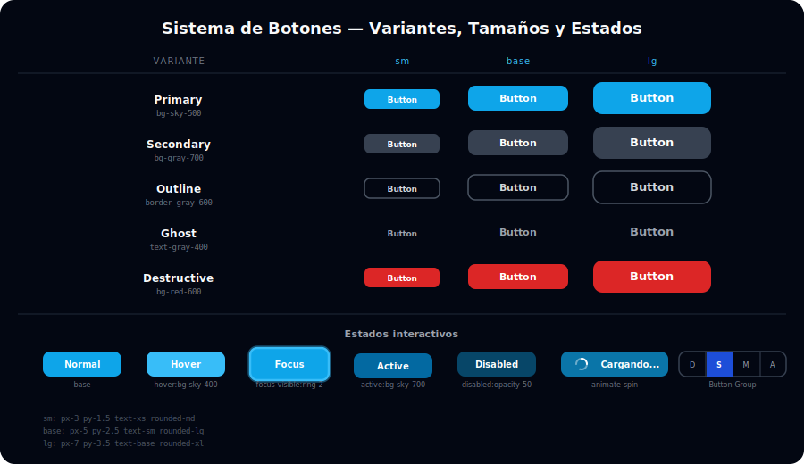

# 🔘 Sistema de Botones en Tailwind

## 🎯 Objetivos

- Diseñar las 5 variantes de botón: primary, secondary, outline, ghost, destructive
- Controlar 3 tamaños: sm, base (md), lg
- Implementar todos los estados: hover, focus-visible, active, disabled, loading
- Garantizar accesibilidad con `focus-visible:ring-2`

---



## 📋 Contenido

### 1. Las 5 Variantes

Cada variante comunica una intención diferente al usuario:

```html
<!-- PRIMARY: acción principal de la página (solo una por sección) -->
<button class="rounded-lg bg-sky-500 px-5 py-2.5 text-sm font-semibold text-white
               transition-colors hover:bg-sky-400
               focus-visible:outline-none focus-visible:ring-2 focus-visible:ring-sky-500 focus-visible:ring-offset-2 focus-visible:ring-offset-gray-950
               active:bg-sky-600
               disabled:opacity-50 disabled:pointer-events-none">
  Guardar cambios
</button>

<!-- SECONDARY: acción secundaria / menos énfasis -->
<button class="rounded-lg bg-gray-800 px-5 py-2.5 text-sm font-semibold text-white
               transition-colors hover:bg-gray-700
               focus-visible:outline-none focus-visible:ring-2 focus-visible:ring-gray-500 focus-visible:ring-offset-2 focus-visible:ring-offset-gray-950
               active:bg-gray-900
               disabled:opacity-50 disabled:pointer-events-none">
  Cancelar
</button>

<!-- OUTLINE: acción secundaria con más presencia visual -->
<button class="rounded-lg border border-gray-600 px-5 py-2.5 text-sm font-semibold text-gray-300
               transition-colors hover:border-gray-400 hover:text-white
               focus-visible:outline-none focus-visible:ring-2 focus-visible:ring-gray-500 focus-visible:ring-offset-2 focus-visible:ring-offset-gray-950
               active:bg-gray-800
               disabled:opacity-50 disabled:pointer-events-none">
  Ver detalles
</button>

<!-- GHOST: acción terciaria, mínimo énfasis visual -->
<button class="rounded-lg px-5 py-2.5 text-sm font-semibold text-gray-400
               transition-colors hover:bg-gray-800 hover:text-white
               focus-visible:outline-none focus-visible:ring-2 focus-visible:ring-gray-500 focus-visible:ring-offset-2 focus-visible:ring-offset-gray-950
               active:bg-gray-900
               disabled:opacity-50 disabled:pointer-events-none">
  Omitir
</button>

<!-- DESTRUCTIVE: acción peligrosa/irreversible (eliminar, cancelar plan) -->
<button class="rounded-lg bg-red-600 px-5 py-2.5 text-sm font-semibold text-white
               transition-colors hover:bg-red-500
               focus-visible:outline-none focus-visible:ring-2 focus-visible:ring-red-500 focus-visible:ring-offset-2 focus-visible:ring-offset-gray-950
               active:bg-red-700
               disabled:opacity-50 disabled:pointer-events-none">
  Eliminar cuenta
</button>
```

> **Por qué `focus-visible:ring-2` y no `focus:ring-2`:** `focus-visible` solo activa el anillo cuando el usuario navega con teclado (Tab), no cuando hace clic con el mouse. Esto mejora la experiencia visual de usuarios con mouse sin sacrificar la accesibilidad de teclado.

---

### 2. Tamaños: sm / base / lg

El tamaño se controla con `px-*`, `py-*` y `text-*`:

```html
<!-- Tamaño SM -->
<button class="rounded-md bg-sky-500 px-3 py-1.5 text-xs font-semibold text-white
               hover:bg-sky-400 transition-colors">
  Small
</button>

<!-- Tamaño BASE (default) -->
<button class="rounded-lg bg-sky-500 px-5 py-2.5 text-sm font-semibold text-white
               hover:bg-sky-400 transition-colors">
  Base
</button>

<!-- Tamaño LG -->
<button class="rounded-xl bg-sky-500 px-7 py-3.5 text-base font-semibold text-white
               hover:bg-sky-400 transition-colors">
  Large
</button>
```

| Tamaño | px | py | text | rounded |
|--------|----|----|------|---------|
| sm | px-3 | py-1.5 | text-xs | rounded-md |
| base | px-5 | py-2.5 | text-sm | rounded-lg |
| lg | px-7 | py-3.5 | text-base | rounded-xl |

---

### 3. Botones con Iconos

```html
<!-- Icono a la izquierda -->
<button class="inline-flex items-center gap-2 rounded-lg bg-sky-500 px-5 py-2.5 text-sm font-semibold text-white hover:bg-sky-400 transition-colors">
  <svg class="h-4 w-4" fill="none" stroke="currentColor" viewBox="0 0 24 24">
    <path stroke-linecap="round" stroke-linejoin="round" stroke-width="2" d="M4 16v1a3 3 0 003 3h10a3 3 0 003-3v-1m-4-8l-4-4m0 0L8 8m4-4v12"/>
  </svg>
  Subir archivo
</button>

<!-- Icono a la derecha -->
<button class="inline-flex items-center gap-2 rounded-lg border border-gray-600 px-5 py-2.5 text-sm font-semibold text-gray-300 hover:border-gray-400 hover:text-white transition-colors">
  Ver más
  <svg class="h-4 w-4" fill="none" stroke="currentColor" viewBox="0 0 24 24">
    <path stroke-linecap="round" stroke-linejoin="round" stroke-width="2" d="M9 5l7 7-7 7"/>
  </svg>
</button>

<!-- Solo icono (icon button) — necesita aria-label -->
<button class="rounded-lg p-2 text-gray-400 hover:bg-gray-800 hover:text-white transition-colors"
        aria-label="Eliminar elemento">
  <svg class="h-5 w-5" fill="none" stroke="currentColor" viewBox="0 0 24 24">
    <path stroke-linecap="round" stroke-linejoin="round" stroke-width="2" d="M6 18L18 6M6 6l12 12"/>
  </svg>
</button>
```

---

### 4. Estado Loading con `animate-spin`

```html
<!-- Botón en estado de carga -->
<button disabled
        class="inline-flex items-center gap-2 rounded-lg bg-sky-500 px-5 py-2.5 text-sm font-semibold text-white
               opacity-75 pointer-events-none">
  <!-- Spinner SVG con animate-spin -->
  <svg class="h-4 w-4 animate-spin" fill="none" viewBox="0 0 24 24">
    <circle class="opacity-25" cx="12" cy="12" r="10" stroke="currentColor" stroke-width="4"/>
    <path class="opacity-75" fill="currentColor" d="M4 12a8 8 0 018-8V0C5.373 0 0 5.373 0 12h4z"/>
  </svg>
  Guardando...
</button>
```

---

### 5. Grupo de Botones (Button Group)

```html
<!-- Grupo de botones con bordes compartidos -->
<div class="inline-flex rounded-lg border border-gray-700 overflow-hidden">
  <button class="px-4 py-2 text-sm text-gray-400 hover:bg-gray-800 hover:text-white transition-colors border-r border-gray-700">
    Día
  </button>
  <button class="px-4 py-2 text-sm bg-sky-600 text-white font-semibold">
    Semana
  </button>
  <button class="px-4 py-2 text-sm text-gray-400 hover:bg-gray-800 hover:text-white transition-colors border-l border-gray-700">
    Mes
  </button>
</div>
```

---

## ✅ Checklist de Verificación

- [ ] Las 5 variantes tienen el color correcto: sky, gris-oscuro, border, transparente, rojo
- [ ] Todos los botones tienen `focus-visible:ring-2` para accesibilidad de teclado
- [ ] El estado `disabled` usa `disabled:opacity-50 disabled:pointer-events-none`
- [ ] Los botones con solo icono tienen `aria-label`
- [ ] `transition-colors duration-200` en todos para evitar cambios bruscos
- [ ] El botón de carga tiene `animate-spin` en el spinner y `disabled` en el elemento
