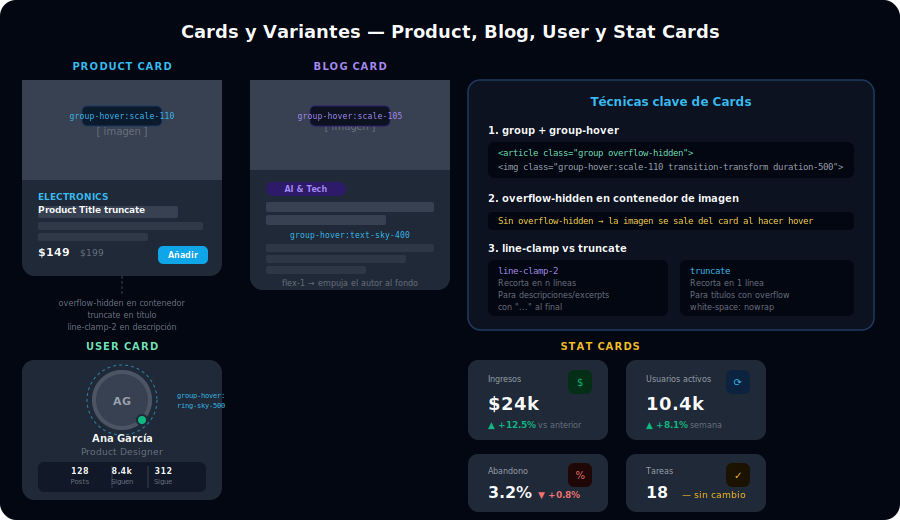

# 🃏 Cards y Variantes en Tailwind

## 🎯 Objetivos

- Construir los 4 tipos de card más comunes en UI modernas
- Usar `group` y `group-hover:*` para efectos coordinados padre-hijo
- Aplicar `overflow-hidden` + `scale` para efectos de zoom en imágenes
- Controlar texto largo con `truncate` y `line-clamp-{n}`

---



## 📋 Contenido

### 1. Product Card

La card de producto tiene imagen, título, precio, descripción corta y CTA. El `group` permite que la imagen escale suavemente cuando el usuario hace hover en la card completa:

```html
<article class="group overflow-hidden rounded-2xl bg-gray-800 transition-shadow duration-300 hover:shadow-xl hover:shadow-black/30">

  <!-- Contenedor de imagen: overflow-hidden impide que scale se salga -->
  <div class="overflow-hidden">
    
  </div>

  <!-- Contenido -->
  <div class="p-5">
    <!-- Categoría / badge -->
    <span class="text-xs font-semibold uppercase tracking-wider text-sky-400">Accesorios</span>

    <!-- Título con truncate para texto largo en 1 línea -->
    <h3 class="mt-1 truncate text-base font-bold text-white">
      Reloj Minimal Premium Edition 2026
    </h3>

    <!-- Descripción con line-clamp-2 para máximo 2 líneas -->
    <p class="mt-2 text-sm text-gray-400 line-clamp-2">
      Diseñado para la persona que valora la simplicidad sin sacrificar la funcionalidad.
      Cristal de zafiro resistente a arañazos.
    </p>

    <!-- Footer: precio + CTA -->
    <div class="mt-4 flex items-center justify-between">
      <p class="text-lg font-bold text-white">
        $149
        <span class="ml-1 text-sm font-normal text-gray-400 line-through">$199</span>
      </p>
      <button class="rounded-lg bg-sky-500 px-4 py-2 text-xs font-semibold text-white transition-colors hover:bg-sky-400">
        Añadir al carrito
      </button>
    </div>
  </div>

</article>
```

---

### 2. Blog Card

La card de blog incluye imagen, categoría badge, título, excerpt y autor:

```html
<article class="group flex flex-col overflow-hidden rounded-2xl bg-gray-800">

  <!-- Imagen con zoom en hover -->
  <div class="overflow-hidden">
    
  </div>

  <div class="flex flex-1 flex-col p-6">
    <!-- Metadata -->
    <div class="flex items-center gap-3">
      <!-- Badge de categoría -->
      <span class="rounded-full bg-violet-500/15 px-3 py-1 text-xs font-semibold text-violet-400">
        IA & Tech
      </span>
      <span class="text-xs text-gray-500">12 min de lectura</span>
    </div>

    <!-- Título: hover cambia color gracias a group -->
    <h3 class="mt-3 text-base font-bold text-white transition-colors group-hover:text-sky-400 line-clamp-2">
      Cómo los modelos de lenguaje están cambiando el desarrollo de software en 2026
    </h3>

    <!-- Excerpt con line-clamp-3 -->
    <p class="mt-2 flex-1 text-sm text-gray-400 line-clamp-3">
      Los LLMs han evolucionado de herrramientas de autocompletado a copilots capaces de
      razonar, planificar y ejecutar tareas complejas de ingeniería de software.
    </p>

    <!-- Autor -->
    <div class="mt-4 flex items-center gap-3 border-t border-gray-700 pt-4">
      <div class="h-8 w-8 shrink-0 rounded-full bg-sky-600 flex items-center justify-center text-xs font-bold text-white">
        MR
      </div>
      <div>
        <p class="text-xs font-semibold text-white">María Ramírez</p>
        <p class="text-xs text-gray-500">28 Mar 2026</p>
      </div>
    </div>
  </div>

</article>
```

---

### 3. User Card

La card de usuario es compacta: avatar prominente, nombre, rol y botón de acción:

```html
<div class="group relative flex flex-col items-center rounded-2xl bg-gray-800 p-6 text-center transition-shadow hover:shadow-xl hover:shadow-black/20">

  <!-- Avatar con ring en hover -->
  <div class="relative">
    <div class="h-20 w-20 overflow-hidden rounded-full ring-4 ring-gray-700 transition-all duration-300 group-hover:ring-sky-500">
      
    </div>
    <!-- Badge de estado online -->
    <span class="absolute bottom-0 right-0 h-5 w-5 rounded-full border-2 border-gray-800 bg-emerald-500"></span>
  </div>

  <!-- Info -->
  <h3 class="mt-4 text-base font-bold text-white">Ana García</h3>
  <p class="mt-1 text-sm text-gray-400">Senior Product Designer</p>

  <!-- Stats -->
  <div class="mt-4 grid w-full grid-cols-3 gap-2 rounded-xl bg-gray-900 p-3">
    <div class="flex flex-col items-center">
      <p class="text-base font-bold text-white">128</p>
      <p class="text-xs text-gray-500">Posts</p>
    </div>
    <div class="flex flex-col items-center border-x border-gray-700">
      <p class="text-base font-bold text-white">8.4k</p>
      <p class="text-xs text-gray-500">Seguidores</p>
    </div>
    <div class="flex flex-col items-center">
      <p class="text-base font-bold text-white">312</p>
      <p class="text-xs text-gray-500">Siguiente</p>
    </div>
  </div>

  <!-- Botón de acción -->
  <button class="mt-4 w-full rounded-xl bg-sky-500 py-2 text-sm font-semibold text-white transition-colors hover:bg-sky-400">
    Seguir
  </button>

</div>
```

---

### 4. Stat Card (Dashboard)

Muestra una métrica principal con icono, cambio respecto al período anterior y mini gráfico visual:

```html
<div class="rounded-2xl bg-gray-800 p-6">

  <!-- Header: label + icono -->
  <div class="flex items-start justify-between">
    <p class="text-sm font-medium text-gray-400">Ingresos totales</p>
    <!-- Icono en contenedor con color de fondo semitransparente -->
    <div class="rounded-xl bg-emerald-500/15 p-2">
      <svg class="h-5 w-5 text-emerald-400" fill="none" stroke="currentColor" viewBox="0 0 24 24">
        <path stroke-linecap="round" stroke-linejoin="round" stroke-width="2" d="M12 8c-1.657 0-3 .895-3 2s1.343 2 3 2 3 .895 3 2-1.343 2-3 2m0-8c1.11 0 2.08.402 2.599 1M12 8V7m0 1v8m0 0v1m0-1c-1.11 0-2.08-.402-2.599-1M21 12a9 9 0 11-18 0 9 9 0 0118 0z"/>
      </svg>
    </div>
  </div>

  <!-- Métrica principal -->
  <p class="mt-4 text-3xl font-extrabold text-white">$24,780</p>

  <!-- Indicador de cambio -->
  <div class="mt-2 flex items-center gap-1.5">
    <!-- Flecha: verde = positivo, rojo = negativo -->
    <span class="flex items-center gap-0.5 text-xs font-semibold text-emerald-400">
      ▲ +12.5%
    </span>
    <span class="text-xs text-gray-500">vs. mes anterior</span>
  </div>

</div>

<!-- Stat negativa (pérdida) -->
<div class="rounded-2xl bg-gray-800 p-6">
  <div class="flex items-start justify-between">
    <p class="text-sm font-medium text-gray-400">Tasa de abandono</p>
    <div class="rounded-xl bg-red-500/15 p-2">
      <svg class="h-5 w-5 text-red-400" fill="none" stroke="currentColor" viewBox="0 0 24 24">
        <path stroke-linecap="round" stroke-linejoin="round" stroke-width="2" d="M17 16l4-4m0 0l-4-4m4 4H7m6 4v1a3 3 0 01-3 3H6a3 3 0 01-3-3V7a3 3 0 013-3h4a3 3 0 013 3v1"/>
      </svg>
    </div>
  </div>
  <p class="mt-4 text-3xl font-extrabold text-white">3.2%</p>
  <div class="mt-2 flex items-center gap-1.5">
    <span class="flex items-center gap-0.5 text-xs font-semibold text-red-400">
      ▼ -0.8%
    </span>
    <span class="text-xs text-gray-500">vs. semana anterior</span>
  </div>
</div>
```

---

## ✅ Checklist de Verificación

- [ ] `group` está en el contenedor padre de la card
- [ ] El contenedor de la imagen tiene `overflow-hidden` para evitar que el `scale` desborde
- [ ] `transition-transform duration-500` en la imagen para zoom suave
- [ ] `line-clamp-2` en descriptions, `truncate` en títulos de una línea
- [ ] Los colores de estado en stat cards usan `bg-emerald-500/15 text-emerald-400` (fondo con opacidad)
- [ ] `flex-1` en la descripción de la blog card para empujar el autor al fondo
