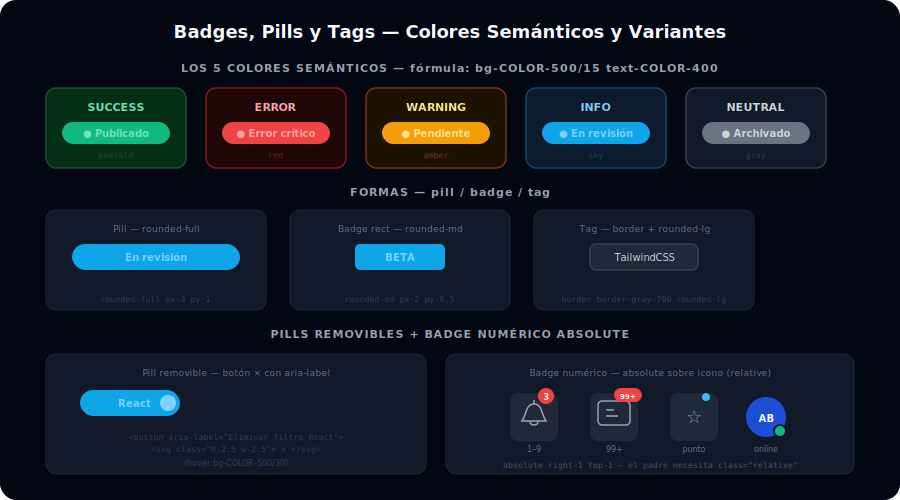

# 🏷️ Badges y Tags en Tailwind

## 🎯 Objetivos

- Diseñar badges con los 5 colores semánticos (success, error, warning, info, neutral)
- Diferenciar visualmente pill, badge rectangular y tag de categoría
- Agregar botón de cierre (×) en pills removibles
- Implementar badge de notificación numérico con `absolute` sobre un icono

---



## 📋 Contenido

### 1. Los 5 Colores Semánticos

Cada color comunica un estado diferente al usuario. La fórmula para tema oscuro es `bg-COLOR-500/15 text-COLOR-400`:

```html
<!-- SUCCESS: operación completada, activo, disponible -->
<span class="inline-flex items-center rounded-full bg-emerald-500/15 px-3 py-1 text-xs font-semibold text-emerald-400">
  ✓ Publicado
</span>

<!-- ERROR / DESTRUCTIVE: error, peligro, eliminado -->
<span class="inline-flex items-center rounded-full bg-red-500/15 px-3 py-1 text-xs font-semibold text-red-400">
  ✕ Error
</span>

<!-- WARNING: advertencia, pendiente, atención requerida -->
<span class="inline-flex items-center rounded-full bg-amber-500/15 px-3 py-1 text-xs font-semibold text-amber-400">
  ⚠ Pendiente
</span>

<!-- INFO: información neutral, en proceso, nuevo -->
<span class="inline-flex items-center rounded-full bg-sky-500/15 px-3 py-1 text-xs font-semibold text-sky-400">
  ℹ En revisión
</span>

<!-- NEUTRAL: desactivado, archivado, secundario -->
<span class="inline-flex items-center rounded-full bg-gray-500/15 px-3 py-1 text-xs font-semibold text-gray-400">
  Archivado
</span>
```

> **La fórmula `/15`:** `bg-emerald-500/15` es la utilidad de opacidad de Tailwind. El `/15` aplica 15% de opacidad al fondo, creando ese efecto suave de "tint" que es característico de los badges modernos sin ser demasiado pesado visualmente.

---

### 2. Variantes de Forma

```html
<!-- PILL (totalmente redondo) — para estados y categorías -->
<span class="inline-flex items-center rounded-full bg-sky-500/15 px-3 py-1 text-xs font-semibold text-sky-400">
  Pro
</span>

<!-- BADGE RECTANGULAR (bordes medios) — para labels y etiquetas -->
<span class="inline-flex items-center rounded-md bg-sky-500/15 px-2 py-0.5 text-xs font-semibold text-sky-400">
  NEW
</span>

<!-- TAG (con borde explícito) — para categorías y filtros -->
<span class="inline-flex items-center rounded-lg border border-gray-700 bg-gray-800 px-3 py-1 text-xs text-gray-300 hover:border-gray-500 hover:text-white transition-colors cursor-pointer">
  TailwindCSS
</span>
```

---

### 3. Pills con Botón de Cierre

Útiles en filtros activos y chips de selección múltiple:

```html
<!-- Pill removible -->
<span class="inline-flex items-center gap-1.5 rounded-full bg-sky-500/15 pl-3 pr-1.5 py-1 text-xs font-semibold text-sky-400">
  React
  <!-- Botón de cierre: pequeño, accesible, con hover que lo oscurece -->
  <button
    class="flex h-4 w-4 items-center justify-center rounded-full text-sky-400 hover:bg-sky-500/30 transition-colors"
    aria-label="Eliminar filtro React"
  >
    <svg class="h-2.5 w-2.5" fill="none" stroke="currentColor" viewBox="0 0 24 24">
      <path stroke-linecap="round" stroke-linejoin="round" stroke-width="2.5" d="M6 18L18 6M6 6l12 12"/>
    </svg>
  </button>
</span>

<!-- Fila de pills de filtros activos -->
<div class="flex flex-wrap gap-2">
  <span class="inline-flex items-center gap-1.5 rounded-full bg-violet-500/15 pl-3 pr-1.5 py-1 text-xs font-semibold text-violet-400">
    JavaScript
    <button class="flex h-4 w-4 items-center justify-center rounded-full hover:bg-violet-500/30 transition-colors" aria-label="Eliminar JavaScript">✕</button>
  </span>
  <span class="inline-flex items-center gap-1.5 rounded-full bg-sky-500/15 pl-3 pr-1.5 py-1 text-xs font-semibold text-sky-400">
    React
    <button class="flex h-4 w-4 items-center justify-center rounded-full hover:bg-sky-500/30 transition-colors" aria-label="Eliminar React">✕</button>
  </span>
  <span class="inline-flex items-center gap-1.5 rounded-full bg-emerald-500/15 pl-3 pr-1.5 py-1 text-xs font-semibold text-emerald-400">
    Node.js
    <button class="flex h-4 w-4 items-center justify-center rounded-full hover:bg-emerald-500/30 transition-colors" aria-label="Eliminar Node.js">✕</button>
  </span>
</div>
```

---

### 4. Badge de Notificación Numérico

Se superpone sobre un icono con `relative` en el padre y `absolute` en el badge:

```html
<!-- Badge de notificación sobre icono de campana -->
<button class="relative rounded-lg p-2 text-gray-400 hover:bg-gray-800 hover:text-white transition-colors"
        aria-label="Notificaciones (3 sin leer)">
  <!-- Icono -->
  <svg class="h-6 w-6" fill="none" stroke="currentColor" viewBox="0 0 24 24">
    <path stroke-linecap="round" stroke-linejoin="round" stroke-width="2"
          d="M15 17h5l-1.405-1.405A2.032 2.032 0 0118 14.158V11a6.002 6.002 0 00-4-5.659V5a2 2 0 10-4 0v.341C7.67 6.165 6 8.388 6 11v3.159c0 .538-.214 1.055-.595 1.436L4 17h5m6 0v1a3 3 0 11-6 0v-1m6 0H9"/>
  </svg>
  <!-- Badge numérico: absolute, esquina superior derecha -->
  <span class="absolute right-1 top-1 flex h-4 w-4 items-center justify-center rounded-full bg-red-500 text-[10px] font-bold text-white">
    3
  </span>
</button>

<!-- Badge > 99 → mostrar "99+" -->
<button class="relative rounded-lg p-2 text-gray-400 hover:bg-gray-800 transition-colors" aria-label="Mensajes (127 sin leer)">
  <svg class="h-6 w-6" fill="none" stroke="currentColor" viewBox="0 0 24 24">
    <path stroke-linecap="round" stroke-linejoin="round" stroke-width="2"
          d="M8 10h.01M12 10h.01M16 10h.01M9 16H5a2 2 0 01-2-2V6a2 2 0 012-2h14a2 2 0 012 2v8a2 2 0 01-2 2h-5l-5 5v-5z"/>
  </svg>
  <span class="absolute right-0 top-0 flex h-5 w-auto min-w-5 items-center justify-center rounded-full bg-red-500 px-1 text-[9px] font-bold text-white">
    99+
  </span>
</button>
```

---

### 5. Badges dentro de Tablas y Listas

```html
<!-- En tabla de usuarios: badge de rol -->
<tr class="border-b border-gray-800">
  <td class="px-4 py-3 text-sm text-white">Ana García</td>
  <td class="px-4 py-3">
    <span class="rounded-full bg-sky-500/15 px-2.5 py-0.5 text-xs font-semibold text-sky-400">Admin</span>
  </td>
  <td class="px-4 py-3">
    <span class="rounded-full bg-emerald-500/15 px-2.5 py-0.5 text-xs font-semibold text-emerald-400">Activo</span>
  </td>
</tr>

<!-- En lista de tareas: badge de prioridad -->
<li class="flex items-center justify-between rounded-lg bg-gray-800 px-4 py-3">
  <span class="text-sm text-white">Revisar pull request #42</span>
  <span class="rounded-md bg-red-500/15 px-2 py-0.5 text-xs font-semibold text-red-400">Alta</span>
</li>
```

---

## ✅ Checklist de Verificación

- [ ] La fórmula `bg-COLOR-500/15 text-COLOR-400` se usa en todos los badges
- [ ] Cada color corresponde a su semántica: verde=success, rojo=error, amarillo=warning, azul=info, gris=neutral
- [ ] Los pills removibles tienen botón con `aria-label` describiendo qué se elimina
- [ ] Los badges numéricos usan `absolute` con el padre en `relative`
- [ ] Se usa `inline-flex items-center` para centrar el contenido del badge verticalmente
