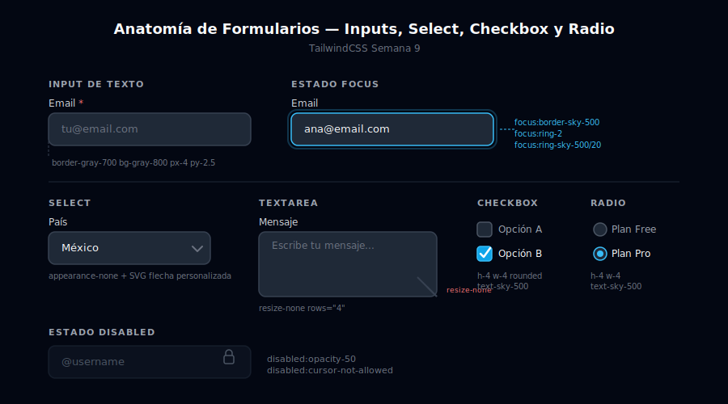

# Formularios con TailwindCSS

## 🎯 Objetivos

- Estilizar los 6 tipos de input de HTML con Tailwind
- Crear una anatomía consistente de campo de formulario: label → input → hint/error
- Aplicar estados visuales: default, focus, disabled, read-only
- Construir checkboxes, radios y selects accesibles

---



---

## 1. Anatomía de un campo de formulario

Todo campo de formulario bien construido tiene tres partes:

```html
<!-- 1. Label: describe el campo — siempre vinculado con for/id -->
<label for="email" class="block text-sm font-medium text-gray-300">
  Email <span class="text-red-400">*</span>
</label>

<!-- 2. Input: el campo en sí -->
<input
  type="email"
  id="email"
  name="email"
  placeholder="tu@email.com"
  class="mt-1.5 block w-full rounded-lg border border-gray-700 bg-gray-800
         px-4 py-2.5 text-sm text-white placeholder:text-gray-500
         focus:border-sky-500 focus:outline-none focus:ring-2 focus:ring-sky-500/20
         transition-colors"
/>

<!-- 3. Hint/Error: texto auxiliar o mensaje de error -->
<p class="mt-1.5 text-xs text-gray-500">Recibirás el enlace de confirmación aquí.</p>
```

### Clases esenciales del input

| Grupo | Clases | Propósito |
|-------|--------|-----------|
| Layout | `block w-full` | Ocupa todo el ancho disponible |
| Shape | `rounded-lg` | Bordes redondeados |
| Border | `border border-gray-700` | Borde visible en reposo |
| Background | `bg-gray-800` | Fondo oscuro del input |
| Spacing | `px-4 py-2.5` | Padding interior cómodo |
| Typography | `text-sm text-white` | Tamaño y color del texto ingresado |
| Placeholder | `placeholder:text-gray-500` | Color del texto de placeholder |
| Focus | `focus:border-sky-500 focus:outline-none focus:ring-2 focus:ring-sky-500/20` | Ring de enfoque accesible |
| Transition | `transition-colors` | Suaviza el cambio de color en focus |

---

## 2. Text inputs

```html
<!-- Input de texto básico -->
<div class="space-y-1.5">
  <label for="name" class="block text-sm font-medium text-gray-300">
    Nombre completo
  </label>
  <input
    type="text"
    id="name"
    name="name"
    placeholder="Ana García"
    autocomplete="name"
    class="block w-full rounded-lg border border-gray-700 bg-gray-800
           px-4 py-2.5 text-sm text-white placeholder:text-gray-500
           focus:border-sky-500 focus:outline-none focus:ring-2 focus:ring-sky-500/20
           transition-colors"
  />
</div>

<!-- Input con icono interior (izquierda) -->
<div class="space-y-1.5">
  <label for="search" class="block text-sm font-medium text-gray-300">Buscar</label>
  <div class="relative">
    <!-- Icono posicionado absolute dentro del input container -->
    <div class="pointer-events-none absolute inset-y-0 left-0 flex items-center pl-3">
      <svg class="h-4 w-4 text-gray-500" fill="none" stroke="currentColor" viewBox="0 0 24 24">
        <path stroke-linecap="round" stroke-linejoin="round" stroke-width="2" d="M21 21l-6-6m2-5a7 7 0 11-14 0 7 7 0 0114 0"/>
      </svg>
    </div>
    <!-- pl-10 hace espacio para el icono -->
    <input
      type="search"
      id="search"
      name="search"
      placeholder="Buscar componentes..."
      class="block w-full rounded-lg border border-gray-700 bg-gray-800
             py-2.5 pl-10 pr-4 text-sm text-white placeholder:text-gray-500
             focus:border-sky-500 focus:outline-none focus:ring-2 focus:ring-sky-500/20
             transition-colors"
    />
  </div>
</div>

<!-- Input disabled -->
<div class="space-y-1.5">
  <label for="username-disabled" class="block text-sm font-medium text-gray-300">
    Usuario (no editable)
  </label>
  <input
    type="text"
    id="username-disabled"
    value="@ana.garcia"
    disabled
    class="block w-full rounded-lg border border-gray-700 bg-gray-800/50
           px-4 py-2.5 text-sm text-gray-500
           disabled:cursor-not-allowed disabled:opacity-50"
  />
</div>
```

---

## 3. Textarea

```html
<div class="space-y-1.5">
  <label for="message" class="block text-sm font-medium text-gray-300">
    Mensaje <span class="text-red-400">*</span>
  </label>
  <!-- rows controla la altura inicial; resize-none evita que el usuario la redimensione -->
  <textarea
    id="message"
    name="message"
    rows="4"
    placeholder="Describe tu consulta..."
    class="block w-full resize-none rounded-lg border border-gray-700 bg-gray-800
           px-4 py-3 text-sm text-white placeholder:text-gray-500
           focus:border-sky-500 focus:outline-none focus:ring-2 focus:ring-sky-500/20
           transition-colors"
  ></textarea>
  <p class="text-xs text-gray-500">Máximo 500 caracteres.</p>
</div>
```

---

## 4. Select

```html
<div class="space-y-1.5">
  <label for="country" class="block text-sm font-medium text-gray-300">País</label>
  <!-- El select nativo con Tailwind necesita el icono de flecha reemplazado -->
  <div class="relative">
    <select
      id="country"
      name="country"
      class="block w-full appearance-none rounded-lg border border-gray-700 bg-gray-800
             py-2.5 pl-4 pr-10 text-sm text-white
             focus:border-sky-500 focus:outline-none focus:ring-2 focus:ring-sky-500/20
             transition-colors"
    >
      <option value="" class="bg-gray-800 text-gray-500">Selecciona un país</option>
      <option value="mx" class="bg-gray-800">México</option>
      <option value="es" class="bg-gray-800">España</option>
      <option value="ar" class="bg-gray-800">Argentina</option>
    </select>
    <!-- Ícono de flecha personalizado (appearance-none oculta el nativo) -->
    <div class="pointer-events-none absolute inset-y-0 right-0 flex items-center pr-3">
      <svg class="h-4 w-4 text-gray-500" fill="none" stroke="currentColor" viewBox="0 0 24 24">
        <path stroke-linecap="round" stroke-linejoin="round" stroke-width="2" d="M19 9l-7 7-7-7"/>
      </svg>
    </div>
  </div>
</div>
```

---

## 5. Checkbox y Radio

```html
<!-- Checkbox individual -->
<label class="flex cursor-pointer items-center gap-3">
  <input
    type="checkbox"
    name="terms"
    class="h-4 w-4 rounded border-gray-600 bg-gray-800 text-sky-500
           focus:ring-2 focus:ring-sky-500 focus:ring-offset-2 focus:ring-offset-gray-900"
  />
  <span class="text-sm text-gray-300">
    Acepto los <a href="#" class="text-sky-400 hover:text-sky-300 underline">términos</a>
  </span>
</label>

<!-- Grupo de checkboxes con fieldset -->
<fieldset class="space-y-3">
  <legend class="text-sm font-medium text-gray-300">Notificaciones</legend>
  <label class="flex cursor-pointer items-center gap-3">
    <input type="checkbox" name="notify-email" checked
      class="h-4 w-4 rounded border-gray-600 bg-gray-800 text-sky-500
             focus:ring-2 focus:ring-sky-500 focus:ring-offset-2 focus:ring-offset-gray-900"/>
    <span class="text-sm text-gray-300">Email</span>
  </label>
  <label class="flex cursor-pointer items-center gap-3">
    <input type="checkbox" name="notify-sms"
      class="h-4 w-4 rounded border-gray-600 bg-gray-800 text-sky-500
             focus:ring-2 focus:ring-sky-500 focus:ring-offset-2 focus:ring-offset-gray-900"/>
    <span class="text-sm text-gray-300">SMS</span>
  </label>
</fieldset>

<!-- Grupo de radios -->
<fieldset class="space-y-3">
  <legend class="text-sm font-medium text-gray-300">Plan</legend>
  <label class="flex cursor-pointer items-center gap-3">
    <input type="radio" name="plan" value="free"
      class="h-4 w-4 border-gray-600 bg-gray-800 text-sky-500
             focus:ring-2 focus:ring-sky-500 focus:ring-offset-2 focus:ring-offset-gray-900"/>
    <span class="text-sm text-gray-300">Free</span>
  </label>
  <label class="flex cursor-pointer items-center gap-3">
    <input type="radio" name="plan" value="pro" checked
      class="h-4 w-4 border-gray-600 bg-gray-800 text-sky-500
             focus:ring-2 focus:ring-sky-500 focus:ring-offset-2 focus:ring-offset-gray-900"/>
    <span class="text-sm text-gray-300">Pro <span class="text-xs text-sky-400 ml-1">Recomendado</span></span>
  </label>
</fieldset>
```

---

## 6. Form groups y layout

```html
<!-- Grid de 2 columnas en desktop -->
<form class="space-y-6">
  <div class="grid grid-cols-1 gap-x-6 gap-y-5 sm:grid-cols-2">
    <div class="space-y-1.5">
      <label for="fname" class="block text-sm font-medium text-gray-300">Nombre</label>
      <input type="text" id="fname" name="fname"
        class="block w-full rounded-lg border border-gray-700 bg-gray-800 px-4 py-2.5 text-sm text-white
               placeholder:text-gray-500 focus:border-sky-500 focus:outline-none focus:ring-2 focus:ring-sky-500/20 transition-colors"/>
    </div>
    <div class="space-y-1.5">
      <label for="lname" class="block text-sm font-medium text-gray-300">Apellido</label>
      <input type="text" id="lname" name="lname"
        class="block w-full rounded-lg border border-gray-700 bg-gray-800 px-4 py-2.5 text-sm text-white
               placeholder:text-gray-500 focus:border-sky-500 focus:outline-none focus:ring-2 focus:ring-sky-500/20 transition-colors"/>
    </div>
    <!-- Campo full-width en grid de 2 columnas -->
    <div class="space-y-1.5 sm:col-span-2">
      <label for="bio" class="block text-sm font-medium text-gray-300">Bio</label>
      <textarea id="bio" name="bio" rows="3"
        class="block w-full resize-none rounded-lg border border-gray-700 bg-gray-800 px-4 py-3 text-sm text-white
               placeholder:text-gray-500 focus:border-sky-500 focus:outline-none focus:ring-2 focus:ring-sky-500/20 transition-colors">
      </textarea>
    </div>
  </div>
  <!-- Submit actions -->
  <div class="flex items-center justify-end gap-3 border-t border-gray-800 pt-6">
    <button type="button" class="rounded-lg px-5 py-2.5 text-sm font-semibold text-gray-400 hover:text-white transition-colors">
      Cancelar
    </button>
    <button type="submit" class="rounded-lg bg-sky-500 px-5 py-2.5 text-sm font-semibold text-white hover:bg-sky-400 transition-colors
                                  focus-visible:outline-none focus-visible:ring-2 focus-visible:ring-sky-500 focus-visible:ring-offset-2 focus-visible:ring-offset-gray-900">
      Guardar cambios
    </button>
  </div>
</form>
```

---

## ✅ Checklist de verificación

- [ ] Cada `<input>` tiene su `<label>` con `for` apuntando al `id` del input
- [ ] `placeholder:text-gray-500` (no `text-gray-500` directamente en el input)
- [ ] `focus:outline-none focus:ring-2` — nunca quitar el outline sin reemplazarlo
- [ ] `disabled:cursor-not-allowed disabled:opacity-50` en campos deshabilitados
- [ ] `appearance-none` en selects para quitar el estilo nativo del browser
- [ ] Textarea tiene `resize-none` si no quieres que el usuario cambie el tamaño
- [ ] `fieldset` + `legend` en grupos de checkboxes/radios

---

## 📚 Recursos

- [MDN: `<input>`](https://developer.mozilla.org/en-US/docs/Web/HTML/Element/input)
- [TailwindCSS: Placeholder Color](https://tailwindcss.com/docs/placeholder-color)
- [TailwindCSS: Ring Width](https://tailwindcss.com/docs/ring-width)
