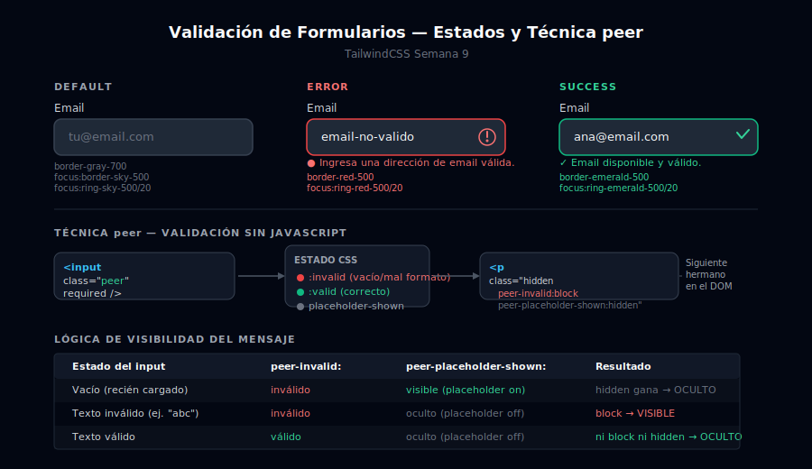

# Validación y Estados de Formularios

## 🎯 Objetivos

- Implementar los estados de validación: error, success y warning en campos
- Usar la técnica `peer` de Tailwind para mostrar errores sin JavaScript
- Agregar iconos de validación dentro de los inputs
- Aplicar `aria-describedby` para mensajes de error accesibles

---



---

## 1. Los tres estados de validación

Cada campo de formulario puede estar en uno de estos estados:

| Estado | Color | Caso de uso |
|--------|-------|-------------|
| **Error** | `red` | Campo inválido o vacío requerido |
| **Success** | `emerald` | Campo validado correctamente |
| **Warning** | `amber` | Campo con advertencia (email ya registrado, contraseña débil) |
| **Default** | `gray` | Estado neutro de reposo |
| **Focus** | `sky` | Input activo con cursor |

---

## 2. Estados aplicados manualmente (sin JavaScript real)

La forma más directa de mostrar estados es aplicar clases CSS diferentes:

```html
<!-- DEFAULT: estado neutro -->
<input class="block w-full rounded-lg border border-gray-700 bg-gray-800
              px-4 py-2.5 text-sm text-white placeholder:text-gray-500
              focus:border-sky-500 focus:outline-none focus:ring-2 focus:ring-sky-500/20 transition-colors"/>

<!-- ERROR: borde y ring rojos -->
<div class="space-y-1.5">
  <label for="email-error" class="block text-sm font-medium text-gray-300">Email</label>
  <div class="relative">
    <input
      type="email"
      id="email-error"
      value="email-invalido"
      aria-describedby="email-error-msg"
      aria-invalid="true"
      class="block w-full rounded-lg border border-red-500 bg-gray-800
             px-4 py-2.5 pr-10 text-sm text-white
             focus:border-red-500 focus:outline-none focus:ring-2 focus:ring-red-500/20
             transition-colors"
    />
    <!-- Icono de error absolute a la derecha -->
    <div class="pointer-events-none absolute inset-y-0 right-0 flex items-center pr-3">
      <svg class="h-5 w-5 text-red-400" fill="none" stroke="currentColor" viewBox="0 0 24 24">
        <path stroke-linecap="round" stroke-linejoin="round" stroke-width="2" d="M12 8v4m0 4h.01M21 12a9 9 0 11-18 0 9 9 0 0118 0"/>
      </svg>
    </div>
  </div>
  <!-- Mensaje de error vinculado con aria-describedby -->
  <p id="email-error-msg" class="flex items-center gap-1.5 text-xs text-red-400">
    <svg class="h-3.5 w-3.5 shrink-0" fill="currentColor" viewBox="0 0 20 20">
      <path fill-rule="evenodd" d="M18 10a8 8 0 11-16 0 8 8 0 0116 0zm-7 4a1 1 0 11-2 0 1 1 0 012 0zm-1-9a1 1 0 00-1 1v4a1 1 0 102 0V6a1 1 0 00-1-1z" clip-rule="evenodd"/>
    </svg>
    Ingresa una dirección de email válida.
  </p>
</div>

<!-- SUCCESS: borde y ring verdes -->
<div class="space-y-1.5">
  <label for="email-ok" class="block text-sm font-medium text-gray-300">Email</label>
  <div class="relative">
    <input
      type="email"
      id="email-ok"
      value="ana@email.com"
      aria-describedby="email-ok-msg"
      class="block w-full rounded-lg border border-emerald-500 bg-gray-800
             px-4 py-2.5 pr-10 text-sm text-white
             focus:border-emerald-500 focus:outline-none focus:ring-2 focus:ring-emerald-500/20
             transition-colors"
    />
    <div class="pointer-events-none absolute inset-y-0 right-0 flex items-center pr-3">
      <svg class="h-5 w-5 text-emerald-400" fill="none" stroke="currentColor" viewBox="0 0 24 24">
        <path stroke-linecap="round" stroke-linejoin="round" stroke-width="2" d="M5 13l4 4L19 7"/>
      </svg>
    </div>
  </div>
  <p id="email-ok-msg" class="flex items-center gap-1.5 text-xs text-emerald-400">
    <svg class="h-3.5 w-3.5 shrink-0" fill="currentColor" viewBox="0 0 20 20">
      <path fill-rule="evenodd" d="M10 18a8 8 0 100-16 8 8 0 000 16zm3.707-9.293a1 1 0 00-1.414-1.414L9 10.586 7.707 9.293a1 1 0 00-1.414 1.414l2 2a1 1 0 001.414 0l4-4z" clip-rule="evenodd"/>
    </svg>
    Email disponible y válido.
  </p>
</div>
```

---

## 3. Validación con `peer` (sin JavaScript)

La técnica `peer` aprovecha las pseudo-clases CSS `:invalid`, `:valid`, `:placeholder-shown`:

```html
<!-- El input debe tener la clase "peer" -->
<!-- "required" activa la validación HTML nativa -->
<!-- "placeholder-shown" indica que el campo está vacío (no se ha tocado) -->

<div class="space-y-1.5">
  <label for="email-peer" class="block text-sm font-medium text-gray-300">
    Email <span class="text-red-400">*</span>
  </label>

  <!-- peer + required = herramienta principal -->
  <input
    type="email"
    id="email-peer"
    name="email"
    placeholder="tu@email.com"
    required
    class="peer block w-full rounded-lg border border-gray-700 bg-gray-800
           px-4 py-2.5 text-sm text-white placeholder:text-gray-500
           focus:border-sky-500 focus:outline-none focus:ring-2 focus:ring-sky-500/20
           invalid:border-red-500 invalid:focus:border-red-500 invalid:focus:ring-red-500/20
           transition-colors"
  />

  <!-- Mensaje de error:
       - hidden = por defecto
       - peer-invalid:block = se muestra cuando el input es inválido
       - peer-placeholder-shown:hidden = se oculta mientras el placeholder es visible
         (así no se muestra antes de que el usuario haya tocado el campo)
  -->
  <p class="mt-1 hidden text-xs text-red-400 peer-invalid:block peer-placeholder-shown:hidden">
    Ingresa una dirección de email válida.
  </p>
</div>
```

> ⚠️ **Orden importa en el DOM**: El elemento `peer-*` debe estar **después** del elemento marcado como `peer` en el HTML, porque CSS solo puede seleccionar siblings posteriores (+/~).

### Lógica de la combinación `peer-invalid:block peer-placeholder-shown:hidden`

| Estado del input | `peer-invalid:` | `peer-placeholder-shown:` | Resultado |
|-----------------|-----------------|--------------------------|-----------|
| Vacío (recién cargado) | inválido (required vacío) | sí visible | `hidden` gana → **oculto** |
| Tiene texto inválido | inválido | placeholder oculto | `block` → **visible** |
| Tiene texto válido | válido | placeholder oculto | ni `block` ni `hidden` → **oculto** |

---

## 4. Validación de contraseña con campo de confirmación

```html
<div class="space-y-5">
  <!-- Password -->
  <div class="space-y-1.5">
    <label for="password" class="block text-sm font-medium text-gray-300">Contraseña</label>
    <input
      type="password"
      id="password"
      name="password"
      placeholder="Mínimo 8 caracteres"
      minlength="8"
      required
      class="peer block w-full rounded-lg border border-gray-700 bg-gray-800
             px-4 py-2.5 text-sm text-white placeholder:text-gray-500
             focus:border-sky-500 focus:outline-none focus:ring-2 focus:ring-sky-500/20
             invalid:border-red-500 invalid:focus:border-red-500 invalid:focus:ring-red-500/20
             transition-colors"
    />
    <p class="hidden text-xs text-red-400 peer-invalid:block peer-placeholder-shown:hidden">
      La contraseña debe tener al menos 8 caracteres.
    </p>
  </div>

  <!-- Strength indicator (CSS-only usando peer) -->
  <div class="h-1.5 w-full overflow-hidden rounded-full bg-gray-700">
    <!-- La barra se llena con CSS en función de la longitud del valor -->
    <!-- En este ejemplo estático simulamos 3 niveles -->
    <div class="h-full w-1/3 rounded-full bg-red-500 transition-all duration-300"></div>
    <!-- w-2/3 → amber -->
    <!-- w-full → emerald -->
  </div>
  <p class="text-xs text-red-400">Contraseña débil</p>
</div>
```

---

## 5. Validación por campo con clases condicionales (para JavaScript dinámico)

Cuando usas JavaScript puedes añadir/quitar estas clases programáticamente:

```html
<!-- Clase de error aplicada dinámicamente con JS -->
<input
  class="block w-full rounded-lg border bg-gray-800 px-4 py-2.5 text-sm text-white
         placeholder:text-gray-500 focus:outline-none focus:ring-2 transition-colors
         /* ESTADO ERROR: añadir estas clases */
         border-red-500 focus:border-red-500 focus:ring-red-500/20
         /* ESTADO SUCCESS: cambiar por estas */
         /* border-emerald-500 focus:border-emerald-500 focus:ring-emerald-500/20 */
         /* ESTADO DEFAULT */
         /* border-gray-700 focus:border-sky-500 focus:ring-sky-500/20 */"
/>
```

---

## ✅ Checklist de verificación

- [ ] `aria-invalid="true"` en inputs con error
- [ ] `aria-describedby` apuntando al `id` del mensaje de error
- [ ] Mensajes de error visibles siempre tienen al menos 4.5:1 de contraste
- [ ] La técnica `peer` requiere que el mensaje sea hermano **posterior** al input
- [ ] `peer-placeholder-shown:hidden` evita mensajes prematuros
- [ ] Icono de error/éxito siempre acompañado de texto (no solo color)

---

## 📚 Recursos

- [TailwindCSS Docs: Styling based on sibling state (peer)](https://tailwindcss.com/docs/hover-focus-and-other-states#styling-based-on-sibling-state)
- [MDN: Constraint Validation API](https://developer.mozilla.org/en-US/docs/Web/HTML/Constraint_validation)
- [WCAG: Error Identification](https://www.w3.org/WAI/WCAG21/Understanding/error-identification.html)
