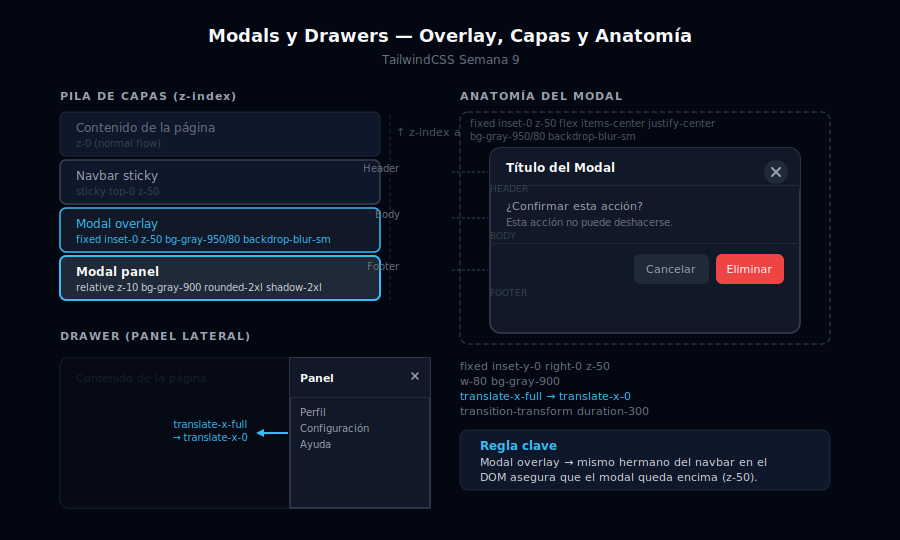

# Modals y Drawers

## 🎯 Objetivos

- Construir un overlay que cubre 100vw × 100vh con `fixed inset-0`
- Centrar el contenido del modal con `flex items-center justify-center`
- Aplicar `backdrop-blur-sm` para el efecto glassmorphism en el fondo
- Gestionar capas con `z-index` para que el modal esté siempre encima
- Construir un drawer (panel lateral) como variante de modal

---



---

## 1. Anatomía de un modal

Un modal tiene tres partes:

```
┌─────────────────────────────────────────────────────┐
│ OVERLAY (fixed inset-0 z-50)                        │
│ bg-gray-950/80 backdrop-blur-sm                     │
│                                                     │
│   ┌─────────────────────────────────────────────┐  │
│   │ CONTENEDOR (relative z-50                   │  │
│   │  bg-gray-900 rounded-2xl shadow-2xl         │  │
│   │  max-w-lg w-full max-h-[90vh] overflow-auto │  │
│   │                                             │  │
│   │  ┌──────────┐ Header + botón cerrar         │  │
│   │  │  HEADER  │                               │  │
│   │  ├──────────┤                               │  │
│   │  │  BODY    │ Contenido del modal           │  │
│   │  ├──────────┤                               │  │
│   │  │  FOOTER  │ Botones de acción             │  │
│   │  └──────────┘                               │  │
│   └─────────────────────────────────────────────┘  │
└─────────────────────────────────────────────────────┘
```

---

## 2. Modal con la técnica `peer` (sin JavaScript)

```html
<!-- El checkbox "peer" controla la visibilidad del modal -->
<input type="checkbox" id="modal-toggle" class="peer hidden" />

<!-- BOTÓN que abre el modal (activa el checkbox) -->
<label
  for="modal-toggle"
  class="cursor-pointer inline-flex items-center gap-2 rounded-lg bg-sky-500 px-5 py-2.5
         text-sm font-semibold text-white hover:bg-sky-400 transition-colors"
>
  Abrir modal
</label>

<!-- OVERLAY: hidden por defecto, flex cuando peer está checked
     - fixed inset-0: cubre toda la pantalla
     - z-50: por encima de todo el contenido
     - bg-gray-950/80: fondo semitransparente
     - backdrop-blur-sm: desenfoca el contenido detrás
-->
<div class="fixed inset-0 z-50 hidden items-center justify-center
            bg-gray-950/80 backdrop-blur-sm
            peer-checked:flex">

  <!-- Clic en el overlay cierra el modal (label apunta al mismo checkbox) -->
  <label for="modal-toggle" class="absolute inset-0 cursor-pointer" aria-label="Cerrar modal"></label>

  <!-- CONTENIDO DEL MODAL: por encima del overlay label (z-10) -->
  <div class="relative z-10 mx-4 w-full max-w-lg overflow-hidden rounded-2xl
              bg-gray-900 shadow-2xl ring-1 ring-gray-800">

    <!-- Header -->
    <div class="flex items-center justify-between border-b border-gray-800 px-6 py-4">
      <h2 class="text-base font-semibold text-white">Confirmar acción</h2>
      <!-- Botón cerrar (label = es como press en el checkbox) -->
      <label
        for="modal-toggle"
        class="cursor-pointer rounded-lg p-1.5 text-gray-400
               hover:bg-gray-800 hover:text-white transition-colors"
        aria-label="Cerrar modal"
      >
        <svg class="h-5 w-5" fill="none" stroke="currentColor" viewBox="0 0 24 24">
          <path stroke-linecap="round" stroke-linejoin="round" stroke-width="2" d="M6 18L18 6M6 6l12 12"/>
        </svg>
      </label>
    </div>

    <!-- Body -->
    <div class="px-6 py-5">
      <p class="text-sm text-gray-400">
        ¿Estás seguro de que deseas eliminar este elemento? Esta acción no se puede deshacer.
      </p>
    </div>

    <!-- Footer con acciones -->
    <div class="flex items-center justify-end gap-3 border-t border-gray-800 px-6 py-4">
      <label
        for="modal-toggle"
        class="cursor-pointer rounded-lg px-5 py-2.5 text-sm font-semibold text-gray-400
               hover:text-white transition-colors"
      >
        Cancelar
      </label>
      <button class="rounded-lg bg-red-600 px-5 py-2.5 text-sm font-semibold text-white
                     hover:bg-red-500 transition-colors
                     focus-visible:outline-none focus-visible:ring-2 focus-visible:ring-red-500 focus-visible:ring-offset-2 focus-visible:ring-offset-gray-900">
        Eliminar
      </button>
    </div>
  </div>
</div>
```

---

## 3. Modal con scroll (`max-h-[90vh]`)

Para modals con contenido largo que necesita scroll interno:

```html
<!-- El contenido del modal con altura máxima y scroll -->
<div class="relative z-10 mx-4 w-full max-w-lg rounded-2xl bg-gray-900 shadow-2xl ring-1 ring-gray-800
            flex flex-col max-h-[90vh]">

  <!-- Header fijo dentro del modal -->
  <div class="shrink-0 flex items-center justify-between border-b border-gray-800 px-6 py-4">
    <h2 class="text-base font-semibold text-white">Términos y Condiciones</h2>
    <label for="modal-terms" class="cursor-pointer rounded-lg p-1.5 text-gray-400 hover:bg-gray-800 hover:text-white transition-colors" aria-label="Cerrar">
      <svg class="h-5 w-5" fill="none" stroke="currentColor" viewBox="0 0 24 24">
        <path stroke-linecap="round" stroke-linejoin="round" stroke-width="2" d="M6 18L18 6M6 6l12 12"/>
      </svg>
    </label>
  </div>

  <!-- Área scrollable — overflow-y-auto hace scroll solo aquí -->
  <div class="flex-1 overflow-y-auto px-6 py-5">
    <p class="text-sm text-gray-400 leading-relaxed">
      Contenido largo que necesita scroll...
    </p>
  </div>

  <!-- Footer fijo dentro del modal -->
  <div class="shrink-0 flex justify-end gap-3 border-t border-gray-800 px-6 py-4">
    <button class="rounded-lg bg-sky-500 px-5 py-2.5 text-sm font-semibold text-white hover:bg-sky-400 transition-colors">
      Aceptar
    </button>
  </div>
</div>
```

---

## 4. Drawer (panel lateral)

El drawer es una variante de modal que se desliza desde el lateral:

```html
<input type="checkbox" id="drawer-toggle" class="peer hidden" />

<label for="drawer-toggle"
  class="cursor-pointer inline-flex items-center gap-2 rounded-lg border border-gray-700 px-4 py-2.5
         text-sm font-semibold text-gray-300 hover:border-gray-500 hover:text-white transition-colors">
  Abrir panel
</label>

<!-- Overlay del drawer -->
<div class="fixed inset-0 z-50 hidden bg-gray-950/60 backdrop-blur-sm peer-checked:block">
  <label for="drawer-toggle" class="absolute inset-0 cursor-pointer" aria-label="Cerrar panel"></label>
</div>

<!-- DRAWER: panel lateral derecho
     - fixed inset-y-0 right-0: ocupa todo el alto, pegado a la derecha
     - translate-x-full: fuera de pantalla por defecto
     - peer-checked:-translate-x-0: aparece cuando checkbox está activo
     - w-80 md:w-96: ancho del panel
-->
<div class="fixed inset-y-0 right-0 z-50 flex w-80 flex-col bg-gray-900 shadow-2xl
            translate-x-full transition-transform duration-300 ease-in-out
            peer-checked:translate-x-0">

  <!-- Drawer header -->
  <div class="flex items-center justify-between border-b border-gray-800 px-5 py-4">
    <h2 class="text-base font-semibold text-white">Configuración</h2>
    <label for="drawer-toggle"
      class="cursor-pointer rounded-lg p-1.5 text-gray-400 hover:bg-gray-800 hover:text-white transition-colors"
      aria-label="Cerrar panel">
      <svg class="h-5 w-5" fill="none" stroke="currentColor" viewBox="0 0 24 24">
        <path stroke-linecap="round" stroke-linejoin="round" stroke-width="2" d="M6 18L18 6M6 6l12 12"/>
      </svg>
    </label>
  </div>

  <!-- Drawer body (scrollable) -->
  <div class="flex-1 overflow-y-auto px-5 py-4">
    <p class="text-sm text-gray-400">Contenido del panel lateral...</p>
  </div>

  <!-- Drawer footer -->
  <div class="border-t border-gray-800 px-5 py-4">
    <label for="drawer-toggle"
      class="block cursor-pointer text-center rounded-xl bg-sky-500 py-2.5 text-sm font-semibold text-white
             hover:bg-sky-400 transition-colors">
      Guardar
    </label>
  </div>
</div>
```

---

## 5. Gestión de capas `z-index`

En una página con navbar y modal, la pila debe ser:

```
z-0   → Contenido de la página
z-10  → Dropdowns inline, tooltips
z-40  → Banners top (anuncios, cookies)
z-50  → Navbar sticky
z-50  → Modal overlay (mismo nivel con flex — el order del HTML lo resuelve)
```

```html
<!-- Pila recomendada para coexistir -->
<header class="sticky top-0 z-50 ...">...</header>

<!-- El modal está después del header en el DOM, así que
     con el mismo z-50, el modal queda encima del header -->
<div class="fixed inset-0 z-50 ...">
  <!-- Overlay y contenido del modal -->
</div>
```

---

## ✅ Checklist de verificación

- [ ] `fixed inset-0` — no `absolute`, que modal cubra toda la pantalla
- [ ] `z-50` en overlay y contenido del modal
- [ ] `backdrop-blur-sm` + `bg-gray-950/80` — ambos son necesarios
- [ ] Botón cerrar accesible con `aria-label="Cerrar modal"`
- [ ] El overlay tiene su propio `label` para cerrar al hacer clic fuera
- [ ] Contenido del modal con `relative z-10` para estar encima del overlay-label
- [ ] Para modals con scroll: `max-h-[90vh] flex flex-col` + `flex-1 overflow-y-auto`

---

## 📚 Recursos

- [TailwindCSS: Fixed position](https://tailwindcss.com/docs/position#fixed-positioning)
- [TailwindCSS: Z-index](https://tailwindcss.com/docs/z-index)
- [TailwindCSS: Backdrop blur](https://tailwindcss.com/docs/backdrop-blur)
- [WCAG: Modal Dialog](https://www.w3.org/WAI/ARIA/apg/patterns/dialog-modal/)
