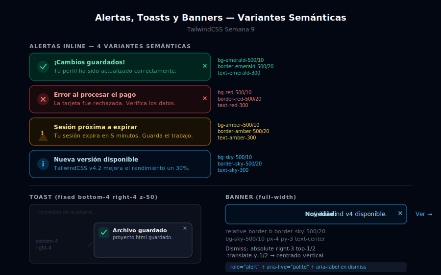

# Alertas, Toasts y Banners

## 🎯 Objetivos

- Construir los 4 tipos de alerta semántica: success, error, warning, info
- Implementar toasts con posicionamiento `fixed` en la esquina inferior
- Crear banners dismissables de ancho completo
- Agregar `role="alert"` y `aria-live="polite"` para accesibilidad

---



---

## 1. Anatomía de una alerta

```
┌─────────────────────────────────────────────────────────┐
│  [Icono]  Título de la alerta              [× dismiss] │
│           Descripción o mensaje de detalle              │
└─────────────────────────────────────────────────────────┘
```

Fórmula de colores (consistente con badges semánticos):

| Tipo | Fondo | Borde | Icono/Texto | Icono HeroIcons |
|------|-------|-------|-------------|-----------------|
| Success | `bg-emerald-500/10` | `border-emerald-500/20` | `text-emerald-400` | check-circle |
| Error | `bg-red-500/10` | `border-red-500/20` | `text-red-400` | x-circle |
| Warning | `bg-amber-500/10` | `border-amber-500/20` | `text-amber-400` | exclamation-triangle |
| Info | `bg-sky-500/10` | `border-sky-500/20` | `text-sky-400` | information-circle |

---

## 2. Alertas inline (dentro del contenido)

```html
<!-- ✅ SUCCESS -->
<div role="alert"
  class="flex items-start gap-3 rounded-xl border border-emerald-500/20 bg-emerald-500/10 px-4 py-3.5">
  <svg class="mt-0.5 h-5 w-5 shrink-0 text-emerald-400" fill="none" stroke="currentColor" viewBox="0 0 24 24">
    <path stroke-linecap="round" stroke-linejoin="round" stroke-width="2" d="M9 12l2 2 4-4m6 2a9 9 0 11-18 0 9 9 0 0118 0"/>
  </svg>
  <div class="flex-1">
    <p class="text-sm font-semibold text-emerald-300">¡Cambios guardados!</p>
    <p class="mt-0.5 text-sm text-emerald-400/80">Tu perfil ha sido actualizado correctamente.</p>
  </div>
  <!-- Botón dismiss -->
  <button type="button"
    class="ml-auto rounded-md p-0.5 text-emerald-400 hover:bg-emerald-500/20 hover:text-emerald-300 transition-colors"
    aria-label="Cerrar alerta">
    <svg class="h-4 w-4" fill="none" stroke="currentColor" viewBox="0 0 24 24">
      <path stroke-linecap="round" stroke-linejoin="round" stroke-width="2" d="M6 18L18 6M6 6l12 12"/>
    </svg>
  </button>
</div>

<!-- ❌ ERROR -->
<div role="alert"
  class="flex items-start gap-3 rounded-xl border border-red-500/20 bg-red-500/10 px-4 py-3.5">
  <svg class="mt-0.5 h-5 w-5 shrink-0 text-red-400" fill="none" stroke="currentColor" viewBox="0 0 24 24">
    <path stroke-linecap="round" stroke-linejoin="round" stroke-width="2" d="M10 14l2-2m0 0l2-2m-2 2l-2-2m2 2l2 2m7-2a9 9 0 11-18 0 9 9 0 0118 0"/>
  </svg>
  <div class="flex-1">
    <p class="text-sm font-semibold text-red-300">Error al procesar el pago</p>
    <p class="mt-0.5 text-sm text-red-400/80">La tarjeta fue rechazada. Verifica los datos e intenta de nuevo.</p>
  </div>
  <button type="button"
    class="ml-auto rounded-md p-0.5 text-red-400 hover:bg-red-500/20 transition-colors"
    aria-label="Cerrar alerta">
    <svg class="h-4 w-4" fill="none" stroke="currentColor" viewBox="0 0 24 24">
      <path stroke-linecap="round" stroke-linejoin="round" stroke-width="2" d="M6 18L18 6M6 6l12 12"/>
    </svg>
  </button>
</div>

<!-- ⚠️ WARNING -->
<div role="alert"
  class="flex items-start gap-3 rounded-xl border border-amber-500/20 bg-amber-500/10 px-4 py-3.5">
  <svg class="mt-0.5 h-5 w-5 shrink-0 text-amber-400" fill="none" stroke="currentColor" viewBox="0 0 24 24">
    <path stroke-linecap="round" stroke-linejoin="round" stroke-width="2" d="M12 9v2m0 4h.01m-6.938 4h13.856c1.54 0 2.502-1.667 1.732-2.5L13.732 4c-.77-.833-1.923-.833-2.464 0L4.35 16.5c-.77.833.192 2.5 1.732 2.5z"/>
  </svg>
  <div class="flex-1">
    <p class="text-sm font-semibold text-amber-300">Sesión próxima a expirar</p>
    <p class="mt-0.5 text-sm text-amber-400/80">Tu sesión expirará en 5 minutos. Guarda tu trabajo.</p>
  </div>
  <button type="button"
    class="ml-auto rounded-md p-0.5 text-amber-400 hover:bg-amber-500/20 transition-colors"
    aria-label="Cerrar alerta">
    <svg class="h-4 w-4" fill="none" stroke="currentColor" viewBox="0 0 24 24">
      <path stroke-linecap="round" stroke-linejoin="round" stroke-width="2" d="M6 18L18 6M6 6l12 12"/>
    </svg>
  </button>
</div>

<!-- ℹ️ INFO -->
<div role="alert"
  class="flex items-start gap-3 rounded-xl border border-sky-500/20 bg-sky-500/10 px-4 py-3.5">
  <svg class="mt-0.5 h-5 w-5 shrink-0 text-sky-400" fill="none" stroke="currentColor" viewBox="0 0 24 24">
    <path stroke-linecap="round" stroke-linejoin="round" stroke-width="2" d="M13 16h-1v-4h-1m1-4h.01M21 12a9 9 0 11-18 0 9 9 0 0118 0"/>
  </svg>
  <div class="flex-1">
    <p class="text-sm font-semibold text-sky-300">Nueva versión disponible</p>
    <p class="mt-0.5 text-sm text-sky-400/80">TailwindCSS v4.2 ya está disponible con mejoras de rendimiento.</p>
  </div>
  <button type="button"
    class="ml-auto rounded-md p-0.5 text-sky-400 hover:bg-sky-500/20 transition-colors"
    aria-label="Cerrar alerta">
    <svg class="h-4 w-4" fill="none" stroke="currentColor" viewBox="0 0 24 24">
      <path stroke-linecap="round" stroke-linejoin="round" stroke-width="2" d="M6 18L18 6M6 6l12 12"/>
    </svg>
  </button>
</div>
```

---

## 3. Toasts (notificaciones flotantes)

Los toasts aparecen de forma transitoria en una esquina fija de la pantalla:

```html
<!-- Contenedor de toasts: fixed en la esquina inferior derecha -->
<!-- z-50 para estar encima de todo el contenido -->
<div class="fixed bottom-4 right-4 z-50 flex flex-col gap-3" aria-live="polite">

  <!-- Toast de éxito -->
  <div role="alert"
    class="flex w-80 items-start gap-3 rounded-xl border border-emerald-500/20 bg-gray-900
           px-4 py-3.5 shadow-lg shadow-black/20 ring-1 ring-gray-800">
    <div class="flex h-8 w-8 shrink-0 items-center justify-center rounded-lg bg-emerald-500/15">
      <svg class="h-4 w-4 text-emerald-400" fill="none" stroke="currentColor" viewBox="0 0 24 24">
        <path stroke-linecap="round" stroke-linejoin="round" stroke-width="2" d="M5 13l4 4L19 7"/>
      </svg>
    </div>
    <div class="flex-1 pt-0.5">
      <p class="text-sm font-semibold text-white">Archivo subido</p>
      <p class="mt-0.5 text-xs text-gray-400">design-final-v3.fig se ha guardado.</p>
    </div>
    <button type="button"
      class="shrink-0 rounded-md p-0.5 text-gray-500 hover:text-gray-300 transition-colors"
      aria-label="Cerrar notificación">
      <svg class="h-4 w-4" fill="none" stroke="currentColor" viewBox="0 0 24 24">
        <path stroke-linecap="round" stroke-linejoin="round" stroke-width="2" d="M6 18L18 6M6 6l12 12"/>
      </svg>
    </button>
  </div>

  <!-- Toast de error -->
  <div role="alert"
    class="flex w-80 items-start gap-3 rounded-xl border border-red-500/20 bg-gray-900
           px-4 py-3.5 shadow-lg shadow-black/20 ring-1 ring-gray-800">
    <div class="flex h-8 w-8 shrink-0 items-center justify-center rounded-lg bg-red-500/15">
      <svg class="h-4 w-4 text-red-400" fill="none" stroke="currentColor" viewBox="0 0 24 24">
        <path stroke-linecap="round" stroke-linejoin="round" stroke-width="2" d="M6 18L18 6M6 6l12 12"/>
      </svg>
    </div>
    <div class="flex-1 pt-0.5">
      <p class="text-sm font-semibold text-white">Error de conexión</p>
      <p class="mt-0.5 text-xs text-gray-400">No se pudo sincronizar. Reintentando...</p>
    </div>
    <button type="button"
      class="shrink-0 rounded-md p-0.5 text-gray-500 hover:text-gray-300 transition-colors"
      aria-label="Cerrar notificación">
      <svg class="h-4 w-4" fill="none" stroke="currentColor" viewBox="0 0 24 24">
        <path stroke-linecap="round" stroke-linejoin="round" stroke-width="2" d="M6 18L18 6M6 6l12 12"/>
      </svg>
    </button>
  </div>

</div>
```

---

## 4. Banner de anuncio (ancho completo)

```html
<!-- Banner superior: se muestra debajo del navbar -->
<!-- relative para que el botón de cierre sea absolute dentro -->
<div class="relative border-b border-sky-500/20 bg-sky-500/10 px-4 py-3 text-center">

  <!-- Contenido del banner -->
  <p class="text-sm text-sky-300">
    🎉 <strong>Novedad:</strong> TailwindCSS v4 ya está disponible.
    <a href="#" class="ml-1 underline hover:text-sky-200 transition-colors">Ver novedades →</a>
  </p>

  <!-- Botón dismiss absolute a la derecha -->
  <button
    type="button"
    class="absolute right-3 top-1/2 -translate-y-1/2 rounded-md p-1 text-sky-400
           hover:bg-sky-500/20 hover:text-sky-300 transition-colors"
    aria-label="Cerrar anuncio">
    <svg class="h-4 w-4" fill="none" stroke="currentColor" viewBox="0 0 24 24">
      <path stroke-linecap="round" stroke-linejoin="round" stroke-width="2" d="M6 18L18 6M6 6l12 12"/>
    </svg>
  </button>
</div>

<!-- Banner de error full-page (crítico) -->
<div class="relative border-b border-red-500/20 bg-red-500/10 px-4 py-3">
  <div class="mx-auto flex max-w-7xl items-center justify-between">
    <div class="flex items-center gap-3">
      <svg class="h-5 w-5 text-red-400" fill="none" stroke="currentColor" viewBox="0 0 24 24">
        <path stroke-linecap="round" stroke-linejoin="round" stroke-width="2" d="M12 9v2m0 4h.01m-6.938 4h13.856c1.54 0 2.502-1.667 1.732-2.5L13.732 4c-.77-.833-1.923-.833-2.464 0L4.35 16.5c-.77.833.192 2.5 1.732 2.5z"/>
      </svg>
      <p class="text-sm text-red-300">
        <strong>Mantenimiento programado</strong> — El servicio estará inactivo hoy a las 23:00 UTC.
      </p>
    </div>
    <button type="button"
      class="rounded-md p-1 text-red-400 hover:bg-red-500/20 transition-colors"
      aria-label="Cerrar aviso">
      <svg class="h-4 w-4" fill="none" stroke="currentColor" viewBox="0 0 24 24">
        <path stroke-linecap="round" stroke-linejoin="round" stroke-width="2" d="M6 18L18 6M6 6l12 12"/>
      </svg>
    </button>
  </div>
</div>
```

---

## 5. Accesibilidad de notificaciones

```html
<!-- aria-live="polite": anuncia el cambio cuando el usuario termina de leer
     Usar para toasts de éxito o info -->
<div aria-live="polite" class="fixed bottom-4 right-4 z-50">
  <!-- Toasts se insertan aquí dinámicamente -->
</div>

<!-- aria-live="assertive": interrumpe al usuario para anunciar
     Solo para errores críticos -->
<div aria-live="assertive">
  <!-- Errores de seguridad o acciones irreversibles -->
</div>

<!-- role="alert": equivalente a aria-live="assertive" -->
<div role="alert">
  <p>Error crítico: no se puede continuar.</p>
</div>
```

---

## ✅ Checklist de verificación

- [ ] `role="alert"` en todas las alertas inline
- [ ] `aria-live="polite"` en el contenedor de toasts dinámicos
- [ ] Botón dismiss siempre tiene `aria-label` descriptivo
- [ ] No usar solo color para comunicar el estado — siempre acompañar con icono y texto
- [ ] Contraste WCAG AA en todos los textos de alerta (fondo `/10` puede ser insuficiente para texto pequeño)
- [ ] Toasts tienen `z-50` para estar encima del overlay del navbar

---

## 📚 Recursos

- [TailwindCSS: Background Opacity](https://tailwindcss.com/docs/background-color#changing-the-opacity)
- [MDN: ARIA live regions](https://developer.mozilla.org/en-US/docs/Web/Accessibility/ARIA/ARIA_Live_Regions)
- [WCAG: Status Messages](https://www.w3.org/WAI/WCAG21/Understanding/status-messages.html)
- [Heroicons](https://heroicons.com/) — Iconos SVG para check, x, warning, info
