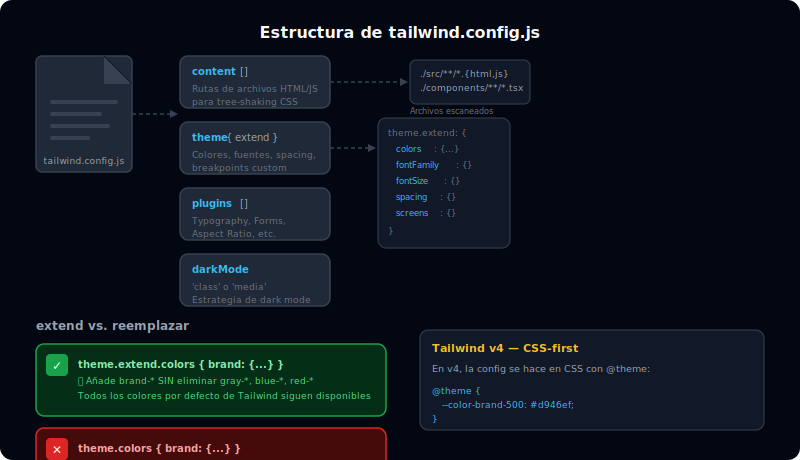

# Estructura de tailwind.config.js

## 🎯 Objetivos

- Entender la anatomía completa del archivo de configuración de Tailwind
- Diferenciar Tailwind v3 (JS config) y v4 (CSS-first config)
- Configurar `content`, `theme`, `plugins` correctamente
- Saber cuándo usar `extend` vs reemplazar

---



---

## 1. ¿Qué es tailwind.config.js?

El archivo de configuración de Tailwind es el **centro de control de tu design system**. Permite:

- Definir qué archivos analiza Tailwind para purgar CSS no usado
- Extender o reemplazar los valores por defecto del theme
- Activar plugins oficiales y de terceros
- Configurar variantes condicionales

```javascript
// tailwind.config.js (Tailwind v3)
/** @type {import('tailwindcss').Config} */
module.exports = {
  // 1. content: rutas a todos los archivos con clases Tailwind
  content: [
    './index.html',
    './src/**/*.{html,js,ts,jsx,tsx,vue,svelte}',
  ],

  // 2. theme: define los valores del design system
  theme: {
    // Aquí reemplazas los defaults (usar con cuidado)
    extend: {
      // Aquí extiendes sin reemplazar los defaults ✅
    },
  },

  // 3. plugins: plugins oficiales y de comunidad
  plugins: [],
}
```

---

## 2. La sección `content`

**La sección más crítica**: Tailwind analiza estos archivos para determinar qué clases incluir en el CSS generado. Si un archivo no está aquí, las clases que contiene serán eliminadas (purged) del build.

```javascript
content: [
  // HTML en la raíz
  './index.html',

  // Todos los archivos en src con estas extensiones
  './src/**/*.{html,js,ts,jsx,tsx}',

  // Componentes en una librería externa
  './node_modules/@mi-libreria/components/**/*.js',
],
```

### ⚠️ Error común: clases dinámicas no detectables

```javascript
// ❌ MAL: Tailwind no puede detectar 'bg-red-500' ni 'bg-green-500'
const color = isError ? 'red' : 'green'
const className = `bg-${color}-500`

// ✅ BIEN: las clases completas son detectables
const className = isError ? 'bg-red-500' : 'bg-green-500'
```

---

## 3. theme vs theme.extend

Esta es la distinción más importante de la configuración:

```javascript
// tailwind.config.js
module.exports = {
  theme: {
    // ❌ REEMPLAZA — elimina TODOS los colores default de Tailwind
    colors: {
      brand: '#3b82f6',
      // Ahora solo existe bg-brand, NO bg-gray-500, bg-blue-300, etc.
    },

    extend: {
      // ✅ AGREGA — conserva todos los colores de Tailwind Y agrega los tuyos
      colors: {
        brand: '#3b82f6',
        // Ahora existe bg-brand Y TAMBIÉN bg-gray-500, bg-blue-300, etc.
      },
    },
  },
}
```

### Cuándo reemplazar (sin `extend`)

Solo reemplaza cuando realmente quieres eliminar los defaults:

```javascript
theme: {
  // Reemplazar la paleta completa para un design system muy cerrado
  colors: {
    transparent: 'transparent',
    current: 'currentColor',
    white: '#ffffff',
    black: '#000000',
    brand: {
      50: '#f0f9ff',
      500: '#0ea5e9',
      900: '#0c4a6e',
    },
  },

  // Reemplazar las fuentes sin mantener las de Tailwind
  fontFamily: {
    sans: ['Inter', 'system-ui', 'sans-serif'],
    mono: ['JetBrains Mono', 'monospace'],
  },
},
```

---

## 4. Tailwind v4: configuración CSS-first

En Tailwind v4, la configuración se hace **directamente en CSS** usando la directiva `@theme`, sin necesidad de un archivo `.js` separado:

```css
/* src/main.css */
@import "tailwindcss";

/* Configuración CSS-first: todo en el mismo archivo */
@theme {
  /* Colores de marca */
  --color-brand-50: #f0f9ff;
  --color-brand-100: #e0f2fe;
  --color-brand-200: #bae6fd;
  --color-brand-300: #7dd3fc;
  --color-brand-400: #38bdf8;
  --color-brand-500: #0ea5e9;
  --color-brand-600: #0284c7;
  --color-brand-700: #0369a1;
  --color-brand-800: #075985;
  --color-brand-900: #0c4a6e;
  --color-brand-950: #082f49;

  /* Tipografía */
  --font-display: "Inter Display", "Inter", sans-serif;
  --font-body: "Inter", system-ui, sans-serif;

  /* Spacing extra */
  --spacing-section: 5rem;
  --spacing-section-lg: 8rem;
}
```

Estos valores se convierten automáticamente en clases: `bg-brand-500`, `font-display`, `mt-section`, etc.

---

## 5. Sección plugins

```javascript
const plugin = require('tailwindcss/plugin')

module.exports = {
  plugins: [
    // Plugins oficiales
    require('@tailwindcss/forms'),
    require('@tailwindcss/typography'),
    require('@tailwindcss/aspect-ratio'),

    // Plugin inline personalizado
    plugin(function({ addUtilities, addComponents, theme }) {
      // Agregar utilidades custom
      addUtilities({
        '.text-shadow-sm': {
          textShadow: '0 1px 2px rgba(0,0,0,0.2)',
        },
      })
    }),
  ],
}
```

---

## 6. Configuración completa de ejemplo (v3)

```javascript
/** @type {import('tailwindcss').Config} */
module.exports = {
  content: [
    './index.html',
    './src/**/*.{html,js,ts,jsx,tsx}',
  ],

  theme: {
    extend: {
      // Colores de marca
      colors: {
        brand: {
          50:  '#f0f9ff',
          100: '#e0f2fe',
          200: '#bae6fd',
          300: '#7dd3fc',
          400: '#38bdf8',
          500: '#0ea5e9',
          600: '#0284c7',
          700: '#0369a1',
          800: '#075985',
          900: '#0c4a6e',
          950: '#082f49',
        },
      },

      // Fuentes custom
      fontFamily: {
        display: ['Inter Display', 'Inter', 'sans-serif'],
        body:    ['Inter', 'system-ui', 'sans-serif'],
      },

      // Tamaños de fuente extra
      fontSize: {
        hero: ['3.5rem', { lineHeight: '1.1', fontWeight: '700' }],
        caption: ['0.6875rem', { lineHeight: '1.4' }],
      },

      // Spacing extra
      spacing: {
        section: '5rem',
        'section-lg': '8rem',
      },

      // Breakpoints extra
      screens: {
        xs: '375px',
        '3xl': '1920px',
      },
    },
  },

  plugins: [
    require('@tailwindcss/forms'),
  ],
}
```

---

## 7. Verificar la configuración

Puedes ver todos los valores resueltos de tu config con el plugin CLI de Tailwind:

```bash
# Ver todo el theme resuelto (colores, spacing, etc.)
npx tailwindcss --help

# En Tailwind v3, resolver el config programáticamente
const resolveConfig = require('tailwindcss/resolveConfig')
const config = resolveConfig(require('./tailwind.config.js'))
console.log(config.theme.colors.brand)
```

---

## ✅ Checklist de Verificación

- [ ] Tengo `content` correctamente configurado con todas las rutas de mis archivos
- [ ] Uso `theme.extend` para no perder los defaults de Tailwind
- [ ] Sé la diferencia entre v3 (tailwind.config.js) y v4 (@theme en CSS)
- [ ] Conozco la sección `plugins` y sé instalar un plugin oficial
- [ ] Entiendo por qué no hay que construir clases dinámicas con template literals
