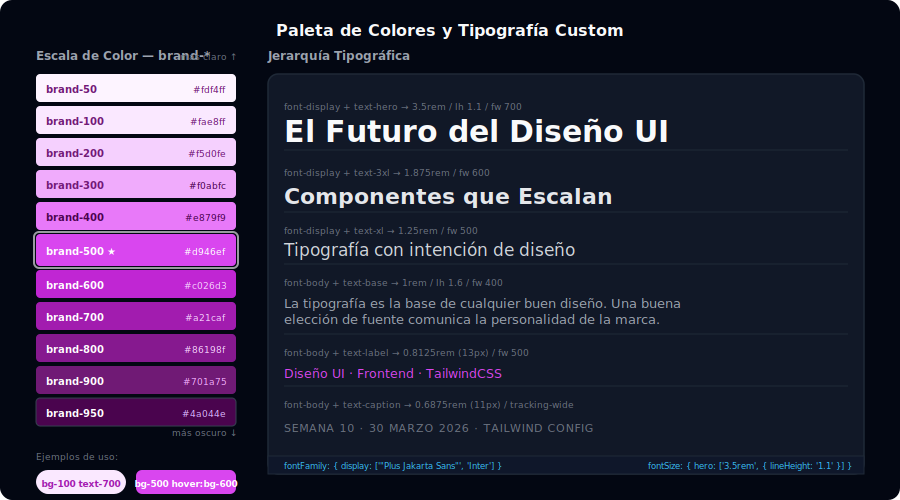

# Extender Paleta de Colores y Tipografía

## 🎯 Objetivos

- Definir una paleta de colores de marca con 9-11 tonos siguiendo la convención Tailwind
- Configurar fuentes de Google Fonts y registrarlas en el config
- Extender la escala de `fontSize` y `fontWeight` con valores custom
- Personalizar `spacing`, `borderRadius` y `screens`

---



---

## 1. Paleta de colores: la escala 50–950

Tailwind usa una escala numérica donde los números más bajos son más claros y los más altos más oscuros. Para crear una paleta de marca coherente, debes seguir este mismo patrón:

```javascript
// tailwind.config.js
theme: {
  extend: {
    colors: {
      brand: {
        50:  '#fdf4ff', // casi blanco — fondos muy suaves
        100: '#fae8ff', // fondos de sección suaves
        200: '#f5d0fe', // bordes suaves
        300: '#f0abfc', // texto sobre fondo oscuro
        400: '#e879f9', // íconos sobre fondo oscuro
        500: '#d946ef', // color base — botones, enlaces
        600: '#c026d3', // hover de botones
        700: '#a21caf', // pressed/active
        800: '#86198f', // texto sobre fondo claro
        900: '#701a75', // texto oscuro
        950: '#4a044e', // casi negro — fondo dark mode
      },
    },
  },
},
```

### Uso en HTML

```html
<!-- Botón de marca completo -->
<button class="bg-brand-500 text-white px-6 py-2.5 rounded-lg
               hover:bg-brand-600 active:bg-brand-700
               focus:outline-none focus:ring-2 focus:ring-brand-500/40
               transition-colors font-medium">
  Comenzar ahora
</button>

<!-- Badge suave -->
<span class="bg-brand-100 text-brand-700 px-3 py-1 rounded-full text-sm font-medium">
  Nuevo
</span>

<!-- Card con borde de marca -->
<div class="border border-brand-200 bg-brand-50 rounded-xl p-6">
  <h3 class="text-brand-900 font-semibold">Título</h3>
  <p class="text-brand-700 text-sm mt-1">Descripción</p>
</div>
```

### Generar escalas automáticamente

Para generar una escala de 11 tonos a partir de un color base, puedes usar herramientas como:
- **[uicolors.app](https://uicolors.app)** — genera escala Tailwind desde un hex
- **[palettte.app](https://palettte.app)** — edición visual de paletas
- **[coolors.co](https://coolors.co)** — generador y ajuste de paletas

```javascript
// También puedes usar la función oklch() en v4 CSS-first
@theme {
  --color-brand-50: oklch(97% 0.02 300);
  --color-brand-500: oklch(65% 0.18 300);
  --color-brand-950: oklch(15% 0.04 300);
}
```

---

## 2. Múltiples paletas en el config

Un design system real tiene más de una paleta:

```javascript
theme: {
  extend: {
    colors: {
      // Color de marca principal
      brand: {
        50: '#fdf4ff', 500: '#d946ef', 950: '#4a044e',
        // ... todos los tonos
      },

      // Color secundario / acento
      accent: {
        50: '#fff7ed', 500: '#f97316', 950: '#431407',
      },

      // Neutros de marca (grises con tono de marca)
      neutral: {
        50: '#fafaf9', 100: '#f5f5f4', 200: '#e7e5e4',
        300: '#d6d3d1', 400: '#a8a29e', 500: '#78716c',
        600: '#57534e', 700: '#44403c', 800: '#292524',
        900: '#1c1917', 950: '#0c0a09',
      },

      // Colores semánticos (mapeados a las paletas base)
      success: '#22c55e',
      error:   '#ef4444',
      warning: '#f59e0b',
      info:    '#0ea5e9',
    },
  },
},
```

---

## 3. Tipografía: fontFamily

```javascript
theme: {
  extend: {
    fontFamily: {
      // Fuente para headings — cargada desde Google Fonts
      display: ['"Plus Jakarta Sans"', 'Inter', 'system-ui', 'sans-serif'],

      // Fuente para body text
      body: ['Inter', 'system-ui', 'sans-serif'],

      // Fuente monoespaciada para código
      mono: ['"JetBrains Mono"', '"Fira Code"', 'monospace'],
    },
  },
},
```

### Cargar fuentes de Google Fonts

```css
/* src/main.css */
/* ✅ Importar en CSS, NO en HTML */
@import url('https://fonts.googleapis.com/css2?family=Plus+Jakarta+Sans:wght@400;500;600;700;800&family=Inter:wght@400;500;600&display=swap');

@import "tailwindcss";
```

### Uso en HTML

```html
<!-- Heading con fuente display -->
<h1 class="font-display text-4xl font-extrabold text-gray-900">
  Título principal
</h1>

<!-- Párrafo con fuente body -->
<p class="font-body text-base text-gray-600 leading-relaxed">
  Texto de párrafo con mejor legibilidad.
</p>

<!-- Código con fuente mono -->
<code class="font-mono text-sm bg-gray-100 px-2 py-0.5 rounded">
  bg-brand-500
</code>
```

---

## 4. Escala de fontSize

Primero, entendemos la sintaxis extendida de Tailwind que acepta `[size, { lineHeight, fontWeight, letterSpacing }]`:

```javascript
theme: {
  extend: {
    fontSize: {
      // Tamaños extra grandes para heroes
      'hero-lg': ['5rem',    { lineHeight: '1',   fontWeight: '800', letterSpacing: '-0.03em' }],
      'hero':    ['3.5rem',  { lineHeight: '1.1', fontWeight: '700', letterSpacing: '-0.02em' }],
      'hero-sm': ['2.5rem',  { lineHeight: '1.2', fontWeight: '700', letterSpacing: '-0.01em' }],

      // Tamaño extra pequeño para metadatos
      'caption': ['0.6875rem', { lineHeight: '1.4', letterSpacing: '0.02em' }],

      // Tamaño para labels de forumulrio
      'label':   ['0.8125rem', { lineHeight: '1.5', fontWeight: '500' }],
    },
  },
},
```

```html
<!-- Uso inmediato -->
<h1 class="text-hero font-display text-gray-950">Bienvenido</h1>
<p class="text-caption text-gray-500 uppercase tracking-widest">Actualizado hace 5 min</p>
```

---

## 5. Spacing personalizado

```javascript
theme: {
  extend: {
    spacing: {
      // Padding/margin para secciones de landing
      'section-sm':  '4rem',    // py-section-sm
      'section':     '6rem',    // py-section
      'section-lg':  '10rem',   // py-section-lg
      'section-xl':  '14rem',   // py-section-xl

      // Ancho de sidebar
      'sidebar':     '16rem',   // w-sidebar

      // Gutter horizontal del layout
      'gutter':      '1.5rem',  // px-gutter
      'gutter-lg':   '2.5rem',  // px-gutter-lg
    },
  },
},
```

```html
<!-- Sección de landing con padding semántico -->
<section class="py-section px-gutter">
  <div class="max-w-7xl mx-auto">...</div>
</section>

<!-- Layout con sidebar -->
<aside class="w-sidebar shrink-0">...</aside>
```

---

## 6. Breakpoints personalizados

```javascript
theme: {
  extend: {
    screens: {
      // Mobile pequeño (iPhone SE)
      'xs': '375px',

      // Pantallas muy grandes (monitores 4K)
      '3xl': '1920px',

      // Breakpoint para impresión
      'print': { 'raw': 'print' },
    },
  },
},
```

```html
<!-- Oculto en xs, visible en sm+ -->
<div class="hidden xs:block sm:flex">...</div>

<!-- Layout diferente en 3xl -->
<div class="grid grid-cols-3 3xl:grid-cols-4">...</div>
```

---

## 7. borderRadius y boxShadow personalizados

```javascript
theme: {
  extend: {
    borderRadius: {
      '4xl': '2rem',
      '5xl': '2.5rem',
      'blob': '60% 40% 30% 70% / 60% 30% 70% 40%',
    },

    boxShadow: {
      // Sombra de card elevada
      'card': '0 1px 3px 0 rgb(0 0 0/0.10), 0 4px 12px -2px rgb(0 0 0/0.08)',
      // Sombra con color de marca
      'brand': '0 8px 32px -4px rgb(217 70 239 / 0.4)',
      // Glow de botón en hover
      'glow': '0 0 20px -4px var(--color-brand-500)',
    },
  },
},
```

---

## ✅ Checklist de Verificación

- [ ] Tengo paleta `brand-*` con al menos 7 shades (50, 100, 200, 300, 400, 500, 600, 700, 800, 900, 950)
- [ ] Las fuentes están importadas en CSS con `@import url(...)` antes de `@import "tailwindcss"`
- [ ] Uso `font-display` y `font-body` en el HTML en lugar de fuentes genéricas
- [ ] Tengo al menos un tamaño de fuente extra (`text-hero` o similar)
- [ ] Tengo al menos un spacing semántico (`py-section`, `px-gutter`)
