# CSS Variables y Design Tokens

## 🎯 Objetivos

- Entender qué son los design tokens y por qué son importantes
- Declarar CSS custom properties (`--variable`) como tokens de diseño
- Integrar tokens CSS con clases de Tailwind (v3 y v4)
- Construir un sistema de tokens con capas: primitivo → semántico → componente
- Implementar theming claro/oscuro mediante tokens

---



---

## 1. ¿Qué son los design tokens?

Un **design token** es un par nombre/valor que representa una decisión de diseño:

```
color primario = #0ea5e9
radio de borde de card = 12px
espaciado de sección = 80px
```

Sin tokens, estos valores están esparcidos por todo el código:

```html
<!-- ❌ Sin tokens: mismo color repetido 40 veces -->
<button class="bg-[#0ea5e9] hover:bg-[#0284c7]">CTA</button>
<a class="text-[#0ea5e9]">Enlace</a>
<div class="border-[#0ea5e9]">Card</div>
```

Con tokens, cambias un valor y se actualiza en toda la UI:

```css
/* ✅ Con tokens: cambias un valor, se actualiza todo */
:root {
  --color-primary: #0ea5e9;
}
```

```html
<button class="bg-[var(--color-primary)]">CTA</button>
```

---

## 2. Jerarquía de tokens: 3 capas

```
CAPA 1: PRIMITIVOS
  Valores crudos sin significado semántico
  → --primitive-blue-500: #0ea5e9
  → --primitive-blue-600: #0284c7

CAPA 2: SEMÁNTICOS
  Valores con significado (qué hace, no qué color es)
  → --color-primary: var(--primitive-blue-500)
  → --color-primary-hover: var(--primitive-blue-600)

CAPA 3: COMPONENTES
  Tokens específicos para componentes concretos
  → --btn-bg: var(--color-primary)
  → --btn-bg-hover: var(--color-primary-hover)
```

### Implementación práctica

```css
/* ============================================
   CAPA 1: PRIMITIVOS
   ============================================ */
:root {
  /* Paleta de azul */
  --primitive-blue-50:  #f0f9ff;
  --primitive-blue-100: #e0f2fe;
  --primitive-blue-400: #38bdf8;
  --primitive-blue-500: #0ea5e9;
  --primitive-blue-600: #0284c7;
  --primitive-blue-900: #0c4a6e;

  /* Paleta de neutros */
  --primitive-gray-50:  #f9fafb;
  --primitive-gray-100: #f3f4f6;
  --primitive-gray-800: #1f2937;
  --primitive-gray-900: #111827;
  --primitive-gray-950: #030712;
}

/* ============================================
   CAPA 2: SEMÁNTICOS (tema claro)
   ============================================ */
:root {
  --color-primary:         var(--primitive-blue-500);
  --color-primary-hover:   var(--primitive-blue-600);
  --color-primary-subtle:  var(--primitive-blue-50);
  --color-primary-on:      #ffffff;           /* texto sobre primary */

  --color-bg:              var(--primitive-gray-50);
  --color-bg-subtle:       var(--primitive-gray-100);
  --color-surface:         #ffffff;
  --color-border:          var(--primitive-gray-100);

  --color-text:            var(--primitive-gray-900);
  --color-text-subtle:     #6b7280;           /* gray-500 */
}

/* ============================================
   CAPA 2: SEMÁNTICOS (tema oscuro)
   ============================================ */
.dark {
  --color-bg:              var(--primitive-gray-950);
  --color-bg-subtle:       var(--primitive-gray-900);
  --color-surface:         var(--primitive-gray-900);
  --color-border:          var(--primitive-gray-800);

  --color-text:            var(--primitive-gray-50);
  --color-text-subtle:     #9ca3af;           /* gray-400 */
}
```

---

## 3. Integrar tokens con Tailwind v3

En Tailwind v3, puedes referenciar variables CSS en el config con `var()`:

```javascript
// tailwind.config.js
module.exports = {
  theme: {
    extend: {
      colors: {
        // Los colores usan las variables CSS como valor
        primary:         'var(--color-primary)',
        'primary-hover': 'var(--color-primary-hover)',
        'primary-subtle': 'var(--color-primary-subtle)',
        surface:         'var(--color-surface)',
        'text-default':  'var(--color-text)',
        'text-subtle':   'var(--color-text-subtle)',
      },
      backgroundColor: {
        page:    'var(--color-bg)',
        subtle:  'var(--color-bg-subtle)',
      },
      borderColor: {
        default: 'var(--color-border)',
      },
    },
  },
}
```

```html
<!-- Uso en HTML: clases Tailwind respaldadas por tokens -->
<body class="bg-page text-text-default">
  <div class="bg-surface border border-default rounded-xl p-6">
    <h2 class="text-text-default font-semibold">Título</h2>
    <p class="text-text-subtle">Descripción</p>
    <button class="bg-primary hover:bg-primary-hover text-white px-4 py-2 rounded-lg">
      Acción
    </button>
  </div>
</body>
```

---

## 4. Integrar tokens con Tailwind v4 (`@theme`)

En Tailwind v4, la integración es más directa y nativa:

```css
/* src/main.css */
@import "tailwindcss";

/* Tokens primitivos */
@layer base {
  :root {
    --primitive-sky-500: #0ea5e9;
    --primitive-sky-600: #0284c7;
    --primitive-gray-950: #030712;
  }
}

/* Tokens semánticos + registro en Tailwind */
@theme {
  /* Tailwind genera bg-primary, text-primary, border-primary, etc. */
  --color-primary:        #0ea5e9;
  --color-primary-hover:  #0284c7;

  /* Tailwind genera bg-surface, etc. */
  --color-surface:        #ffffff;
  --color-bg:             #f9fafb;
  --color-border:         #e5e7eb;
}
```

---

## 5. Tokens de espaciado y tipografía

```css
:root {
  /* Spacing de secciones */
  --space-section-xs:  2rem;    /*  32px */
  --space-section-sm:  4rem;    /*  64px */
  --space-section:     6rem;    /*  96px */
  --space-section-lg:  10rem;   /* 160px */

  /* Radii de componentes */
  --radius-sm:   0.375rem;  /* rounded-md */
  --radius-md:   0.5rem;    /* rounded-lg */
  --radius-lg:   0.75rem;   /* rounded-xl */
  --radius-card: 1rem;      /* rounded-2xl */
  --radius-pill: 9999px;    /* rounded-full */

  /* Tipografía */
  --font-sans:    'Inter', system-ui, sans-serif;
  --font-display: 'Plus Jakarta Sans', 'Inter', sans-serif;
  --font-mono:    'JetBrains Mono', monospace;

  /* Sombras */
  --shadow-card: 0 1px 3px 0 rgb(0 0 0 / 0.1), 0 4px 12px -2px rgb(0 0 0 / 0.08);
  --shadow-modal: 0 20px 60px -10px rgb(0 0 0 / 0.4);
}
```

```html
<!-- Uso con valores arbitrarios de Tailwind -->
<section class="py-[var(--space-section)] px-6">
  <div class="rounded-[var(--radius-card)] shadow-[var(--shadow-card)] bg-white p-8">
    <h2 class="font-[var(--font-display)] text-2xl font-bold">Título</h2>
  </div>
</section>
```

---

## 6. Theming claro/oscuro con tokens

La ventaja real de los tokens es el cambio de tema con una sola clase en el `<html>`:

```html
<!-- Agregar/quitar clase dark en el elemento raíz -->
<html lang="es" class="dark">
```

```css
/* Los tokens cambian de valor según el tema */
:root {
  --color-bg:      #ffffff;
  --color-surface: #f9fafb;
  --color-text:    #111827;
  --color-border:  #e5e7eb;
}

.dark {
  --color-bg:      #030712;
  --color-surface: #111827;
  --color-text:    #f9fafb;
  --color-border:  #1f2937;
}
```

```javascript
// Toggle de tema con una línea
document.documentElement.classList.toggle('dark')
```

El HTML **no cambia en absoluto** — solo los valores de las variables CSS. Toda la UI se actualiza.

---

## 7. Tokens en Figma / Storybook

Los design tokens son el puente entre diseño y desarrollo:

```json
// tokens.json (compatible con Token Studio / Style Dictionary)
{
  "color": {
    "primary": {
      "value": "#0ea5e9",
      "type": "color",
      "description": "Color principal de marca, botones CTAs"
    },
    "bg": {
      "value": "#ffffff",
      "type": "color"
    }
  },
  "spacing": {
    "section": {
      "value": "96px",
      "type": "spacing"
    }
  }
}
```

Este archivo se exporta de Figma con plugins como **Token Studio** y se transforma a variables CSS con **Style Dictionary** o **Theo**.

---

## ✅ Checklist de Verificación

- [ ] Tengo al menos 6 tokens semánticos declarados en `:root`
- [ ] Los tokens de color tienen sus versiones dark en `.dark {}`
- [ ] Uso los tokens en Tailwind con `bg-[var(--...)]` o registrados en `@theme`
- [ ] Cambiando una variable CSS se actualiza visiblemente la UI
- [ ] Entiendo la diferencia entre token primitivo y token semántico
