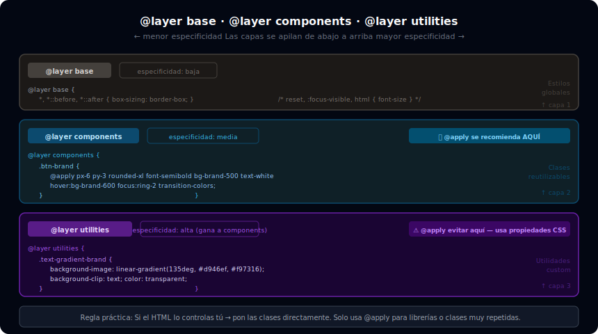

# @layer, @apply y Utilidades Personalizadas

## 🎯 Objetivos

- Entender los tres layers de CSS en Tailwind: base, components, utilities
- Crear utilidades custom con `@layer utilities` que funcionen como las nativas
- Usar `@apply` de forma moderada y en el contexto correcto
- Conocer los límites de `@apply` y cuándo NO usarlo
- Crear variantes custom con `@custom-variant` (v4)

---



---

## 1. El sistema de capas de Tailwind

Tailwind organiza su CSS en tres capas con orden de especificidad definido:

```css
/* Así está organizado internamente Tailwind */

@layer base {
  /* Reset y estilos globales — menor especificidad */
  *, *::before, *::after {
    box-sizing: border-box;
    border-width: 0;
  }
  h1, h2, h3 { font-size: inherit; font-weight: inherit; }
}

@layer components {
  /* Clases reutilizables (Tailwind no tiene muchas por default) */
  .container {
    width: 100%;
    margin-right: auto;
    margin-left: auto;
  }
}

@layer utilities {
  /* Todas las classes de utilidad — mayor especificidad */
  .flex    { display: flex; }
  .hidden  { display: none; }
  .text-sm { font-size: 0.875rem; }
}
```

El orden importa: `utilities` siempre gana sobre `components` que gana sobre `base`.

---

## 2. @layer base: reset y estilos globales

```css
@import "tailwindcss";

@layer base {
  /* Tipografía base del documento */
  html {
    font-family: var(--font-body, 'Inter', system-ui, sans-serif);
    -webkit-font-smoothing: antialiased;
    -moz-osx-font-smoothing: grayscale;
  }

  /* Estilos de enfoque globales accesibles */
  :focus-visible {
    outline: 2px solid var(--color-primary, #0ea5e9);
    outline-offset: 2px;
  }

  /* Scrollbar styling (Webkit) */
  ::-webkit-scrollbar {
    width: 6px;
    height: 6px;
  }
  ::-webkit-scrollbar-track { background: #1f2937; }
  ::-webkit-scrollbar-thumb { background: #374151; border-radius: 3px; }
  ::-webkit-scrollbar-thumb:hover { background: #4b5563; }

  /* Selección de texto */
  ::selection {
    background-color: rgb(14 165 233 / 0.25);
    color: #0c4a6e;
  }

  /* Tipografía semántica (se puede hacer también desde el plugin typography) */
  h1 { @apply text-4xl font-bold tracking-tight; }
  h2 { @apply text-3xl font-semibold tracking-tight; }
  h3 { @apply text-2xl font-semibold; }
  h4 { @apply text-xl font-medium; }
}
```

---

## 3. @layer utilities: utilidades custom

Las utilidades custom son clases de **un solo propósito** que se comportan exactamente como las nativas de Tailwind (compatibles con variantes `hover:`, `md:`, `dark:`, etc.):

```css
@import "tailwindcss";

@layer utilities {
  /* Gradiente de texto — utilitario reutilizable */
  .text-gradient {
    background-clip: text;
    -webkit-background-clip: text;
    color: transparent;
  }

  /* Ocultar scrollbar pero mantener funcionalidad */
  .scrollbar-hide {
    -ms-overflow-style: none;
    scrollbar-width: none;
  }
  .scrollbar-hide::-webkit-scrollbar {
    display: none;
  }

  /* Truncar texto a N líneas */
  .clamp-2 {
    display: -webkit-box;
    -webkit-line-clamp: 2;
    -webkit-box-orient: vertical;
    overflow: hidden;
  }
  .clamp-3 { -webkit-line-clamp: 3; }

  /* Aspect ratio personalizado */
  .aspect-golden {
    aspect-ratio: 1.618 / 1;
  }

  /* Full bleed — sale del contenedor padre */
  .full-bleed {
    width: 100vw;
    margin-left: calc(-50vw + 50%);
  }
}
```

```html
<!-- Las utilidades custom aceptan variantes como las nativas -->
<h2 class="text-gradient bg-gradient-to-r from-sky-400 to-indigo-500 text-4xl font-bold">
  Gradiente animado
</h2>

<!-- Compatibles con responsive y dark -->
<div class="clamp-2 md:clamp-3 dark:text-gray-300">
  Texto largo que se trunca diferente en cada breakpoint...
</div>
```

---

## 4. @layer components: componentes reutilizables

Los componentes encapsulan **múltiples utilidades** en una clase semántica. Se usan **con moderación**:

```css
@layer components {
  /* Botón primario — úsalo solo si realmente lo repites en todo el proyecto */
  .btn {
    @apply inline-flex items-center justify-center gap-2;
    @apply px-4 py-2.5 rounded-lg font-medium text-sm;
    @apply transition-colors duration-200;
    @apply focus:outline-none focus:ring-2 focus:ring-offset-2;
  }

  .btn-primary {
    @apply bg-sky-600 text-white hover:bg-sky-700;
    @apply focus:ring-sky-500;
  }

  .btn-secondary {
    @apply bg-gray-100 text-gray-900 hover:bg-gray-200;
    @apply focus:ring-gray-400;
  }

  .btn-ghost {
    @apply text-gray-700 hover:bg-gray-100;
    @apply focus:ring-gray-400;
  }

  /* Card base */
  .card {
    @apply rounded-2xl bg-white shadow-sm border border-gray-100;
    @apply p-6;
  }

  /* Badge */
  .badge {
    @apply inline-flex items-center px-2.5 py-0.5;
    @apply rounded-full text-xs font-medium;
  }
}
```

```html
<!-- HTML limpio usando los componentes -->
<button class="btn btn-primary">Continuar</button>
<button class="btn btn-ghost">Cancelar</button>
<div class="card">...</div>
<span class="badge bg-sky-100 text-sky-700">Nuevo</span>
```

---

## 5. @apply: reglas de uso

`@apply` extrae clases de Tailwind en una regla CSS. Es útil pero tiene costos:

### Cuándo SÍ usar @apply

```css
/* ✅ Un componente muy repetido en muchos archivos HTML */
.btn-primary {
  @apply bg-sky-600 text-white px-6 py-2.5 rounded-lg font-medium hover:bg-sky-700;
}

/* ✅ Estilos que se aplican a elementos generados (Markdown, CMS) */
.prose-content h2 {
  @apply text-2xl font-bold text-gray-900 mt-8 mb-4;
}

/* ✅ Integración con framework (Angular, Vue) donde el HTML es template */
/* En un componente Vue: */
.c-card {
  @apply rounded-xl bg-white shadow-md p-6 hover:shadow-lg transition-shadow;
}
```

### Cuándo NO usar @apply

```css
/* ❌ Elemento que aparece una sola vez */
.hero-title {
  @apply text-5xl font-bold text-gray-900;
  /* Mejor poner esas clases directamente en el HTML */
}

/* ❌ Para "organizar" o "limpiar" clases del HTML */
/* Si ves muchas clases en tu HTML, probablemente necesitas un componente
   de framework (React, Vue) o un partial de HTML, no @apply */

/* ❌ Para capas donde no tiene sentido */
@layer utilities {
  /* ❌ @apply en utilities rompe la composabilidad */
  .flex-center {
    @apply flex items-center justify-center; /* Usa la clase directamente */
  }
}
```

### Limitaciones de @apply

```css
/* ❌ No puedes usar @apply con variantes dinámicas */
.mi-clase {
  @apply hover:bg-sky-600;   /* OK */
  @apply dark:text-white;    /* OK */
  /* Pero no puedes hacer esto desde HTML: hover:mi-clase */
}

/* ❌ No funciona bien con clases arbitrarias */
.mi-clase {
  @apply bg-[#ff6b6b]; /* Puede funcionar pero es frágil */
}
```

---

## 6. @custom-variant (Tailwind v4)

En Tailwind v4 puedes crear variantes personalizadas:

```css
@import "tailwindcss";

/* Variante para cuando el sidebar está expandido */
@custom-variant sidebar-open (&:where([data-sidebar="open"] *));

/* Variante para elementos activos en nav */
@custom-variant nav-active (&[aria-current="page"]);

/* Variante para el estado de carga */
@custom-variant loading (.loading &);
```

```html
<!-- Uso en HTML -->
<nav data-sidebar="open">
  <div class="sidebar-open:ml-64 transition-all">Contenido</div>
</nav>

<a href="/inicio" aria-current="page"
   class="text-gray-600 nav-active:text-sky-600 nav-active:font-semibold">
  Inicio
</a>
```

---

## 7. Resumen: cuándo usar cada herramienta

| Herramienta | Úsala cuando... | Evítala cuando... |
|-------------|-----------------|-------------------|
| `@layer base` | Resetes globales, estilos de tipografía raíz | Estilos de componentes específicos |
| `@layer utilities` | Utilidades de un solo propósito reutilizables en todo el proyecto | Bloques de múltiples propiedades |
| `@layer components` | Componente que aparece en 5+ lugares distintos | Un elemento que solo existe una vez |
| `@apply` | Componentes de framework (Vue/React), Markdown generado | HTML que controlas directamente |
| CSS custom | Propiedades no cubiertas por Tailwind (`clip-path`, animaciones complejas) | Todo lo demás |

---

## ✅ Checklist de Verificación

- [ ] Tengo al menos 2 utilidades custom en `@layer utilities`
- [ ] Si uso `@layer components`, es para algo que se repite 5+ veces
- [ ] No uso `@apply` para estilos que solo aparecen una vez
- [ ] Mis utilidades custom aceptan variantes (`hover:`, `dark:`, `md:`)
- [ ] Los estilos globales del documento están en `@layer base`
