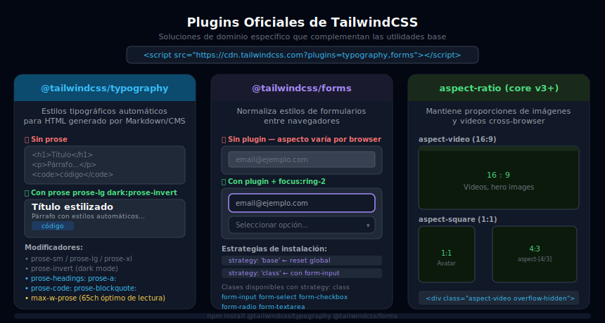

# Plugins Oficiales de TailwindCSS

## 🎯 Objetivos

- Entender para qué sirve cada plugin oficial de Tailwind
- Instalar y configurar `@tailwindcss/typography`, `@tailwindcss/forms` y `@tailwindcss/aspect-ratio`
- Aplicar el plugin Typography para estilizar contenido editorial (markdown, HTML dinámico)
- Usar `prose` y sus modificadores: `prose-sm/lg/xl`, `prose-invert`, `prose-headings:`, `prose-links:`

---



---

## 1. ¿Por qué existen los plugins?

Tailwind es intencionalmente minimalista: solo incluye utilidades de propósito general. Los plugins resuelven **problemas específicos de dominio** que no encajan bien en el modelo utility-first:

| Problema | Plugin | Por qué lo necesitas |
|----------|--------|---------------------|
| HTML generado por markdown / CMS no tiene clases | `@tailwindcss/typography` | No puedes poner clases en el HTML que genera un parser de markdown |
| Los estilos de `<input>` varían entre navegadores | `@tailwindcss/forms` | Cada browser renderiza formularios diferente sin reset |
| Mantener aspect ratios de imágenes/videos es verboso | `@tailwindcss/aspect-ratio` | `aspect-video` y `aspect-square` necesitan soporte cross-browser |

---

## 2. @tailwindcss/typography

### ¿Qué hace?

Aplica **estilos tipográficos completos** a bloques de HTML con la clase `prose`. Ideal para:
- Contenido de artículos de blog
- Documentación renderizada desde Markdown
- Contenido proveniente de un CMS

Sin el plugin, el HTML generado por un parser de Markdown se ve sin estilo:

```html
<!-- Sin plugin: todo igual, sin jerarquía -->
<article>
  <h1>Mi artículo</h1>
  <p>Introducción del artículo...</p>
  <h2>Primera sección</h2>
  <ul><li>Punto 1</li></ul>
</article>

<!-- Con prose: estilos automáticos en todos los elementos hijos -->
<article class="prose">
  <h1>Mi artículo</h1>       <!-- Tamaño, peso, margin automáticos -->
  <p>Introducción...</p>     <!-- line-height, color, margin -->
  <h2>Primera sección</h2>   <!-- Jerarquía visual clara -->
  <ul><li>Punto 1</li></ul>  <!-- Bullet styles, spacing -->
</article>
```

### Instalación

```bash
# Con Vite (producción)
pnpm add -D @tailwindcss/typography

# tailwind.config.js
plugins: [require('@tailwindcss/typography')]
```

```html
<!-- Con CDN (desarrollo/ejercicios): añade ?plugins=typography -->
<script src="https://cdn.tailwindcss.com?plugins=typography"></script>
```

### Clase base: `prose`

```html
<!-- Prose base: aplica estilos a todos los hijos -->
<article class="prose">
  <h1>Título</h1>
  <p>Párrafo con estilos automáticos</p>
  <a href="#">Link con color y underline</a>
  <code>Código inline con fondo</code>
  <pre><code>Bloque de código</code></pre>
  <blockquote>Cita con borde izquierdo</blockquote>
  <ul><li>Lista con bullets estilizados</li></ul>
</article>
```

### Modificadores de tamaño

```html
<!-- Controlan el tamaño base de todas las clases del prose -->
<article class="prose prose-sm">...</article>   <!-- 14px base -->
<article class="prose">...</article>            <!-- 16px base (default) -->
<article class="prose prose-lg">...</article>  <!-- 18px base -->
<article class="prose prose-xl">...</article>  <!-- 20px base -->
<article class="prose prose-2xl">...</article> <!-- 24px base -->
```

### Dark mode: `prose-invert`

```html
<!-- prose-invert: invierte los colores para fondos oscuros -->
<article class="prose dark:prose-invert">
  <!-- En modo oscuro: texto blanco, headings claros, links claros -->
</article>
```

### Personalización con modificadores

El plugin expone modificadores para cada tipo de elemento:

```html
<!-- Personaliza headings, links, code, etc. con color del tema -->
<article class="prose
  prose-headings:font-display
  prose-headings:text-gray-900
  prose-h1:text-4xl
  prose-a:text-sky-600
  prose-a:no-underline
  prose-a:hover:underline
  prose-code:text-sky-700
  prose-code:bg-sky-50
  prose-code:rounded
  prose-code:px-1.5
  prose-blockquote:border-sky-400
  prose-img:rounded-xl
  dark:prose-invert
  dark:prose-a:text-sky-400">
```

### `max-w-prose`

La clase `max-w-prose` es parte del core de Tailwind (no del plugin) y establece `max-width: 65ch` — el ancho óptimo de lectura para tipografía:

```html
<article class="prose prose-lg max-w-prose mx-auto">
  <!-- El texto no se expande más de ~65 caracteres → óptimo para lectura -->
</article>
```

---

## 3. @tailwindcss/forms

### ¿Qué hace?

Aplica un **reset visual a elementos de formulario** (`input`, `select`, `textarea`, `checkbox`, `radio`) para que tengan un aspecto base consistente entre navegadores.

### Instalación y uso

```bash
pnpm add -D @tailwindcss/forms
```

```javascript
// tailwind.config.js
plugins: [require('@tailwindcss/forms')]
// o con estrategia:
plugins: [require('@tailwindcss/forms')({ strategy: 'class' })]
```

### Estrategias

```javascript
// strategy: 'base' (default) — aplica reset globalmente a todos los inputs
plugins: [require('@tailwindcss/forms')({ strategy: 'base' })]

// strategy: 'class' — aplica reset solo a elementos con clase form-input, etc.
plugins: [require('@tailwindcss/forms')({ strategy: 'class' })]
```

```html
<!-- Con estrategia 'class': debes agregar la clase al elemento -->
<input type="text" class="form-input px-4 py-2 rounded-lg border border-gray-300" />
<select class="form-select px-4 py-2 rounded-lg border border-gray-300"></select>
<textarea class="form-textarea px-4 py-2 rounded-lg border border-gray-300"></textarea>
<input type="checkbox" class="form-checkbox text-sky-500" />
<input type="radio" class="form-radio text-sky-500" />
```

### Estilizado con Tailwind tras el reset

```html
<!-- El plugin hace el reset; tú añades el estilo con utilidades normales -->
<input type="email"
  class="form-input w-full rounded-xl px-4 py-3
         border border-gray-300 bg-white text-gray-900
         focus:ring-2 focus:ring-sky-500 focus:border-sky-500
         dark:bg-gray-800 dark:border-gray-600 dark:text-white
         transition-colors" />
```

---

## 4. @tailwindcss/aspect-ratio

### ¿Qué hace?

Proporciona clases `aspect-*` para mantener proporciones de aspecto en imágenes y videos.

> **Nota**: En Tailwind v3+, `aspect-ratio` es parte del core. Este plugin fue necesario para v2. Para proyectos con v3+ usa `aspect-video`, `aspect-square`, `aspect-[16/9]` directamente.

```html
<!-- Core de Tailwind v3+ (sin plugin) -->
<div class="aspect-video">                  <!-- 16:9 -->
<div class="aspect-square">                 <!-- 1:1 -->
<div class="aspect-[4/3]">                  <!-- 4:3 -->
<div class="aspect-[16/9] overflow-hidden rounded-xl">
  
</div>
```

---

## 5. Carga de plugins en CDN

Para ejercicios con CDN puedes cargar múltiples plugins:

```html
<!-- Typography + Forms -->
<script src="https://cdn.tailwindcss.com?plugins=typography,forms"></script>

<!-- Solo typography -->
<script src="https://cdn.tailwindcss.com?plugins=typography"></script>
```

---

## 6. Qué hace `prose` con cada elemento HTML

| Elemento | Efecto de `prose` |
|----------|--------------------|
| `h1` | `font-size: 2.25em`, `font-weight: 800`, `margin-bottom: 0.8em` |
| `h2` | `font-size: 1.5em`, `font-weight: 700`, `margin-top: 1.6em` |
| `p` | `line-height: 1.75`, `margin-top: 1.25em` |
| `a` | Color especial, `text-decoration: underline` |
| `code` (inline) | Fondo, padding, font-family `monospace` |
| `pre > code` | Bloque con fondo oscuro, scroll horizontal |
| `blockquote` | Borde izquierdo, color atenuado |
| `ul/ol` | Bullets y números con sangría correcta |
| `img` | `border-radius: 0.375rem`, responsive |
| `hr` | Línea divisoria estilizada |

---

## ✅ Checklist de Verificación

- [ ] Cargaste el plugin con `?plugins=typography` en CDN o con `require(...)` en config
- [ ] Aplicaste `prose` a un `article` o `div` con HTML complejo
- [ ] Verificaste que `prose-invert` funciona en dark mode
- [ ] Personalizas al menos un modificador (`prose-headings:`, `prose-a:`, etc.)
- [ ] Usas `max-w-prose mx-auto` para limitar el ancho de lectura

## 📚 Recursos

- [Plugin Typography Docs](https://tailwindcss.com/docs/typography-plugin)
- [Plugin Forms Docs](https://github.com/tailwindlabs/tailwindcss-forms)
- [Tailwind Aspect Ratio](https://tailwindcss.com/docs/aspect-ratio)
