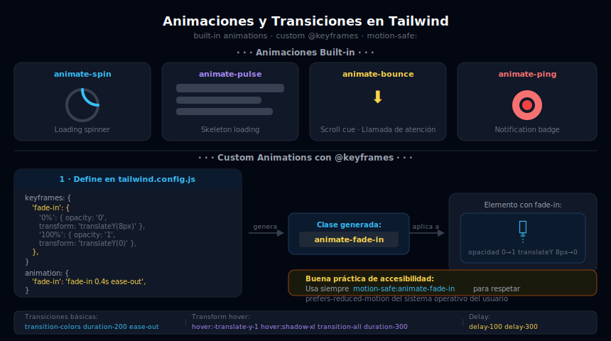

# Animaciones y Transiciones

## 🎯 Objetivos

- Aplicar transiciones suaves con `transition`, `duration-*`, `ease-*` y `delay-*`
- Usar las 4 animaciones built-in: `animate-spin`, `animate-pulse`, `animate-bounce`, `animate-ping`
- Definir animaciones custom con `@keyframes` en `tailwind.config.js`
- Usar `motion-safe:` y `motion-reduce:` para respetar las preferencias de accesibilidad del usuario

---



---

## 1. Transiciones — `transition-*`

### La propiedad base

```html
<!-- transition: activa la transición para las propiedades más comunes -->
<!-- por defecto: color, background-color, border-color, outline-color, -->
<!--              text-decoration-color, fill, stroke, opacity, box-shadow, -->
<!--              transform, filter, backdrop-filter -->
<button class="bg-sky-500 hover:bg-sky-600 transition">Hover me</button>

<!-- transition-colors: solo color/background/border -->
<button class="bg-sky-500 hover:bg-sky-600 transition-colors">...</button>

<!-- transition-shadow: solo box-shadow -->
<div class="shadow-md hover:shadow-xl transition-shadow">...</div>

<!-- transition-transform: solo transform -->


<!-- transition-all: todas las propiedades (usar con moderación) -->
<div class="hover:-translate-y-1 hover:shadow-xl transition-all">...</div>

<!-- transition-none: desactiva transiciones (útil para tests o accesibilidad) -->
<div class="transition-none">...</div>
```

### Duración: `duration-*`

```html
<!-- Valores: 75, 100, 150, 200, 300, 500, 700, 1000 (ms) -->
<button class="hover:bg-sky-600 transition-colors duration-150">Rápido (150ms)</button>
<button class="hover:bg-sky-600 transition-colors duration-300">Normal (300ms)</button>
<button class="hover:bg-sky-600 transition-colors duration-700">Lento (700ms)</button>

<!-- Regla práctica:
  - 75-150ms: feedback de interacción (hover, focus)
  - 200-300ms: cambios de estado moderados
  - 500ms+: animaciones de entrada/salida
-->
```

### Curva de aceleración: `ease-*`

```html
<!-- ease-in: lento al inicio, rápido al final — para salidas -->
<div class="transition duration-300 ease-in hover:opacity-0">...</div>

<!-- ease-out: rápido al inicio, lento al final — para entradas -->
<div class="transition duration-300 ease-out hover:scale-110">...</div>

<!-- ease-in-out: suave en ambos extremos — para la mayoría de casos -->
<div class="transition duration-300 ease-in-out hover:translate-y-1">...</div>

<!-- ease-linear: velocidad constante — para loading spinners -->
<div class="animate-spin ease-linear">...</div>
```

### Delay: `delay-*`

```html
<!-- Retraso antes de que empiece la transición -->
<!-- Valores: 0, 75, 100, 150, 200, 300, 500, 700, 1000 -->
<div class="group">
  <p class="opacity-0 group-hover:opacity-100 transition-opacity delay-150">
    Aparece con retraso
  </p>
</div>

<!-- Útil para animar hijos en secuencia -->
<div class="group flex gap-4">
  <div class="hover:scale-110 transition delay-0">1</div>
  <div class="hover:scale-110 transition delay-100">2</div>
  <div class="hover:scale-110 transition delay-200">3</div>
</div>
```

---

## 2. Animaciones Built-in

Tailwind incluye 4 animaciones predefinidas (y sus respectivos `@keyframes`):

### `animate-spin` — Rotación continua

```html
<!-- Loading spinner -->
<div class="animate-spin h-8 w-8 rounded-full
            border-4 border-gray-200 border-t-sky-500">
</div>

<!-- Se puede ajustar la duración con duration-* -->
<!-- Nota: animate-spin incluye el loop infinito automáticamente -->
```

### `animate-pulse` — Fade in/out (skeleton loading)

```html
<!-- Skeleton loading: simula contenido mientras carga -->
<div class="animate-pulse space-y-4">
  <!-- Línea de título -->
  <div class="h-6 bg-gray-200 dark:bg-gray-700 rounded w-3/4"></div>
  <!-- Párrafo -->
  <div class="space-y-2">
    <div class="h-4 bg-gray-200 dark:bg-gray-700 rounded"></div>
    <div class="h-4 bg-gray-200 dark:bg-gray-700 rounded w-5/6"></div>
  </div>
</div>
```

### `animate-bounce` — Rebote vertical

```html
<!-- Llamada de atención — úsalo con moderación -->
<span class="animate-bounce text-2xl">⬇️</span>

<!-- CTA arrow que llama a hacer scroll -->
<div class="flex justify-center mt-16">
  <div class="animate-bounce text-gray-400">
    <svg class="w-6 h-6" fill="none" viewBox="0 0 24 24" stroke="currentColor">
      <path stroke-linecap="round" stroke-linejoin="round" stroke-width="2" d="M19 9l-7 7-7-7"/>
    </svg>
  </div>
</div>
```

### `animate-ping` — Onda expansiva (notifications)

```html
<!-- Notification badge con efecto ping -->
<div class="relative">
  <button class="p-2 rounded-lg">🔔</button>
  <!-- El ping va sobre el botón como indicador de notificación -->
  <span class="absolute -top-1 -right-1">
    <span class="animate-ping absolute h-3 w-3 rounded-full bg-red-400 opacity-75"></span>
    <span class="relative block h-3 w-3 rounded-full bg-red-500"></span>
  </span>
</div>
```

---

## 3. Animaciones Custom con `@keyframes`

### Definición en `tailwind.config.js`

```javascript
// tailwind.config.js
module.exports = {
  theme: {
    extend: {
      // keyframes: define el movimiento
      keyframes: {
        'fade-in': {
          '0%':   { opacity: '0' },
          '100%': { opacity: '1' },
        },
        'slide-up': {
          '0%':   { transform: 'translateY(16px)', opacity: '0' },
          '100%': { transform: 'translateY(0)',    opacity: '1' },
        },
        'slide-down': {
          '0%':   { transform: 'translateY(-16px)', opacity: '0' },
          '100%': { transform: 'translateY(0)',     opacity: '1' },
        },
        'scale-in': {
          '0%':   { transform: 'scale(0.9)', opacity: '0' },
          '100%': { transform: 'scale(1)',   opacity: '1' },
        },
        wiggle: {
          '0%, 100%': { transform: 'rotate(-3deg)' },
          '50%':       { transform: 'rotate(3deg)' },
        },
      },
      // animation: crea la clase animate-{nombre}
      animation: {
        'fade-in':    'fade-in 0.4s ease-out',
        'slide-up':   'slide-up 0.5s ease-out',
        'slide-down': 'slide-down 0.3s ease-out',
        'scale-in':   'scale-in 0.2s ease-out',
        wiggle:        'wiggle 0.6s ease-in-out infinite',
      },
    },
  },
}
```

### Uso de las animaciones custom

```html
<!-- Hero section con fade-in al cargar -->
<section class="animate-fade-in">...</section>

<!-- Cards con slide-up escalonado (usando delay) -->
<div class="animate-slide-up">Card 1</div>
<div class="animate-slide-up delay-100">Card 2</div>
<div class="animate-slide-up delay-200">Card 3</div>

<!-- Modal con scale-in -->
<div class="animate-scale-in">
  <!-- Contenido del modal -->
</div>

<!-- Botón con wiggle en estado de error -->
<button class="animate-wiggle">Inténtalo de nuevo</button>
```

### CDN: animaciones custom

En CDN, los `@keyframes` custom van en `tailwind.config`:

```html
<script>
  tailwind.config = {
    theme: {
      extend: {
        keyframes: {
          'fade-in': {
            '0%':   { opacity: '0', transform: 'translateY(8px)' },
            '100%': { opacity: '1', transform: 'translateY(0)' },
          },
        },
        animation: {
          'fade-in': 'fade-in 0.5s ease-out forwards',
        },
      },
    },
  }
</script>

<!-- Luego: animate-fade-in está disponible como clase -->
<div class="animate-fade-in">Aparece suavemente</div>
```

---

## 4. `motion-safe:` y `motion-reduce:` — Accesibilidad en Animaciones

### El problema

Algunos usuarios activan `prefers-reduced-motion: reduce` en su sistema operativo porque las animaciones les causan mareos, náuseas o les distraen (relacionado con condiciones como vértigo, epilepsia fotosensible, ADHD).

### Las variantes

```html
<!-- motion-safe: aplica la clase SOLO SI el usuario no tiene reduce activado -->
<!-- (la animación se desactiva automáticamente para quienes la han reducido) -->
<div class="motion-safe:animate-fade-in">
  Aparece animado si el usuario NO ha reducido el movimiento
</div>

<!-- motion-reduce: aplica la clase SOLO SI reduce ESTÁ activado -->
<!-- (útil para ofrecer alternativas) -->
<div class="motion-safe:animate-spin motion-reduce:opacity-70">
  Spinner normal para todos, pero más opaco si se prefiere menos movimiento
</div>
```

### Ejemplo práctico: CTA con scroll cue

```html
<!-- ❌ INCORRECTO: forced animation, ignores preferences -->
<div class="animate-bounce">Scroll para ver más</div>

<!-- ✅ CORRECTO: respeta prefers-reduced-motion -->
<div class="motion-safe:animate-bounce">Scroll para ver más</div>
```

### Regla práctica

> Cualquier animación que no es crítica para la UX debe ir con `motion-safe:`.
> Las transiciones de feedback de interacción (hover, focus) son OK sin `motion-safe:`
> porque son respuestas directas a la acción del usuario, no decorativas.

```html
<!-- Transición de hover — OK sin motion-safe -->
<button class="hover:bg-sky-600 transition-colors duration-150">Botón</button>

<!-- Animación decorativa — DEBE ir con motion-safe -->
<div class="motion-safe:animate-slide-up">Texto hero</div>
```

---

## 5. `will-change-*` — Optimización de Performance

```html
<!-- Avisa al browser que este elemento va a transformarse -->
<!-- El browser puede crear un layer de composición anticipadamente -->
<!-- Usar solo cuando hay un problema de rendimiento demostrado -->
<div class="will-change-transform hover:scale-105 transition-transform">
  Imagen con hover scale
</div>

<!-- Quitar will-change cuando la animación termina (en JS) -->
<!-- element.classList.remove('will-change-transform') -->
```

---

## ✅ Checklist de Verificación

- [ ] Usas `transition-colors` en botones y links con hover de color
- [ ] Usas `animate-spin` en tu loading spinner
- [ ] Usas `animate-pulse` en skeleton loaders
- [ ] Defines al menos 1 animación custom en `keyframes` + `animation` del config
- [ ] Wraps las animaciones decorativas con `motion-safe:`
- [ ] Usas `duration-*` y `ease-*` para ajustar la sensación de las transiciones

## 📚 Recursos

- [Tailwind Docs: Transitions](https://tailwindcss.com/docs/transition-property)
- [Tailwind Docs: Animation](https://tailwindcss.com/docs/animation)
- [MDN: prefers-reduced-motion](https://developer.mozilla.org/en-US/docs/Web/CSS/@media/prefers-reduced-motion)
- [animate.style](https://animate.style) — Referencia visual de animaciones
