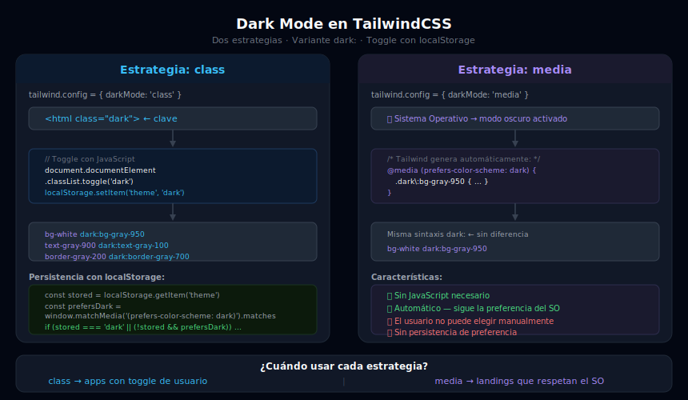

# Dark Mode con TailwindCSS

## 🎯 Objetivos

- Entender la diferencia entre la estrategia `class` y `media` para dark mode
- Aplicar la variante `dark:` en todos los elementos de un layout
- Implementar un toggle de dark mode con JavaScript que persiste en `localStorage`
- Integrar CSS variables con el sistema de dark mode de Tailwind

---



---

## 1. Dos estrategias para Dark Mode

### Estrategia `media` (basada en el sistema operativo)

```javascript
// tailwind.config.js
module.exports = {
  darkMode: 'media', // responde a prefers-color-scheme del OS
}
```

```css
/* Internamente Tailwind genera: */
@media (prefers-color-scheme: dark) {
  .dark\:bg-gray-900 { background-color: #111827; }
}
```

```html
<!-- dark: aplica automáticamente si el OS está en modo oscuro -->
<body class="bg-white dark:bg-gray-900 text-gray-900 dark:text-gray-100">
  ...
</body>
```

**Ventaja**: No requiere JavaScript.
**Desventaja**: El usuario no puede elegir el modo — lo controla el SO.

---

### Estrategia `class` (programática) ← **RECOMENDADA**

```javascript
// tailwind.config.js
module.exports = {
  darkMode: 'class', // aplica dark: cuando <html> tiene la clase 'dark'
}
```

```css
/* Internamente Tailwind genera: */
.dark .dark\:bg-gray-900 { background-color: #111827; }
```

```html
<!-- dark: aplica cuando el elemento <html> tiene la clase 'dark' -->
<html class="dark">
  <body class="bg-white dark:bg-gray-900">
    <!-- ... -->
  </body>
</html>
```

**Ventaja**: Control total — el usuario puede cambiar el tema independientemente del SO.
**Desventaja**: Requiere JavaScript para gestionar la clase.

---

## 2. Toggle con JavaScript

### Versión básica

```html
<button onclick="document.documentElement.classList.toggle('dark')">
  Toggle
</button>
```

### Versión completa con `localStorage`

```javascript
// Función para inicializar el tema al cargar la página
function initDarkMode() {
  // Prioridad: localStorage > preferencia del SO > default claro
  const stored = localStorage.getItem('theme')
  const prefersDark = window.matchMedia('(prefers-color-scheme: dark)').matches

  if (stored === 'dark' || (!stored && prefersDark)) {
    document.documentElement.classList.add('dark')
  } else {
    document.documentElement.classList.remove('dark')
  }
}

// Función para cambiar el tema
function toggleDarkMode() {
  const isDark = document.documentElement.classList.toggle('dark')
  localStorage.setItem('theme', isDark ? 'dark' : 'light')
  updateToggleButton(isDark)
}

// Actualiza el botón de toggle
function updateToggleButton(isDark) {
  const btn = document.getElementById('theme-toggle')
  if (btn) {
    btn.setAttribute('aria-pressed', isDark)
    btn.textContent = isDark ? '☀️ Modo Claro' : '🌙 Modo Oscuro'
  }
}

// Ejecutar al cargar el DOM
document.addEventListener('DOMContentLoaded', () => {
  initDarkMode()
  const isDark = document.documentElement.classList.contains('dark')
  updateToggleButton(isDark)
})
```

### Prevenir el flash de tema incorrecto (FOUC)

Al cargar una página con `localStorage`, puede haber un destello blanco antes de que el JS aplique la clase `dark`. La solución es ejecutar el script **antes** de que el DOM se renderice:

```html
<!DOCTYPE html>
<html lang="es">
<head>
  <!-- ✅ Script inline ANTES del resto del head — sin defer, sin async -->
  <script>
    // Se ejecuta inmediatamente, antes de que el browser pinte
    if (localStorage.theme === 'dark' ||
        (!('theme' in localStorage) &&
         window.matchMedia('(prefers-color-scheme: dark)').matches)) {
      document.documentElement.classList.add('dark')
    }
  </script>
  <!-- Resto del head -->
</head>
```

---

## 3. Aplicar `dark:` en el layout

### Reglas de uso

```html
<!-- Forma correcta: primero el valor base (light), luego dark: -->
<body class="bg-white dark:bg-gray-950 text-gray-900 dark:text-gray-100">
```

### Colores por elemento

```html
<!-- Fondo del body / layout -->
<body class="bg-gray-50 dark:bg-gray-950">

<!-- Superficies (cards, nav, sidebar) -->
<div class="bg-white dark:bg-gray-900">

<!-- Bordes -->
<div class="border border-gray-200 dark:border-gray-700">

<!-- Texto: 3 niveles de contraste -->
<h1 class="text-gray-950 dark:text-gray-50">          <!-- Texto principal: máximo contraste -->
<p  class="text-gray-700 dark:text-gray-300">          <!-- Texto body: contraste cómodo -->
<span class="text-gray-500 dark:text-gray-400">        <!-- Texto auxiliar: información secundaria -->

<!-- Inputs -->
<input class="bg-white dark:bg-gray-800
              border-gray-300 dark:border-gray-600
              text-gray-900 dark:text-gray-100
              placeholder:text-gray-400 dark:placeholder:text-gray-500" />

<!-- Sombras: en dark mode las sombras se cambian por bordes -->
<div class="shadow-md dark:shadow-none dark:border dark:border-gray-700">

<!-- Icons que cambian de color -->
<svg class="text-gray-500 dark:text-gray-400">
```

### Patrón completo: Card responsive con dark mode

```html
<article class="bg-white dark:bg-gray-900
                border border-gray-200 dark:border-gray-700
                rounded-2xl p-6 shadow-sm dark:shadow-none">

  <span class="text-xs text-gray-500 dark:text-gray-400 uppercase tracking-widest">
    Categoría
  </span>

  <h2 class="mt-2 text-xl font-bold text-gray-900 dark:text-gray-50">
    Título del artículo
  </h2>

  <p class="mt-2 text-gray-600 dark:text-gray-400 text-sm leading-relaxed">
    Descripción breve del artículo que explica de qué trata.
  </p>

  <a href="#"
    class="mt-4 inline-block text-sky-600 dark:text-sky-400
           text-sm font-medium hover:underline">
    Leer más →
  </a>
</article>
```

---

## 4. Dark mode con CSS Variables

La combinación de CSS variables con dark mode es especialmente poderosa:

```css
/* Definir tokens semánticos */
:root {
  --color-bg:       #f9fafb;
  --color-surface:  #ffffff;
  --color-text:     #111827;
  --color-text-sub: #6b7280;
  --color-border:   #e5e7eb;
  --color-primary:  #0ea5e9;
}

/* Sobreescribir en dark mode */
.dark {
  --color-bg:       #030712;
  --color-surface:  #111827;
  --color-text:     #f9fafb;
  --color-text-sub: #9ca3af;
  --color-border:   #374151;
  --color-primary:  #38bdf8;
}
```

```html
<!-- El HTML usa los tokens — no necesita dark: por componente -->
<div class="bg-[var(--color-surface)] text-[var(--color-text)] border-[var(--color-border)]">
  <!-- Este elemento se adapta automáticamente al dark mode
       sin necesitar dark: en cada clase individualmente -->
</div>
```

---

## 5. Dark mode en el plugin Typography

```html
<article class="prose dark:prose-invert">
  <!-- prose: tema claro (texto oscuro, headings oscuros)  -->
  <!-- prose-invert: tema oscuro (texto claro, headings claros) -->
</article>
```

Con personalización:

```html
<article class="prose
  prose-headings:text-gray-900 dark:prose-headings:text-gray-100
  prose-a:text-sky-600 dark:prose-a:text-sky-400
  dark:prose-invert">
</article>
```

---

## 6. Selector alternativo: `data-theme`

Algunos proyectos prefieren usar `data-theme` en lugar de la clase `dark`:

```javascript
// tailwind.config.js (Tailwind v3.4+)
module.exports = {
  darkMode: ['selector', '[data-theme="dark"]'],
}
```

```html
<!-- Aplica dark: cuando html tiene data-theme="dark" -->
<html data-theme="dark">
```

```javascript
// Toggle
document.documentElement.dataset.theme =
  document.documentElement.dataset.theme === 'dark' ? 'light' : 'dark'
```

---

## ✅ Checklist de Verificación

- [ ] `darkMode: 'class'` está configurado en `tailwind.config`
- [ ] El toggle JS añade/quita la clase `dark` en `<html>`
- [ ] La preferencia se guarda en `localStorage`
- [ ] La primera carga detecta `prefers-color-scheme` del OS
- [ ] Todas las cards, inputs, textos y bordes tienen variante `dark:`
- [ ] El selector del botón de toggle actualiza su texto/ícono según el estado
- [ ] No hay elementos "rotos" en dark: fondos blancos con texto blanco, etc.

## 📚 Recursos

- [Tailwind Docs: Dark Mode](https://tailwindcss.com/docs/dark-mode)
- [MDN: prefers-color-scheme](https://developer.mozilla.org/en-US/docs/Web/CSS/@media/prefers-color-scheme)
- [web.dev: prefers-color-scheme](https://web.dev/prefers-color-scheme/)
