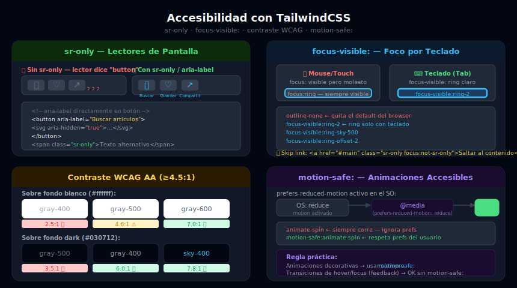

# Accesibilidad con TailwindCSS

## 🎯 Objetivos

- Entender los principios básicos de accesibilidad web (a11y) aplicados a Tailwind
- Usar `sr-only` y `not-sr-only` para contenido solo para lectores de pantalla
- Implementar `focus-visible:` para navegación accesible por teclado
- Verificar y corregir contraste de color (WCAG AA: relación ≥4.5:1)
- Usar atributos `aria-*` y roles semánticos junto con Tailwind
- Respetar `prefers-reduced-motion` con `motion-safe:` y `motion-reduce:`

---



---

## 1. `sr-only` — Contenido para Lectores de Pantalla

La clase `sr-only` oculta visualmente un elemento pero lo mantiene accesible para lectores de pantalla. Aplica:

```css
/* Lo que hace sr-only internamente */
.sr-only {
  position: absolute;
  width: 1px;
  height: 1px;
  padding: 0;
  margin: -1px;
  overflow: hidden;
  clip: rect(0, 0, 0, 0);
  white-space: nowrap;
  border-width: 0;
}
```

### Cuándo usar `sr-only`

```html
<!-- ✅ Botón solo con icono — el texto sr-only explica la acción -->
<button class="p-2 rounded-lg hover:bg-gray-100 dark:hover:bg-gray-800"
        aria-label="Cerrar menú">
  <!-- Icono visible -->
  <svg class="w-5 h-5 text-gray-700 dark:text-gray-300"
       aria-hidden="true" fill="none" viewBox="0 0 24 24" stroke="currentColor">
    <path stroke-linecap="round" stroke-linejoin="round" stroke-width="2"
          d="M6 18L18 6M6 6l12 12"/>
  </svg>
  <!-- Texto sr-only cuando no hay aria-label -->
  <span class="sr-only">Cerrar menú</span>
</button>

<!-- ✅ Skip link — permite saltar al contenido principal -->
<a href="#main-content"
   class="sr-only focus:not-sr-only focus:absolute focus:top-4 focus:left-4
          focus:z-50 focus:px-4 focus:py-2 focus:bg-sky-500 focus:text-white
          focus:rounded-lg font-medium">
  Saltar al contenido principal
</a>

<!-- ✅ Labels de formulario ocultos visualmente pero accesibles -->
<div class="relative">
  <label for="search" class="sr-only">Buscar artículos</label>
  <input id="search" type="search"
         class="w-full pl-10 pr-4 py-2 rounded-lg border border-gray-300"
         placeholder="Buscar..." />
</div>

<!-- ✅ aria-hidden en íconos decorativos (el lector de pantalla los ignora) -->
<span aria-hidden="true">📧</span>
<span class="sr-only">Email:</span>
<span>contacto@ejemplo.com</span>
```

### `not-sr-only` — Restaurar visibilidad

```html
<!-- Útil en combinación: oculto en mobile, visible en desktop -->
<span class="sr-only md:not-sr-only">Ver todos los artículos</span>

<!-- O el patrón del skip link de arriba: sr-only por defecto, visible en focus -->
<a class="sr-only focus:not-sr-only">Skip link</a>
```

---

## 2. `focus-visible:` — Foco Accesible por Teclado

El comportamiento por defecto de los browsers muestra el anillo de foco en casi todos los elementos, lo que puede verse "feo" cuando se hace click con el mouse. `focus-visible:` resuelve esto:

- **`:focus`** — se activa con CUALQUIER interacción: mouse, touch, teclado
- **`:focus-visible`** — se activa principalmente cuando el usuario navega con teclado o no tiene un puntero de alta precisión

```html
<!-- ❌ Incorrecto: sin foco visible — los usuarios de teclado no saben dónde están -->
<button class="outline-none">Botón inaccesible</button>

<!-- ❌ Incorrecto: foco siempre visible — molesto con mouse -->
<button class="focus:ring-2 focus:ring-sky-500">Foco al hacer click también</button>

<!-- ✅ Correcto: foco solo para teclado, invisible para mouse/touch -->
<button class="outline-none focus-visible:ring-2 focus-visible:ring-sky-500
               focus-visible:ring-offset-2 rounded-lg px-4 py-2">
  Accesible por teclado
</button>
```

### Sistema completo de foco

```html
<!-- Base reutilizable para todos los interactivos del proyecto -->

<!-- Botón primario -->
<button class="bg-sky-500 text-white px-5 py-2.5 rounded-xl
               outline-none
               focus-visible:ring-2 focus-visible:ring-sky-500
               focus-visible:ring-offset-2 focus-visible:ring-offset-white
               dark:focus-visible:ring-offset-gray-950">
  Acción principal
</button>

<!-- Link en navegación -->
<a href="#"
   class="text-gray-600 dark:text-gray-400 hover:text-gray-900 dark:hover:text-gray-100
          outline-none focus-visible:ring-2 focus-visible:ring-sky-500
          focus-visible:ring-offset-2 rounded-sm transition-colors">
  Link de nav
</a>

<!-- Input de formulario -->
<input class="block w-full rounded-lg border border-gray-300 dark:border-gray-600
              px-4 py-2.5 bg-white dark:bg-gray-800
              text-gray-900 dark:text-gray-100
              outline-none
              focus-visible:ring-2 focus-visible:ring-sky-500
              focus-visible:border-sky-500 transition-colors" />
```

---

## 3. Contraste de Color (WCAG AA)

### Requisitos mínimos

| Tipo de texto | Relación de contraste mínima |
|---------------|------------------------------|
| Texto normal (< 18pt / < 14pt bold) | **4.5:1** |
| Texto grande (≥ 18pt / ≥ 14pt bold) | **3:1** |
| Elementos UI (iconos, bordes de input) | **3:1** |

### Colores comunes de Tailwind y su contraste sobre white/gray-950

```
Sobre blanco (#ffffff):
  gray-900 (#111827)  → 16.0:1  ✅ Excelente
  gray-700 (#374151)  →  9.7:1  ✅ Excelente
  gray-500 (#6b7280)  →  4.6:1  ✅ AA aprobado (por muy poco)
  gray-400 (#9ca3af)  →  2.5:1  ❌ Falla AA
  sky-700  (#0369a1)  →  5.9:1  ✅ AA aprobado
  sky-500  (#0ea5e9)  →  2.6:1  ❌ Falla AA (texto normal)

Sobre gray-950 (#030712):
  gray-100 (#f3f4f6)  → 17.3:1  ✅ Excelente
  gray-300 (#d1d5db)  → 10.4:1  ✅ Excelente
  gray-400 (#9ca3af)  →  6.0:1  ✅ AA aprobado
  gray-500 (#6b7280)  →  3.5:1  ❌ Falla AA para texto normal
  sky-400  (#38bdf8)  →  7.8:1  ✅ Excelente
  sky-500  (#0ea5e9)  →  4.9:1  ✅ AA aprobado
```

### Patrones de contraste correcto

```html
<!-- ❌ INCORRECTO: gray-400 sobre blanco — falla WCAG AA -->
<p class="text-gray-400">Texto difícil de leer</p>

<!-- ✅ CORRECTO: gray-500 es el mínimo sobre fondo blanco -->
<p class="text-gray-500">Texto secundario legible</p>
<p class="text-gray-600">Aún mejor contraste</p>

<!-- ❌ INCORRECTO en dark: gray-500 sobre gray-950 — no pasa -->
<p class="dark:text-gray-500 dark:bg-gray-950">Ilegible en dark</p>

<!-- ✅ CORRECTO en dark: usar gray-400 como mínimo sobre fondos muy oscuros -->
<p class="text-gray-600 dark:text-gray-400">Texto secundario adaptado</p>
```

### Herramientas de verificación

```html
<!-- Método 1: DevTools de Chrome/Firefox -->
<!-- Seleccionar texto → Styles → ícono de contraste junto al color -->

<!-- Método 2: WebAIM Contrast Checker -->
<!-- https://webaim.org/resources/contrastchecker/ -->

<!-- Método 3: axe DevTools (extensión browser) -->
<!-- Auditoría automática de toda la página -->
```

---

## 4. `aria-*` y Semántica HTML

### HTML semántico > divs genéricos

```html
<!-- ❌ Sin semántica: el lector de pantalla no puede inferir estructura -->
<div class="navbar">
  <div class="logo">Marca</div>
  <div class="links">...</div>
</div>

<!-- ✅ Con semántica: lectores entienden la estructura -->
<header role="banner">
  <nav aria-label="Navegación principal">
    <a href="/">Marca</a>
    <ul>
      <li><a href="/about">About</a></li>
    </ul>
  </nav>
</header>
```

### Atributos `aria-*` más comunes

```html
<!-- aria-label: nombre accesible cuando no hay texto visible -->
<button aria-label="Buscar artículos" class="p-2 rounded">
  <svg aria-hidden="true">...</svg>
</button>

<!-- aria-expanded: indica si un desplegable está abierto -->
<button aria-expanded="false" aria-controls="menu" id="menu-btn">
  Menú
</button>
<ul id="menu" hidden>...</ul>

<!-- aria-current: el item activo en navegación -->
<nav>
  <a href="/" aria-current="page">Inicio</a>
  <a href="/blog">Blog</a>
</nav>

<!-- aria-live: anuncia cambios dinámicos -->
<div aria-live="polite" aria-atomic="true" class="sr-only">
  <!-- Mensajes de notificación, carga completada, errores -->
</div>

<!-- aria-pressed: estado toggle de botón -->
<button id="theme-toggle"
        aria-pressed="false"
        class="...">
  🌙 Modo oscuro
</button>
```

### JS para actualizar aria:

```javascript
const btn = document.getElementById('theme-toggle')
btn.addEventListener('click', () => {
  const isDark = document.documentElement.classList.toggle('dark')
  btn.setAttribute('aria-pressed', isDark)
})
```

---

## 5. HTML Semántico como Base de Accesibilidad

```html
<!-- Estructura de página accesible -->
<body>
  <!-- Skip link — SIEMPRE el primer elemento -->
  <a href="#main" class="sr-only focus:not-sr-only">Saltar al contenido</a>

  <header>
    <nav aria-label="Principal">...</nav>
  </header>

  <main id="main" tabindex="-1">
    <article>
      <!-- time con datetime legible por máquinas -->
      <time datetime="2026-03-30">30 de marzo, 2026</time>
      <h1>Título del artículo</h1>
      <!-- ... -->
    </article>

    <aside aria-label="Artículos relacionados">...</aside>
  </main>

  <footer>
    <nav aria-label="Pie de página">...</nav>
  </footer>
</body>
```

### Jerarquía de headings

```html
<!-- ✅ Un solo h1 por página — describe el contenido principal -->
<h1>Guía completa de TailwindCSS</h1>

<!-- h2: secciones principales -->
  <h2>Instalación</h2>
    <!-- h3: subsecciones -->
    <h3>Con Vite</h3>
    <h3>Con CDN</h3>

  <h2>Configuración</h2>
    <h3>theme.extend</h3>

<!-- ❌ No saltarse niveles -->
<h1>Título</h1>
<h3>Subtítulo</h3> <!-- ← mal: ce saltó h2 -->
```

---

## ✅ Checklist de Verificación

- [ ] Todos los botones-icono tienen `aria-label` o `<span class="sr-only">`
- [ ] Los íconos decorativos tienen `aria-hidden="true"`
- [ ] Existe un skip link al inicio de la página
- [ ] Todos los elementos interactivos tienen `focus-visible:ring-*`
- [ ] Contrastes verificados con DevTools o herramienta externa (≥4.5:1)
- [ ] Headings en jerarquía correcta (h1→h2→h3, sin saltos)
- [ ] HTML semántico: `<nav>`, `<main>`, `<article>`, `<aside>`, `<header>`, `<footer>`
- [ ] Animaciones decorativas con `motion-safe:animate-*`
- [ ] Inputs de formulario con `<label>` asociado (`for` + `id`)
- [ ] Revisión con la extensión axe DevTools o WAVE

## 📚 Recursos

- [WebAIM Contrast Checker](https://webaim.org/resources/contrastchecker/)
- [axe DevTools](https://www.deque.com/axe/)
- [WCAG Quick Reference](https://www.w3.org/WAI/WCAG21/quickref/)
- [MDN: ARIA](https://developer.mozilla.org/en-US/docs/Web/Accessibility/ARIA)
- [Tailwind Docs: Accessibility](https://tailwindcss.com/docs/screen-readers)
