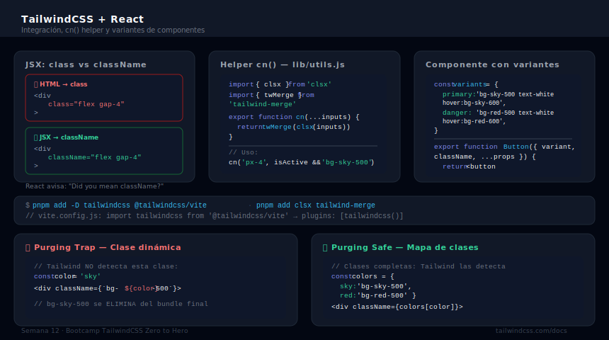

# Tailwind en React con Vite

## 🎯 Objetivos

- Configurar TailwindCSS en un proyecto React + Vite desde cero
- Usar clases Tailwind correctamente en JSX con `className`
- Manejar clases condicionales con `clsx` y `cn()` helper
- Construir componentes reutilizables con variantes tipadas

---



---

## 1. Setup React + Vite + Tailwind v4

### Crear el proyecto

```bash
# Crear proyecto React con Vite
pnpm create vite@latest mi-portfolio -- --template react

cd mi-portfolio

# Instalar Tailwind
pnpm add -D tailwindcss @tailwindcss/vite

# Instalar utilidades de clase condicional
pnpm add clsx tailwind-merge
```

### Configurar Vite

```javascript
// vite.config.js
import { defineConfig } from 'vite'
import react from '@vitejs/plugin-react'
import tailwindcss from '@tailwindcss/vite'

export default defineConfig({
  plugins: [
    react(),
    tailwindcss(),   // ← Tailwind como plugin de Vite (v4+, no PostCSS)
  ],
})
```

### Entry CSS

```css
/* src/index.css */
@import "tailwindcss";

/* Tus custom CSS variables o tokens globales aquí */
@theme {
  --font-sans: 'Inter', system-ui, sans-serif;
  --color-brand: oklch(60% 0.2 230);
}
```

```jsx
// src/main.jsx — importar el CSS global
import React from 'react'
import ReactDOM from 'react-dom/client'
import App from './App.jsx'
import './index.css'    // ← CRÍTICO: importa el CSS con Tailwind

ReactDOM.createRoot(document.getElementById('root')).render(
  <React.StrictMode>
    <App />
  </React.StrictMode>,
)
```

---

## 2. JSX y `className`

La diferencia más importante: en JSX todas las clases van en `className`, no en `class`.

```jsx
// ❌ INCORRECTO — class es incorrecto en JSX (genera warning de React)
<div class="flex items-center gap-4">
  <button class="bg-sky-500 text-white px-4 py-2 rounded-lg">
    Enviar
  </button>
</div>

// ✅ CORRECTO — className en JSX
<div className="flex items-center gap-4">
  <button className="bg-sky-500 text-white px-4 py-2 rounded-lg">
    Enviar
  </button>
</div>
```

```jsx
// Interpolación simple con template literals
const isActive = true

<button className={`px-4 py-2 rounded ${isActive ? 'bg-sky-500 text-white' : 'bg-gray-100 text-gray-700'}`}>
  Botón
</button>
```

---

## 3. `clsx` — Clases condicionales

`clsx` es una librería pequeña para construir `className` de forma legible:

```jsx
import { clsx } from 'clsx'

// Con ternario básico — difícil de leer con muchas condiciones
<button className={`btn ${isActive ? 'btn-primary' : ''} ${isLoading ? 'btn-disabled' : ''}`} />

// Con clsx — legible y sin espacios extra
<button className={clsx(
  'px-4 py-2 rounded-lg font-medium transition-colors',
  isActive && 'bg-sky-500 text-white',
  !isActive && 'bg-gray-100 text-gray-700',
  isLoading && 'opacity-50 cursor-not-allowed',
)} />
```

### Patrones con clsx

```jsx
// Objeto: key = clase, value = condición booleana
<div className={clsx({
  'text-green-600': isSuccess,
  'text-red-600': isError,
  'text-gray-600': !isSuccess && !isError,
})} />

// Array: mezcla de clases fijas, condicionales y arrays
<div className={clsx(
  ['base-class', 'another-base'],
  isLarge ? 'text-xl' : 'text-base',
  { 'font-bold': isBold }
)} />
```

---

## 4. `tailwind-merge` y el helper `cn()`

El problema con `clsx` solo: si pasas `p-4` y `p-8`, se aplican ambas. Tailwind no puede resolver el conflicto. `tailwind-merge` lo resuelve:

```jsx
import { clsx } from 'clsx'
import { twMerge } from 'tailwind-merge'

// ❌ Sin tailwind-merge: ambas clases se aplican (conflicto)
clsx('p-4 bg-red-500', 'p-8')   // → "p-4 bg-red-500 p-8"  ← p-4 Y p-8 en el DOM

// ✅ Con tailwind-merge: la última clase gana
twMerge('p-4 bg-red-500', 'p-8')  // → "bg-red-500 p-8"  ← solo p-8
```

### El helper `cn()` — patrón estándar

Combina `clsx` y `tailwind-merge` en una sola función. Este es el patrón usado por shadcn/ui y la mayoría de proyectos React modernos:

```javascript
// src/lib/utils.js (o utils.ts si usas TypeScript)
import { clsx } from 'clsx'
import { twMerge } from 'tailwind-merge'

export function cn(...inputs) {
  return twMerge(clsx(inputs))
}
```

```jsx
// Uso en cualquier componente
import { cn } from '@/lib/utils'

<div className={cn('p-4 text-gray-700', isActive && 'bg-sky-50 text-sky-700')} />
```

---

## 5. Componentes con variantes

El patrón más común en React + Tailwind: componentes que aceptan una prop `variant` o `size`:

```jsx
// src/components/Button.jsx
import { cn } from '@/lib/utils'

// Mapa de variantes: cada variante = conjunto de clases
const variants = {
  primary:   'bg-sky-500 text-white hover:bg-sky-600 focus-visible:ring-sky-500',
  secondary: 'bg-gray-100 text-gray-700 hover:bg-gray-200 focus-visible:ring-gray-400',
  danger:    'bg-red-500 text-white hover:bg-red-600 focus-visible:ring-red-500',
  ghost:     'text-gray-600 hover:bg-gray-100 focus-visible:ring-gray-400',
}

const sizes = {
  sm:  'px-3 py-1.5 text-sm',
  md:  'px-4 py-2 text-base',
  lg:  'px-6 py-3 text-lg',
}

export function Button({
  variant = 'primary',
  size = 'md',
  className,
  children,
  disabled,
  ...props
}) {
  return (
    <button
      className={cn(
        // Clases base: siempre presentes
        'inline-flex items-center justify-center gap-2',
        'font-medium rounded-lg',
        'transition-colors duration-200',
        'outline-none focus-visible:ring-2 focus-visible:ring-offset-2',
        'disabled:opacity-50 disabled:cursor-not-allowed',
        // Variante: controlada por prop
        variants[variant],
        // Tamaño: controlado por prop
        sizes[size],
        // className externo: permite override del consumidor
        className,
      )}
      disabled={disabled}
      {...props}
    >
      {children}
    </button>
  )
}
```

```jsx
// Uso en la app
import { Button } from './components/Button'

function App() {
  return (
    <div className="flex gap-4">
      <Button>Primary</Button>
      <Button variant="secondary">Secondary</Button>
      <Button variant="danger" size="sm">Eliminar</Button>
      <Button variant="ghost" className="text-sky-600">Override</Button>
    </div>
  )
}
```

---

## 6. Dark mode en React

Con Tailwind `darkMode: 'class'`, el dark mode se activa cuando `<html>` tiene la clase `dark`. En React, manejamos eso con un contexto:

```jsx
// src/hooks/useDarkMode.js
import { useState, useEffect } from 'react'

export function useDarkMode() {
  const [isDark, setIsDark] = useState(() => {
    // Leer del localStorage o del sistema en el primer render
    const stored = localStorage.getItem('theme')
    if (stored) return stored === 'dark'
    return window.matchMedia('(prefers-color-scheme: dark)').matches
  })

  useEffect(() => {
    const root = document.documentElement
    if (isDark) {
      root.classList.add('dark')
    } else {
      root.classList.remove('dark')
    }
    localStorage.setItem('theme', isDark ? 'dark' : 'light')
  }, [isDark])

  return { isDark, toggle: () => setIsDark(prev => !prev) }
}
```

```jsx
// Componente de toggle
function ThemeToggle() {
  const { isDark, toggle } = useDarkMode()

  return (
    <button
      onClick={toggle}
      aria-label={isDark ? 'Activar modo claro' : 'Activar modo oscuro'}
      className={cn(
        'p-2 rounded-lg transition-colors duration-200',
        'hover:bg-gray-100 dark:hover:bg-gray-800',
        'focus-visible:ring-2 focus-visible:ring-sky-500',
      )}
    >
      {isDark ? '☀️' : '🌙'}
    </button>
  )
}
```

---

## 7. Estructura recomendada de proyecto React+Tailwind

```
src/
├── components/
│   ├── ui/              ← componentes base reutilizables (Button, Card, Input)
│   │   ├── Button.jsx
│   │   ├── Card.jsx
│   │   └── Badge.jsx
│   ├── layout/          ← Navbar, Footer, Layout wrapper
│   │   └── Navbar.jsx
│   └── sections/        ← secciones de página (Hero, About, Projects)
│       ├── Hero.jsx
│       └── Projects.jsx
├── hooks/
│   └── useDarkMode.js   ← custom hooks
├── lib/
│   └── utils.js         ← helper cn()
├── index.css            ← @import "tailwindcss"
└── main.jsx
```

---

## ✅ Checklist de Verificación

- [ ] Tailwind configurado con `@tailwindcss/vite` (no PostCSS)
- [ ] `@import "tailwindcss"` en el CSS global
- [ ] CSS global importado en `main.jsx`
- [ ] Todas las clases en `className`, no en `class`
- [ ] `cn()` helper creado en `src/lib/utils.js`
- [ ] Al menos 1 componente con variantes usando `cn()`
- [ ] Dark mode funcional con hook y `localStorage`

---

## 📚 Recursos

- [TailwindCSS — Vite Guide](https://tailwindcss.com/docs/installation/vite)
- [clsx en npm](https://www.npmjs.com/package/clsx)
- [tailwind-merge en npm](https://www.npmjs.com/package/tailwind-merge)
- [React JSX className doc](https://react.dev/learn/writing-markup-with-jsx#3-camelcase-most-of-the-things)
