# Tailwind en Next.js 15+

## 🎯 Objetivos

- Configurar TailwindCSS en un proyecto Next.js 15 con App Router
- Entender la diferencia entre Server Components y Client Components con Tailwind
- Usar `cn()` helper en componentes Next.js
- Configurar metadata, fuentes y estilos globales correctamente

---



---

## 1. Crear proyecto Next.js con Tailwind

`create-next-app` incluye Tailwind como opción en el wizard:

```bash
# El wizard pregunta si quieres Tailwind — selecciona Yes
pnpm create next-app@latest mi-portfolio

# Respuestas recomendadas al wizard:
# ✔ Would you like to use TypeScript? › No (o Yes si ya lo dominas)
# ✔ Would you like to use ESLint? › Yes
# ✔ Would you like to use Tailwind CSS? › Yes
# ✔ Would you like your code inside a `src/` directory? › No
# ✔ Would you like to use App Router? › Yes  ← IMPORTANTE
# ✔ Would you like to use Turbopack for `next dev`? › Yes
# ✔ Would you like to customize the import alias? › No
```

Si necesitas instalarlo manualmente en un proyecto existente:

```bash
pnpm add -D tailwindcss @tailwindcss/postcss postcss
```

```javascript
// postcss.config.mjs — para Next.js se usa PostCSS (no el plugin de Vite)
const config = {
  plugins: {
    '@tailwindcss/postcss': {},
  },
}
export default config
```

---

## 2. Estructura del App Router

```
app/
├── layout.jsx        ← Root layout: envuelve TODA la app — aquí van fonts, metadata, globals
├── page.jsx          ← Página / (home)
├── about/
│   └── page.jsx      ← Página /about
└── globals.css       ← @import "tailwindcss" — importado en layout.jsx
```

### Root Layout

```jsx
// app/layout.jsx
import './globals.css'     // ← Tailwind entra aquí

export const metadata = {
  title: 'Mi Portfolio',
  description: 'Portfolio de desarrollo frontend',
}

export default function RootLayout({ children }) {
  return (
    <html lang="es" suppressHydrationWarning>
      {/* suppressHydrationWarning: necesario para dark mode con localStorage */}
      <body className="min-h-screen bg-white dark:bg-gray-950 text-gray-900 dark:text-gray-100 transition-colors duration-300">
        {children}
      </body>
    </html>
  )
}
```

### globals.css

```css
/* app/globals.css */
@import "tailwindcss";

/* Custom tokens opcionales */
@theme {
  --font-sans: 'Inter', system-ui, sans-serif;
}
```

---

## 3. Server Components vs Client Components

Esta es la diferencia más importante en Next.js App Router:

| | Server Component | Client Component |
|---|---|---|
| **Por defecto** | Sí — todos los componentes son Server | No — requiere `'use client'` |
| **Tailwind** | ✅ Funciona perfectamente | ✅ Funciona perfectamente |
| **Interactividad** | ❌ Sin hooks, sin state, sin eventos | ✅ useState, useEffect, onClick |
| **Cuándo usarlo** | Layout, páginas estáticas, secciones de contenido | Toggle dark mode, formularios, componentes con estado |

```jsx
// app/page.jsx — Server Component (sin 'use client')
// Puede usar Tailwind normalmente, pero NO puede tener onClick o useState

export default function Home() {
  return (
    <main className="min-h-screen">
      <section className="flex flex-col items-center justify-center min-h-screen
                          bg-gradient-to-b from-gray-50 to-white
                          dark:from-gray-950 dark:to-gray-900">
        <h1 className="text-5xl font-bold text-gray-900 dark:text-white">
          Hola, soy tu nombre
        </h1>
        <p className="mt-4 text-xl text-gray-600 dark:text-gray-400">
          Frontend Developer
        </p>
      </section>
    </main>
  )
}
```

```jsx
// components/ThemeToggle.jsx — Client Component (necesita onClick y useState)
'use client'

import { useState, useEffect } from 'react'

export function ThemeToggle() {
  const [isDark, setIsDark] = useState(false)

  useEffect(() => {
    // Solo en el cliente — no en el servidor
    const stored = localStorage.getItem('theme')
    const prefersDark = window.matchMedia('(prefers-color-scheme: dark)').matches
    setIsDark(stored === 'dark' || (!stored && prefersDark))
  }, [])

  function toggle() {
    const newDark = !isDark
    setIsDark(newDark)
    document.documentElement.classList.toggle('dark', newDark)
    localStorage.setItem('theme', newDark ? 'dark' : 'light')
  }

  return (
    <button
      onClick={toggle}
      aria-label={isDark ? 'Cambiar a modo claro' : 'Cambiar a modo oscuro'}
      className="p-2 rounded-lg hover:bg-gray-100 dark:hover:bg-gray-800
                 focus-visible:ring-2 focus-visible:ring-sky-500 outline-none
                 transition-colors duration-200"
    >
      {isDark ? '☀️' : '🌙'}
    </button>
  )
}
```

---

## 4. Script anti-flash para dark mode

El problema del "flash" ocurre cuando la página carga en modo claro antes de que React aplique el dark mode. La solución es un script inline en el `<head>` que corre antes que cualquier React:

```jsx
// app/layout.jsx — script anti-flash ANTES de que el body se pinte
export default function RootLayout({ children }) {
  return (
    <html lang="es" suppressHydrationWarning>
      <head>
        <script
          dangerouslySetInnerHTML={{
            __html: `
              (function() {
                var stored = localStorage.getItem('theme');
                var prefersDark = window.matchMedia('(prefers-color-scheme: dark)').matches;
                if (stored === 'dark' || (!stored && prefersDark)) {
                  document.documentElement.classList.add('dark');
                }
              })();
            `,
          }}
        />
      </head>
      <body className="bg-white dark:bg-gray-950 transition-colors duration-300">
        {children}
      </body>
    </html>
  )
}
```

---

## 5. Fuentes con `next/font` y Tailwind

```jsx
// app/layout.jsx — fuente optimizada con next/font
import { Inter } from 'next/font/google'
import './globals.css'

const inter = Inter({
  subsets: ['latin'],
  variable: '--font-inter',   // ← expone como CSS variable
})

export default function RootLayout({ children }) {
  return (
    <html lang="es" className={inter.variable}>
      <body className="font-sans">
        {/* font-sans usará --font-inter gracias al tailwind.config */}
        {children}
      </body>
    </html>
  )
}
```

```javascript
// tailwind.config.js — mapear la CSS variable a la utilidad font-sans
module.exports = {
  theme: {
    extend: {
      fontFamily: {
        sans: ['var(--font-inter)', 'system-ui', 'sans-serif'],
      },
    },
  },
}
```

---

## 6. `cn()` helper en Next.js

Mismo patrón que en React — crea el archivo en `lib/utils.js`:

```bash
pnpm add clsx tailwind-merge
```

```javascript
// lib/utils.js
import { clsx } from 'clsx'
import { twMerge } from 'tailwind-merge'

export function cn(...inputs) {
  return twMerge(clsx(inputs))
}
```

```jsx
// Uso en cualquier componente (server o client)
import { cn } from '@/lib/utils'    // @ = alias a la raíz del proyecto

<div className={cn('p-4 rounded-lg', isActive && 'ring-2 ring-sky-500')} />
```

---

## 7. Estructura de proyecto recomendada con Next.js

```
app/
├── globals.css
├── layout.jsx           ← root layout
├── page.jsx             ← homepage
└── (routes)/

components/
├── ui/                  ← Button, Card, Badge (client o server)
├── layout/              ← Navbar, Footer
└── sections/            ← Hero, About, Projects, Contact

lib/
└── utils.js             ← cn() helper

public/
└── images/              ← imágenes estáticas
```

---

## ✅ Checklist de Verificación

- [ ] Proyecto creado con `create-next-app` y Tailwind seleccionado
- [ ] `app/globals.css` tiene `@import "tailwindcss"`
- [ ] `globals.css` importado en `app/layout.jsx`
- [ ] Root layout con HTML semántico y `lang="es"`
- [ ] Script anti-flash para dark mode en el layout
- [ ] Componentes con interactividad tienen `'use client'`
- [ ] `cn()` helper en `lib/utils.js`
- [ ] Fuente configurada con `next/font`

---

## 📚 Recursos

- [Next.js App Router Docs](https://nextjs.org/docs/app)
- [TailwindCSS + Next.js Guide](https://tailwindcss.com/docs/installation/framework-guides/nextjs)
- [next/font Documentation](https://nextjs.org/docs/app/building-your-application/optimizing/fonts)
- [Server vs Client Components](https://nextjs.org/docs/app/building-your-application/rendering/client-components)
